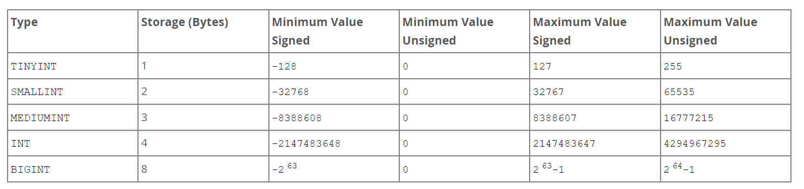

## Introduction

I have chosen to write a case study about MySQL because it is one of the world's most popular and widely used databases.
My goal is to weigh its strengths and weaknesses against other technologies of the same kind to figure out
if this is a product worth using if there are other more modern products with better solutions and
which cases you should use or not use MySQL.

MySQL is an open source relational database management system (RDBMS).
A relational database can store data in tables consisting of rows and columns
that can be related to each other using ids and something called foreign keys.
The SQL in MySQL stands for Structured Query Language, which is a standardized language used by
developers to either create, select, update, or delete data, among other commands.

Think of a relational database (RDB) as a digital file cabinet for storing files.
Data stored in a database must be reliable, to be secure and persistent.

RDBs have stood the test of time and are still today the most used types of databases,
and MySQL is currently the most commonly used RDB.

## Brief History

The first development of MySQL started in 1994 by Swedish developers Allan Larson, David Axamark
, and Finnish developer Michael "Monty" Widenius. MySQL was initially intended for personal usage
and derived from its proprietary predecessor mSQL, another database management system
based on the low-lever language ISAM. The developers considered mSQL to be slow and inflexible
and created a new SQL interface that used the same API as mSQL.
Keeping the same API allowed many developers to switch to MySQL
after its first release on May 23rd, 1995.

In the year 2000, MySQL went open source which allowed it to be accessed and used by everyone.  
Since then it has grown in popularity and is currently ranked the world's most used open source database
with over 5 million active installations,
and ranks second most used overall, behind Oracle's proprietary enterprise database.

Here's a timeline of MySQL

- 1994, development starts
- 1995, first release on May 23rd.
- 1996, version 3.19
- 1997, version 3.20
- 1998, January 8th, version released for windows 95. - version 3.21 Production released from www.mysql.com - version 3.22 alpha, beta
- 2000, version 3.23 beta, MySQL goes open source
- 2001, version 3.23
- 2002, version 4.0 beta
- 2003, version 4.0
- 2004, version 4.1 beta June, production release October 2004 (B-trees and R-trees, prepared statements, subqueries)
- 2005, version 5.0 beta March, production release October Oracle acquires Innobase, the company responsible for backend storage of MySQL.
- 2008,
  - Sun Microsystems acquire MySQL AB, version 5.1 released November
    (partitioning, event scheduler, plugin API, server log tables, row based replication)
  - version 5.1 contained lots of bugs, most of them were fixed by V 5.1.51
  - version 5.1 and 6.0-alpha had issues with data warehousing - partially because of its inability to utilize multiple CPU cores for processing a single query.
- 2009, version 6.0.11-alpha announced.
- 2010, Oracle acquires Sun Microsystems - legal complications in the EU - January 27th - Michael "Monty" Widenius forked MySQL and created MariaDB to keep it open source - MariaDB API remains compatible with MySQL.
- 2013, general availability for version 5.6 announced. Big update
- 2015, general availability for version 5.7 announced - supports native JSON data.
- 2018, version 8.0 - update included NoSQL Document Store.
- 2019, MySQL won the price of best DBMS from DB-Engines ranking

##### Editions

MySQL community edition

- open source GPL, free to use
- community support only

MySQL standard edition (annual subscription of about 2000 USD / year per server )

- 24/7 support from Oracle.
- mostly the same as the community edition but with support.

MySQL enterprise edition (5000 USD / year per server)

- cluster routing and partitioning features
- tools for security, backups, and monitoring
- thread pooling for performance increase during large loads

MySQL Cluster CGE (10.000 USD / year per server)

- designed for linear scalability
- highly available, high volume

## Features

#### Internals

<!-- !!! -->

- MySQL is written in C and C++ and portable across a variety of platforms.
- The C API gives a low-level access to the client/server protocol.
- Supports ANSI/ISO SQL standard
- the server design is multi-layered and has independent modules.
- It's been tested on a wide selection of different compilers and platforms.
- Allows for multithreading using kernel threads and can utilize multiple CPUs with ease, if available.
- supports both transactional and non-transactional storage engines.
- B-tree disk tables and index compression.
- Storage engines can be added relatively easily. This makes it easier to add an SQL interface for in-house databases.
- Purify has been used to test for memory leak detection.
- Valgrind has been used for GPL/GNU General Public License.
- The server is provided as a separate program when using a networked client/server program.
- Configured with CMake for optimal portability.
- Memory allocation system is fast-thread based.
- Designed to implement SQL functions using an optimized class library.
- Uses in-memory hash tables as temporary tables
- Joins are optimized and very fast using nested-loop join.

#### Data Types

<!-- todo: write syntax -->

##### Numeric Data Types



> image from: https://dev.mysql.com/doc/refman/8.0/en/integer-types.html

SQL standard integer types:

- INTEGER (INT), SMALLINT, TINYINT, MEDIUMINT, BIGINT

Fixed-Point types:

- DECIMAL and NUMERIC - Stores exact value. Often used for monetary data

Floating-Point types:

- FLOAT and DOUBLE - stores approximate numeric value, single precision uses four bytes and double precision uses eight

Bit-value type:

- Stores value in binary. Read more about binary values here: https://www.techtarget.com/whatis/definition/binary

Numeric type Attributes: Numeric datatypes can have attributes to specify the width of an integer. E.g. INT(3)

Out-of-Range and Overflow Handling: Allows for both "strict SQL mode" and "no restrictive mode".
Strict mode returns an error if the integer is out of range and no-strict clips the value to appropriately
fit the column data and stores the result instead.

SIGNED and UNSIGNED values:

- signed values can store zero, negative and positive numbers.
- UNSIGNED values can only store zero and positive numbers.

What numeric types one should use depends on what it is used for. In general, one would want to use the type that stores the most accurate value and uses the least amount of storage, with consideration to how fast you need the data to be pulled or stored. E.g: DECIMAL is great for monetary use whereas FLOAT and DOUBLE are often used for scientific numbers where every decimal number counts.

##### String Data Types

The string data types are CHAR, VARCHAR, BINARY, VARBINARY, TEXT, BLOB, SET, and ENUM.

CHAR (fixed length)

- The length of a "CHAR value" is a "fixed length" that is declared when a table is created.
  This can be anything between 0 to 255. The "CHAR value" is then padded to the right with spaces to match the "fixed value".
  Trailing spaces will be removed when a "CHAR value" is retrieved unless PAD_CHAR_TO_FULL_LENGTH mode is activated.
- CHAR uses static memory allocation
- Faster
- typically used for phone numbers, zip codes, etc.
  E.G. CHAR(10) = "abc-------"

VARCHAR (variable length)

- VARCHAR values are stored with either 1 or 2 byte prefix plus data.
- Uses dynamic memory allocations
- Better for storage space
- Slower
- typically used for storing names or other values that can vary in length.
  E.G. VARCHAR(10) = "abc"


> image from: https://dev.mysql.com/doc/refman/8.0/en/char.html

BINARY and VARBINARY have many similarities with CHAR and VARCHAR. The difference is that the values are stored as byte strings rather than character strings.
The size of BINARY and VARBINARY values can be specified like in CHAR and VARCHAR by using parentheses e.g. Binary(40).
In this example, the value will allow storage for 40 bytes and pads the potentially "missing" space with 0x00, which is then retained when the value is retrieved.
VARBINARY will do the same as VARCHAR by initially using 1 or 2 byte prefix plus data. There is no padding

BLOB and TEXT

- BLOB stands for "Binary Large OBject". There are four different types of BLOBs: TINYBLOB, BLOB, MEDIUMBLOB and LONGBLOB.
  BLOBs store the value as binary strings
- TEXT is the "non-binary" equivalent to blob, There are four different types of TEXT: TINYTEXT, TEXT, MEDIUMTEXT and LONGTEXT.
  TEXT stores values as character strings.

- some developers argue that you CAN utilize BLOBs and TEXTs as a "document-database storage", meaning you can use a relational database to achieve some of the same benefits from a document-no-SQL database. However, this seems to be an ongoing debate.

ENUM

- ENUM, which is short for enumeration. Is a string object where a set of values are enumerated.
  Think of this as an array of string values, each value has an index and only one value can be selected at a time.
  ENUMs store the string values as numbers to save data and return strings when retrieved.
  Only one index can be selected at a time.

SET

- SET is in many ways similar to ENUMs. SET allows you to select many options, as opposed to ENUM which only allows one.
  A SET column can have up to 64 members.
  An error will occur if the values are duplicated when strict SQL mode is active.
  Some argue that SET can be an inefficient way to store data because of its limiting storage capacity when working with "many to many relationships"

##### Date and Time Data Types

The Date and Time Data Types are DATE, TIME, YEAR, DATETIME and TIMESTAMP.

DATE

- Function: Is used for date only.
- Format: "YYYY-MM-DD".
- Range: From "1000-01-01" to "9999-12-31".
- Timezone conversion: Not possible.

TIME

- Function: Is used for time only.
- Format: "HH:MM:SS" or "HHH:MM:SS" for large hours.
- Range: From "-838:59:59.000000" to "838:59:59.000000".
- Timezone conversion: Not possible.

DATETIME

- Function: Is used for both date and time.
- Format: "YYYY-MM-DD hh:mm:ss".
- Range: From "1000-01-01 00:00:00" to "9999-12-31 23:59:59".
- Timezone conversion: Not possible.

TIMESTAMP

- Function: Is used for date, time and timezone conversion.
- Format: "YYYY-MM-DD hh:mm:ss".
- Range: From "1970-01-01 00:00:01.000000" UTC to "2038-01-19 03:14:07.999999" UTC.
- Timezone conversion: Possible.

Both TIMESTAMP and DATETIME can include fractional seconds up to 6 digits.

YEAR

- Function: Is used for year only.
- Format: "YYYY".
- Range: 1901 to 2155.
- Timezone conversion: Not possible.
- 1-byte storage value.

##### Spatial Data Types

Spatial data types can consist of single geometry values:

- GEOMETRY
- POINT
- POLYGON
- LINESTRING

The other types of spatial data consist of a collection of values:

- MULTIPOINT
- MULTILINESTRING
- MULTIPOLYGON
- GEOMETRYCOLLECTION

This type of data is typically used in a geographic setting.

##### The JSON Data Type

MySQL supports JSON (Javascript Object Notation). JSON stores its values inside an object with key-value pairs.
E.G. { key: "value", key2: 29 }
MySQL automatically validates the document when storing JSON instead of a string.
JSON stored in JSON columns allows for optimized storage, and quicker conversion because JSON is stored as a binary format with a structure that enables the server to look up objects directly by key or array indexes.

#### Statements and Functions

MySQL has a large and comprehensive list of built-in statements and functions that makes it easier to perform tasks.

Statements in MySQL usually start with one of the following keywords: SELECT, SHOW, INSERT, UPDATE, DROP, DELETE, ALTER, CREATE, USE.
This enables the user to manipulate data in the database using a Structured Query Language.

Functions are pre-build programs that take parameters and return a value or complete a task based on the parameters passed by the developer.

The syntax for a MySQL function is:

```
CREATE FUNCTION function_name [ (parameter datatype [, parameter datatype]) ]
RETURNS return_datatype

BEGIN

   declaration_section

   executable_section

END;
```

> function source: https://www.techonthenet.com/mysql/functions.php

#### Security

Some of the main security features are:

- User authentication: Access to the database can be controlled by the use of a username and password authentication.
- Access control: A user can be granted specific access privileges such as the ability to read write or execute specific commands.
- Encryption: MySQL uses different forms of encryption for data in transit such as SSL (Secure Sockets Layer),
  TSL (Transport Layer Security) and AES (Advanced Encryption Standard) for data at rest.
- Data validation: Provided constraints such as primary keys, foreign keys, and checks help prevent corruption
  and keep the data accurate, valid, and consistent.
- Auditing: You can log and monitor user activities to detect suspicious behavior
- Firewall: Access to a MySQL server can be restricted with the use of firewalls and allowing only authorized connections.

Note that it's important to configure your security-best-practices to ensure that the data is secure.

SQL injections

It is highly recommended that developers properly configure the database and all code connected to it
to avoid attacks such as SQL injections. here are some methods from MySQL that can help secure the database:

- prepared statements: Separate and create layers between user input and SQL with prepared statements and parameterized queries.
- Stored procedures: Control what types of statements are executed.
- Input validation: Build a robust validations system to properly sanitize data.
- Limited privileges: Limit and compartmentalize privileges to decreases risk of SQL injections

#### Scalability

MySQL supports large databases. There are databases with over 50 million records, 200,000 tables, and around 5 billion rows.
The maximum number of tables is generally limited by the storage engine used.

#### Connectivity

There are several protocols for connecting to MySQL servers:

- TCP/IP sockets on any platform.
- Named pipes and shared-memory connections. Optional: (--protocol=memory)
- Unix domain socket files for Unix systems.
- Client programs for many languages. APIs are available for C, C++, Perl, Java, Eiffel, Tcl, PHP, Ruby, and Python.
- Provides connectors for ODBC (Open Database Connectivity), JDBC (Java Database Connectivity), and .NET applications.

#### Localization

- Servers provide error messages in many languages.
- Supports different character and Unicode sets. Data is sorted and saved in the selected language.
- Time zones can be changed dynamically for servers and clients.

#### Clients and Tools

- Includes client and utility programs such as "MySQLDump", "MySQLAdmin" and "MySQL Workbench"
- Provides CLI for SQL statements such as "MySQLCheck" and "MyISAMchk" to repair, check and optimize tables.
- programs can be requested using `-?` or `--help` for online assistance

#### ACID Compliant

MySQL is ACID compliant

ACID compliance

- Atomicity - All or nothing. Transactions are treated as a unit where either all of the changes are made or none at all.
- Consistency - Transactions are valid to the rules of the DB even if transactions fail.
- Isolation - Transactions are isolated to make sure they do affect each other.
- Durability - committed transactions persist, even in the event of failure.

Non-ACID-compliant databases can potentially trade integrity for speed.

## Strengths

- Open source: MySQL is a free open-source software that can be modified by others to fit specific needs.
- Widely adopted: MySQL is one of the most used relational databases in the world with a lot of documentation and community support.
- Scalability: Can scale to handle large amounts of data, a good choice for busy web applications.
- High performance: Provides fast and efficient processing for large datasets.
- Large community: One of the best features of a popular open source software is that it comes with a large community
  which makes it a lot easier to find support and answers to questions.
- Proprietary option: Comes with the option of changing to the proprietary enterprise version if needed.

## Weaknesses

- Limited transaction processing: MySQL is less sophisticated regarding transaction processing.
- Limited No-SQL capabilities: MySQL is limited in it's ability to handle No-SQL data.
- Lacking built-in security features: MySQL har fewer built in security systems than some other database providers,
  This can lead to developers having to create additional security infrastructure.

## Comparison

<!-- Compare the product to other products in the same category, if applicable. -->

The three overwhelmingly most used open-source relational databases are MySQL, PostgreSQL and Microsoft SQL Server, in given order. I'm therefore going to make a comparison between MySQL and PostgreSQL.

Both MySQL and PostgreSQL are open-source software, this makes them free-to-use and enables users modify the software to their own needs.
They are both generally considered to be Relational Database Management Systems (RDBMS), however, Postgres is actually an Object-Relational Database (ORDBMS).

The main difference between these is the way they store and organize their data.
An RDBMS stores it's data in tables with relationships and an ORDBMS stores it's data in objects and classes.
Object-relational databases are better at handling complex data structures, can store and manipulate other formats such as hstore and xml, allows for more complex relationships and generally considered better at handling many-to-many relationships.

MySQL is purely a relational database that connects using a single thread process as opposed to Postgres which creates a new system process using it's memory allocation for every connection. This makes postgres slightly slower when reading data and gives MySQL an advantage when it comes to smaller scale projects.

Replication is supported by both systems. Postgres uses synchronous replication, and MySQL uses one-way asynchronous replication.
Postgres offer more ways to use indexes such as indexing JSON, Hash indexes and partial indexes.

Security is an almost even race. Both services support AES,TSL and SSL, although TSL must be configured to postgres before use.
For authentication Postgres uses an IP-based client with Kerberos and PAM, whereas MySQL uses native window services, LDAP and PAM.

#### Conclusion

MySQL and PostgreSQL are database software that truly have stood the test of time.
Choosing the right database is a determining factor, so it depends on the use case.

If your application needs a database that is feature-rich, can handle complex queries, frequent write operations and unique ways to index, then PostgreSQL is a good choice.

If your application is smaller, you would perhaps want to use something lighter that requires less maintenance but is also easy to manage and reliable.

##### Use cases:

MySQL:

- Transactions
- Storage and logistics
- Customer data
- eCommerce.

PostgreSQL:

- Scientific data
- Industrial data
- Spatial and Geographic data
- large datasets

## Summary

Summarize the content and highlight the relevance of the product to a web developer.

### Credits

- Student Name (studentGitHubUsername)

#### References

- List of videos or links used during research

Articles:

- https://dev.mysql.com/
- https://dev.mysql.com/doc/refman/8.0/en/features.html
- https://www.tutorialspoint.com/what-are-the-main-features-of-mysql
- https://dev.mysql.com/doc/c-api/8.0/en/
- https://dev.mysql.com/doc/refman/8.0/en/data-types.html
- https://en.wikipedia.org/wiki/MySQL
- https://en.wikipedia.org/wiki/MSQL
- https://www.tutorialspoint.com/discuss-the-history-of-mysql#:~:text=Timeline%20of%20MySQL&text=MySQL%20was%20founded%20in%201995,in%20addition%20to%20Sweden%20headquarters.
- https://www.interviewbit.com/blog/mysql-commands/
- https://www.techonthenet.com/mysql/functions.php
- https://dev.mysql.com/doc/mysql-reslimits-excerpt/8.0/en/table-size-limit.html#:~:text=You%20are%20using%20a%20MyISAM,2567%20%E2%88%92%201%20bytes).
- https://satoricyber.com/mysql-security/mysql-security-common-threats-and-8-best-practices/#:~:text=MySQL%20protects%20sensitive%20data%20accessAsymmetric%20Public%20Key%20Encryption%2FDecryption
- https://kinsta.com/blog/postgresql-vs-mysql/#postgresql-vs-mysql-headtohead-comparison
- https://www.fivetran.com/blog/postgresql-vs-mysql
- https://zetcode.com/mysql/storageengines/#:~:text=There%20are%20two%20types%20ofto%20version%205.5%20was%20MyISAM.
- https://www.postgresql.org/docs/current/connect-estab.html#:~:text=PostgreSQL%20implements%20a%20%E2%80%9Cprocess%20per,time%20a%20connection%20is%20requested.
- https://blog.devart.com/postgresql-vs-mysql.html
- https://www.sumologic.com/blog/postgresql-vs-mysql/
- https://www.postgresql.org/docs/current/ssl-tcp.html
- https://www.integrate.io/blog/postgresql-vs-mysql-which-one-is-better-for-your-use-case/#:~:text=Most%20developers%20will%20tell%20yoularge%20and%20complicated%20analytical%20processes.
- https://www.postgresql.org/docs/current/libpq-ssl.html#:~:text=PostgreSQL%20has%20native%20support%20forTLS%20protocols%20for%20increased%20security.
- https://www.postgresql.org/docs/current/user-manag.html
- https://www.immuta.com/blog/attribute-based-access-control/
- https://ostatic.com/mysql

Videos:

- https://www.youtube.com/watch?v=EIo1JFCWpfA
- https://www.youtube.com/watch?v=OqjJjpjDRLc
- https://www.youtube.com/watch?v=EIo1JFCWpfA&t=90s
- https://www.youtube.com/watch?v=UGu9unCW4PA&list=PL_c9BZzLwBRKn20DFbNeLAAbw4ZMTlZPH
- https://www.youtube.com/watch?v=btjBNKP49Rk&t=300s
