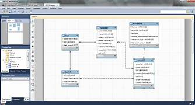

### **Development Platforms - Course Assignment**

## Student Name

### Sherzad Hasan & Samah Zaytoun

## Word count

## 1404

**Task Project**
#

**Hva er MySQL?**

MySQL er en populært åpen kildekode for relasjonsdatabasebehandlingssystem som ble brukt i over to tiår. Det er en av de mest brukte databasene i denne verden hos både bedrifter og programmerene og MySQL ble utviklet av et svensk selskap kalt TcX (senere MySQL AB) som svar på mangelen på pålitelige databasetilbud med åpen kildekode på den tiden

Fordelen med MySQL kan være den brukervennlighet. Den har et enkelt brukervennlig grensesnitt som kan gjøre det enkelt å administrere den i databaser og utføre spørringer, i tillegg er den kompatibel med et bredt spekter av operativsystemer, inkludert Linux, Windows og macOS, noe som gjør det tilgjengelig for et bredt publikum.

MySQL er designet for å håndtere store datamengder og kan enkelt skaleres for å gjennomføre ganske mye av datasett. I tillegg har den byggd opp av sikkerhetsfunksjoner som hjelper med å beskytte data mot uautorisert tilgang.

En annen fordel med MySQL er dens allsidighet. Den kan brukes til applikasjoner og fra enkle nettsteder til vanskelige bedriftssystemer. Den støtter mange programmeringsspråk, inkludert PHP, Java og Python, det som gjør den til en fantastisk valg for utviklere.

**Et eksmpel:**

et eksempel ved å bruke et sett med HTML-tabeller. Hver tabell nedenfor representerer én tabell i en fiktiv database som denne tabellen er ansvarlig for å inneholde all informasjon som er relevant for en prosjekt med firma, fornavn, lønn og avdeling.

**Hva brukes MYSQL, og den for ?**

MySQL brukes til å lagre og administrere data. Det brukes ofte til en rekke bruksområder, inkludert:

**Nettapplikasjoner:** MySQL brukes ofte i nettapplikasjoner, som e-handelssider og innholdsstyringssystemer. Det gir sikkerhet og en skalerbar backend for å sortere brukerdata og innhold.

**Innebygde systemer:** MySQL kan brukes i innebygde systemer, som for eksempel salgsautomater og salgsautomater, for å lagre og administrere data.

**Spillapplikasjoner:** MySQL kan brukes til å administrere spillerdata og spillstatistikk i online spillapplikasjoner.

**Forretningsapplikasjoner:** MySQL kan brukes til å administrere forretningsdata, som lagerdata, salgsdata og kundeinformasjon. Den kan også brukes til dataanalyse og rapportering.

**Mobilapplikasjoner:** MySQL kan brukes til å lagre data for mobilapplikasjoner, som brukerprofiler, app preferanser og transaksjonshistorikk.

**Styrke og svakhet:**

Noen av styrker og svakheter i MySQL:

**Styrker:**
 Brukervennlighet: MySQL er kjent for sitt brukervennlige grensesnitt, som gjør det enkelt å sortere og administrere databaser og utføre spørringer.

**Skalerbarhet:** MySQL er designet for å fikse store datamengder og kan enkelt skaleres for å gjennomføre stor mengde av data.

**Ytelse:** MySQL er kjent for sin raske og pålitelige ytelse, det som gjør det til et populært valg for applikasjoner som trenger høyhastighets databehandling.

**Sikkerhet:** MySQL har innebygde sikkerhetsfunksjoner som hjelper til å beskytte data mot uautorisert tilgang.

**Svakheter:**
 Begrenset funksjonalitet: MySQL har ikke alle funksjonene som trengs for enkelte komplekse applikasjoner.

**Mangel på støtte:** Selv om MySQL har et stort fellesskap av brukere og utviklere, har det kanskje ikke samme nivå av profesjonell støtte som enkelte proprietære databaser.

**Begrensede skalerbarhetsalternativer:** Det er kanskje ikke like skalerbart som enkelte andre databaser, for eksempel NoSQL-databaser.

**Begrenset transaksjonskontroll:** MySQL har kanskje ikke samme nivå av transaksjonskontroll som noen andre databaser, noe som kan være en bekymring for applikasjoner som krever streng transaksjonsstyring.

**Begrensede datatyper:** MySQL støtter kanskje ikke alle datatyper som trenger for enkelte spesialiserte applikasjoner.

Totalt sett er MySQL et sterk og pålitelig databasebehandlingssystem som er mye brukt og verdsatt for sin brukervennlighet, skalerbarhet og ytelse det som gjør den til et populært valg for utviklere og bedrifter. I tillegg til at den kan brukes til et bredt spekter av applikasjoner.

**Hva er SQL?**

SQL, som er kortleser for Structured Query Language, er et programmeringsspråk som er brukt for å manipulere og sortere data i relasjonsdatabaser. Det er et standardspråk for samhandling med databaser og brukes av utviklere, analytikere og dataforskere over hele verden.

En av de viktigste sidene ved SQL er dens evne til å hente data fra databaser. SQL-spørringer kan brukes til å velge spesifikke data fra tabeller, slå sammen flere tabeller og filtrere data basert på spesielle kriterier. Dette gjør det til et sterkt verktøy for å jobbe med store datasett og trekke ut verdifull innsikt fra dem.

SQL er også kjent for sin allsidighet og skalerbarhet. Den kan brukes med et bredt spekter av databaser, inkludert MySQL, Oracle, Microsoft SQL Server og PostgreSQL, blant andre. I tillegg kan den håndtere store datamengder og kan enkelt integreres med andre programmeringsspråk og dataverktøy.

Andre bra ting med SQL er at det er relativt enkelt å lære. Selv om det absolutt er mer avanserte funksjoner og konsepter som det tar tid å mestre, er den grunnleggende syntaksen og strukturen til SQL-spørringer ganske grei. Dette gjør den tilgjengelig for både erfarne programmerere og nybegynnere.

**Hva brukes den for?**

SQL brukes først og fremst til å sortere og manipulere data i relasjonsdatabaser. Relasjonsdatabaser er strukturert i et tabellformat, med tabeller som inneholder rader med data og kolonner som representerer attributtene til dataene. SQL brukes til å samhandle med disse databasene ved å skrive spørringer for å hente, sette inn, oppdatere og slette data i tabellene.

**Her er noen vanlige brukstilfeller for SQL:**

**Datamanipulering:** SQL kan brukes til å legge til, slette og oppdatere data i tabeller ved å bruke INSERT-, UPDATE- og DELETE-setninger. Dette gir mulighet til brukere å endre data i databasen etter behov.

**Dataaggregering:** SQL kan brukes til å samle data i tabeller ved å bruke funksjoner som **COUNT, SUM, AVG og MAX.** Dette kan være bra for å generere rapporter og visualiseringer.

**Databaseadministrasjon:** SQL kan brukes til å opprette og administrere databaser, tabeller og andre databaseobjekter. Dette inkluderer oppgaver som å lage tabeller, sette opp sikkerhetstillatelser og optimalisere databaseytelsen.

**Datahenting:** SQL kan brukes til å hente spesifikke data fra tabeller ved hjelp av SELECT-setninger. Dette lar analytikere og utviklere søke etter store datasett og trekke ut bare dataene som trenger det.

**Datasammenføyninger:** SQL kan brukes til å slå sammen flere tabeller basert på vanlige felt, slik at brukere kan kombinere data fra forskjellige kilder som det.

**Styrker og svakheter ved SQL**

**Styrker:**

**Fleksibilitet:** SQL er fleksibel og kan brukes med en rekke databasebehandlingssystemer, inkludert MySQL, Oracle, Microsoft SQL Server og PostgreSQL. Den kan også brukes med forskjellige programmeringsspråk og dataverktøy.

**Sikkerhet:** SQL gir sikkerhetsfunksjoner for å beskytte data som er lagret i databaser. Brukere kan kontrollere tilgangen til dataene ved hjelp av forskjellige mekanismer som brukerautentisering, tilgangskontroll og datakryptering.

**Høy ytelse:** SQL er designet for å drive store datasett og komplekse spørringer effektivt. Den bruker indekserings- og hurtigbufferteknikker for å optimalisere ytelsen, slik at brukerne kan hente og manipulere data fort .

**Standardisering:** SQL er et standardisert språk, noe som betyr at spørringer skrevet i SQL enkelt kan porteres på tvers av forskjellige databasesystemer. Dette gjør det lettere for utviklere å jobbe med ulike databaser og bytte mellom dem etter behov.

**Svakheter:**

**Ikke-prosedyre:** SQL er et ikke-prosedyrespråk, noe som betyr at brukere ikke kan spesifisere rekkefølgen operasjoner skal utføres i. Dette kan gjøre det vanskelig å optimalisere søk for ytelse, spesielt for komplekse søk.

Begrenset støtte for ustrukturerte data: SQL er utviklet for å fungere med strukturerte data lagret i tabeller, og det kan være utfordrende å jobbe med ustrukturerte data som tekst- og multimediefiler.

Begrenset skalerbarhet: Selv om SQL er designet for å håndtere store datasett, kan den bli treg når du arbeider med ekstremt store databaser eller når du behandler komplekse spørringer. Og Mens SQL har en relativt enkel syntaks for grunnleggende spørringer, kan den bli kompleks når du arbeider med mer avanserte funksjoner som lagrede prosedyrer, triggere og visninger. Dette kan gjøre det vanskelig for nybegynnere å lære og bruke effektivt.

For å oppsummere det SQL er et kraftig og allsidig språk for arbeid med data i relasjonsdatabaser. Dens evne til å samhandle med databaser og manipulere data gjør den til et viktig verktøy for både dataanalytikere, utviklere og databaseadministratorer.

**forskjellen mellom MySQL og SQL**

SQL (Structured Query Language) er et språk som brukes til å kommunisere med databaser generelt og er et standardspråk som brukes av de fleste RDBMS-er, inkludert MySQL, Oracle, Microsoft SQL Server, PostgreSQL og andre.

Mens MySQL er et populært RDBMS med åpen kildekode som bruker SQL som sitt primære språk. MySQL brukes til å administrere store mengder strukturert data og kan brukes i flere spekter av applikasjoner, inkludert webapplikasjoner, datavarehus og e-handel.

SQL, er et standardspråk som brukes til å kommunisere med databaser og til å lage, endre og hente data fra en database. Den kan brukes til å utføre en rekke operasjoner, inkludert å lage tabeller, definere relasjoner mellom tabeller, sette inn og oppdatere data og spørre etter data.

Oppsummert er MySQL en spesifikk implementering av et RDBMS som bruker SQL som sitt primære språk, mens SQL er et språk som brukes til å kommunisere med databaser generelt.

###Kilder
Vi har brukte disse kildene for å hente informasjon:

 - [https://google.no](http://www.google.no/)
 - [https://youtube.no](http://www.youtube.no/)
 - [https://content.noroff.dev/development-platforms/relational-datastores.html](https://content.noroff.dev/development-platforms/relational-datastores.html)