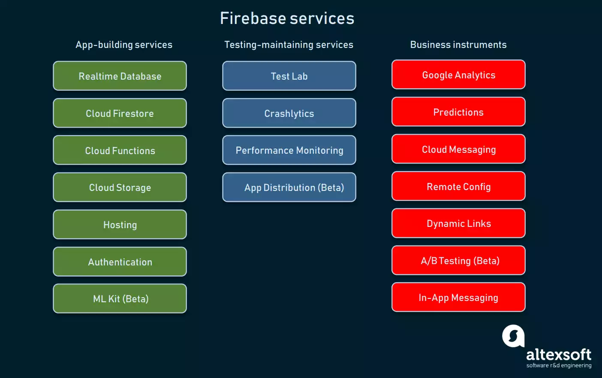

## Introduction

## *What is **Firebase**?*

## **Firebase**

Users' needs are the focus of this mobile development platform. It has features that help both developers work efficiently, fast, and reliably, solving the three main issues in mobile apps and all multi-platform devices. 

It was a backend platform that enhanced the developer's reliance on using it based on demand. It is a leading platform that is relied on by developers globally. 

*Firebase* many rapid improvements and additional features have been added to the list of achievements that will give satisfying results for the knowledge of both developers and users. And since it is cloud-hosted, it will provide a smoother performance for demand scaling without any hassles. All features are functions for both mobile and web-based applications, including services for building, testing, and managing apps.

- [links](https://blog.back4app.com/firebase/#What_is_Firebase_and_how_it_works)

- [video-links](https://www.youtube.com/watch?v=XHvWx1F3S4A)

___________________________________________________________________________________________

## Brief History

- ***Firebase*** originated with *Envolve*, a startup founded in the company in 2011 by Andrew Lee and James Tamplin.

- The company offered an API for developers to facilitate the integration of online chats into websites. Envolve's founders noticed that their chat service was used to forward non-chat messages.

- Developers relied on the platform to synchronize application data in real-time. Lee and Tamplin decided to separate the differentiate real-time architecture from the chat system, which led to the creation of Firebase in 2011. The *Firebase Backend-as-a-Service* platform was unveiled to the public and launched in April 2012.

- The first *Firebase* product launched to hit the market was the **Realtime Database**. This is an API for synchronizing application data between Android synchronization, Web, and iOS devices. Application developers can rely on the platform to create collaborative real-time applications.
[links](https://www.javatpoint.com/firebase-introduction)

___________________________________________________________________________________________

## Features

[links](https://www.altexsoft.com/blog/firebase-review-pros-cons-alternatives/)

### **App-Building Services**

- [1] *Real-time database* - Updates, stores, and sync data between your users. The data is stored as JSON and synchronized with each connected client in real-time. It captures, collects, processes, and enriches incoming data points after they have been made. Data velocity continues to increase and accelerate and now relies more heavily on real-time database technologies. Real-time processing to process handle workloads whose state is constantly changing. Transactions in real-time processing are completed so quickly that the result can be retrieved and processed immediately.

- [2] *Cloud Firestore* - is a NoSQL document database for the client- and server-side apps document-oriented database. One of the unique features is the syncing of data across multiple client apps using real-time listeners. It supports various file types, numbers, strings, and nested objects. It is secure, reliable, and integrates seamlessly with Firebase and the Google Cloud Platform. It also provides support for offline access, which is especially useful for mobile apps.

- [3] *Cloud Functions* - is a tool for building the mobile app that lets you automatically run backend code in response to trigger events and enables you to firebase features and HTTPS requests. It allows you to write small pieces of JavaScript, which has been the most requested feature.

- [4] *Cloud Storage* - is designed for application developers who need to store and serve user-generated content, usually big files like photos or videos. It is a technology that allows storing and managing various media content generated by mobile app users. It is a cloud computing model that holds data on the internet through a cloud computing provider that organizes and operates data storage. We can use Google Cloud Storage to access the duplicate files on the server. It provides agility, durability, and global scale with "anywhere, anytime" data access.

- [5] *Hosting* - is responsible for providing static and dynamic content and microservices. Can quickly deploy web apps with a single command. It allows us to migrate Firebase hosting content into our domain with SSL security.

- [6] *Authentication* - 