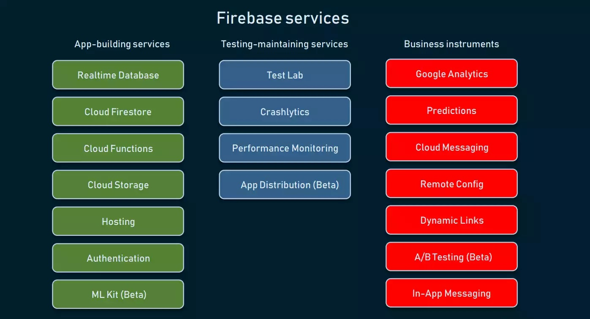

### Table of contents

1. Introduction
2. Brief History
3. Features
4. Strengths
5. Weaknesses
6. Reviews
7. Alternatives & Comparison
8. Summary
9. Credits
10. Companies using Firebase
11. Reference links
12. Video links

____________________________________________________________________________________________________________________

## **Introduction:**

## *What is ***FIREBASE***?*

**Firebase** is a cross-platform development service with features that help developers to work efficiently, quickly, and reliably, solving the three main issues in mobile apps and all multi-platform devices. It is a back-end platform that increases an application's resources based on demand. It is a leading platform that is relied upon by developers globally. It has benefited from rapid improvement and additional features that provide satisfying results for developers and users. Since it is cloud-hosted, it gives smooth performance due to hassle-free demand scaling. All components are available for mobile and web-based applications, including services for building, testing, and managing apps.

____________________________________________________________________________________________________________________

## **Brief History**

- ***Firebase*** originated with *Envolve*, a startup founded in the company in 2011 by Andrew Lee and James Tamplin.

- The company offered an API for developers to facilitate the integration of online chats into websites. Envolve's founders noticed that their chat service was used to forward non-chat messages.

- Developers relied on the platform to synchronize application data in real-time. Lee and Tamplin decided to separate the differentiate real-time architecture from the chat system, which led to the creation of Firebase in 2011. The *Firebase Backend-as-a-Service* platform was unveiled to the public and launched in April 2012.

- The first *Firebase* product launched to hit the market was the **Realtime Database**. This is an API for synchronizing application data between Android synchronization, Web, and iOS devices. Application developers can rely on the platform to create collaborative real-time applications.

____________________________________________________________________________________________________________________

## **Features:**

[image reference from](https://www.altexsoft.com/blog/firebase-review-pros-cons-alternatives/)

____________________________________________________________________________________________________________________

### **App-Building Services**

- *Real-time database* - Updates, stores, and sync data between your users. The data is stored as JSON and synchronized with each connected client in real-time. It captures, collects, processes, and enriches incoming data points after they have been made. Data velocity continues to increase and accelerate and now relies more heavily on real-time database technologies. Real-time processing to process handle workloads whose state is constantly changing. Transactions in real-time processing are completed so quickly that the result can be retrieved and processed immediately.

- *Cloud Firestore* - is a NoSQL document database for the client- and server-side apps document-oriented database. One of the unique features is the syncing of data across multiple client apps using real-time listeners. It supports various file types, numbers, strings, and nested objects. It is secure, reliable, and integrates seamlessly with Firebase and the Google Cloud Platform. It also provides support for offline access, which is especially useful for mobile apps.

- *Cloud Functions* - is a tool for building the mobile app that lets you automatically run backend code in response to trigger events and enables you to firebase features and HTTPS requests. It allows you to write small pieces of JavaScript, which has been the most requested feature.

- *Cloud Storage* - is designed for application developers who need to store and serve user-generated content, usually big files like photos or videos. It is a technology that allows storing and managing various media content generated by mobile app users. It is a cloud computing model that holds data on the internet through a cloud computing provider that organizes and operates data storage. We can use Google Cloud Storage to access the duplicate files on the server. It provides agility, durability, and global scale with "anywhere, anytime" data access.

- *Hosting* - is responsible for providing static dynamic content and microservices. Can quickly deploy web apps with a single command. It allows us to migrate Firebase hosting content into our domain with SSL security.

- *Authentication* - is one of the most critical requirements for Android apps. It provides all the server-side stuff for authenticating the user, and it is much more complicated if we have to write all this code ourselves. These features can be easily integrated with your custom backend. It also provides some user interface libraries that enable screens for us when logging in.

- *Firebase Machine Learning Kit* - is a powerful yet easy-to-use package, simple, easy, and quick to add to any application. Not only this, but the chances of errors are also significantly reduced. The best part of implementing this SDK is that you do not have to write much code. It applies Google Analytics for Firebase data to create groups of users based on predicted behavior. It is updated daily and can use for targeting with notifications, remote configuration, and more. It provides users with features of Machine Learning such as Face Recognizance, Language Translator, etc.

____________________________________________________________________________________________________________________

### **Testing-Maintaining Services**

- *Firebase Test Lab* - it is a cloud-based service infrastructure that ensures your app quality. It initiates testing of your app across various devices and device configurations with one operation. Instruments used for testing are real production devices. The mobile platform has evolved rapidly. Firebase Test Lab installs the application on a device hosted in a Google data center. You can target a specific device and run your application to determine the issues.

- *Firebase Crashlytics* -  is a  Firebase feature to support developers. It helps collect, analyze, diagnose, organize, and manage crashes and crash reports that are destroying our app's quality performance. When an issue suddenly increases rapidly, the developers get alerts and can figure out which lines of code are causing crashes.

- *Firebase Performance Monitoring* - is an assistance for collecting and giving insights into how the performance data of your mobile and web apps are in real users' hands, then reviewing and analyzing that data in the Firebase console. It helps you to understand in real time where your app's performance can be improved so that you can use that information to fix performance issues. It is a savior service when an application is experiencing crashes due to memory issues during network calls, or even if the app is not fluid and is experiencing glitches in graphical redraw processes, and so on.

- *App Distribution* - is a unique solution to help you test cross-platform, allowing you to upload and distribute your apps to trusted testers or QA from your team to execute the process called pre-release app distribution, which is an effective option to advertise the applications.

____________________________________________________________________________________________________________________

### **Business Instruments**

- *Google Analytics* - provides a free app measurement solution for comprehensive in-app behavioral and marketing analytics on mobile apps, how users engage with your app, and its marketing performance in app usage and user engagement. The analytics reports help you understand how your users behave, enabling you to make informed decisions regarding app marketing and performance optimizations.

- *Predictions* - is a tool that uses the app's analytical data to predict or anticipate user actions. It is a service from Firebase that assists users in predicting behaviors employing Machine Learning technologies. It learns the analytical data to develop dynamic user segments based on users' predicted behavior. It will make it easier to analyze data. This feature can retain users who would have otherwise uninstalled an app. It uses the power of Google's machine learning to create dynamic user groups based on users' predicted behavior.

- *Firebase Cloud Messaging(FCM)* - is a cross-platform solution that reliably sends messages at zero cost. It was known as Google Cloud Messaging, primarily for Android, iOS, and web applications. It works by keeping a connection open towards the Google servers from your phone. This connection listens to messages from Google servers and takes action on your phone when messages are received. When a user does not directly interact with your app, it is either running in the background or tucked away from memory, depending on the type of phone or OS the user is running. In each case, it is only possible to get a message through to the app with the app not polling a server and asking whether it has any notifications.

- *Remote Config* -It makes changes and updates configurations from the Firebase console. It can dynamically turn features on and off, personalize by audience segments, and run experiments without setting up complex infrastructure or releasing a new version. It is a cloud service that controls and creates in-app default values that hold the behavior and appearance of your app.

- *Dynamic Links* - is when users open an app's dynamic link on an android or iOS device but need to install it on their mobile phones, and they will be alerted to install your application. Once the installation completes, the application will start, and the user can access the link. It opens the same active link in the browsers and will redirect them to the website's equivalent content. It can work across application installs.

- *Firebase A/B Testing* - allows the app's experience to be easy to run, analyze, and scale product and marketing experiments. It makes you customize your experiment to suit your unique app needs. You determine what elements you want to test, which users to target, what parameters to put in place, and how many variants to include. It allows you to test changes to your app's UI, features, or engagement campaigns.

- *In-App Messaging* - is a Firebase feature that lets you interact with users actively using your application. You can design your in-app messages to trigger based on your customer’s interests and behaviors. Then, your in-app messaging logic targets users with personalized messages at just the right time. It is more on a technical capability that allows a company to communicate directly with users through the product. It displays lightboxes, tooltips, surveys, banners, and other messaging formats right inside while users engage with it. It tends to have a higher response rate than push notifications or email messages.

____________________________________________________________________________________________________________________

## **Strengths:**

- Free to start
- Development speed
- All in one platform
- Developers can focus on frontend development
- Serverless
- Monitor Errors
- Backups

____________________________________________________________________________________________________________________

**Free to start** - *Getting started without any cost is a good option offered by Firebase and one reason it is so popular, and that users can sign in with their Google account*.

**Development Speed** - *Provides multiple ready-to-use services like data storage, authentication, notifications, analytics, and more that will prevent a developer from creating boilerplate code, reinventing the wheel, and starting a backend from scratch that manages all the work, helps developers drastically reduce the time to market for developing apps*.

**All in one platform** - *It covers the entire application development cycle, and the platform contains features to build, release and monitor applications. Also, it provides tools to engage users and keep them using it*.

**Focus on Front-End Development** - *The Firebase focuses on creating frontend code for mobile applications that makes application development convenient and helps to keep costs low, and it allows developers and companies to standardize the backend environment*.

**Serverless** - *Firebase solves scaling up a database cluster. It provides an entirely serverless environment as it comes with a serverless architecture that requires users to pay based on requests. There is no requirement to manage or worry about server infrastructure*.

**Machine Learning** - *It is advantageous as it allows developers to rely on machine learning. It has an ML kit with available APIs for different mobile platform features like text identification, face detection, image labeling, barcode scanning, and more*.

**Monitor Errors** - *It can monitor both non-fatal and fatal errors, and reports are generated based on how errors affect users’ experience*.

**Backups** - *The apps are protected from any possibility of data loss by relying on the automatic backup feature of this platform. Clicking the Backups tab of the Firebase Database gives one access to the auto-backup settings*.

____________________________________________________________________________________________________________________

## **Weaknesses:**

- It’s not Open-Source
- Firebase does not work in many countries
- Only NoSQL databases are available
- Slow Queries
- Not all services are free to start
- It’s not cheap and pricing is difficult to forecast
- Runs only on Google Cloud
- Dedicated Servers & Enterprise Support are not an option

____________________________________________________________________________________________________________________

**It’s not Open-Source** - *Firebase users can't modify Firebase source code because it is closed-source. Because of this issue, developers using Firebase end up using alternative platforms*.

**Firebase does not work in many countries** - *Firebase is a subdomain from Google that only works in some countries*.

**Only NoSQL databases are available** - *In Firebase, there is no option to use a relational database. There is a solution for this situation, and a user can craft a complex with Firebase. The implementation may be complex for a beginner using the platform. Firebase uses JSON, and there are virtually no SQL features, so migrating from the database will be more challenging*.

**Slow Queries** - *Its specific limitations are a downfall of using it, like the frequency limited to 1 per second. No native aggregation queries and the maximum API request size is only 10 MiB. The document size limit is 1 MiB, and the Queries have slow performance*.

**It's not free or cheap, and pricing is complex to forecast** - *Most of its services are available under the Spark Plan, but some are unavailable. Price changes once the user exceeds the free limit. Like the Cloud Vision APIs under the Machine Learning feature, it is only available to Blaze Plan users and charges $1.5/k APIs. Firebase is a feature- high-priced mobile application development platform. It offers a free plan, but that comes with some restrictions. In another way, some open-source technologies deliver more affordable solutions. Estimating Firebase's costs can be difficult for some users, especially when the scalability requirements are unpredictable. The pricing is complicated, and Firebase has specific pricing for every feature. Keeping the costs under a threshold can be challenging with the platform, and there is no easy way to cap or put hard limits on the bill. Understand how the billing works before committing to this model and monitor your costs regularly to avoid unexpected charges by the end of the month*.

**Runs only on Google Cloud** - *Firebase is now a part of Google, and its infrastructure runs entirely on the Google Cloud, which limits the level of flexibility in terms of hosting options. It doesn't provide server-level access, and problems may arise if customizing server settings is necessary. There is no option to run Firebase on other cloud providers like AWS, Azure, or Digital Ocean*.

**Dedicated Servers & Enterprise Support are not an option** - *Firebase offers less flexibility than a fully dedicated cluster structure and doesn't provide a dedicated server. Likely, several applications' workloads will not fluctuate much but may require tailor-made security settings or server-level access. A serverless structure will not be adequate for this scenario, and dedicated hosting is a more suitable option. It doesn't even offer enterprise pricing plans, contracts, or assistance, which is a significant issue for many potential users*.
____________________________________________________________________________________________________________________

## **Reviews:**

- [Video reviews-https://www.g2.com/](https://www.g2.com/products/firebase/reviews/firebase-review-4469918)

____________________________________________________________________________________________________________________

## **Alternatives & Comparison:**

- **Parse** is an open source where data migrations are much easier than with Firebase. Parse offers many of the same features and additional benefits. It also runs on any cloud, whereas Firebase only runs on Google Cloud. Users also say data migrations are much more manageable with Parse than with Firebase. Self-hosting is also free.

- **Supabase** is a SQL database rather than NoSQL, offering most features for free.

- **Kuzzle** is another alternative. It is known for improving your TTM (time-to-market) and offers a scalable server, making it an excellent option for fast-growing apps.

- **Back4App** is an alternative to the original Parse hosting service that users can utilize both GraphQL and Rest API. Its live querying functionality makes it easy to execute real-time sync and storage of data.

- [Firebase vs Supabase](https://www.youtube.com/watch?v=yGbGxWMv9KA)

____________________________________________________________________________________________________________________

## **Summary:**

- What is ***Firebase***? It's Google's all-in-one cloud service, neatly packaged and delivered to developers who want something up and running quickly. No need to worry about provisioning or elastic cloud structures. All you have to do is connect it to your front end, and everything works. It is an impressive technology and a far-reaching platform for mobile-app development that streamlines various tasks and produces quality software solutions. Since Google backs the technology, it tends to be the most robust, scalable, and dynamic framework features of Firebase, giving fierce competition to web service provider companies. This article explained Firebase's advantages, downsides, pricing structure, core features, and best alternative platforms. It also has downsides, like only providing NoSQL. Pricing-wise, Firebase operates under two different plans. The first one is Spark, which provides a generous free tier and encompasses most Firebase features. Firebase is fantastic if you want to create something out of nothing in a flash, making it great for rapid prototyping. You can connect to it if you've got the general gist of what you want to do and need a fully configured backend. Then Firebase can be your go-to service.

____________________________________________________________________________________________________________________

## **Credits:**

- Nenita Santander Norvalls (NeNorvalls)

____________________________________________________________________________________________________________________

## **Companies using Firebase:**

- Alibaba
- Ebay Motor
- Le Figaro
- The New York Times
- Todoist

____________________________________________________________________________________________________________________

## **References:**

### **Introduction**

- [links reference-https://github.com](https://github.com/user/repo/blob/branch/other_file.md)
- [links reference-https://blog.back4app.com](https://blog.back4app.com/firebase/#What_is_Firebase_and_how_it_works)
- [image reference-https://stock.adobe.com](https://stock.adobe.com/ph)
- [links reference-https://firebase.google.com](https://firebase.google.com/)
- [links reference-https://www.javatpoint.com](https://www.javatpoint.com/firebase-introduction)
- [image reference-https://www.altexsoft.com](https://www.altexsoft.com/blog/firebase-review-pros-cons-alternatives/)

#### *Realtime database*

- [links reference-https://firebase.google.com](https://firebase.google.com/docs/database)
- [links reference-https://hazelcast.com](https://hazelcast.com/glossary/real-time-database/)
- [links reference-https://en.wikipedia.org](https://en.wikipedia.org/wiki/Real-time_database)

#### *Firestore*

- [links reference-https://cloud.google.com](https://cloud.google.com/firestore/docs/data-model)
- [links reference-https://www.codemag.com](https://www.codemag.com/Article/1905071/Introduction-to-Cloud-Firestore)

#### *Cloud Functions*

- [links reference-https://firebase.google.com](https://firebase.google.com/docs/functions#:~:text=Cloud%20Functions%20for%20Firebase%20is,runs%20in%20a%20managed%20environment)
- [links reference-https://firebase.blog](https://firebase.blog/posts/2017/03/introducing-cloud-functions-for-firebase)
- [links reference-https://blog.back4app.com](https://blog.back4app.com/firebase-cloud-functions/])

#### *Cloud Storage*

- [links reference-https://firebase.google.com](https://firebase.google.com/docs/storage)
- [links reference-https://www.javatpoint.com](https://www.javatpoint.com/firebase-cloud-storage)

#### *Hosting*

- [links reference-https://www.javatpoint.com](https://www.javatpoint.com/firebase-hosting)
- [link reference-https://firebase.google.com](https://firebase.google.com/docs/hosting)
- [link reference-https://pranaypatel.medium.com](https://pranaypatel.medium.com/firebase-hosting-cecc4b87c641)

#### *Authentication*

- [link reference-https://firebase.google.com](https://firebase.google.com/docs/auth)
- [links reference-https://www.javatpoint.com](https://www.javatpoint.com/firebase-authentication)

#### *Machine Learning Kit*

- [links reference-https://blog.back4app.com](https://blog.back4app.com/firebase-ml/)
- [links reference-https://medium.com](https://medium.com/@lmoroney_40129/machine-learning-in-firebase-using-predictions-8a1df0c63b60)
- [links reference-https://www.geeksforgeeks.org](https://www.geeksforgeeks.org/firebase-machine-learning-kit/)
- [links reference-https://www.quora.com](https://www.quora.com/What-s-new-in-Firebase-Machine-Learning-and-MLKit)

#### *Test Lab*

- [links reference-https://docs.codemagic.io](https://docs.codemagic.io/yaml-testing/firebase-test-lab/)
- [links reference-https://console.cloud.google.com](https://console.cloud.google.com/marketplace/details/google-cloud-platform/firebase-test-lab-for-android?pli=1)
- [links reference-https://www.g2.com](https://www.g2.com/products/google-firebase-test-lab/reviews)
- [links reference-https://subscription.packtpub.com](https://subscription.packtpub.com/book/web-development/9781788624718/7/ch07lvl1sec44/firebase-test-lab)

#### *Crashlytics*

- [links reference-https://firebase.google.com](https://firebase.google.com/docs/crashlytics)
- [links reference-blog.back4app](https://blog.back4app.com/firebase-crashlytics/)
- [links reference-https://www.javatpoint.com](https://www.javatpoint.com/firebase-crashlytics)

#### *Performance Monitoring*

- [links reference-https://firebase.blog](https://firebase.blog/posts/2018/11/firebase-performance-monitoring)
- [links reference-https://firebase.google.com](https://firebase.google.com/docs/perf-mon)
- [links reference-https://subscription.packtpub.com](https://subscription.packtpub.com/book/web-development/9781788624718/8/ch08lvl1sec49/firebase-performance-monitoring)

#### *App Distribution(Beta)*

- [links reference-https://firebase.google.com](https://firebase.google.com/docs/app-distribution)
- [links reference-https://blog.back4app.com](https://blog.back4app.com/firebase-app-distribution/)

#### *Google Analytics*

- [links reference-https://www.webfx.com](https://www.webfx.com/martech/tech/firebase-vs-google/)
- [links reference-https://support.google.com](https://support.google.com/firebase/answer/7388022?hl=en)
- [links reference-https://firebase.flutter.dev](https://firebase.flutter.dev/docs/analytics/overview/)

#### *Predictions*

- [links reference-https://blog.back4app.com](https://blog.back4app.com/firebase-predictions/#:~:text=Firebase%20Predictions%20is%20a%20tool,out%20of%20it%20with%20ease.)
- [links reference-https://medium.com](https://medium.com/loodos/firebase-predictions-control-your-audience-growth-713eac413acf)
- [links reference-https://vladimirj.dev](https://vladimirj.dev/firebase-predictions/)

#### *Cloud Messaging*

- [links reference-https://www.techtarget.com](https://www.techtarget.com/whatis/definition/Firebase-Cloud-Messaging-FCM)
- [links reference-https://www.javatpoint.com](https://www.javatpoint.com/firebase-cloud-messaging)
- [links reference-https://en.wikipedia.org](https://en.wikipedia.org/wiki/Firebase_Cloud_Messaging)
- [links reference-https://firebase.flutter.dev](https://firebase.flutter.dev/docs/messaging/overview/)

#### *Remote Config*

- [links reference-https://firebase.google.com](https://firebase.google.com/products/remote-config?gclid=CjwKCAiA_vKeBhAdEiwAFb_nrfw47Y8y7No9FhAEiL9iSr83gJB6wYkQGsXYfnTjqwos-JKQ1NFSThoCfVAQAvD_BwE&gclsrc=aw.ds)
- [links reference-https://firebase.google.com/docs/remote-config](https://firebase.google.com/docs/remote-config#:~:text=Firebase%20Remote%20Config%20is%20a,and%20appearance%20of%20your%20app.)

#### *Dynamic Links*

- [links reference-https://blog.back4app.com](https://blog.back4app.com/firebase-dynamic-links/)

#### *A/B Testing*

- [links reference-https://firebase.google.com](https://firebase.google.com/products/ab-testing#:~:text=Firebase%20A%2FB%20Testing%20gives,the%20copy%20of%20your%20notifications%3F)
- [links reference-https://theengineerscafe.com](https://theengineerscafe.com/firebase-predictions-explained/)
- [links reference-https://www.mouritech.com](https://www.mouritech.com/it-technical-articles/a/b-testing-boost-user-retention/)

#### *In-App Messaging*

- [links reference-https://www.airship.com](https://www.airship.com/resources/explainer/in-app-messaging-explained/#:~:text=In%2Dapp%20messages%20are%20messages,messaging%20and%20Message%20Center%20messages.)
- [links reference-https://www.leanplum.com](https://www.leanplum.com/glossary/in-app-messaging/)
- [links reference-https://www.helpshift.com](https://www.helpshift.com/glossary/in-app-messaging/)
- [links references-https://www.businessofapps.com/](https://www.businessofapps.com/guide/in-app-messaging/)

### Strengths & Weaknesses

- [links reference-https://osdb.io](https://osdb.io/firebase-pros-and-cons-when-you-should-and-shouldnt-use-firebase-osdb/)
- [links reference-https://blog.back4app.com](https://blog.back4app.com/firebase/#What_is_Firebase_and_how_it_works)

____________________________________________________________________________________________________________________

### **Video References:**

#### Firebase

- [video-links reference-https://www.youtube.com](https://www.youtube.com/watch?v=XHvWx1F3S4A)

#### Cloud Functions

- [video-links reference-https://www.youtube.com](https://www.youtube.com/watch?v=QP8sjZuOlFY&t=8s)

#### Cloud Storage

- [video-links reference-https://www.youtube.com](https://www.youtube.com/watch?v=_tyjqozrEPY&t=5s)

#### Authentication

- [video-links reference-https://www.youtube.com](https://www.youtube.com/watch?v=8sGY55yxicA)

#### Performance Monitoring

- [video-links reference-https://www.youtube.com](https://www.youtube.com/watch?v=0EHSPFvH7vk&t=2s)

#### Google Analytics

- [video-links reference-https://www.youtube.com](https://www.youtube.com/watch?v=8iZpH7O6zXo&t=1s)

#### Cloud Messaging

- [video-links reference-https://www.youtube.com](https://www.youtube.com/watch?v=sioEY4tWmLI)

#### Dynamic Links

- [video-links reference-https://www.youtube.com](https://www.youtube.com/watch?v=LvY1JMcrPF8)

____________________________________________________________________________________________________________________

### **Image References:**

- [images reference-https://stock.adobe.com](https://stock.adobe.com/ph)

____________________________________________________________________________________________________________________

### **Plagiarism & Grammar Checker**

- [https://app.grammarly.com/](https://app.grammarly.com)
