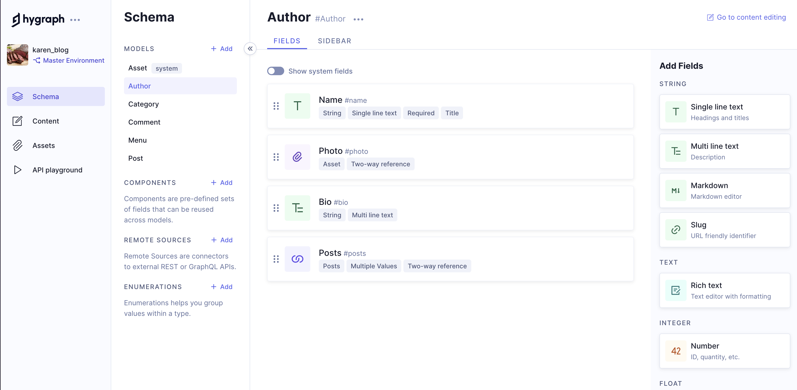

## Introduction
Karen is looking to write and share her recipes with family, friends and other cooking enthusiasts.   
The website should be easy to upload recipes, organize them into categories and manage   
her own collection with ease. Karen wants to make sure she can easily learn how to   
publish her recipes without it being too time-consuming or troublesome.

### Our approach
We put focus on to the keywords in Karen's wishlist. She wants to **manage**, **organize** and **share** her   
recipes **easily**. The initial thought we had were like WordPress. But we didn't want to use a monolithic CMS.  
After some research we found that Hygraph provides us with the perfect combination of features and flexibility   
that meet Karen's needs. It allows us to quickly create content models and for Karen to easily manage, organize   
and share recipes with a few clicks. Not only can we create custom user-friendly interfaces and implement powerful   
search capabilities, but also keep full control of our product without having to worry about any potential issues.

We chose to use **React JS**, **NextJS**, **Tailwind CSS**, **GraphQL** and **GraphCMS** as the development technologies for this project.

### What?
* **React JS** is a front-end JavaScript library for building user interfaces based on components.
* **NextJS** provides an easy-to-use, fast and reliable platform for developers to build performant websites. It offers a powerful server rendering solution
* **TailwindCSS** is a utility-first CSS framework packed with classes that can be composed to build any design, directly in our markup.
* **GraphQL** is an open-source data query and manipulation language for APIs, and a query runtime engine.
* **Hygraph(GraphCMS)** is a back end-only web content management system that acts primarily as a content repository.   
  It is hosted on a scalable state-of-the-art server architecture hosted by Amazon Web Services and based on PostgresQL.

### Why?
* We want easy production builds
* We want server-side rendering
* Static exporting options
* We want Karen to manage her own website with ease
* GraphCMS/Hygraph replaced the CMS part of WordPress
* GraphQL replaced both SQL and NoSQL but still keeping their respective benefits
* We want to create a website using new technologies

## Brief History
### Nextjs
**Initial release date:** _October 25, 2016_

**Next.js** was first released as an open-source project on GitHub on **_October 25, 2016_**.  
It was originally developed based on six principles: Out-of-the-Box functionality requiring no setup,   
JavaScript everywhere, all functions are written in JavaScript, automatic code-splitting and server-rendering,   
configurable data-fetching, anticipating requests, and simplifying deployment.

**A very summarized list of additions to Next.js between _2017-2022_:**
* **V 2.0 _Mar 2017_:** Improved for smaller websites and scalability.
* **V 7.0 _Sep 2018_:** Improved error handling and dynamic route handling (supporting React contextAPI).
* **V 8.0 _Feb 2019_:** serverless app deployment, improved static exports and prefetch performance.
* **V 9.3 _Mar 2020_:** optimization, global Sass and CSS module support.
* **V 9.5 _Jul 2020_:** incremental static regeneration, rewrites, and redirect support
* **V 11 _Jun 2021_:** Webpack 5, "Next.js Live".
* **V 12 _Oct 2021_:** Rust compiler, AVIF support, Edge Functions & Middleware, and Native ESM & URL Imports.
* **V 13 _Oct 2022_:** app directory that includes support for layouts, React server components, streaming, and a new set of data fetching methods.Turbo, changes to Next.js API.

### Tailwind CSS
**Initial release date:**  _November 1st, 2017_

**TailwindCSS** was an “accident” and came to be as a by-product of another  
project by Adam Wathan. Initially built with Less (Leaner CSS) and inspired   
by bootstrap. Eventually the project grew too big to be maintained with Less,   
and therefore David Hemphill suggested to build the framework using postCSS   
instead. The first alfa version was released in **_Oct 2017_**.

* **V 1.0 _May 2019_:** Official release
* **V 2.0 _Nov 2020_:** New color-palette, dark-mode support, minimizing breaking changes, form-styling,  
  extended spacing, typography and opacity scales, as well as a bunch more features were added.
* **V 2.1 _Mar 2021_:** JIT (Just-In-Time) compiles all CSS on-demand rather than generating the entire stylesheet up front.
* **_April 2021_:** Added React + Vue support
* **V 3.0 _Dec 2021_:** JIT, more colors and lots of new styling options.

### GraphQL
**Initial release date:** _September 14, 2015_

**_2004_ was the start** of the famous website we now know as “facebook”.   
Back then Apple was set on creating the best mobile browser, but ended up focusing   
too much on their native mobile apps and was left with a bad web browsing experience.

* In **_2012_**, this led to the facebook development team   
  working on a query language named GraphQL.
* In **_2015_**, they also introduced an open-source project called React.
* **Between _2019-2021_**, they released Relay that ties React   
  and GraphQL together, and decided to make GraphQL open-source.

### Hygraph (GraphCMS)
**Hygraph** we found out is the best GraphQL content management system out there.  
It gives us instant GraphQL Content APIs to create, enrich, unify and deliver content across platforms.

The **GraphQL CMS** was an idea created by two friends in **2015** working for a DAM company.
* The product was officially funded in **2017**. Initially named GraphCMS but then later changed to Hygraph.
* **In 2021**, they added some features such as improvements of the CMS layout, granular permissions,   
  UI extensions and scheduled publishing. They also added a marketing website reference app   
  and ecommerce. they added proper docs and opened a GraphQL community.
* **In 2022**, they changed name to Hygraph, introduced content federation,   
  added commenting-feature, adding components, added new extensions   
  for marketplace and launched hygraph.design.

## Features
* **React** makes it easier to create dynamic web applications because it requires less coding and offers  
  more functionality, as opposed to JavaScript, where coding often gets complex very quickly.   
  Improved performance: React uses Virtual DOM, thereby creating web applications faster.  
  &nbsp;
* **Nextjs** gives developers the ability to do things like server-side rendering, which means   
  the server reads through code and tells the browser what to display on the page.   
  Server-side rendering creates faster, more versatile web applications.  
  &nbsp;
* **GraphQL** simplifies the task of aggregating data from multiple sources or   
  APIs and then resolving the data to the client in a single API call.  
  &nbsp;
* **Hygraph** features content modeling where developers and content managers   
  can easily set up content structures, or models, create custom workflows,   
  and connect models to speed up creation.

* **_Note:_** _Image shows only Hygraph features._

## Strengths
* Easy to use for both the client and the developer
* The GraphQL syntax is not so different from JSON
* Hygraph acts as both a Headless CMS and a powerful GraphQL database
* Delivers performance and scalability with the available features
* Offers a free plan

## Weaknesses
* GraphQL allows mutations in writing codes requiring customized codes for every new write operation.  
Therefore the GraphQL can be more challenging in design and implementation.
* Cost money for bigger or more projects
* We have yet to figure out more cons...

## Comparison
### Hygraph vs WordPress
Using WordPress can cause your code to become more difficult   
to maintain due to the amount of plugins you might end up   
integrating. Hygraph seems to beat WP in a multitude of fields   
and generally has more to offer with equally good/or better solutions.

**GraphQL** offers to do what a lot of WordPress plugins claim to do,   
but fails to do as efficiently as GraphQL. GraphQL also offers its own API.     
GraphQL focuses on simplifying the exchange of data between the client and   
the server and claims to be more efficient than the standard REST architecture.   
Hygraph also has a larger selection of categories, such as Headless eCommerce,   
Forms automation, mobile content management system and more. Hygraph is also generally   
easier to set up and maintain, especially code-wise when using a headless CMS.   
WordPress relies on a lot of plugins which can cause hard-to-maintain hacky code down the road.

Although using Hygraph offers drag & drop features and minimizes/eliminates need for code,   
it is still easier to understand and use the tool with at least some level of technical   
knowledge and be familiar with web-development. For those who lack this experience WordPress could   
be a better option since it is very easy to use even for those with little to no technical knowledge.

Both WordPress and Hygraph offer simplicity and a wide range of use-cases,   
and both tools have a free-to-use tier which makes getting started easy.

### GraphQL vs SQL
While GraphQL offers a simple, readable format for data access, it stands out   
from SQL in that it has a unique feature called “nesting”. This ability to nest   
queries lets us fetch all the relevant data from the API all within one request.   
GraphQL is also nearly a universal query language that can handle data from different   
sources with ease. This makes GraphQL ideal for working with backends that have other   
types of data sources besides databases.

SQL has long been the most popular go-to query language. But SQL does not have   
the ability to use nested queries like GraphQL. SQL syntax is also a bit more complex,   
as well as it not being universal which still makes it a great tool for working with   
databases, but not ideal for APIs.

The way I like to say it is this:   
_"GraphQL permits flexible queries within the framework set by the   
developer who built the API. SQL permits universal querying on any   
database model. So if you’re primarily querying databases, SQL will do the job nicely."_

GraphQL, in spite of its popularity as an API query language,   
is not going to unseat SQL as the primary language for database access.

## Summary
As content management systems (CMS) become more and more popular,   
developers have to decide which CMS to use for their projects.   
WordPress has been the go-to option for many projects due to   
its ease of use, powerful features and flexibility. However,   
as technology advances, there are now other options available   
that can provide a better development experience.  

**WordPress** is still the most popular CMS solution, but it is too monolithic, preventing it from being   
flexible enough to meet the needs of today's users. And as developers, as far as we're concerned,   
WordPress will not give us the needed support for improving our coding skills.  

**Hygraph (GraphCMS)** gives the developer the ease of not having to hard-code their own back-end.     
Hygraph was a great option for our project because it provided a solid, intuitive platform.    
We utilized Hygraph's intuitive user interface which enabled us to quickly develop the website    
with minimal effort. It allowed us to develop the website quickly and easily, and gave Karen    
the opportunity to add her recipes with ease.  

**GraphQL** makes it easy to exchange data at a single endpoint.    
In Hygraph, the `models` made in the `schema`-section could be compared to the    
`tables` in a database, and the `fields` would be the `columns`. Now, instead of     
the developer adding more `tables`, Karen can do that herself, as well as adding the     
`rows` to the `tables`, without the developer having to hard-code their way to achieve this.  

It exists a lot of documentation and a big community for **Hygraph**, and using it     
together with **GraphQL** gives you the opportunity to query for a specific endpoint,     
these tools are great and easy to use, if you don't want to use a coupled CMS.    
It is intuitive and flexible, and the most important: Karen can add her recipes whenever she wants!

We made a little video clip to showcase a basic introduction of Hygraph.    

  
**Source:** [_Video Clip Showcasing Hygraph_](https://www.youtube.com/watch?v=7hnxVRcmN94)

## References
**Wikipedia:** [Nextjs](https://www.google.com/url?sa=t&rct=j&q=&esrc=s&source=web&cd=&cad=rja&uact=8&ved=2ahUKEwjQ89zihaT9AhXitYsKHW6TAPkQmhN6BAhiEAI&url=https%3A%2F%2Fen.wikipedia.org%2Fwiki%2FNext.js&usg=AOvVaw0B-Px8Rh7KearsjWzEctWw)  
**Wikipedia:** [Reactjs](https://www.google.com/url?sa=t&rct=j&q=&esrc=s&source=web&cd=&cad=rja&uact=8&ved=2ahUKEwi1x8zPhaT9AhXJwosKHQb6BhMQmhN6BAhkEAI&url=https%3A%2F%2Fen.wikipedia.org%2Fwiki%2FReact_(JavaScript_library)&usg=AOvVaw0YVCk9X7Sh1l7rf61OXIPW)  
**Wikipedia:** [GraphQL](https://www.google.com/url?sa=t&rct=j&q=&esrc=s&source=web&cd=&cad=rja&uact=8&ved=2ahUKEwiNq42dhqT9AhVolosKHRVqCBQQmhN6BAhjEAI&url=https%3A%2F%2Fen.wikipedia.org%2Fwiki%2FGraphQL&usg=AOvVaw2vBjxmxg9EAnjF3uFZE5Lt)  
**Docs:** [ReactJS](https://reactjs.org/)  
**Docs:** [NextJS](https://nextjs.org/)  
**Docs:** [TailwindCSS](https://tailwindcss.com/)  
**Docs:** [GraphQL](https://graphql.org/)  
**Docs:** [GraphCMS / Hygraph](https://hygraph.com/)  
**Video:** [Build and Deploy THE BEST Modern Blog App with React](https://www.youtube.com/watch?app=desktop&v=HYv55DhgTuA)   
**Gist:** [Tutorial Featured Post Card](https://gist.github.com/adrianhajdin/2b2e8509a48229baf9bb9b53d4a31c91)  
**Gist:** [Image Resize in GitHub Markdown](https://gist.github.com/uupaa/f77d2bcf4dc7a294d109)  
**Images:** [Pixabay](https://pixabay.com/no/photos/search/chicken%20fried%20rice/?manual_search=1)  
**GitHub:** [Add local repo to GitHub using GitHub CLI](https://docs.github.com/en/get-started/importing-your-projects-to-github/importing-source-code-to-github/adding-locally-hosted-code-to-github)  
**Recipe:** [Chicken Fried Rice](https://www.delish.com/cooking/recipe-ideas/a25635966/chicken-fried-rice-recipe/)  
**Article:** [The First Headless CMS Built Around GraphQL](https://www.cms-connected.com/News-Archive/September-2017/GraphCMS-The-First-Headless-Content-Management-System-Built-Around-GraphQL)  