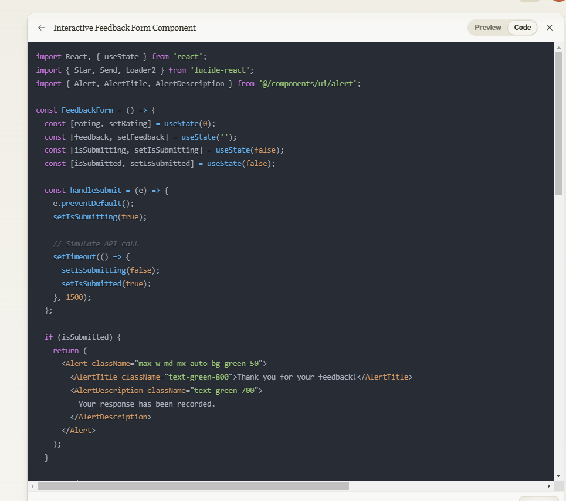

## Introduction

Claude.ai is a family of foundational AI models made by Anthropic. Is has, as of October 2024, 3 main models(Haiku, Sonnet, Opus). We'll go more in-depth on what separates the three further in to the document.

## Brief History

- 2021: Anthropic is founded by ex OpenAi-employees, most notably the siblings Daniela Amodei and Dario Amodei.
- 2023: Claude, the initial version of the language model was released in March(2 version, Claude and Claude instant).
- 2023: In July, Claude 2 was released. More tokens, as well as extra abilities regarding reading, summarizing and assisting with tasks from PDF and other documents was included.
- 2024: Claude 2.1 was released in January. They doubled the number of tokens Claude was able to handle, as well as decreased the likelihood of false statements.
- 2024: Claude 3 introduced the three models, Haiku, Sonnet and Opus with its release in March.
- 2024: Claude 3.5 Sonnet is released to the public in June.
- 2024: In October, 3.5 Haiku, as well as an upgraded 3.5 Sonnet is released.

## Main Features

- **Written content:** As most AI chatbots, Claude.ai is good at helping you write in text form. Everything from short messages to longer style content like a novel or a screenplay. Claude can also be a good tool to use when summarizing longer articles and such.
- **Image Analyzing:** Claude can be used to analyze an image, like for example chart data from a picture, or interpreting what is on the image in question.
- **Programming:** Claude is exceptionally good at being a "pair programmer". It knows all the major programming languages, but really excels at Python.
- **Brainstorming:** The chatbot can also be used to act as a brainstorming partner, to help further the creativity of the user, while also providing different viewpoints for example.

While being a fully usable general AI chatbot, especially Claude.ai 3.5 Sonnet is exceptionally good with code, which is the main focus of this case study. The 3.5 Sonnet is trained on data up until April 2024 as of the writing of this text.
One of the main reasons the version works really good while having it as a pair programmer or a helper of sorts, is because of the interface. Please have a look this screenshot where Claude was asked to make some quick example code to preview how the interface is.

Like mentioned earlier, Claude.ai have an extensive library of knowledge in programming languages, and have Full-stack capabilities.
Since its fairly recent data update, it writes and suggests clean and well-structured code, as well as follow the best practices in the different languages.

Some limitations are there; Claude.ai can not run or test the code it writes. It also does not have the ability to access external APIs or databases.

## Market Comparison

The obvious competitors that has the most relevancy in this study are the following;

- OpenAIs GPT-4o: This is probably the most known AI chatbot, and it has updated data from October 2023. As part of OpenAIs network of chatbot, this would probably be to go-to option for most people not specifically working with coding, although it also is good at being a pair programmer, or a sparring partner of sorts.
- Google Gemini 1.5 Pro: Updated with data up until November 2023. While also being, like GPT, fairly good at coding, Gemini is most notable in delivering high-quality language understanding and delivering good performances in content creation and data analysis.
- Mistral: Mistral 7B v0.3, which is the latest version of Mistral have a updated database up until mid-2024. Mistral excels in being extremely capable multilingualy, as well as in code generation and mathematical reasoning.

## Good-to-knows

When starting to use Claude.ai 3.5 Sonnet, you get

## Conclusion

This section can be used to summarize your findings. What are the main advantages and disadvantages of your chosen tool? What are the main use cases for this tool? What are the main limitations of this tool? What does the future look like for this tool?

## References

- [Example.com](https://example.com)
- _Good Examples_ by John Doe, 1990
- The Example Podcast, Episode 1
- [Examples Explained](https://youtu.be/dQw4w9WgXcQ)

## Additional Resources

- [More about Examples](https://example.com)
- [Examples, the Full Course](https://youtu.be/dQw4w9WgXcQ)
