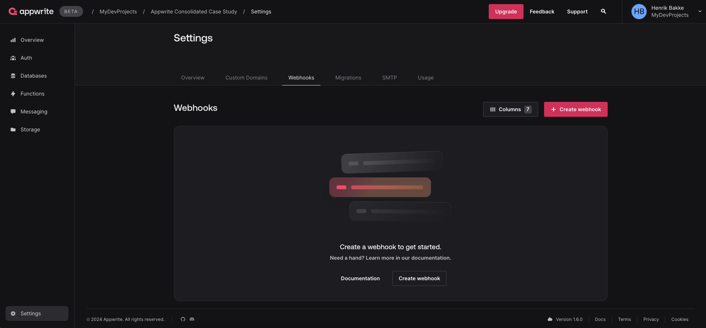
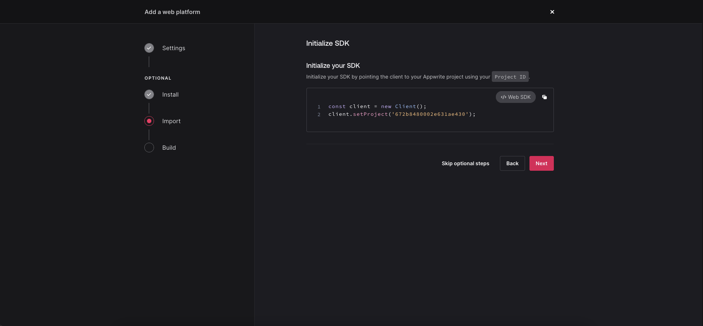
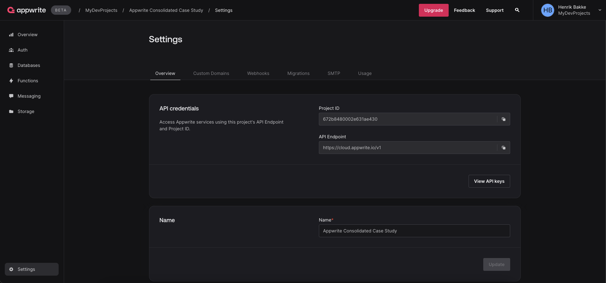
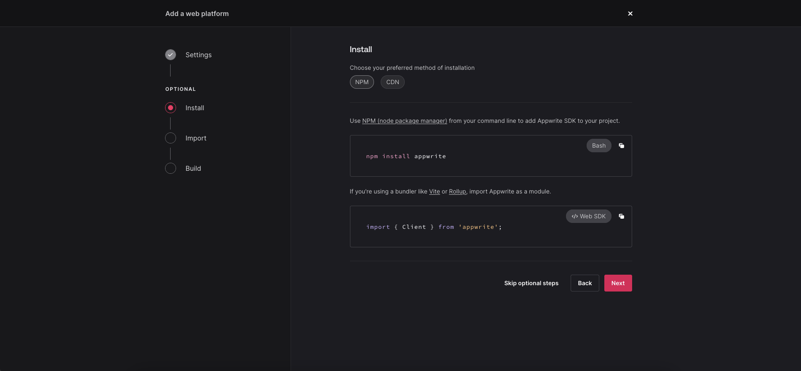
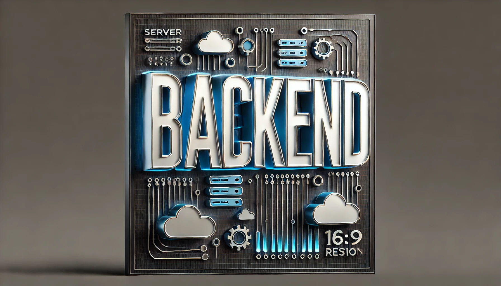
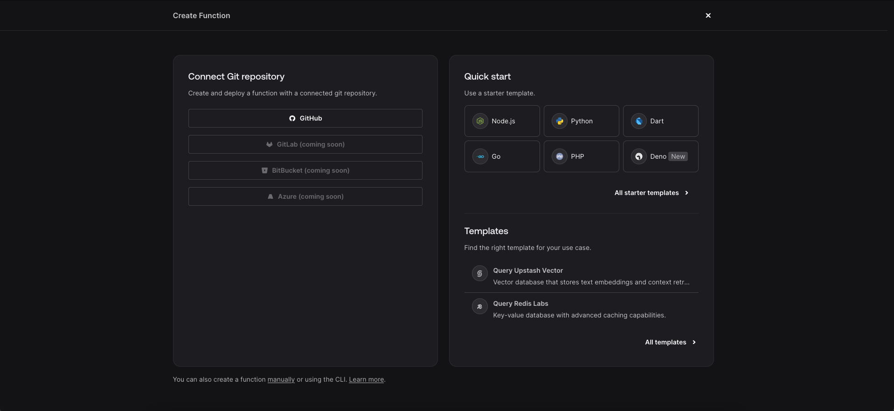

# Table of Contents

- [1. Introduction to Appwrite](#1-Introduction-to-Appwrite)

  - [1a. Overview of Appwrite](#1a-Overview-of-Appwrite)
  - [1b. Target Audience](#1b-Target-Audience)
  - [1c. Category](#1c-Category)
  - [1d. Open Source Nature](#1d-Open-Source-Nature)

- [2. History of Appwrite](#2-History-of-Appwrite)

  - [2a. Founding and Launch](#2a-Founding-and-Launch)
  - [2b. Evolution](#2b-Evolution)
  - [2c. Community Growth](#2c-Community-Growth)
  - [2d. Funding and Partnerships](#2d-Funding-and-Partnerships)

- [3. Core Features of Appwrite](#3-Core-Features-of-Appwrite)

  - [3a. Database Management](#3a-Database-Management)
  - [3b. User Authentication](#3b-User-Authentication)
  - [3c. File Storage](#3c-File-Storage)
  - [3d. Cloud Functions](#3d-Cloud-Functions)
  - [3e. Real-time and Webhooks](#3e-Real-Time-and-Webhooks)
  - [3f. Appwrite SDKs](#3f-Appwrite-SDKs)
  - [3g. API Endpoints](#3g-API-Endpoints)
  - [3h. Cross-Platform Support](#3h-Cross-Platform-Support)

- [4. Deep Dive into a Specific Feature](#4-Deep-Dive-Into-a-Specific-Feature)

  - [4a. Database](#4a-Database)
  - [4b. User Authentication](#4b-User-Authentication)
  - [4c. Performance Metrics](#4c-Performance-Metrics)

- [5. Setup and Usage](#5-Setup-and-Usage)

  - [5a. Installation Process](#5a-Installation-Process)
  - [5b. Deployment Options](#5b-Deployment-Options)
  - [5c. Configuration and Customization](#5c-Configuration-and-Customization)
  - [5d. Appwrite Console](#5d-Appwrite-Console)

- [6. Applications and Use Cases](#6-Applications-and-Use-Cases)

  - [6a. Common Use Cases](#6a-Common-Use-Cases)
  - [6b. Popular Integrations](#6b-Popular-Integrations)
  - [6c. Industries/Verticals](#6c-Industries-and-Verticals)

- [7. Comparison with Other Platforms](#7-Comparison-with-Other-Platforms)

  - [7a. Supabase](#7a-Supabase)
  - [7b. AWS Amplify](#7b-AWS-Amplify)
  - [7c. Backendless](#7c-Backendless)
  - [7d. Firebase](#7d-Firebase)

- [8. Strengths of Appwrite](#8-Strengths-of-Appwrite)

  - [8a. Open-Source Community](#8a-Open-Source-Community)
  - [8b. Self-Hosted Option](#8b-Self-Hosted-Option)
  - [8c. Cloud Hosting](#8c-Cloud-Hosting)
  - [8d. Security](#8d-Security)
  - [8e. Modularity and Extensibility](#8e-Modularity-and-Extensibility)
  - [8f. Cross-Platform SDKs](#8f-Cross-Platform-SDKs)

- [9. Weaknesses or Limitations of Appwrite](#9-Weaknesses-or-Limitations-of-Appwrite)

  - [9a. Feature Gaps](#9a-Feature-Gaps)
  - [9b. Learning Curve](#9b-Learning-Curve)

- [10. Community and Ecosystem](#10-Community-and-Ecosystem)

  - [10a. GitHub Activity](#10a-Github-Activity)
  - [10b. Developer Resources](#10b-Developer-Resources)
  - [10c. Extensions and Plugins](#10c-Extensions-and-Plugins)
  - [10d. Community Feedback](#10d-Community-Feedback)

- [11. Future of Appwrite](#11-Future-of-Appwrite)

  - [11a. Roadmap](#11a-Roadmap)
  - [11b. Upcoming Features](#11b-Upcoming-Features)
  - [11c. Market Potential](#11c-Market-Potential)

- [12. Conclusion](#12-Conclusion)
  - [12a. Summary of Key Points](#12a-Summary-of-Key-Points)
  - [12b. Recommendation](#12b-Recommendation)
  - [12c. Final Thoughts](#12c-Final-Thoughts)

# 1-Introduction-to-Appwrite

## 1a-Overview-of-Appwrite

### What is Appwrite?

Appwrite is an open-source backend-as-a-service (BaaS) platform designed to streamline backend development for mobile and web developers. It offers a suite of pre-built APIs and tools for managing core backend functionalities such as user authentication, database management, file storage, and serverless functions. Appwrite is designed to be self-hosted using Docker, which provides developers with flexibility in deploying it locally or on the cloud [1](#references), [2](#references).

#### Key Features

- **User Authentication**: Supports multiple methods, including email/password and OAuth integrations like Discord, providing flexible and secure authentication solutions [2](#references), [3](#references).
- **Database Management**: Offers a NoSQL database to manage structured data efficiently, simplifying database setup and management for developers [3](#references), [7](#references).
- **File Storage**: Appwrite includes secure file management, with capabilities for file uploads, downloads, and integrations such as Amazon S3, allowing developers to manage and manipulate files directly within their applications [3](#references), [6](#references).
- **Serverless Functions**: The platform supports serverless functions, enabling developers to create custom logic triggered by events or scheduled tasks, making the application more dynamic and responsive [5](#references), [7](#references).
- **Multi-platform Support**: Appwrite is compatible with multiple platforms, including web, Android, and Flutter, and offers SDKs in various programming languages like JavaScript, Swift, and Dart, ensuring developers can integrate it into their existing tech stack easily [2](#references), [8](#references).

Appwrite’s developer-friendly design reduces the need for extensive backend coding, allowing front-end developers to manage backend tasks using a UI management console and pre-configured APIs, which simplifies the development process [4](#references), [6](#references). It aims to empower developers to focus on building innovative features rather than spending time on backend setup and maintenance [1](#references), [5](#references).

#### Deployment Options

Appwrite offers flexibility in deployment through several options:

- **Self-Hosting**: Developers can deploy Appwrite using Docker, making it easy to set up on various environments, including local machines and cloud servers [3](#references), [6](#references).
- **Third-Party Hosting**: Appwrite integrates with services like Elestio for managed hosting, providing additional flexibility [5](#references).
- **Cloud Version**: A cloud version is also available, currently in private beta, for those seeking managed solutions [5](#references).

By providing a comprehensive, easy-to-use, and secure backend solution, Appwrite enables developers to build, scale, and innovate applications efficiently while managing backend services with minimal complexity [1](#references), [8](#references).

## 1b-Target-Audience

### Who is Appwrite built for?

Appwrite is designed for a diverse range of users, including developers, startups, and enterprises, offering a flexible, scalable, and user-friendly backend solution suitable for various application development needs.

#### Developers

Appwrite primarily targets developers, particularly those building web, mobile, and Flutter applications. It simplifies backend development by providing APIs and tools that allow developers to manage key services like authentication, databases, file storage, and messaging without extensive backend coding [9](#references), [11](#references), [12](#references). This makes it ideal for frontend developers and mobile developers who want to focus on the user interface and experience rather than the complexities of backend infrastructure [9](#references), [10](#references).

Freelancers also benefit from Appwrite’s features, as the platform provides a centralized, secure solution for managing client data and scaling projects, helping them manage multiple clients more efficiently [11](#references). For full-stack developers, Appwrite offers an all-in-one solution to streamline backend management, allowing them to build and deploy applications faster [10](#references), [11](#references).

#### Startups

Appwrite caters to startups and small teams by offering a self-hosted backend platform that minimizes the need for extensive backend resources. This enables startups to develop, scale, and launch applications quickly while maintaining secure, scalable infrastructure [10](#references), [12](#references). Its flexibility and support for various frameworks (e.g., Flutter, React, Angular) make it a practical solution for startups aiming to minimize development cycles and reduce costs while maximizing productivity [13](#references).

#### Enterprises

While Appwrite’s primary focus is on individual developers and startups, it also serves enterprise needs by offering a scalable and customizable backend solution. Enterprises can benefit from Appwrite's ability to provide secure, large-scale application support with options for self-hosting, giving organizations more control over their data and infrastructure [10](#references), [14](#references). Appwrite's adaptability makes it a fit for enterprises seeking robust, secure, and efficient backend management tailored to enterprise-level projects [16](#references).

#### Summary

In conclusion, Appwrite is built for developers, startups, and enterprises seeking a simplified approach to backend development. It provides the tools necessary for building secure and scalable applications while supporting various programming languages and frameworks. The platform's focus on ease of use and flexibility makes it suitable for both individual developers, startups looking to scale quickly, and enterprises needing robust backend solutions [13](#references), [15](#references).

## 1c-Category

Appwrite primarily fits into the **Backend-as-a-Service (BaaS)** category. The platform provides an extensive suite of backend services, such as user authentication, database management, file storage, and cloud functions, all integrated as Docker microservices. By packaging these backend capabilities, Appwrite allows developers to focus on building applications rather than managing the server infrastructure, aligning with the core principles of BaaS [17](#references), [18](#references).

### Key Features Supporting BaaS Classification

1. **Database Management**: Appwrite offers real-time database services, making it straightforward for developers to manage and synchronize data. This functionality is central to BaaS platforms as it abstracts backend complexities for seamless integration with front-end applications [17](#references), [18](#references), [19](#references).
2. **User Authentication and Security**: Appwrite provides built-in support for authentication, roles, and permissions management, ensuring secure user access and identity management, which is a critical aspect of BaaS solutions [17](#references), [19](#references).

3. **File Storage and Media Handling**: It features robust file storage capabilities, allowing developers to handle media uploads and downloads efficiently, a key feature for modern applications that need cloud-based storage solutions [17](#references), [18](#references).

4. **Cloud Functions**: Appwrite supports the execution of server-side logic through cloud functions, which can be triggered based on specific events or API requests. This serverless approach is another hallmark of BaaS platforms, providing flexibility without server management overhead [17](#references), [19](#references).

5. **API and SDK Support**: The platform abstracts its services through REST APIs and SDKs across multiple programming languages and platforms, which is characteristic of both BaaS and API-first platforms. However, the focus on offering a comprehensive set of backend services, rather than exclusively on APIs, solidifies its position as a BaaS offering [17](#references), [19](#references).

### API-first and Full-Stack Characteristics

While Appwrite demonstrates traits that could classify it under **API-first platforms** due to its extensive API offerings and SDK support, these features serve primarily to enhance its backend service delivery rather than being the main focus. It is not a full-stack development platform as it lacks integrated front-end tools or frameworks, further supporting its primary classification as a BaaS solution [18](#references), [19](#references).

### Conclusion

Appwrite is best categorized as a **Backend-as-a-Service (BaaS)** platform. Its features align with the standard offerings of BaaS, providing a full suite of backend services that streamline development for frontend-focused developers by handling backend complexities through APIs and microservices.

## 1d-Open-Source-Nature

### Appwrite's Open-Source Background and Its Importance to the Developer Community

Appwrite’s open-source background is a fundamental aspect of its appeal and value to the developer community. As an open-source backend-as-a-service (BaaS) platform, Appwrite provides essential backend functionalities like authentication, database management, and file storage through easy-to-use APIs and SDKs, making the development process faster and more efficient [20](#references), [21](#references).

#### Transparency and Trust

With its open-source codebase available on platforms like GitHub, Appwrite offers complete transparency. Developers can inspect, modify, and verify the platform's inner workings, ensuring trust and security by understanding precisely how data is handled. This visibility is critical when managing sensitive information, allowing developers to confirm and even enhance security measures [20](#references), [22](#references).

#### Community-Driven Development

The open-source nature of Appwrite enables collaboration from a global developer community. With hundreds of contributors, the platform benefits from rapid development cycles and the implementation of features that reflect actual developer needs. This collaborative environment ensures that Appwrite evolves quickly and stays relevant, directly responding to user feedback and real-world challenges [20](#references), [21](#references).

#### Flexibility and Customizability

Appwrite’s open-source model allows developers to customize and adapt the platform to suit specific project requirements. This flexibility enables Appwrite to function either as a standalone backend or as part of a larger infrastructure, giving developers complete control over how they integrate and utilize the platform [21](#references), [22](#references).

#### Cost-Effective Development

Appwrite’s open-source license makes it a cost-effective solution, eliminating licensing fees and reducing the need for proprietary backend services. Developers can self-host the platform, significantly lowering costs compared to commercial BaaS solutions like Firebase, which can become expensive as applications scale [20](#references), [22](#references).

#### Avoidance of Vendor Lock-In

By being open-source, Appwrite helps developers avoid vendor lock-in. Developers are not tied to a specific provider, granting them the flexibility to switch hosting services or adjust backend components without being constrained by proprietary systems [21](#references), [22](#references).

#### Educational Resource and Skill Development

Appwrite’s open-source codebase is an excellent educational tool. Developers, particularly those new to backend development, can explore and learn from the source code to understand best practices for building secure, scalable backend solutions. Additionally, contributing to Appwrite enables developers to enhance their skills and build strong portfolios, demonstrating their expertise [20](#references), [22](#references).

#### Conclusion

Appwrite’s open-source background is crucial for its growing adoption within the developer community. It offers transparency, encourages collaboration, and provides a flexible, cost-effective backend solution that promotes innovation and skill development. By avoiding vendor lock-in and fostering a dynamic community, Appwrite emerges as a powerful alternative to proprietary systems, enabling developers to build secure, efficient, and scalable applications [21](#references), [22](#references).

# 2-History-of-Appwrite

## 2a-Founding-and-Launch

### When was Appwrite founded and by whom?

Appwrite was founded in 2019 by Israeli developer and entrepreneur Eldad Fux, who aimed to simplify the backend development process for mobile and web applications. Frustrated with the existing tools that demanded significant infrastructure setup and maintenance, Eldad envisioned a modular, scalable Backend-as-a-Service (BaaS) platform that would enable developers to focus on building applications without the complexities of backend management [23](#references).

Eldad, as the Founder and CEO, played a pivotal role in the development of Appwrite. Known as “contributor zero,” he continues to steer the project’s growth. After securing initial funding, Appwrite hired its first engineers, including Christy Jacob, who is now the Lead Engineer for Appwrite Cloud, and Damodar Lohani, a Flutter enthusiast who contributed significantly to Appwrite’s Flutter SDK and community [24](#references).

Appwrite’s early contributors also included Bradley Schofield, who joined at 16 and has since become a full-stack engineer focused on growth, and Jake Barnby, a key figure in Appwrite’s Android SDK development. Torsten Dittmann, who initially fixed bugs, now leads front-end development. This collaborative culture, rooted in the open-source community, continues to drive Appwrite’s expansion and innovation [24](#references).

## 2b-Evolution

### Key Milestones in Appwrite's Development Over the Years

Appwrite has evolved significantly since its inception, transitioning from a personal open-source project to a comprehensive Backend-as-a-Service (BaaS) platform with a growing ecosystem. Here are the key milestones in its development:

### 1. **Founding and Initial Development (2019)**

Appwrite was created by Eldad Fux in 2019 as an open-source BaaS platform aimed at simplifying backend development for developers. The first pull request marked its beginning, and shortly thereafter, community contributions started, driving initial growth and feature development [25](#references), [26](#references).

### 2. **Public Launch and Community Growth (2019-2020)**

Appwrite launched publicly on GitHub in September 2019, quickly gaining traction within the developer community. A post on Hacker News brought it widespread attention, leading to thousands of GitHub stars and a growing number of contributors. This momentum saw the platform stabilizing and expanding its feature set through community engagement [25](#references), [26](#references), [29](#references).

### 3. **Key Feature Expansions and Realtime API Integration (2020-2021)**

During 2020 and 2021, Appwrite introduced significant updates, including advanced user authentication options, cloud storage, and role-based access control. The addition of a Realtime API in 2021 enabled developers to implement real-time features in their applications, further enhancing Appwrite's position as a BaaS platform [25](#references), [28](#references).

### 4. **Series A Funding and Platform Enhancements (2022)**

In 2022, Appwrite raised $27 million in Series A funding led by Tiger Global. This allowed the platform to improve its developer experience, expand its team, and integrate further with popular frameworks like Flutter, React, iOS, and Android. Additionally, Appwrite launched a $50,000 open-source fund to support other OSS projects, emphasizing its commitment to the developer community [26](#references), [27](#references), [28](#references), [30](#references).

### 5. **Launch of Appwrite Cloud Beta and Appwrite Pro (2023)**

In 2023, Appwrite launched the beta of Appwrite Cloud, offering a managed hosting environment and introducing structured Free and Pro tiers. This marked the platform’s shift toward offering managed services and premium features. The introduction of Appwrite Pro in December 2023 provided advanced scalability options, custom branding, and premium support for production-level applications [27](#references), [29](#references).

### 6. **Version 1.0 Release and Marketplace Expansion (2022-2023)**

Appwrite reached its first production-ready version with the release of Version 1.0 in September 2022, featuring OAuth integrations, enhanced performance, and stability improvements. Following this, the platform launched the Appwrite Marketplace, allowing developers to integrate third-party services and plugins, further expanding its ecosystem and cloud-native capabilities [25](#references), [28](#references).

### 7. **Scaling Capabilities and AI/ML Integrations (2023)**

Version 1.2, released in October 2023, brought enhanced scalability features, including multi-tenancy support and AI/ML service integrations. These updates aimed to support large-scale applications and keep Appwrite competitive in the evolving cloud space, catering to modern developer needs [26](#references), [28](#references).

### 8. **Commitment to the Open-Source Community**

Throughout its development, Appwrite has maintained its open-source roots, hiring from within its contributor community and continuously supporting open-source projects. Initiatives like the Appwrite Swag Store and the OSS Program, which offers free access to Appwrite Pro for maintainers, demonstrate its ongoing commitment to developers and maintainers worldwide [25](#references), [27](#references), [28](#references).

## 2c-Community-Growth

### How has the developer community evolved around Appwrite?

The developer community surrounding Appwrite has grown into a vibrant, open-source-driven ecosystem. Initially aimed at making backend development more accessible, Appwrite attracted a diverse group of developers who contribute through bug reports, feature suggestions, documentation improvements, and open-source contributions. Several key factors have driven this growth:

1. **Open-source foundation**: Appwrite’s open-source nature allows developers to participate directly in its development. Contributions range from fixing bugs to suggesting new features, fostering a collaborative community environment where even small contributions have a noticeable impact [31](#references).

2. **Hackathons and community events**: Regular events like Hacktoberfest and other community hackathons encourage developers to collaborate on projects, explore Appwrite's capabilities, and innovate. These events also provide opportunities for learning and skill showcasing [31](#references).

3. **Community programs**: Programs like "Appwrite Heroes" highlight contributors who actively share knowledge through tutorials, guides, and support. These developers play a crucial role in onboarding new users and expanding the community by creating valuable resources [31](#references), [33](#references).

4. **Strong support networks**: Appwrite offers accessible support through platforms like GitHub and Discord, where developers at all levels can solve challenges together and learn from one another [31](#references).

Through a combination of open-source collaboration, educational initiatives, and community recognition, the Appwrite developer community has become a dynamic and supportive environment for learning, contributing, and innovation.

#### Statistics on Community Engagement

The community now consists of over 800 contributors, reflecting the growth of the Appwrite ecosystem. These developers have contributed to more than 43.9K GitHub stars, 3K+ pull requests, 21K commits, and 3.5K forks. They help by submitting bug reports, suggesting new features, improving documentation, and sharing tutorials and blog posts to help others learn about Appwrite. Additionally, the community supports one another by sharing knowledge at meetups and enhancing the platform through code improvements [32](#references).

#### Appwrite Heroes Program

The Appwrite Heroes program has been instrumental in fostering a dedicated group of expert developers who contribute to the community by creating video tutorials, blog posts, and written guides. These Heroes also actively support other developers, particularly within the Appwrite Discord community. The program not only provides recognition but also offers access to exclusive resources and participation in in-person gatherings. This initiative strengthens the Appwrite community by highlighting the achievements of these key contributors [33](#references).

### Open-source Contributions and Key Milestones

Appwrite’s commitment to open-source development has been a major factor in the community’s growth. More than 700 developers have shaped the platform by contributing to its improvement. A significant milestone was the release of Appwrite 1.4, which involved over 40 contributors. They worked on various elements such as bug fixes, documentation, translations, and feature enhancements. Every contribution, no matter the size, has helped to make Appwrite more useful for the global developer community [34](#references).

The participation in events like Hacktoberfest has been especially influential. These events serve as a gateway for many developers to begin their open-source journeys, just as some of Appwrite’s core team members did. Appwrite’s community-driven approach ensures that every contributor has a meaningful impact on the platform’s evolution, making the tool more developer-friendly and reinforcing the community’s open-source ethos [34](#references).

## 2d-Funding-and-Partnerships

Appwrite has raised a total of $37 million across two funding rounds. The most recent and largest was a $27 million Series A round held on April 5, 2022, led by Tiger Global Management, with participation from Bessemer Venture Partners, Flybridge, and other investors. This funding enabled Appwrite to accelerate the development of its platform, grow its developer community, and introduce new features aimed at both individual developers and enterprise users [35](#references).

Prior to this, Appwrite raised between $8.5 million and $10 million in a Seed round on September 28, 2021. While Appwrite’s own communications reference the amount as $8.5 million, some sources report it as $10 million, possibly due to rounding or additional late-stage contributions. This round was led by Bessemer Venture Partners and Flybridge, with participation from Ibex and Seedcamp [36](#references), [37](#references).

These funding rounds provided Appwrite with the financial backing to expand its team, improve its product offering, and build out its open-source community. The company's partnerships, including collaborations with cloud providers and tech ecosystems, have also been critical in helping Appwrite integrate with various development environments and strengthen its position in the backend infrastructure space [35](#references).

Appwrite also benefits from the support of several notable angel investors, including Ariel Maislos (former Apple IL CEO) and Uri Boness (co-founder of Elastic), as well as other key angel investors, all of whom contribute to the company’s growth alongside its institutional backers [37](#references), [38](#references).

# 3-Core-Features-of-Appwrite

## 3a-Database-Management

### How Appwrite Handles Database Interactions (SQL/NoSQL Support, Built-in Database Features)

Appwrite employs a NoSQL-inspired database model but integrates SQL-like querying features to offer flexibility and adaptability for developers across various use cases. Here’s an overview of how it manages database interactions:

#### 1. Database Model and Support (SQL vs. NoSQL)

Appwrite uses a NoSQL, document-based model as its primary structure. It operates around **collections** (equivalent to tables in SQL) and **documents** (similar to rows), which allows for flexible, schema-less data storage, adapting well to evolving application requirements, particularly in mobile and web app development [39](#references), [41](#references). Although it primarily follows a NoSQL approach, Appwrite also supports SQL-like features, including advanced filtering, sorting, and pagination, thus bridging the gap between SQL and NoSQL functionalities [42](#references).

#### 2. Built-in Database Features

Appwrite includes several built-in features designed to streamline database management:

- **Attributes and Indexing**: Developers can define custom attributes for collections, which function similarly to fields in SQL databases. Appwrite also supports indexing specific fields, enabling faster search and filtering operations [39](#references).
- **Advanced Querying Capabilities**: The platform supports SQL-like operations such as filtering (`Query.equal()`, `Query.greaterThan()`) and sorting (`Query.orderAsc()`, `Query.orderDesc()`), making it familiar to developers with SQL backgrounds. It offers both limit-offset and cursor-based pagination for handling large datasets effectively [42](#references).
- **Real-time Database Updates**: Appwrite allows subscriptions to real-time updates, pushing changes directly to clients when documents are created, updated, or deleted, which is ideal for use cases like chat applications or collaborative tools [39](#references).

#### 3. Extensibility and Integration with External Databases

While Appwrite provides a built-in database for simple to moderate requirements, it also supports integration with external SQL and NoSQL databases through **Appwrite Functions**. This includes support for PostgreSQL (e.g., Neon), MongoDB (e.g., MongoDB Atlas), and specialized databases like Redis and Neo4j for graph relationships [40](#references). This flexibility enables developers to start with the built-in database and expand to more sophisticated solutions as needed.

#### 4. Database Relationships and Flexibility

Despite its NoSQL orientation, Appwrite supports **relationships between collections** akin to SQL systems, such as one-to-one, one-to-many, and many-to-many, which are useful in scenarios like social networking apps and e-commerce platforms [41](#references). Developers can use methods like `createDocument()` and `updateDocument()` to manage these relationships efficiently, leveraging document IDs for ease of data linking and consistency [41](#references).

#### 5. Database Security and Access Control

Appwrite ensures database security with **role-based access control (RBAC)**, allowing developers to define permissions at the document and collection levels. Permissions can be assigned to users, teams, or roles, ensuring granular control over who can access, modify, or delete data [39](#references).

#### 6. Scalability and Performance Optimization

Appwrite is built to scale horizontally, supporting efficient data operations through its indexing and optimized query system. Its use of document IDs for relationships reduces the need for complex joins, improving performance for mobile applications and large-scale systems [39](#references), [41](#references).

#### 7. Future Capabilities and Expansion

Appwrite is continuously evolving, with plans for more advanced database features like joins, subqueries, and additional operators, which will expand its capabilities further. This development suggests a shift towards a hybrid model that blends NoSQL flexibility with SQL complexity [42](#references).

## 3b-User-Authentication

### Authentication Options, User Roles, and Security Measures in Appwrite

Appwrite offers a robust and flexible framework for authentication, user role management, and security, catering to a wide range of application needs.

#### 1. Authentication Options

Appwrite supports multiple authentication methods, allowing developers to implement various secure login mechanisms:

- **Email/Password Authentication**: The traditional email and password method is secured using advanced password hashing algorithms such as bcrypt and Argon2 to ensure strong protection against password-related attacks [43](#references), [44](#references).
- **OAuth Providers**: Appwrite integrates with over 30 OAuth providers, including Google, Facebook, GitHub, and Apple, allowing users to authenticate using their existing accounts. This reduces friction during onboarding and enhances security as Appwrite handles the authentication process without storing passwords directly [43](#references), [44](#references).
- **Magic URL/Link**: This passwordless authentication method allows users to log in via a secure link sent to their email, expiring after a specific duration to maintain security [43](#references), [44](#references).
- **Phone (OTP) Authentication**: Users authenticate via a one-time password (OTP) sent through SMS, providing a secure and passwordless login option [43](#references), [44](#references).
- **JWT-Based Authentication**: JSON Web Tokens (JWT) facilitate stateless and flexible authentication, particularly useful for frontend and mobile applications. Tokens have configurable expiration times, enhancing session management security [43](#references), [44](#references).
- **Anonymous Authentication**: Allows users to access the application without creating an account, useful for guest access scenarios. These sessions can be converted into full accounts later [43](#references), [44](#references).
- **Custom Tokens**: Developers can generate custom tokens for specialized authentication methods, such as biometric authentication[44](#references).
- **Multifactor Authentication (MFA)**: Appwrite supports MFA integration, enhancing security by requiring users to verify their identity through an additional factor, like a one-time code or other forms of verification [43](#references), [44](#references).

#### 2. User Roles and Permissions

Appwrite incorporates a flexible role-based access control (RBAC) system to manage user permissions effectively:

- **Default Roles**: Includes built-in roles such as "Guests" for anonymous users and "Users" for those authenticated through email, OAuth, or other methods [43](#references).
- **Custom Roles**: Developers can create custom roles like "Admin" or "Editor," providing granular access control tailored to specific application needs. These roles are scoped on a per-project basis, allowing precise permissions management [43](#references).
- **Teams and Labels**: Users can be grouped into teams for streamlined management, while labels categorize users based on attributes or actions, further customizing the permission system [44](#references).
- **Granular Permissions**: Appwrite assigns detailed permissions (Read, Write, Create, Delete) based on user roles and specific resources, ensuring secure and controlled access [43](#references), [44](#references).

#### 3. Security Measures

Appwrite provides comprehensive security mechanisms to safeguard user data and application integrity:

- **Data Encryption**: Encryption is applied both at rest and in transit (using SSL/TLS), ensuring data confidentiality and secure communication between client and server [43](#references).
- **Password Hashing**: Strong hashing algorithms like bcrypt and Argon2 are used to securely store user passwords, preventing unauthorized access even if a data breach occurs [43](#references), [44](#references).
- **Rate Limiting and Throttling**: Appwrite enforces rate limiting on sensitive actions like login attempts and API requests to mitigate brute-force attacks and abuse, with configurable throttling mechanisms [43](#references).
- **Token Security**: JWTs are signed using secure algorithms (e.g., HMAC, RSA), and Appwrite manages token expiration, revocation, and refresh, ensuring secure session management [43](#references), [44](#references).
- **Audit Logs**: Appwrite tracks critical events such as logins, permission changes, and sign-ups, providing a clear trail for monitoring and troubleshooting [43](#references).
- **Environment Variables and Secrets Management**: Sensitive information (e.g., API keys) is stored in environment variables to prevent exposure [43](#references).
- **Session Security**: Appwrite uses secure session tokens (e.g., HttpOnly cookies) and supports session invalidation upon logout or when compromised [43](#references).
- **CAPTCHA and DDoS Protection**: CAPTCHA integration prevents automated attacks, while rate limiting and throttling provide additional layers of security against DDoS and malicious activities [43](#references).
- **MFA Support**: Though not built-in, Appwrite allows easy integration of third-party MFA services, adding another layer of security [43](#references), [44](#references).

#### Conclusion

Appwrite provides a comprehensive suite of authentication options, a flexible RBAC system, and robust security measures to secure applications effectively. Whether through traditional email/password methods, modern OAuth integrations, or advanced MFA setups, Appwrite ensures secure, scalable, and adaptable authentication solutions for developers and users alike.

## 3c-File-Storage

Appwrite provides a robust file storage service, offering features for file management, cloud integration, and access control. The file storage capabilities include uploading and managing various file types such as images, documents, and videos through SDKs for different programming languages. Each upload creates a new version, enabling version control and rollback, while custom metadata can be attached to files for categorization and retrieval based on attributes like tags or custom fields [45](#references).

For cloud integration, Appwrite supports seamless use of external storage providers like Amazon S3, which helps in managing large-scale storage needs while leveraging cloud infrastructure. Additionally, it offers a self-hosted option, allowing organizations to maintain on-premises storage to comply with data privacy requirements or retain full control over data management [45](#references).

Access control in Appwrite is finely tuned with role-based permissions, where developers can specify who can view, upload, or manage files. Permissions can be applied at the file level, supporting public or restricted access based on user roles, teams, or individual users. The platform also supports various authentication methods, including anonymous login, to grant access without traditional credentials [46](#references).

Appwrite's permission mechanism allows assigning read, create, update, and delete permissions to users, roles, or teams, enabling flexible control over file access. Server-side integrations provide further flexibility, allowing bypassing individual permissions using API keys for full resource access. The system's default settings restrict access to newly created resources unless permissions are explicitly defined, ensuring secure management by default [47](#references).

Appwrite's combination of versatile file management, scalable cloud integration options, and detailed access control mechanisms make it a suitable choice for modern web and mobile application development.

## 3d-Cloud-Functions

### How Appwrite supports serverless functions and custom backend logic:

Appwrite supports serverless functions by allowing developers to execute custom backend logic securely and scalably through "Appwrite Functions." These functions can be written in various programming languages, such as Node.js, Python, and PHP, enabling developers to perform tasks like data processing, integrating third-party APIs, or sending notifications. Functions can be triggered in multiple ways, including manually through the Appwrite API, automatically based on platform events like database changes or user authentication events, or even on a set schedule using cron expressions. This flexibility supports automation and event-driven programming, making it suitable for modern application development [48](#references), [49](#references), [50](#references).

For better management, functions in Appwrite can be configured with environment variables, timeouts, and permission scopes. This allows developers to securely manage sensitive data, customize behavior across different environments, and control access to function execution. By supporting environment variables, Appwrite helps keep sensitive information, like API keys, secure while allowing easy configuration adjustments without modifying the code. Timeouts ensure functions don't run indefinitely, and scopes restrict which project resources can be accessed during function execution. These configurations enable a secure and efficient environment for running custom backend logic [49](#references), [50](#references).

The platform supports integrating functions with version control systems, like Git, to facilitate seamless deployment processes. Each function deployment acts as a version, allowing developers to track changes, perform updates, or switch between different function versions easily. This version control capability, combined with support for automation through CI/CD pipelines, helps maintain consistent deployment practices and efficient development workflows. Logs can also be utilized for monitoring function execution and diagnosing issues, providing insight into function performance and helping optimize execution over time [49](#references), [50](#references).

Appwrite's built-in features, such as the NoSQL database, authentication, and storage, further complement serverless functions by providing an integrated environment for developing custom backend logic. With functions serving as a powerful extension to the built-in SDKs, developers can automate tasks, implement custom workflows, and respond to real-time events without the need for additional server infrastructure. This integrated setup simplifies backend development, allowing for rapid creation of scalable web and mobile applications [48](#references), [50](#references), [51](#references).

## 3e-Real-Time-and-Webhooks

### Real-Time Data Handling and Webhook Support for Notifications and Integration

Appwrite's capabilities in real-time data handling and webhook support make it a versatile solution for building dynamic and interactive applications. The platform provides real-time updates through its built-in **Appwrite Realtime** feature, which allows clients to subscribe to events such as database changes, file uploads, and authentication status updates. This is achieved using WebSockets, enabling low-latency communication that pushes updates to clients within milliseconds. Appwrite Realtime supports subscriptions to multiple channels and events across various resources, such as database documents, file storage, and user accounts, eliminating the need for continuous polling. These capabilities can be leveraged for applications like live chat, collaborative documents, or any situation requiring immediate data synchronization across users [52](#references), [53](#references).

The real-time data handling system respects Appwrite's permissions and authentication mechanisms, ensuring that updates are delivered only to clients with access to the relevant resources. Developers can subscribe to multiple channels, receive updates from different event types, and even unsubscribe when no longer needed. However, developers need to manage WebSocket connections carefully to avoid excessive reconnections, as each subscription change requires a new connection [52](#references), [53](#references).

In terms of integration, Appwrite supports webhooks that can trigger actions based on specific events within the platform. For example, when a user registers, updates a document, or uploads a file, a configured webhook sends an HTTP POST request to a specified external service, such as Slack or a custom API. The webhook requests contain payloads with detailed event information, allowing external services to act on these updates. Appwrite also ensures the security of these integrations by providing signature verification using HMAC-SHA1 signatures, which can be validated by the receiving service to confirm the authenticity of the request[54](#references).

Combining real-time data handling and webhooks allows for various advanced use cases. For instance, notifications can be implemented by using real-time subscriptions for in-app alerts and webhooks for sending out-of-app notifications via email or third-party services. This combination can also be used to automate workflows; for example, triggering a Slack message whenever a new user registers. Additionally, webhooks can keep third-party services in sync with Appwrite data by updating external databases or triggering data processing tasks based on Appwrite events [52](#references), [54](#references).

Appwrite also facilitates user engagement through messaging capabilities, enabling multi-channel communication via email, SMS, and push notifications. It integrates with third-party services such as Mailgun for emails and Twilio for SMS to handle message delivery effectively. Real-time alerts, marketing messages, and security notifications can all be dispatched through these channels, allowing for flexible and personalized user interactions. Messages can be scheduled or sent immediately, and users can be organized into groups, known as topics, for targeted communication. These features make Appwrite a comprehensive solution for managing notifications and engaging with users across various platforms [55](#references), [56](#references), [57](#references), [58](#references).

## 3f-Appwrite-SDKs

### Appwrite's Available SDKs for Different Programming Languages

Appwrite offers SDKs (Software Development Kits) to facilitate the integration of its backend services across various programming languages and platforms. These SDKs are split into client and server categories, providing flexibility and broad support for developers building applications for mobile, web, and server environments.

#### **Client SDKs**

Client SDKs are designed for building client-side applications, including mobile and web apps. They enable developers to access Appwrite’s services such as authentication, databases, storage, and real-time functionalities directly within their client applications.

1. **JavaScript SDK**

   - Supports web development, including frontend and backend (Node.js).
   - Allows the integration of Appwrite features like authentication, databases, and file storage in JavaScript applications [59](#references), [60](#references).

2. **Flutter SDK**

   - Enables development for cross-platform mobile and web apps using Dart and Flutter.
   - Integrates services such as databases, authentication, and storage seamlessly into Flutter-based apps [59](#references), [60](#references).

3. **React Native SDK**

   - In beta (Version 0.5.0), supports cross-platform mobile development.
   - Offers similar capabilities as the Flutter SDK for integrating backend services into React Native apps [60](#references).

4. **Swift SDK**

   - Supports iOS and macOS development, giving Swift developers access to Appwrite services like user management and storage within Apple environments [59](#references), [60](#references).

5. **Kotlin SDK**
   - Specifically for Android development, providing native access to Appwrite’s APIs and features for building Android applications [59](#references), [60](#references).

#### **Server SDKs**

Server SDKs are tailored for server-side application development, allowing integration with Appwrite’s services on backend environments or within Appwrite Functions.

1. **Node.js SDK**

   - Suitable for server-side development, integrating Appwrite services into Node.js applications [60](#references).

2. **Python SDK**

   - Used for various purposes, including backend development, data science, and scripting.
   - Facilitates API interactions like data management and authentication [59](#references), [60](#references).

3. **Dart SDK**

   - Supports Dart-based development beyond Flutter, including server-side applications [60](#references).

4. **PHP SDK**

   - Integrates Appwrite’s features into PHP applications, particularly for backend use cases [59](#references), [60](#references).

5. **Ruby SDK**

   - Ideal for Ruby on Rails projects and other Ruby-based applications, simplifying backend integration [59](#references), [60](#references).

6. **.NET SDK**

   - Currently in beta (Version 0.10.1), this SDK supports development for .NET environments [60](#references).

7. **Deno SDK**

   - A server-side option for applications using the Deno runtime environment [60](#references).

8. **Go SDK**
   - In beta (Version 0.2.0), suitable for building APIs and microservices using Go [59](#references), [60](#references).

#### **Direct Integration Options**

For scenarios where an SDK is unavailable or when developers prefer direct integration, Appwrite provides multiple protocol options:

- **REST API**: Access Appwrite’s services using standard HTTP clients.
- **GraphQL API**: Integrate using GraphQL for flexible queries.
- **Realtime API**: Utilize WebSocket for real-time features.

These options offer flexibility when using languages or platforms not yet supported by Appwrite SDKs [60](#references).

#### **Utility Classes**

Appwrite SDKs include utility classes that simplify tasks like ID generation, query management, permission handling, file I/O, and enum operations. These utilities are adapted to the respective programming environments for ease of use and efficient development [60](#references).

## 3g-API-Endpoints

### REST API Usage and GraphQL Support

Appwrite offers robust support for both REST APIs and GraphQL, giving developers flexibility in how they interact with the platform's backend services. The REST API provides a straightforward way to perform CRUD operations using standard HTTP methods like GET, POST, PUT, and DELETE. Authentication options include API keys, JWT tokens, and OAuth, allowing for secure access across different use cases. Appwrite's multiple SDKs, such as JavaScript, Swift, and Kotlin, wrap around the REST API to streamline development by managing HTTP requests automatically. For developers needing direct integration, Appwrite's RESTful architecture and detailed documentation facilitate easy interaction with the backend services [61](#references), [62](#references).

The introduction of GraphQL in Appwrite 1.2 expands the platform's versatility, enabling data querying and manipulation through a single endpoint (`/v1/graphql`). The GraphQL support includes full coverage of Appwrite services like authentication, database management, and file storage. This approach allows for more flexible data retrieval by specifying only the required fields in queries, improving performance and reducing the amount of data transferred. Appwrite's GraphQL API also supports batching queries and mutations, providing the capability to execute complex operations with fewer network requests. The GraphQL schema is auto-generated based on the configured collections and functions, ensuring a type-safe interface [61](#references), [63](#references), [64](#references).

In comparing REST and GraphQL, REST is suitable for scenarios with predefined endpoints and simpler use cases, while GraphQL excels in situations where more flexibility in data retrieval is needed. GraphQL's ability to aggregate data from multiple sources in a single request contrasts with REST's multiple endpoints for different resources, making GraphQL more efficient for complex applications. Appwrite's simultaneous support for both APIs allows developers to select the most appropriate tool for their specific needs, ensuring adaptability across various project requirements [61](#references), [62](#references), [63](#references), [64](#references).

## 3h-Cross-Platform-Support

### Coverage for Mobile, Web, and Desktop Applications

Appwrite offers comprehensive cross-platform support for mobile, web, and desktop applications, providing developers with a unified backend solution that is adaptable and efficient. Below is a detailed overview of how Appwrite caters to each platform:

### 1. Mobile Applications

Appwrite supports the development of mobile applications across major platforms such as **iOS**, **Android**, and **Flutter**. Its SDKs and APIs integrate with these environments, ensuring developers can build apps using their preferred frameworks like **React Native**, **Swift**, **Objective-C**, **Kotlin**, and **Java**. Appwrite's support for **Flutter** allows developers to maintain a single codebase for both iOS and Android, optimizing development efforts [65](#references), [66](#references), [67](#references), [68](#references).

#### Key Mobile Features:

- **Authentication**: Appwrite offers authentication options such as **email/password**, **OAuth providers** (e.g., Google, Facebook), and **anonymous login**, ensuring secure access across mobile platforms [65](#references), [68](#references).
- **Database and File Storage**: Real-time databases and file management services provide efficient data synchronization and secure media handling for mobile apps [65](#references), [66](#references).
- **Push Notifications**: Push notification services are supported, enhancing user engagement by reliably delivering updates on both **iOS** and **Android** [65](#references).

### 2. Web Applications

Appwrite provides robust support for web development through its JavaScript SDK, which integrates smoothly with front-end frameworks such as **React**, **Vue.js**, **Angular**, and **plain JavaScript**. This compatibility allows developers to build responsive, modern web applications using consistent backend services [65](#references), [66](#references), [67](#references), [68](#references).

#### Key Web Features:

- **Authentication**: Web applications benefit from various authentication methods, including **OAuth**, **email/password**, and **anonymous access**, providing a secure login experience [65](#references), [67](#references).
- **Real-time Database**: Appwrite’s database offers real-time capabilities, suitable for dynamic web apps that require live data updates [65](#references), [68](#references).
- **File Storage and Upload**: The storage service enables web apps to manage files, including images and documents, directly from the client with secure access controls [66](#references), [68](#references).
- **Serverless Functions**: Appwrite Functions allow web applications to trigger server-side operations for integrating third-party services or managing complex processes [65](#references), [68](#references).

### 3. Desktop Applications

Appwrite extends its capabilities to desktop applications using frameworks such as **Electron** and **Flutter Desktop**, supporting **Windows**, **macOS**, and **Linux** platforms. Developers can use the same SDKs and APIs applied in mobile and web environments, ensuring consistency and reducing code duplication [65](#references), [66](#references), [67](#references), [68](#references).

#### Key Desktop Features:

- **Cross-Platform SDKs**: Appwrite’s SDKs work seamlessly with desktop frameworks, allowing features like **authentication**, **database access**, and **file storage** to function uniformly [65](#references), [68](#references).
- **Database Access and Synchronization**: Desktop apps can leverage Appwrite’s real-time database for consistent data synchronization, mirroring mobile and web functionality [65](#references), [67](#references).
- **File Handling and Serverless Functions**: By utilizing Appwrite’s APIs, desktop apps built with Electron can manage files and execute server-side functions, providing a coherent cross-platform experience [65](#references), [66](#references).

### 4. Cross-Platform Consistency and Deployment

Appwrite’s architecture promotes a **unified API** and consistent SDKs across platforms, ensuring that developers can build applications with minimal code changes between mobile, web, and desktop versions. This strategy significantly reduces maintenance overhead and accelerates development cycles [65](#references), [66](#references), [67](#references), [68](#references).

#### Deployment Flexibility:

- Appwrite can be deployed **locally** for development and testing or hosted on any **cloud platform** supporting Docker, ensuring scalability and deployment consistency [66](#references), [68](#references).
- Furthermore it is also possible to deploy using appwrites own cloud, Appwrite Cloud.

### Conclusion

Appwrite’s support for mobile, web, and desktop applications through consistent APIs, SDKs, and deployment options makes it a powerful backend solution for developers aiming to build cross-platform applications efficiently. By offering a unified development experience, Appwrite reduces complexity and fosters rapid development, ensuring feature parity across platforms [65](#references), [66](#references), [67](#references), [68](#references).

# 4-Deep-Dive-Into-a-Specific-Feature

## 4a-Database

The Appwrite database is a NoSQL-like document-based system built on top of MariaDB, designed to provide developers with a robust platform for managing application data. It supports flexible schemas, powerful querying capabilities, and fine-grained access control, making it suitable for various use cases such as dynamic content applications, user-specific data storage, and real-time communication tools. Here's an in-depth look at its overview, configuration, use cases, and benefits:

### Overview

- **Databases**: The highest level of organization in Appwrite, containing multiple collections.
- **Collections**: Containers for documents, each collection has a defined structure.
- **Documents**: Individual pieces of data within collections.
- **Permissions**: Control access to collections and documents.
- **Relationships**: Connections between documents in different collections.
- **Backups**: Encrypted database backups for recovery.
- **Queries**: Methods to filter, sort, and paginate data.
- **Order**: The sequence of results based on attributes.
- **Pagination**: Dividing results into manageable subsets.

### Detailed Explanations

- **Databases**  
  Databases are the top-level structure in Appwrite, where each database can contain multiple collections. They are used to organize data, and future versions may support various database technologies, allowing flexibility depending on user preferences. Databases can be created through the Appwrite Console or programmatically via a Server SDK. [69](#references)

- **Collections**  
  Collections act as containers that group documents sharing the same structure. In Appwrite, the concept of collections aligns with NoSQL principles but is designed to support both SQL and NoSQL databases in the future. Collections are created either manually in the Console or programmatically. Each collection's structure is defined by attributes, which dictate the format of the data within documents. [69](#references)

- **Documents**  
  Documents represent the individual data records stored within a collection. They share a structure based on the parent collection's attributes. To create documents, proper permissions are required. Documents can be added either through the Console or via SDKs for programmatic access. Retrieval can be managed using various methods for filtering, sorting, and pagination. [69](#references)

- **Permissions**  
  Permissions determine who can access collections and documents. Initially, collections have no permissions set, restricting access. Permissions can be defined at the collection level, affecting all documents within, or at the document level, allowing for more specific control. Enabling document-level permissions requires setting up document security in the collection settings. [69](#references)

- **Relationships**  
  Relationships define how documents from different collections are connected, modeling real-life associations like users and posts. This feature helps avoid redundant data and supports different relationship types (one-to-one, one-to-many, etc.), with options for handling deletions (restrict, cascade, set null). Relationships are experimental and may change in future versions. [69](#references)

- **Backups**  
  Appwrite provides encrypted, remote backups with no downtime, available on Appwrite Cloud for all Pro, Scale, and Enterprise customers. Backup policies automate the backup process, while manual backups offer on-demand solutions. Plans vary, with more customization available for Scale and Enterprise tiers. Backups can be easily restored from the Console, making them essential for data security and recovery. [69](#references)

- **Queries**  
  Queries allow filtering, sorting, and paginating data using various operators. The Appwrite SDKs provide a `Query` class with methods for different query types (e.g., equal, contains). Queries are combined with logical AND by default, and pagination settings can be adjusted to control the number of results. [69](#references)

- **Order**  
  Ordering sorts query results based on specified attributes. Sorting can be done in ascending or descending order, and combining multiple sort criteria is possible. For optimal performance, it's recommended to create an index for the attribute used in sorting. [69](#references)

- **Pagination**  
  Pagination manages large datasets by breaking them into smaller pages. By default, list operations return 25 items per page, but this can be adjusted using the Query.limit(25) operator to specify a different limit. It's important to note that setting larger page sizes may impact performance, so choosing an appropriate page size is crucial. Two types of pagination are available:
  - **Offset Pagination**: Uses a specified limit and offset to divide results. It is simple but can be slow for large datasets or frequently changing data. [69](#references)
  - **Cursor Pagination**: Uses a document's ID as a cursor for navigating between pages, suitable for dynamic data or infinite scrolling scenarios. [69](#references)

### Configuration

#### Setting Up Collections and Documents

Appwrite organizes data into collections, which function similarly to tables in a traditional relational database, and documents, which are akin to rows within those tables. Collections can contain attributes that define the structure of documents, such as data types (string, integer, boolean, etc.), and can be configured for either static or dynamic schema enforcement. This approach allows for a flexible and evolving data model, accommodating changes without rigidly defined structures [70](#references), [71](#references).

#### Configuring Permissions and Access Control

Permissions in Appwrite are managed at both the collection and document levels, enabling developers to define who can access or modify data. The system supports Role-Based Access Control (RBAC), where permissions are assigned based on user roles like guest or authenticated user. This granular approach helps maintain data security while allowing flexibility in access management. Developers can also configure advanced validation rules to ensure data integrity, such as restricting certain operations or setting custom validation criteria [70](#references), [71](#references).

#### Indexes and Queries

To enhance performance, Appwrite supports indexing on specific attributes, which improves the speed of data retrieval during complex queries involving sorting, filtering, or searching large datasets. The query language provides capabilities for building sophisticated queries, including filtering based on conditions (e.g., greater than, less than, equal to) and ordering results. These features ensure efficient data access, which is crucial for dynamic applications that require quick responses [69](#references), [71](#references).

### Use Cases

#### Dynamic Content Applications

The flexible schema and indexing capabilities of Appwrite make it ideal for content-heavy applications like blogs, content management systems (CMS), and e-commerce platforms. In such use cases, the database can store and manage various data types, such as articles, products, and user-generated content, while ensuring appropriate access controls for public or admin-only content [71](#references).

#### User-Specific Data Storage

Appwrite's ability to handle dynamic schemas and enforce strict access controls suits applications that store user-specific data, such as profiles, settings, and activity logs. Gaming applications can use the database to track user achievements and leaderboard data, while productivity tools can manage tasks, projects, and notes with user-specific permissions [69](#references), [70](#references), [71](#references).

#### Real-Time Applications

For social media and communication apps, the database supports storing structured data like messages, notifications, posts, and comments with access control to ensure privacy. Additionally, the integration of real-time updates allows applications to instantly reflect data changes, enabling features like live chat, collaborative editing, and real-time notifications [70](#references), [71](#references).

### Benefits for Developers

#### Flexible Schema Management

Appwrite's mixed-mode schema support allows developers to start with minimal data requirements and evolve the schema as needed. It offers both static and dynamic attributes, enabling a balance between data consistency and adaptability. This flexibility simplifies development and reduces the upfront planning required for database design [70](#references), [71](#references).

#### Granular Access Control

Built-in permissions at both the collection and document levels allow developers to implement secure data access without custom security layers. Role-based permissions enable complex configurations, such as restricting data access based on user roles or statuses. This feature ensures consistent data security across applications while providing the flexibility needed for varied use cases [69](#references), [70](#references).

#### Optimized Performance with Indexes and Queries

Indexing capabilities and advanced querying options optimize database performance, especially for read-heavy applications where efficient data retrieval is critical. This support for complex queries allows developers to implement dynamic data retrieval patterns without custom backend logic, further streamlining development [70](#references), [71](#references).

#### Seamless Integration with Other Appwrite Features

The database integrates with other Appwrite services, such as authentication and cloud functions, allowing developers to automate tasks like sending notifications or processing data. The unified platform simplifies development by reducing the need for additional third-party services, thus enabling faster feature implementation [70](#references), [71](#references).

#### Developer-Friendly Tools

Appwrite provides a REST API and SDKs for various programming languages, making it easy to interact with the database across web, mobile, and server-side applications. Real-time updates and seamless integration with the platform's other features, such as authentication and functions, allow for rapid development of interactive applications [71](#references).

## 4b-User-Authentication

### Configuration

Appwrite provides a powerful and secure framework for user authentication, designed to be straightforward yet highly configurable. Setting up authentication involves:

- **Client Initialization**: Developers start by setting up the `Client` instance with the API endpoint and project ID. Appwrite SDKs support a range of programming languages for ease of integration [73](#references), [74](#references).
- **Auth Methods**: Options include email/password, OAuth 2.0 integrations, magic links, one-time passwords (OTP), phone authentication via SMS, JWT, and custom tokens [73](#references), [74](#references), [76](#references).
- **Password Security**: Appwrite utilizes Argon2 hashing for passwords and supports security features such as password history, password dictionary checks, and prevention of using personal data in passwords [75](#references).
- **Multifactor Authentication (MFA)**: For enhanced security, MFA with TOTP can be enabled [74](#references), [76](#references).
- **Session Management**: Developers can manage user sessions with methods like `account.createEmailPasswordSession()` and check active sessions using `account.get()` [73](#references).
- **Redirects and Alerts**: Configuring redirect URLs for verification and password recovery, as well as session alerts, provides transparency and security [75](#references), [76](#references).

### Use Cases

- **Standard User Management**: Useful for applications requiring typical sign-up/login functionality with email/password [77](#references), [73](#references).
- **Enhanced Security Applications**: Implementing MFA or passwordless login (e.g., magic links, OTPs) for apps needing more secure authentication [76](#references), [75](#references).
- **Multi-Platform Support**: Works seamlessly in web and mobile applications, making it suitable for developers working across platforms like React, Vue, and Flutter [73](#references), [74](#references).
- **Guest Access and Account Upgrades**: Allows applications to provide anonymous access with the potential to upgrade to full user accounts later [76](#references).
- **SSO and OAuth 2.0**: Integrates with popular platforms (Google, GitHub) for easier user onboarding [76](#references).

### Specific Benefits for Developers

- **Security and Compliance**: Appwrite’s use of Argon2 hashing and built-in password safety features ensure high standards of password security [75](#references).
- **Easy Integration**: With clear SDK examples, developers can implement complex authentication flows without extensive manual work [73](#references), [76](#references).
- **Flexibility and Customization**: Multiple auth options allow developers to create tailored user experiences while maintaining strong security practices [74](#references), [76](#references).
- **User Session Management**: Effective session handling and state management help maintain authenticated user flows and support protected routes [73](#references).
- **Adaptability**: Built-in support for various authentication types, including custom tokens and JWT, ensures that developers can adjust the authentication mechanism to fit their application’s needs [74](#references).

### Conclusion

Appwrite’s authentication features provide a comprehensive, secure, and adaptable solution for managing user identity across web and mobile applications. With its robust framework, developers can quickly integrate advanced authentication methods while maintaining user security and trust.

## 4c-Performance-Metrics

Appwrite's performance benchmarks reveal a robust backend solution with scalability, resource efficiency, and low response times. This makes it suitable for handling high loads, supporting numerous concurrent connections, and maintaining fast, reliable operations across various application environments.

### 1. Scalability

Appwrite’s architecture is built for horizontal scaling through Docker and Kubernetes, enabling independent scaling of each service (e.g., database, storage, authentication) as demand increases. This setup, especially in Kubernetes, can dynamically adjust resources based on metrics like CPU and memory usage, providing high scalability in both cloud and self-hosted environments [78](#references), [79](#references).

In high-load tests, Appwrite demonstrated resilience by maintaining over 6,800 Virtual Users (VUs) on an 8-core, 16GB instance, with scalability to over 10,000 requests per second in a Kubernetes cluster [81](#references). Appwrite’s Go runtime supports scalability in CPU-bound tasks, efficiently utilizing multiple CPU cores, demonstrating strong concurrency capabilities ideal for parallel processing [80](#references).

In another benchmark, Appwrite sustained 1 million WebSocket connections on a single server using the Swoole PHP framework. This test on a DigitalOcean setup highlighted Appwrite’s potential to manage massive loads, showing that its WebSocket server could theoretically support billions of connections given optimized hardware [82](#references).

### 2. Response Time

Appwrite’s response times remain competitive under various configurations, with sub-200ms times for 90% of requests and up to 1 second for 99% during load testing [81](#references). Simple CRUD operations often fall between 50-100ms for P50 response times, while P95/P99 may reach up to 1 second under intensive workloads, though this depends on infrastructure and operation complexity [78](#references).

For functions, Appwrite’s Go runtime benchmarks highlight efficient cold-start times, outperforming other runtimes (like Python and Ruby) in complex scenarios. Its high throughput performance supports fast execution times, critical for applications requiring swift responses [80](#references). In WebSocket connection testing, Appwrite reached 2,000 connections per second, effectively handling spikes in user volume without degradation in response times [82](#references).

### 3. Resource Utilization and Efficiency

Appwrite demonstrates efficient resource usage, particularly in CPU and memory management. Under moderate load, single-node setups may see 70-80% CPU utilization, but Kubernetes distribution can reduce this load, keeping usage under 50% per node [78](#references). Idle resource consumption was also favorable, with Appwrite using about 30% of resources on smaller instances, making it cost-effective for self-hosted options [81](#references).

Memory usage, especially in the Go runtime, is minimal, supporting low-memory environments and varied workloads with consistent memory efficiency [80](#references). Additionally, Appwrite’s ability to maintain millions of WebSocket connections with only 16 GB of memory underscores its capacity for large-scale deployments with controlled resource consumption [82](#references).

### 4. Optimization and Best Practices

Optimal performance in Appwrite requires best practices like MongoDB indexing and caching via Redis, which reduce latency and database load, essential for maintaining low response times. Load balancing and SSL termination are also beneficial for high-traffic apps, reducing latency further when configured with tools like Nginx [78](#references), [79](#references).

### 5. Comparative Performance

Compared to Firebase and Supabase, Appwrite provides flexibility and similar response times in self-hosted setups. While Firebase benefits from Google's infrastructure for low latency, Appwrite’s self-hosted model allows customization and comparable performance when properly configured [78](#references), [81](#references). For instance, Appwrite's document-based MongoDB backend supports workloads differently from Supabase’s PostgreSQL, giving it an edge in non-relational applications [79](#references).

### Conclusion

In summary, Appwrite offers strong performance metrics, competitive scalability, and effective resource usage. With well-configured infrastructure, Appwrite can meet or exceed industry-standard performance expectations, making it an excellent choice for both small-scale and enterprise applications requiring scalable, efficient backend solutions.

# 5-Setup-and-Usage

## 5a-Installation-Process

### Steps for Setting Up Appwrite Locally or via Cloud Services

Appwrite supports versatile installation methods, catering to both local and cloud environments to suit diverse project needs. Here’s a guide to setting up Appwrite, focusing on the primary methods available:

1. **Local Installation with Docker**

   - Appwrite is containerized and optimized for Docker, enabling a fast, local setup by simply running the provided Docker Compose command. This setup makes the Appwrite console accessible through `localhost`, ideal for local development and testing environments [83](#references), [85](#references).
   - Advanced configurations allow customization of Docker environment variables, facilitating use in larger-scale applications that demand tailored settings for scalability and automation [85](#references).

2. **Appwrite CLI for Enhanced Flexibility**

   - Appwrite’s CLI provides a powerful, platform-independent tool available via npm or as a standalone binary for macOS, Windows, and Linux. It supports self-hosted configurations by allowing connection to custom endpoints, secure setups on private infrastructure, and bypasses SSL checks for trusted environments [84](#references).
   - The CLI enables automated resource management through `appwrite.json` files and can be integrated into CI/CD pipelines, making it highly suitable for automation and scripting [84](#references).

3. **One-Click Cloud Deployment**

   - Appwrite offers streamlined, one-click installation options on popular cloud providers like DigitalOcean, Gitpod, Akamai, and AWS Marketplace. This setup simplifies remote access without requiring local Docker installation, ideal for teams and production environments that require minimal configuration [83](#references), [85](#references).

4. **Advanced Container Orchestration for Production**

   - For production environments, Appwrite is compatible with Kubernetes, Docker Swarm, and Rancher, which enables scalability, high availability, and automated management. This setup is best for robust applications needing advanced orchestration and distribution across multiple nodes [85](#references).

5. **Installation Process for Appwrite Cloud**

   - Setting up Appwrite Cloud allows developers to quickly establish a managed backend without extensive configuration. By signing up on Appwrite Cloud, users gain immediate access to backend services, including user authentication, databases, and storage options, through an accessible web console designed to streamline project management [86](#references). This setup is ideal for applications needing scalability and a flexible backend without the overhead of self-hosting.

   -For those transitioning from a self-hosted Appwrite setup to Appwrite Cloud, the platform supports a straightforward migration process. Users can initiate this by logging into their Appwrite console, selecting "Deploy to Cloud," and choosing which resources to migrate, such as user accounts, databases, and custom functions. This flexibility allows developers to migrate essential project elements while maintaining control over specific configurations and adapting their setups to benefit from Appwrite Cloud’s infrastructure and scalability [86](#references).

## 5b-Deployment-Options

### Self-Hosting with Docker

Self-hosting Appwrite with Docker is a robust deployment method, leveraging Docker containers for streamlined resource management, portability, and scalability on any Docker-compatible OS, such as Linux, macOS, or Windows. This approach grants high customization and control, ideal for developers needing on-premises infrastructure, unique security configurations, or advanced integrations. System requirements for a small production instance include a minimum of 4 GB RAM, at least 2 CPU cores, and Docker Engine installation.[89](#references)

### Cloud-Based Deployments on Popular Platforms

Appwrite can also be deployed across popular cloud platforms like AWS, Google Cloud, and DigitalOcean, thanks to its containerized design. This deployment method offers scalability with integrated cloud provider tools and automation features, such as backups, reducing the need for extensive server management. Basic cloud knowledge, such as configuring VPCs and security groups, is essential, as are the provider’s infrastructure costs. This method is suitable for teams that prioritize cloud service reliability and flexibility.[90](#references)

### Managed Hosting with Appwrite Cloud

Appwrite Cloud, the official managed hosting service from Appwrite, simplifies infrastructure management, providing developers with a seamless path to launch and scale applications. Offering various subscription plans based on usage needs, Appwrite Cloud ensures that scaling, updates, and security are handled, freeing developers to concentrate on building features rather than backend maintenance.[91](#references)[92](#references)

#### Appwrite Cloud Plans:

- **Free Plan** ($0/month): Ideal for personal projects and students, the Free plan includes unlimited projects, 10GB of bandwidth, 2GB storage, up to 750K executions, and 75K monthly active users. However, it comes with limitations, such as 1 database, 3 buckets, and 5 functions per project, and includes Appwrite branding[91](#references)[92](#references).

- **Pro Plan** ($15/member/month): Designed for professional developers and teams scaling their products, this plan offers 300GB of bandwidth, 150GB storage, up to 3.5M executions, and 200K monthly active users. Additional features include organization roles, email support, daily backups (stored for 7 days), add-ons, and unlimited databases, buckets, and functions[91](#references)[92](#references).

- **Scale Plan** ($599/organization/month): Targeted at scaling teams and agencies, the Scale plan includes unlimited seats, SOC-2 compliance, BAA, network logs, 28-day log retention, custom organization roles, SSO, activity logs, custom backup policies, and priority support[91](#references)[92](#references).

- **Enterprise Plan** (Custom pricing): Tailored for enterprises needing extensive resources and premium support, the Enterprise plan provides uptime SLAs, a designated success manager, 24/7 enterprise support, a private Slack channel, volume discounts, log drains, 90-day log retention, advanced observability, and bring-your-own-cloud capability[91](#references)[92](#references).

## 5c-Configuration-and-Customization

### How to Customize and Configure Appwrite for Specific Needs

Customizing Appwrite to meet specific application requirements involves configuring environment variables, authentication, database management, storage solutions, and security protocols. Here’s an overview of best practices for tailoring Appwrite to your unique project.

#### 1. Environment Variables and Initial Setup

Start by modifying the `.env` file in Appwrite’s root directory to customize environment variables. Key variables include `DATABASE_HOST`, `STORAGE_LIMIT`, and `JWT_SECRET`, which control database connections, storage constraints, and security settings, respectively [93](#references). On Appwrite Cloud, define these variables directly in the Console to streamline project configuration [94](#references). Generate scoped API keys with defined permissions to control access and secure functions [95](#references).

#### 2. Authentication and Authorization Customization

Appwrite offers versatile authentication options, including email/password, OAuth, and phone-based methods. Configure OAuth settings via the Console by adding provider credentials, or use custom JWTs for third-party identity providers [93](#references). For more granular control, enable role-based access control (RBAC) in Appwrite Cloud to restrict data access based on user roles [94](#references).

#### 3. Database and Collection Management

Appwrite’s database configuration allows for detailed schema design through collections and attributes. Use indexes to enhance search speed in large datasets and apply validation rules to enforce data integrity [93](#references). In Appwrite Cloud, leverage these tools with additional database scaling features [94](#references).

#### 4. Storage Customization and Integration

Appwrite’s storage is fully customizable, with options to set file size limits, access permissions, and storage adapters, such as S3 [93](#references). In Appwrite Cloud, use custom file buckets and define permissions based on user roles to further control data management [94](#references).

#### 5. Serverless Functions for Automation

Appwrite Functions provide a serverless approach to automation, allowing you to trigger tasks on specific events (e.g., user registration) or schedule them at intervals. This flexibility enables automated workflows, such as data syncing or reporting [93](#references), [94](#references).

#### 6. Realtime Features and Webhooks

For real-time application needs, enable Appwrite’s real-time subscriptions on collections to sync live data with the front end. Webhooks can be configured to notify external systems of events, like user sign-ups or document changes, supporting integrations with services like Zapier or custom APIs [93](#references), [94](#references).

#### 7. Security and Compliance

Strengthen security by using dynamic API keys, which allow ephemeral keys that expire after execution. This setup enhances security by minimizing long-lived keys and ensuring consistent use across development environments [95](#references). Appwrite Cloud additionally supports two-factor authentication and data encryption for enhanced compliance with regulations such as GDPR [94](#references).

#### 8. Monitoring, Logging, and Performance Tuning

Enable logging and audit tracking to monitor usage and troubleshoot issues. Use error logs and activity monitoring tools for deeper insight, with third-party logging solutions if needed [93](#references), [94](#references). To optimize performance, configure custom domains, use CDN integrations, and set quotas or rate limits to manage application load effectively.

#### Conclusion

Through thoughtful customization across these components, Appwrite can be tailored to support specific project requirements, providing flexibility for everything from basic storage to complex, scalable backend infrastructure.

## 5d-Appwrite-Console

### Overview of the Appwrite Console and its UI for Managing Applications

The Appwrite Console is a user-friendly, centralized platform for developers to manage application backends. Its design emphasizes ease of use, providing a streamlined UI for handling project setup, database management, user authentication, storage, serverless functions, and monitoring.

#### Dashboard Overview

The Console opens with a **central dashboard** that summarizes all active projects, showing metrics like API usage and system health indicators for services such as authentication, databases, and real-time connections. It also offers **quick actions** for creating new projects, accessing documentation, and engaging with the Appwrite community for support [96](#references).

#### Project Management

Projects serve as containers within the Console, each with its dedicated settings. Developers can manage **API keys, OAuth providers**, and enforce **Role-Based Access Control (RBAC)** for secure application interaction. This structure enables project-specific configurations, ensuring each app has its unique parameters [96](#references), [98](#references).

#### Database and Storage Management

Appwrite's Console facilitates **NoSQL-like database management** with tools for organizing data into collections and documents. Through its visual document editor, developers can manipulate and search database entries. Storage management is also straightforward, with the Console allowing users to organize files in buckets and define role-based permissions for access [96](#references), [97](#references).

#### User Authentication and Management

User authentication is integral to most applications, and the Console includes tools for **user list management, individual profile access**, and **session monitoring**. This section enables password resets, permission adjustments, and session terminations, providing developers with a secure and flexible user management solution [96](#references), [98](#references).

#### Serverless Functions

In the **Functions** section, developers can create and deploy serverless functions (similar to AWS Lambda), write code directly in the Console, and set event triggers like database changes or scheduled tasks. This function editor integrates with the rest of the Appwrite environment, enabling seamless logic deployment and monitoring via detailed function logs [96](#references).

#### Webhooks and Integrations

Appwrite's Console includes support for **webhooks** and **third-party integrations**. Developers can configure webhooks to trigger external services in response to in-app events. Popular services such as Twilio and Stripe can be integrated for enhanced application functionality [96](#references), [98](#references).

#### Security, Compliance, and Monitoring

The Console's **Security Rules** section empowers developers to configure access policies across databases, storage, and user data. It also includes **audit logs** to track major system actions, ensuring compliance and transparency. Real-time monitoring tools display API usage and system metrics, allowing developers to observe and optimize backend performance [96](#references), [97](#references), [98](#references).

#### Console Setup and SDK Configuration

Setting up a project in Appwrite begins with creating a project ID and selecting a region. Developers then integrate their front end with Appwrite using SDKs (e.g., the Web SDK) and configure the backend to handle CORS and other project-specific settings. This setup process is accessible via a guided, intuitive UI, allowing for quick integration and API configuration [97](#references), [98](#references).

#### Conclusion

The Appwrite Console offers developers a cohesive, versatile UI that simplifies backend management through project-based structuring, real-time monitoring, and robust security tools. Its integration with React and other frameworks makes it a comprehensive tool for startups and SMEs seeking to deploy scalable applications efficiently.

# 6-Applications-and-Use-Cases

## 6a-Common-Use-Cases

Appwrite, as an open-source Backend-as-a-Service (BaaS), supports numerous backend functionalities such as authentication, real-time database updates, secure file storage, and serverless functions. These capabilities make it highly versatile across different application domains, including social media platforms, e-commerce sites, and content management systems (CMS).

#### 1. Social Media Applications

Social media platforms require features like real-time interactions, user authentication, and multimedia handling. Appwrite’s **Realtime API** and authentication system enable platforms to support synchronous activities like messaging, posts, and live status updates. A notable example, LangX, a language exchange app, uses Appwrite’s real-time messaging for language learners to chat dynamically and securely. Additionally, Appwrite’s file storage facilitates sharing multimedia resources such as images and audio, enriching the language learning experience through interactive exchanges [99](#references), [100](#references), [101](#references), [102](#references).

#### 2. E-commerce Platforms

E-commerce applications benefit from Appwrite’s flexible backend offerings that support customer data storage, real-time updates, and file management for product catalogs. Appwrite’s **serverless functions** automate processes such as stock updates and order notifications, enhancing responsiveness to customer actions. With real-time synchronization, Appwrite ensures product availability is always current, which is essential in providing a seamless shopping experience. The platform’s multi-protocol support, including REST and GraphQL, allows easy integration with a wide range of frontend and backend technologies [99](#references), [101](#references), [102](#references).

#### 3. Content Management Systems (CMS)

For CMS applications, Appwrite’s **structured data management** and **role-based permissions** simplify content organization and secure access control. The platform enables efficient management of large content hierarchies and media assets, allowing teams to structure, search, and categorize content as needed. Additionally, Appwrite’s SDKs and APIs provide developers with the flexibility to update content dynamically across web and mobile environments, supporting features like media file storage and ID-based file retrieval for reliable content management [99](#references), [4](#references).

### Key Functionalities of Appwrite in Real-World Applications

- **Authentication & Permissions**: Secure, role-based permissions support interactive applications where controlled access is critical [100](#references), [101](#references).
- **Real-Time Database**: Offers immediate data updates, ideal for dynamic user interactions in social and collaborative apps [99](#references), [100](#references).
- **Serverless Functions**: Automates backend processes like order management and content synchronization, freeing developers to focus on user features [101](#references), [102](#references).
- **File Storage with CDN Integration**: Manages media securely and efficiently, delivering optimized assets across applications with fast loading times [100](#references), [102](#references).
- **Scalable, Self-Hosted Deployment**: Ensures data privacy and compliance with regulations, providing flexibility across various infrastructures [101](#references).

### Conclusion

Appwrite’s BaaS model provides a robust foundation for developers to create high-quality, interactive applications without backend complexities. Its scalable architecture, diverse SDK support, and active developer community make it an appealing choice for social media, e-commerce, and CMS applications where performance, security, and real-time interactions are vital.

## 6b-Popular-Integrations

### Third-party services commonly integrated with Appwrite:

Appwrite, as an open-source Backend-as-a-Service (BaaS), can be seamlessly integrated with various third-party services to enhance its core functionalities, particularly for developers seeking Firebase alternatives and robust cloud support. These integrations allow Appwrite to offer more flexible, scalable, and powerful backend solutions tailored to diverse application needs, including authentication, database management, cloud storage, messaging, and more.

#### Common Third-Party Integrations with Appwrite

1. **Cloud Providers**: Appwrite is commonly paired with cloud services like AWS, Google Cloud, and DigitalOcean, which provide scalable infrastructure, enhanced storage capabilities, and access to advanced tools like machine learning APIs. These cloud providers support Appwrite's scalability and storage expansion, vital for handling high-performance and data-intensive applications [103](#references), [104](#references).

2. **Authentication Providers**: While Appwrite has built-in authentication features, it also supports integration with over 30 OAuth2 providers, such as Google, Facebook, GitHub, and Apple, for social login options. For more advanced identity management, Appwrite can integrate with specialized services like Auth0 and Okta, offering additional security and user management flexibility [103](#references), [104](#references), [105](#references).

3. **Database Integrations**: Although Appwrite provides a built-in database, developers often use it alongside managed databases like MongoDB, MySQL, and PostgreSQL for custom configurations and complex querying capabilities. This flexibility supports a wider range of data management needs, particularly useful for larger applications [103](#references), [105](#references).

4. **File Storage Solutions**: Appwrite's file management capabilities can be extended through integrations with major cloud storage services, including Amazon S3, Google Cloud Storage, and Azure Blob Storage. This enables scalable and secure file handling, with advanced access control and storage capabilities that are essential for projects involving large volumes of user-generated content or media [103](#references), [104](#references), [105](#references).

5. **Messaging and Notification Services**: Appwrite supports multi-channel communication by integrating with messaging and notification services such as Twilio for SMS, SendGrid and Mailgun for email, and OneSignal for push notifications. These integrations allow developers to build highly engaging and responsive user experiences through seamless, automated notifications [103](#references), [104](#references), [105](#references).

6. **Payment Processing**: To accommodate e-commerce and subscription-based applications, Appwrite integrates with payment processors like Stripe and PayPal. These services facilitate secure and streamlined payment workflows within applications, making Appwrite suitable for various business models [103](#references), [105](#references).

7. **Analytics and Monitoring**: Appwrite can connect with analytics platforms such as Google Analytics, Mixpanel, and Amplitude. These integrations provide developers with valuable insights into user engagement and behavior, helping to improve app performance and tailor user experiences [105](#references).

## 6c-Industries-and-Verticals

### Specific industries where Appwrite excels

Appwrite is particularly well-suited to industries where rapid development, scalability, and robust backend services are essential. Here are some key industries where Appwrite excels:

### 1. Startups

Appwrite excels in supporting startups by providing a comprehensive backend solution that addresses the unique challenges of early-stage development. Startups typically need fast, reliable tools to validate ideas and get products to market quickly. Appwrite’s core features—such as user authentication, database management, and storage—allow developers to focus on creating the product’s core functionality without spending valuable time and resources setting up servers or managing backend infrastructure. This streamlined approach not only reduces backend development time and costs but also enables startups to launch faster and test their ideas more effectively. [107](#references), [108](#references)

The Appwrite Startup Program further empowers early-stage companies with resources like $20,000 in cloud credits, priority support, and access to a thriving open-source community. These offerings allow startups to reduce initial costs, scale as they grow, and gain community-backed insights. With Appwrite’s built-in security and scalable architecture, startups can develop confidently, knowing their applications are secure and capable of handling increased demand as they reach new milestones. This combination of tools, support, and scalability makes Appwrite an ideal choice for startups aiming to innovate and expand efficiently. [108](#references)

### 2. SaaS

Appwrite excels in supporting SaaS businesses by providing a unified backend platform that simplifies essential tasks like user authentication, database management, and file storage. With built-in support for various authentication methods—including OAuth providers and two-factor authentication—Appwrite ensures a secure, flexible, and seamless user experience, which is essential for multi-user SaaS environments. Its integration of both SQL and NoSQL databases allows developers to manage data easily within a single platform, reducing backend complexity and focusing more on feature development. Additionally, Appwrite’s serverless functions enable event-triggered actions without managing infrastructure, making it easy to build responsive and scalable SaaS applications. This comprehensive, scalable approach allows SaaS companies to deliver robust, high-performing solutions to users faster and with less backend management. [106](#references), [107](#references)

### 3. Tech Platforms and Marketplaces

Marketplaces and tech platforms—whether focused on e-commerce, digital services, or content—rely heavily on efficient user data management, media handling, and robust authentication. Appwrite’s capabilities in real-time data synchronization, role-based access controls, and storage simplify these essential processes. With its modular, API-driven architecture, Appwrite enables marketplaces to securely process transactions, manage user data effectively, and support high volumes of media uploads, making it a strong fit for dynamic, data-intensive environments. [106](#references)

### 4. Education Technology (EdTech)

EdTech platforms benefit greatly from features like real-time updates, course tracking, and secure access for multiple user roles. Appwrite’s authentication and database services support complex multi-user environments—ideal for platforms with students, teachers, and administrators. With real-time data synchronization and a scalable infrastructure, Appwrite enables educational tools to deliver up-to-date interactions, such as live quizzes or course progress, while ensuring data security. [106](#references)

### 5. Media and Content Platforms

For media platforms requiring storage for images, videos, and text, along with dynamic user interactions, Appwrite offers an efficient, secure solution. Its storage services allow for reliable file handling, while database and function services enable features such as real-time content updates and user engagement. Customizable functions add further flexibility, supporting advanced features like content recommendations or analytics. [106](#references)

### 6. IoT and Real-Time Applications

Applications that rely on real-time data, including IoT solutions, demand low latency and rapid data updates. Appwrite’s support for real-time data synchronization is ideal for these scenarios, allowing developers to build responsive applications that manage continuous data from multiple IoT devices. This capability makes Appwrite suitable for use cases like logistics, healthcare monitoring, and smart home applications. [106](#references)

With Appwrite, these industries can launch faster, reduce backend complexity, and scale seamlessly with their user base, benefiting from a solution that emphasizes security, modularity, and ease of use in demanding environments. [106](#references)

# 7-Comparison-with-Other-Platforms

## 7a-Supabase

### Cost Comparison

**Appwrite** offers a highly cost-effective solution for developers who are comfortable with self-hosting, as it is fully open-source and free if managed on a self-hosted infrastructure. This approach allows developers to control costs directly through their own infrastructure, but they must consider potential cloud or server expenses [109](#references), [111](#references), [114](#references). Appwrite also provides paid plans for managed hosting starting at $15 per month, lower than Supabase’s entry-level managed plan [110](#references).

**Supabase**, while also open-source, offers a managed hosting service with a generous free tier, making it suitable for smaller projects and prototyping. However, Supabase’s free tier has limitations, such as pausing projects after a week of inactivity [109](#references), [113](#references). Its paid plans start at $25 per month, scaling based on database size, storage, and bandwidth usage, which may lead to increased costs for high-traffic projects [111](#references), [112](#references).

### Feature Comparison

**Database**: Supabase’s core strength is its integration with PostgreSQL, a relational database that supports complex queries, real-time subscriptions, and advanced extensions. This makes it suitable for applications requiring SQL-based data relationships and real-time interactions [109](#references), [113](#references). In contrast, Appwrite utilizes a NoSQL document-based database model that is simpler to use and suitable for projects with straightforward data needs but lacks the relational depth PostgreSQL offers [111](#references), [114](#references).

**Real-Time and Data Synchronization**: Supabase provides real-time database updates through its Realtime Server, which is beneficial for collaborative and event-driven applications requiring minimal latency. Appwrite, while supporting WebSocket connections for real-time updates across multiple services, is less specialized in database synchronization compared to Supabase [109](#references), [110](#references), [113](#references).

**Authentication**: Both platforms offer flexible user authentication. Supabase integrates PostgreSQL’s row-level security, enabling fine-grained access control directly within the database, and supports OAuth and SSO for enterprise use cases [110](#references), [111](#references). Appwrite, in contrast, supports OAuth and JWT and allows custom token integration, but lacks enterprise-specific features like SAML [109](#references), [113](#references).

**Serverless Functions**: Appwrite supports over 10 programming languages for serverless functions, providing extensive flexibility for custom logic within applications [110](#references), [112](#references). Supabase, however, is limited to TypeScript for serverless functions, which may restrict some teams preferring other languages [110](#references), [112](#references).

### Performance Comparison

**Speed and Latency**: Supabase excels in performance for real-time applications due to its globally distributed servers and edge deployment, which reduces latency and optimizes data handling for SQL-based projects [110](#references), [111](#references), [114](#references). Appwrite’s performance is flexible depending on the chosen infrastructure but may experience higher latency without advanced configurations for high-demand applications [111](#references), [113](#references).

**Scalability**: Supabase’s PostgreSQL foundation allows for seamless scaling with indexing, partitioning, and connection management techniques, making it suitable for large datasets and complex data handling. Appwrite offers scalability through self-hosting and Docker support, though its document-based approach may encounter limitations when managing very large or relational datasets [113](#references), [114](#references).

### Conclusion

**Supabase** is ideal for developers requiring a relational SQL-based backend with real-time updates, robust scalability, and managed infrastructure that simplifies database scaling. Its extensive real-time capabilities and PostgreSQL foundation make it a good choice for applications with high data interaction needs [109](#references), [112](#references).

**Appwrite** suits developers needing a cost-effective and highly customizable BaaS, especially when offline support or deployment flexibility is important. Its document-based storage, broader language support for functions, and full control over infrastructure make it a viable option for teams that prefer extensive backend control and customization [110](#references), [114](#references).

## 7b-AWS-Amplify

### Cost Comparison

Appwrite, as an open-source, self-hosted solution, offers significant cost advantages for developers looking to manage expenses through their own infrastructure. This setup allows for a no-cost entry point beyond server costs, and Appwrite offers reasonably priced paid options with enhanced resource limits, such as a $15 plan supporting up to 200,000 authenticated users and 150 GB of file storage [115](#references), [117](#references), [118](#references). In comparison, AWS Amplify has a free tier across many services, including AWS Lambda and AWS Aurora, which transitions into a usage-based pricing model that can become costly as the application scales. Amplify’s costs for heavy usage, including higher prices for function calls and storage, generally make it a more complex and potentially expensive choice for high-volume applications [115](#references), [116](#references), [117](#references).

### Feature Comparison

**Appwrite** is a fully self-hosted, open-source BaaS platform, offering a comprehensive set of backend services, including database management (SQL and NoSQL), user authentication, file storage, and serverless functions. Its strengths lie in simplicity, control, and privacy, making it ideal for projects needing straightforward, scalable backends. Appwrite’s flexibility in supporting various frontend frameworks and CDN integration is well-suited for multimedia-heavy applications, but it lacks the extensive cloud-native integrations of Amplify [116](#references), [118](#references). Appwrite’s self-hosted nature enables full customization but places the responsibility of security and server management on the user [115](#references), [117](#references).

**AWS Amplify** shines with its deep integration across AWS’s ecosystem, providing extensive cloud services such as AI/ML, IoT, and large-scale database solutions. Amplify’s extensive feature set includes user management, hosting, storage, APIs, and serverless functions, making it well-suited for enterprise-level applications with complex, cloud-based requirements. However, this breadth of features introduces a steeper learning curve and a less streamlined setup experience for smaller applications or newcomers [116](#references), [117](#references). Amplify’s reliance on AWS services limits customization options for developers seeking full infrastructure control [118](#references).

### Performance Comparison

**Appwrite** relies on the developer’s chosen infrastructure, meaning its performance and scalability depend on the host server’s capabilities. With CDN integration and support for serverless functions, Appwrite can handle moderate scaling demands effectively, providing low latency for applications prioritizing multimedia and regional performance [117](#references), [118](#references). This performance can be ideal for startups and smaller applications focused on rapid, cost-effective deployments.

**AWS Amplify**, backed by AWS’s global infrastructure, offers robust scalability and low latency for enterprise applications requiring global distribution and high customization potential. Its setup supports large-scale applications with complex backend requirements and performs optimally when integrated deeply into AWS services. However, this added complexity may introduce performance issues if not correctly optimized, especially for less experienced teams [115](#references), [117](#references).

### Summary

Overall, **Appwrite** is a cost-effective, flexible solution for small to mid-sized projects seeking control, simplicity, and self-hosted options, particularly beneficial for projects with significant multimedia needs or privacy concerns. **AWS Amplify** provides unmatched scalability, feature depth, and performance for enterprise-grade applications requiring extensive cloud-native services and is well-suited for development teams comfortable navigating AWS’s extensive ecosystem.

## 7c-Backendless

### Cost Comparison

**Appwrite**:
Appwrite offers a variety of pricing plans tailored for different user needs. The free tier is suitable for hobbyists and students, providing basic capabilities but with branding and limited database features [123](#references). The Pro plan at $15/member/month is designed for developers and teams, providing more resources like 300GB of bandwidth and 150GB of storage, and adds features such as email support and daily backups. For scaling teams, the Scale plan ($599/org/month) offers unlimited seats, advanced logging, custom roles, and priority support. Enterprises can opt for custom pricing that includes a designated success manager and 24/7 assistance [123](#references).

**Backendless**:
Backendless provides flexible pricing options starting with a free tier in _Backendless Cloud_, which grants users access to comprehensive backend features suitable for individuals and small projects without financial commitment [120](#references). Paid plans scale up to _Backendless Pro_, an on-premise solution ideal for medium to large businesses with no licensing fees and full feature access. The _Managed Backendless_ plan provides expert support and monitoring but incurs additional costs [120](#references).

**Summary**:
Both Appwrite and Backendless offer a free cloud-based entry, with Appwrite providing additional flexibility and cost-efficiency through its open-source nature, allowing developers full control over infrastructure. Backendless, on the other hand, also offers scalable options geared towards enterprise needs, with managed services at higher costs [120](#references), [123](#references).

### Feature Comparison

**Appwrite**:
Appwrite boasts a comprehensive suite of backend functionalities including user authentication, real-time data, database storage, and support for custom server functions [121](#references), [122](#references). Its self-hosted, open-source approach provides full control over customization and data, which is an advantage over proprietary solutions like Firebase [122](#references). The platform integrates with popular frameworks like React, Vue, and Angular and supports seamless data migration from services like Firebase and Supabase [121](#references). Appwrite’s strong security features and active community further bolster its appeal for developers [122](#references).

**Backendless**:
Backendless excels in providing a rich set of features, including real-time database synchronization, user authentication, cloud code customization, geolocation services, and pub/sub messaging [119](#references). Its codeless backend functionality allows non-developers to create and test logic directly in the console, which can be an advantage for teams needing quick adaptability [119](#references). However, the extensive array of tools may be overwhelming for new users or those looking for simpler setups [119](#references).

**Summary**:
Appwrite’s open-source model allows for extensive customization and self-hosting advantages. Backendless, on the other hand, offers an extensive out-of-the-box feature set, making it suitable for users who need complete backend solutions with real-time data handling and codeless development options [119](#references), [121](#references), [122](#references).

### Performance Comparison

**Appwrite**:
Appwrite’s open-source nature allows developers to optimize performance based on their infrastructure. While detailed metrics on speed and latency aren't provided, its extensibility and server-side code capabilities suggest that performance can be tailored to the specific needs of the deployment [122](#references), [123](#references).

**Backendless**:
Backendless incorporates in-memory data caching, boosting speed and backend performance. It is designed to scale efficiently, particularly with its _Backendless Pro_ version, which supports high transaction volumes [119](#references), [120](#references). The _Managed Backendless_ plan further ensures minimal latency and high uptime through 24/7 monitoring and expert support [120](#references).

**Summary**:
Both Appwrite and Backendless offer scalable solutions, but Backendless comes with specific performance enhancement features like in-memory caching, which may provide better speed out-of-the-box for larger operations. Appwrite’s flexibility allows for custom performance optimization suited to its open-source nature [119](#references), [122](#references), [123](#references).

## 7d-Firebase

### Cost Comparison

- **Free Tier**:

  - **Appwrite**: Offers a free plan through Appwrite Cloud, where hosting is managed, and users avoid self-hosting costs. Alternatively, Appwrite can be self-hosted for full control over server expenses [125](#references).
  - **Firebase**: Offers a generous free tier, particularly in Firestore and Authentication, but usage-based costs can rapidly increase with data and operation demands [124](#references).

- **Paid Plans**:

  - **Appwrite**: Provides a Pro plan at $15 per member per month, with options for paid add-ons. Users can also self-host, tailoring costs to their server configuration [125](#references).
  - **Firebase**: Operates on a pay-as-you-go model, where read/write operations and data-heavy usage can lead to high costs, especially for applications that see frequent spikes in activity [126](#references).

- **Open-Source Alternative**:
  - **Appwrite**: Fully open-source, providing complete customization, no vendor lock-in, and independence from a specific ecosystem [125](#references).
  - **Firebase**: Closed-source, meaning users must rely on Google’s infrastructure without the option for full backend control or alternative deployment options [126](#references).

### Feature Comparison

- **Database**:

  - **Appwrite**: Supports structured data with document-based and relational models, along with real-time data capabilities via WebSockets for synchronized updates. It includes basic triggers and functions for event-based interactions, though Firebase may offer more optimized real-time sync for high-frequency applications[124](#references).
  - **Firebase**: Provides real-time capabilities through its Realtime Database and Firestore, making it highly suitable for applications requiring live data updates, such as chat or collaborative tools [126](#references).

- **Authentication**:

  - **Appwrite**: Offers flexible authentication options, including OAuth, JWT, and session management, providing more customization and extensibility for secure environments [125](#references).
  - **Firebase**: Integrated deeply with Google services, making it ideal for projects within the Google ecosystem while being beginner-friendly for authentication setup [126](#references).

- **File Storage**:

  - **Appwrite**: Provides scalable file storage with built-in encryption, compression, and API-driven access, adaptable to server resources [125](#references).
  - **Firebase**: Firebase Storage offers secure and optimized storage through Google Cloud, with a CDN for global distribution of multimedia content [126](#references).

- **Functions and Extensibility**:
  - **Appwrite**: Allows backend functions in various languages (Dart, Swift, Kotlin), suitable for self-hosted and Git-based deployment setups [125](#references).
  - **Firebase**: Firebase Functions, optimized for serverless deployment, integrates seamlessly across Firebase services, simplifying backend processing for developers [126](#references).

### Performance Comparison

- **Speed and Latency**:

  - **Appwrite**: Performance depends on server location and quality, offering potential low-latency setups for developers hosting on platforms like DigitalOcean or AWS [124](#references).
  - **Firebase**: Google Cloud’s infrastructure optimizes Firebase for minimal latency, making it ideal for high-sync applications where data consistency and speed are crucial [126](#references).

- **Scalability**:
  - **Appwrite**: Scalability is dependent on the user’s server configuration, offering control but requiring hands-on management for high-load setups [124](#references).
  - **Firebase**: Offers auto-scaling, with Firebase managing load handling, ideal for large applications or those with variable traffic demands [126](#references).

### Summary

- **Appwrite**: Best for developers seeking a **self-hosted, open-source solution** that offers customization, controlled costs, robust flexibility, and real-time data capabilities via WebSockets. Appwrite is especially suitable where data privacy and ownership are prioritized [125](#references).
- **Firebase**: Ideal for applications needing **managed, real-time data capabilities** with minimal setup, seamless Google Cloud integration, and optimized scalability, suitable for projects in fast-paced environments [126](#references).

Both platforms are strong choices, with Firebase excelling in managed real-time data handling and Appwrite standing out for its cost flexibility, open-source nature, and customization options.#

# 8-Strengths-of-Appwrite

## 8a-Open-Source-Community

Open-source status offers Appwrite and similar platforms several significant advantages, providing support, transparency, flexibility, and more, which collectively enhance the software and its ecosystem.

### Community Support

Open-source platforms like Appwrite benefit from vibrant community involvement. Appwrite's community of contributors actively works to improve the platform, sharing solutions, developing new features, and resolving bugs swiftly. This collaboration means that issues are addressed more quickly, allowing users to access robust support from both developers and other users within the community, which contributes to a stable and evolving software environment.[127](#references)

### Transparency

Transparency is a core benefit of open-source software. By making the source code publicly available, Appwrite allows users to examine, understand, and verify its functionality. This builds trust as users can confirm the software meets their security and operational standards, without the risk of hidden vulnerabilities. Unlike proprietary software, open-source projects enable users to rely on open knowledge and openly address potential concerns, resulting in enhanced security and accountability.[127](#references)[128](#references)

### Flexibility and Agility

Access to the source code gives users the flexibility to tailor the software to meet specific needs. Appwrite’s open-source nature allows developers to customize, modify, or extend the platform’s capabilities, resulting in solutions that fit unique use cases. This adaptability also means developers can respond quickly to new requirements, bugs, or feature requests, making open-source projects more agile and responsive compared to many proprietary alternatives [128](#references).

### Cost-Efficiency and Scalability

Open-source software often incurs fewer costs than proprietary software, as it typically does not require expensive licensing fees. Users also benefit from the scalability of open-source platforms, which can be adapted and expanded as an organization grows. This scalability, combined with a low entry cost, allows for strategic, cost-effective adoption and scaling [128](#references).

### Community-Driven Innovation

Appwrite’s open-source model encourages continuous improvement through community collaboration. With thousands of contributors participating, the platform benefits from diverse perspectives, which enhance feature development, security, and overall functionality. This dynamic environment fosters innovation as ideas and expertise from across the community shape the platform’s evolution, creating a robust ecosystem that supports developers worldwide [127](#references)[129](#references).

### Freedom from Vendor Lock-In

Open-source software provides independence from specific vendors, allowing users to modify, adopt, or discontinue the software without being constrained. This freedom ensures users retain control over their data and software, minimizing reliance on a single provider and reducing potential operational risks associated with vendor lock-in [128](#references).

### Talent Attraction

The collaborative nature of open-source projects like Appwrite attracts skilled developers who are passionate about innovation and flexibility. Companies using open-source software can appeal to talent motivated to work in transparent and community-oriented environments, supporting both individual and collective growth [128](#references).

Appwrite’s open-source framework not only empowers its community but also continuously adapts to meet real-world needs, demonstrating the strength of open-source as a sustainable, innovative, and community-driven model.

## 8b-Self-Hosted-Option

Appwrite’s self-hosted deployment allows organizations complete control over both data and infrastructure, ideal for those prioritizing data privacy and regulatory compliance. By self-hosting, all data remains under direct control, without exposure to external cloud environments, ensuring sensitive information is safeguarded against unauthorized access. This approach mitigates risks tied to third-party data handling, making Appwrite’s self-hosting an attractive choice for security-conscious applications [130](#references), [131](#references).

Customization is a core advantage of self-hosting with Appwrite, providing flexibility that a managed cloud environment might lack. Appwrite allows users to tailor their configuration by setting custom HTTP and HTTPS ports, managing encrypted data storage through a secure key, and defining specific DNS and hostname configurations. These options enable users to adapt Appwrite’s deployment to their unique infrastructure needs, ensuring the setup aligns precisely with their operational requirements. Such flexibility is especially valuable across varied deployment environments, supported by minimal hardware requirements (2 CPU cores, 4GB RAM) [131](#references).

Appwrite further simplifies deployment with one-click installation options on platforms like DigitalOcean and AWS. This allows users to achieve fast, consistent setup while retaining full control over custom configurations without the need for local Docker installation [131](#references).

## 8c-Cloud-Hosting

### Appwrite Cloud: A Streamlined Backend Solution for Developers

Appwrite Cloud has entered the public beta phase, opening its doors to a wider audience with its fully managed backend platform. This service marks a key milestone for Appwrite, building on extensive feedback from a prior private beta to deliver an optimized and accessible cloud solution for developers. Designed with a focus on reducing the complexities of backend management, Appwrite Cloud empowers developers to prioritize building and scaling applications without the need to maintain server infrastructure.

#### The Benefits of Appwrite's Cloud-Hosted Option

Using Appwrite Cloud provides significant benefits for developers seeking an efficient, reliable, and secure backend solution:

1. **Reduced Infrastructure Management**: By handling backend infrastructure, Appwrite Cloud allows developers to focus on application features rather than server management complexities [132](#references).

2. **Scalability**: With Appwrite Cloud, applications can seamlessly handle increased traffic without needing manual hardware upgrades [132](#references).

3. **Built-in Security and Compliance**: Appwrite Cloud includes essential security and compliance features, such as data encryption, helping developers meet regulations like GDPR[132](#references).

4. **Automatic Maintenance and Updates**: Since updates are managed automatically in the cloud, your app runs on the latest version with minimized downtime [132](#references).

5. **Cost-Efficiency with Pay-as-You-Go**: Appwrite Cloud’s pay-as-you-go model is ideal for many users, as it scales with usage, reducing initial costs associated with self-hosted backends [132](#references).

6. **Access to Advanced Features**: Appwrite Cloud offers built-in tools like usage analytics and request tracking, enabling developers to optimize performance without additional setup [132](#references).

By opting for Appwrite’s cloud-hosted version, developers can streamline their backend processes, allocating more resources to frontend development and user-centric improvements.

#### Appwrite Cloud Public Beta

Appwrite Cloud’s public beta phase now offers broad access to its fully managed platform, a step up from the private beta. The feedback from initial users has shaped Appwrite Cloud’s development, from feature prioritization to pricing strategies. This phase showcases Appwrite's dedication to providing accessible, developer-focused tools.

##### Key Highlights

- **Why Appwrite Cloud?**: Appwrite Cloud enables developers to focus on building applications without managing servers, extending open-source benefits in a hosted environment [133](#references).
- **Private Beta Learnings**: Feedback from the private beta helped the team refine Appwrite Cloud’s features and pricing to better suit developer needs [133](#references).

- **Public Beta Access**: All features from the private beta are available to the public beta participants, who are encouraged to join the Appwrite Discord for direct support and shared experiences [133](#references).

##### Future Plans

- **Community Engagement**: Appwrite continues gathering feedback through interviews and surveys, with plans to introduce a free tier for hobby projects [133](#references).

- **Multi-Region Support**: Initially based in Frankfurt, Appwrite Cloud will expand to regions like San Francisco, New York, and Singapore [133](#references).

- **Compliance and Security**: Appwrite aims to meet compliance standards such as SOC 2, HIPAA, and GDPR, underscoring a commitment to high security [133](#references).

- **Additional Runtimes**: While currently supporting languages like Node, Python, PHP, Ruby, and Dart, Appwrite Cloud will expand runtime options based on user demand [133](#references).

Appwrite Cloud’s public beta marks a milestone in its journey toward general availability, with community feedback shaping its growth and evolution [133](#references).

#### Appwrite Cloud Pricing Tiers

##### Free Tier

The **Free Tier** offers generous resources for personal projects and student developers. With up to 10GB bandwidth and 2GB storage, it allows up to 750,000 function executions and supports 75,000 monthly active users. The free tier is perfect for learning and experimenting with Appwrite Cloud, though it includes Appwrite branding [134](#references).

##### Pro Tier

At $15 per member per month, the **Pro Tier** is tailored for professional developers, providing 300GB bandwidth, 150GB storage, and 3.5 million function executions. This tier supports larger projects with 200,000 monthly active users and adds organization roles, email support, and daily backups stored for seven days [134](#references).

##### Scale Tier

Designed for scaling teams, the **Scale Tier** ($599/month) includes compliance measures such as SOC-2 and BAAs, unlimited seats, and priority support. It offers network and activity logs with a 28-day retention, custom organization roles, and SSO for secure access management [134](#references).

##### Enterprise Plan

The **Enterprise Plan** offers custom solutions with features like 24/7 support, a designated Success Manager, and a private Slack channel for rapid assistance. Advanced options, including log drains and observability tools, cater to organizations needing tailored infrastructure and top-tier support [134](#references).

## 8d-Security

Appwrite integrates robust security features that align with industry standards, providing developers with tools to build secure and compliant applications. Its security framework includes encryption, user authentication, and access control measures that enhance data protection and privacy.

### Encryption

Appwrite encrypts data both at rest and in transit, using AES-256 for storage and HTTPS for data transmission, protecting user information from unauthorized access. Additionally, Appwrite offers various authentication methods, including email/password, OAuth, and anonymous login, along with role-based access control (RBAC) for detailed permission settings. This combination of encryption and access control supports data privacy and regulatory compliance [136](#references).

### Compliance with Industry Standards

Appwrite’s session management maintains consistent user authentication across platforms, while also allowing session persistence through secure session cookies or storage based on the device, like SharedPreferences for Android and UserDefaults for Apple. Limits on active sessions per user further reinforce security. Its advanced password management prevents password reuse, blocks weak passwords, and uses the Argon2 hashing algorithm with salting to securely store credentials. Security notifications for new sessions and testing capabilities with mock phone numbers also contribute to enhanced user security [135](#references).

### Future-Focused Data Security

Appwrite's encryption covers various aspects of data security, from HTTPS connections to file encryption within storage buckets. Files under 20MB are encrypted using AES-128 in Galois/Counter Mode (GCM), ensuring that sensitive information remains protected even if accessed by unauthorized users. Future database encryption will extend this protection to specific database fields, allowing for encrypted storage of critical data [137](#references).

### Compliance Measures for Sensitive Data

For compliance, Appwrite provides multiple regulatory safeguards that align with GDPR, CCPA, HIPAA, and SOC 2 standards, ensuring compliance for data-sensitive applications. Regular cloud backups, third-party penetration testing, audit logs, and abuse protection against threats like DoS and brute-force attacks further reinforce security and trustworthiness. Its PCI compliance through Stripe supports secure payment handling, adding an extra layer of security to transaction-based applications [138](#references).

### Conclusion

Appwrite’s comprehensive security suite and commitment to industry standards position it as a solid choice for developers prioritizing data protection and compliance. By integrating encryption, robust authentication, compliance tools, and proactive threat detection, Appwrite empowers developers to create applications with built-in safeguards for user data. With its future-oriented roadmap for enhancing security, Appwrite is equipped to support applications that demand high-level security and regulatory compliance, making it a reliable partner in building secure, modern applications.

## 8e-Modularity-and-Extensibility

### Customizable nature and ability to integrate with existing projects.

Appwrite stands out as a customizable and integrative backend platform designed to enhance modern web and mobile development. Its modular and extensible architecture supports seamless integration into existing projects across various frameworks and environments. Appwrite's flexibility is evident in its support for multiple programming languages and modular SDKs, which cover frameworks or platforms such as React, Flutter, iOS, and Android, simplifying integration and configuration [139](#references), [140](#references).

With a wide range of backend functionalities consolidated into one platform—databases, authentication, file storage, and server-side execution—developers save time by avoiding the need to create custom solutions for each service [141](#references), [142](#references). Appwrite’s authentication capabilities are customizable, offering options from basic email and password setups to advanced OAuth2 integrations with services like Google and GitHub, with optional multi-factor authentication (MFA) for enhanced security [140](#references), [142](#references).

Appwrite’s serverless functions, which support Node.js, Python, Ruby, PHP, Dart, and Go, allow developers to extend server-side logic efficiently. This enhances adaptability by enabling custom triggers and workflows, such as real-time data handling and updates, fitting various project needs [139](#references), [141](#references), [142](#references). Its self-host deployment flexibility, thanks to Docker compatibility, supports both local and cloud hosting, ensuring that integration aligns with the project's preferred infrastructure [140](#references), [141](#references), [142](#references).

Moreover, Appwrite’s open-source nature and active community foster continuous development and adaptability, making it a suitable choice for projects that start small but require scalability and expanded features as they grow [141](#references), [142](#references). The platform’s ability to run serverless functions and develop them locally, with deployment capabilities directly from GitHub, integrates seamlessly with existing version control workflows [139](#references), [142](#references).

Appwrite is particularly advantageous for startups and MVPs due to its rapid deployment capabilities and all-in-one backend services, allowing teams to focus more on frontend development [141](#references), [142](#references). Custom applications that demand specific backend configurations also benefit from Appwrite’s extensibility and customizable permission models, supporting tailored enterprise solutions [141](#references), [142](#references).

## 8f-Cross-Platform-SDKs

Appwrite provides a robust suite of SDKs and APIs that facilitate backend development for both mobile and web applications. Appwrite's broad SDK support spans numerous programming languages and platforms, such as JavaScript, Flutter, React Native, Swift, Kotlin, PHP, Python, Ruby, Dart, and more, making it adaptable to various development environments, whether client-side or server-side [143](#references), [144](#references). The platform additionally includes integration via HTTP, GraphQL, and WebSocket protocols, enhancing its versatility in cross-platform applications and positioning it within BaaS offerings that prioritize multi-platform connectivity [143](#references).

Appwrite’s addition of SDKs and runtimes for languages like Go further strengthens its role as a BaaS by enabling high-performance, scalable backend functions and leveraging Go's concurrency advantages for backend efficiency [145](#references).

# 9-Weaknesses-or-Limitations-of-Appwrite

## 9a-Feature-Gaps

### Features that Appwrite Lacks Compared to Competitors

Appwrite, a robust open-source backend-as-a-service, offers a rich set of features for backend development. However, compared to several competitors, it lacks specific functionalities in areas such as deployment flexibility, real-time customization, integrations with AI/ML services, and developer tool enhancements. Here’s a detailed comparison with specific competitors:

1. **Real-Time Collaboration and Data Synchronization**:  
   **Supabase** and **Firebase** offer real-time data capabilities with specialized features for live data updates, presence tracking, and subscription-based messaging, beneficial for collaborative applications like shared whiteboards and multiplayer games [150](#references), [147](#references). While Appwrite does support real-time APIs, it lacks features like in-depth presence tracking and cross-channel broadcast messaging.

2. **Comprehensive AI/ML Integrations**:  
   **Firebase** and **Supabase** integrate AI/ML features, such as Firebase’s Genkit for multimodal content generation and Supabase Vector’s vector storage and query tools for handling embeddings [146](#references), [151](#references). Appwrite currently lacks integrated AI functionalities and ML model support, which limits its ability to serve applications needing text, image processing, or AI-based personalization directly from the backend.

3. **Advanced User Engagement and Marketing Tools**:  
   Competitors like **Backendless** provide tools for user engagement, including landing page creation, email marketing with A/B testing, and advanced push notifications [156](#references). **AWS Amplify** offers similar tools with Amazon Pinpoint for behavioral tracking and tailored messaging [153](#references). Appwrite’s messaging service is capable of push notifications, but it lacks the more complex segmentation, testing, and user journey optimization features.

4. **API and Data Management Customization**:  
   **Backendless** provides features like CSV import/export, in-database processing of PDFs and images, and integrations with third-party data enrichment APIs, enabling more flexible data handling [157](#references). Appwrite’s data customization capabilities are more limited, with fewer options for transforming or enhancing data directly within the platform.

5. **Extended Integrations with Cloud Providers and DevOps**:  
   **AWS Amplify** excels with deep integrations into AWS services, offering DevOps tools like automated CI/CD pipelines, environment branching, and multi-account support [152](#references). Additionally, **Supabase** supports branching, direct database integrations, and extended API compatibility [149](#references). Appwrite has yet to match the depth of cloud and DevOps integrations, which restricts teams that need complex multi-environment workflows.

6. **Codeless and Low-Code Development Options**:  
   **Backendless** and **AWS Amplify** both offer powerful low-code environments, enabling rapid API and UI building without heavy coding requirements [155](#references), [154](#references). While Appwrite provides extensive SDK support, its lack of codeless development options can make it less accessible for teams looking for faster, drag-and-drop-based backend and frontend development.

7. **Customizable Analytics and Monitoring**:  
   **Firebase** offers comprehensive crash reporting, user behavior analytics, and real-time monitoring with integrations like Crashlytics, while **AWS Amplify** provides monitoring via Amazon CloudWatch [148](#references), [153](#references). Appwrite’s monitoring capabilities are relatively basic, lacking advanced analytics or user behavior insights that competitors provide, which can be vital for performance optimization and debugging.

### Conclusion

While Appwrite is strong in providing secure, open-source backend solutions, competitors like Firebase, AWS Amplify, Supabase, and Backendless provide additional functionalities in AI/ML support, real-time customization, comprehensive integrations, low-code options, and monitoring tools. Addressing these areas could enhance Appwrite’s ability to compete in the market.

## 9b-Learning-Curve

### Installation Challenges

When new users begin installing Appwrite, they often encounter challenges primarily related to environment setup and dependency issues. The requirement to set up Docker and configure it properly can be daunting, particularly for those unfamiliar with containerization technologies. This complexity extends to the initial configuration of Appwrite itself, which involves integrating various services like OAuth providers, SMTP servers, and database settings. Such intricate steps can deter users who are not well-versed in these systems, potentially leading to a steep learning curve and longer setup times. [158](#references)

Appwrite Cloud addresses these challenges effectively by simplifying the installation process, which is particularly beneficial for those new to backend server management or Docker. By eliminating the need to configure Docker or manage server infrastructure, Appwrite Cloud allows users to bypass these complex setup stages. Users can quickly create an account on Appwrite Cloud and immediately start using the backend services without concern for server compatibility or intricate configuration details. Moreover, Appwrite Cloud manages the underlying infrastructure, ensuring it is optimized for performance, security, and reliability, thus significantly reducing the administrative burden and allowing users to focus more on development than on maintenance. [159](#references)

### Documentation Gaps

Appwrite's comprehensive suite of backend services, while robust, presents a significant learning curve, particularly for new users unfamiliar with extensive backend systems. The documentation, though rich in content, sometimes lags in detail for more advanced or less frequently used features, making it challenging for developers to implement specific functionalities effectively. Furthermore, as Appwrite is actively developed, ensuring that the documentation keeps pace with the platform's updates and changes can be problematic. Users may encounter discrepancies that can lead to confusion and hinder their ability to use the platform efficiently. This gap in documentation necessitates a greater investment in self-directed learning and experimentation, which can initially feel overwhelming but is essential for mastering the platform's full potential. [158](#references), [159](#references)

### Potential Difficulties for New Users

For new users, diving into Appwrite can present a variety of challenges as they navigate its robust backend functionalities that include handling databases, authentication, server logic, and more. Beginners, particularly those with limited backend experience, might find it difficult to grasp how to structure their applications effectively using Appwrite’s comprehensive services. This includes setting up data schemas, managing user sessions, and integrating with existing front-end systems. Additionally, understanding the nuances of managing a virtual server environment, even in a managed cloud setup, requires a new set of skills such as resource allocation and application scaling which are crucial for optimal performance and cost management. [160](#references)

Frontend developers, accustomed primarily to client-side logic and interface design, might particularly struggle with the transition to backend responsibilities when adopting Appwrite. While they are familiar with consuming APIs, configuring them within Appwrite—complete with security implementations like OAuth tokens and API keys—can be considerably more complex than typical frontend tasks. This complexity extends to managing and querying databases, often a new domain for those without prior backend experience. Without a solid grasp of these backend concepts, integrating Appwrite effectively into their projects can be a daunting task. [160](#references)

To mitigate these difficulties, it's advantageous for all users to start with basic tutorials that focus on key backend concepts and gradually move to more complex functionalities. Engaging with the Appwrite community and other learning resources can provide support and practical insights. For those tackling API complexities and integration challenges, focusing on one service at a time, such as authentication or data management, can simplify the learning process. This step-by-step approach allows new users, including frontend developers, to build confidence and expertise in backend development, ultimately enabling more robust and versatile application development. [160](#references)

# 10-Community-and-Ecosystem

## 10a-Github-Activity

Appwrite's GitHub presence reflects a robust and active community committed to its ongoing development. The project has gathered an impressive **45.1k stars** [161](#references) and boasts **4k forks** [161](#references) indicating significant interest and adoption by developers worldwide. This popularity is supported by **800+ contributors** [163](#references) who have collectively contributed to **3K+ pull requests** and **21K+ commits**, showcasing a continuous and dynamic development process [163](#references).

The repository maintains high community standards, including a comprehensive **README**, **code of conduct**, **contributing guidelines**, and a **BSD-3-Clause license** [161](#references), [162](#references). Additionally, it includes **issue templates**, a **pull request template**, and a **security policy**, promoting organized contributions and ensuring a secure collaboration environment [162](#references). Appwrite's GitHub is actively managed, with **2.5K+ closed issues** and approximately **500+ open issues**, highlighting proactive issue management and responsiveness [163](#references).

Participation in initiatives like Hacktoberfest further stimulates community contributions, making it an inviting platform for both experienced and new developers [161](#references). Appwrite encourages members to report issues, suggest new features, and contribute to documentation, fostering an inclusive and engaged contributor base [163](#references).

## 10b-Developer-Resources

### Available documentation, tutorials, and support channels (Discord, forums, etc.)

Appwrite provides a range of documentation, tutorials, and support channels to assist developers in getting started and resolving issues:

- **Documentation**: Appwrite’s official documentation includes extensive information about setup, features, APIs, and various platform integrations. It covers everything from getting started to advanced features, making it a go-to resource. [164](#references)

- **Tutorials**: Appwrite provides a comprehensive suite of tutorials designed to guide developers in integrating its features across popular frameworks and platforms. Web developers can follow step-by-step guides to build applications like an "ideas tracker" using frontend frameworks such as Nuxt, React, Vue.js, and SvelteKit, with additional support for creating admin panels through Refine. For mobile and native app development, Appwrite offers similar "ideas tracker" tutorials for Android and React Native, ensuring consistent functionality across ecosystems. In terms of authentication, Appwrite covers server-side solutions for Astro SSR, Next.js SSR, and SvelteKit SSR, along with standard SvelteKit authentication to help developers implement secure user login flows. Additionally, Appwrite’s tutorials include Stripe functions for app subscriptions, enabling seamless payment and subscription management. This broad tutorial support makes Appwrite an adaptable choice for full-stack development across diverse tech stacks. [165](#references)

- **Support Channels**:

  - **GitHub Repository**:  
    Appwrite’s GitHub repository is a central hub for collaboration, boasting over 800 contributors and significant community activity with 43.9K stars, 3.5K forks, and more than 21K commits. Developers can contribute by submitting issues, creating pull requests, or working on existing issues. The repository’s over 3K managed issues reflect the community's active engagement. [166](#references)

  - **Discord Community**:  
    With a growing community of over 17K members, Appwrite’s Discord server offers real-time support and communication among developers. This channel provides direct access to community experts and the Appwrite team, with scheduled office hours and “Ask Me Anything” events to deepen community connections and engagement. [166](#references)

  - **Showcase and Community Platforms**:  
    Appwrite encourages developers to showcase their projects on https://builtwith.appwrite.io/, promoting visibility and inspiration within the community. Appwrite also maintains a presence across multiple social platforms, amassing a combined following of over 128K, extending its support and outreach. [166](#references)

  - **Educational Contributions**:  
    Contributions are welcomed beyond code, including documentation improvements, blogs, videos, and hosting or participating in meetups. These educational contributions enrich Appwrite’s resources, providing avenues for all skill levels to influence and benefit from the ecosystem. [166](#references)

  - **Collaborative Events and Culture**:  
    Regular community events, meticulous issue management, and a culture of inclusivity define Appwrite’s support channels. Developers are empowered to contribute, learn, and collaborate within a vibrant, open-source ecosystem that encourages growth and innovation. [166](#references)

These resources are designed to offer support for various aspects of using Appwrite and foster a supportive community.

## 10c-Extensions-and-Plugins

Appwrite provides a range of third-party plugins and extensions that expand its native capabilities, allowing developers to integrate diverse functionalities into their applications. Key integrations in the Appwrite ecosystem include:

- **Authentication**: Appwrite supports OAuth2 authentication with over 30 providers, such as Google, Amazon, Apple, and Discord, along with phone authentication options through services like Twilio [167](#references).

- **Messaging**: Integrations are available for email, SMS, push notifications, and WhatsApp messaging. For example, SendGrid can handle email communications, Twilio supports SMS, APNs and FCM provide push notifications, and Vonage facilitates WhatsApp messaging [167](#references).

- **Payments**: Appwrite integrates with Stripe and Lemon Squeezy to enable payment and subscription management, providing secure transaction options for app monetization [167](#references).

- **Logging**: Developers can track application errors and performance through logging tools such as Sentry, Raygun, and AppSignal, improving application reliability and debugging [167](#references).

- **Databases**: For extended database functionality, Appwrite supports external databases like MongoDB Atlas and Upstash Vector, which allow more versatile data management solutions [167](#references).

- **Search**: Appwrite can enhance search capabilities with services like Algolia, offering scalable and efficient search for applications [167](#references).

- **Storage**: External storage options like Amazon S3 can be connected to Appwrite, providing robust and scalable file storage for applications [167](#references).

In addition to these integrations, the community-driven repository ["Awesome Appwrite"](https://github.com/appwrite/awesome-appwrite) curates an extensive list of libraries, tools, and projects built around Appwrite, further enriching its ecosystem [167](#references).

## 10d-Community-Feedback

Developers commonly praise Appwrite for its ease of use and setup, especially for frontend developers or those new to backend services. The straightforward REST API, well-organized SDKs, and clear documentation make it an attractive choice for adding backend functionality quickly. Many developers find it among the fastest platforms to start creating functional applications, drawing comparisons to popular backend solutions like Firebase and Supabase, yet with the added flexibility of local deployment. [168](#references)

Self-hosting is another popular feature, as Appwrite can be self-hosted using Docker. This setup offers developers control over data and security, which is highly valued for private projects or when aiming to avoid third-party hosting costs. Docker support is appreciated for being user-friendly and accessible, especially for developers who prefer a controlled backend environment. [168](#references), [169](#references)

Full-stack developers value Appwrite's all-in-one backend services, including database management, authentication, storage, serverless functions, and real-time capabilities. This comprehensive approach allows them to manage backend needs with a single tool, making it suitable for small teams and solo developers. [169](#references), [170](#references)

Appwrite's documentation is generally praised for its clarity, and the community support is seen as robust, particularly on forums and Discord. However, some feedback highlights a desire for more examples and guidance, especially for complex setups. [168](#references)

Realtime features and built-in authentication are notable for developers implementing live updates and managing user sessions. These functionalities are well-regarded for reducing the need for custom solutions, streamlining backend tasks and allowing developers to focus on business-specific logic. [169](#references), [170](#references)

Some developers have noted performance and scalability concerns under high traffic or complex applications, especially in comparison with more mature BaaS options. Appwrite Cloud, currently in beta, is anticipated to address some of these concerns, but early users noted minor stability issues. [168](#references), [169](#references)

The open-source nature of Appwrite is appreciated for enabling customizations and contributions, though new contributors sometimes experience a learning curve due to the codebase’s complexity. Overall, Appwrite's developer-friendly, modular approach and community-driven development make it a trusted choice, with developers hoping for continued improvements in performance and scalability. [168](#references), [169](#references), [170](#references)

# 11-Future-of-Appwrite

## 11a-Roadmap

Appwrite's publicly available roadmap showcases its commitment to transparency and developer collaboration, detailing current development initiatives, completed milestones, and future goals through its GitHub project boards. The roadmap's primary focus is on four strategic pillars: **Friction** (enhancing developer adoption), **Reliability** (ensuring scalability), **Growth** (broadening capabilities), and **Revenue** (long-term sustainability). These focus areas guide its short-term and long-term plans [171](#references), [172](#references).

### In Progress Features

- **Cloud Function Enhancements**: Appwrite is working on improving cloud function management, including syncing configurations with `appwrite.json` to streamline deployment [172](#references).
- **File Token API**: The roadmap includes adding API routes for file token management to enhance secure file sharing for clients that do not use cookies [173](#references).
- **Configurable Rate Limits**: Administrators will gain more control with customizable rate limits, addressing specific use cases like OTP resending [173](#references).
- **Runtime Support Expansion**: Appwrite is integrating modern runtimes, including Bun 1.1 and .NET 8.0, to stay aligned with current developer needs [172](#references).
- **Geo-based Filtering and Permissions**: Planned features include geographic data filtering and attribute-level permissions for greater data access control [173](#references).

### Completed Work

- **Enhanced Authentication**: Features such as demo user capabilities for testing phone authentication have been completed to reduce developer costs during development [172](#references).
- **Function Execution Improvements**: Appwrite has refined function control through dynamic API keys and added functionality like a cancel build endpoint [172](#references).
- **Bug Fixes**: Ongoing corrections, such as translation errors and CLI performance issues, demonstrate Appwrite's focus on reliability [172](#references), [173](#references).

### Future Goals

- **Scheduled Function Executions**: Appwrite aims to enable time-based task scheduling, which will enhance workflow automation [172](#references).
- **MongoDB Integration**: The roadmap includes plans to integrate MongoDB support, appealing to developers seeking NoSQL database options [173](#references).
- **Broader Language Support**: Adding support for Go language functions illustrates Appwrite's intent to cater to a wider range of developer preferences [172](#references).
- **Advanced Database Features**: The introduction of aggregate functions and bulk document creation will improve database operations [173](#references).

### Overall Direction

Appwrite’s roadmap and future goals are structured around enhancing the developer experience, broadening runtime and language support, and improving data management and security features. This approach ensures a comprehensive and adaptable backend solution for modern web and app development [171](#references), [172](#references), [173](#references).

## 11b-Upcoming-Features

Appwrite is planning to introduce various features and improvements designed to enhance functionality, improve user control, and increase data processing efficiency across multiple areas.

### 1. File Sharing and Token-Based Access

A **new file token object** is being introduced, along with relevant API routes, to facilitate easier file sharing. Users will be able to generate tokens to bypass standard authentication on file view routes, simplifying file access without requiring a session. Additionally, a dedicated UI update in the Appwrite console will allow for the listing, creation, and deletion of these tokens [174](#references).

### 2. Configurable Rate Limits

Appwrite will provide **configurable rate limits**, enabling users to customize the default request limit (60 requests per minute per IP) and define different limits for various actions, such as OTP resending. This feature aims to grant users more control over API request management [175](#references).

### 3. Bulk Document Creation

A **bulk document creation** feature is in development, allowing multiple documents to be created in one API call through a new `createDocuments` endpoint. This improvement significantly reduces the need for numerous individual API calls, especially when handling large data sets [176](#references).

### 4. Aggregate Functions for Queries

Upcoming support for **aggregate functions** like sum, count, and max, as well as distinct selects, will enable more complex data operations within queries. This functionality enhances data processing capabilities, allowing users to perform aggregate calculations directly in queries [177](#references).

### 5. Database Transactions

**Database transactions** will soon be available, allowing users to group related create, read, update, and delete operations to ensure data integrity. This feature includes rollback capabilities for failed transactions, helping to maintain consistent and reliable data states [178](#references).

### 6. Periodic Updates for IP Geolocation

Appwrite will periodically update the **GeoLite2 database** through its CI pipeline, integrating monthly updates from MaxMind. This enhancement is expected to improve IP geolocation accuracy, making location-based features more reliable [179](#references).

### 7. Active User Metrics

A new **Active User metrics** feature will display the number of active users per day, broken down by project and platform. This feature allows developers to track engagement directly from the Appwrite backend, offering insights into user activity patterns [180](#references).

## 11c-Market-Potential

Appwrite is poised to become a major player in the BaaS and development platform space due to its commitment to open-source development, flexibility, and community-driven growth. By allowing developers to self-host and customize the backend, Appwrite offers an alternative to proprietary platforms like Firebase, giving developers more control over their projects and appealing to those looking to avoid vendor lock-in. This open-source approach could foster a strong developer community, positioning Appwrite as a highly customizable backend solution for various user bases, including startups and enterprise developers. [181](#references)

Appwrite’s extensive feature set and continued growth have positioned it as a versatile backend platform capable of supporting projects at any scale. By expanding its offerings to cover critical backend functions such as authentication, storage, and real-time APIs, Appwrite is on track to be a comprehensive backend solution for developers, reducing the need to migrate to other platforms as projects grow in complexity. This layered approach allows Appwrite to cater to applications from MVPs to fully scaled products, making it attractive to a diverse range of development needs. [182](#references)

Another strength lies in Appwrite's compatibility with Docker and multi-cloud platforms, which aligns well with current trends of avoiding dependency on a single cloud provider. This flexibility not only supports multi-cloud environments but also allows for on-premises deployments, providing organizations with more options for backend infrastructure management. As multi-cloud strategies gain traction, Appwrite's approach could increase its appeal to enterprises looking for adaptable backend solutions. [181](#references)

Appwrite’s focus on an intuitive and developer-friendly experience sets it apart in the BaaS market. By simplifying backend setup and management, Appwrite attracts not only seasoned developers but also frontend-focused developers looking to manage backends without extensive backend knowledge. Its user-friendly console and comprehensive documentation lower the barrier to entry, making Appwrite an accessible yet powerful choice for development teams of varying skill levels. [181](#references)

Appwrite's upcoming "Scale" plan reflects its focus on supporting growing teams and agencies with tailored resources and support for scalability. Positioned between the "Pro" and "Enterprise" tiers, the "Scale" plan aims to accommodate the needs of scaling organizations with unlimited seats, SOC-2 and BAA compliance, network and activity logs, custom roles, Single Sign-On (SSO), flexible backup policies, and priority support. This strategic move emphasizes Appwrite's commitment to evolving alongside its user base, offering a robust platform that adapts to the demands of larger, security-conscious organizations ready to grow. [183](#references)

Lastly, Appwrite’s commitment to community engagement through a transparent public roadmap and an evolving feature set reinforces its position as a developer-centric platform. By incorporating community feedback and emphasizing open-source contributions, Appwrite fosters a strong ecosystem around third-party integrations and plugins. This level of community involvement can help Appwrite build a loyal user base and differentiate itself in the competitive BaaS market. [182](#references)

In summary, Appwrite’s future in the BaaS and development platform space appears promising, with its focus on open-source flexibility, a developer-friendly approach, and robust multi-cloud compatibility. If it continues along this path, Appwrite could become a staple in the backend ecosystem, catering to a wide range of developers and organizations seeking scalable backend solutions, whether through self-hosted or cloud-based options. [181](#references), [183](#references)

# 12-Conclusion

## 12a-Summary-of-Key-Points

### Strengths of Appwrite:

#### It's Open-Source Community

Open-source platforms like Appwrite thrive on vibrant community support, where contributors collaboratively enhance the software by developing new features and swiftly resolving issues. Transparency is a fundamental advantage, allowing users to inspect and verify the source code, fostering trust and security. The flexibility and agility of open-source software enable customization to meet specific needs and quick adaptation to changes. Additionally, open-source solutions are cost-effective and scalable, making them accessible and adaptable as organizations grow. Community-driven innovation ensures continuous improvement and diverse perspectives, while freedom from vendor lock-in provides users with control and independence. Lastly, the open-source environment attracts talented developers who are passionate about contributing to and evolving the platform.

#### It's Self-Hosted Option

Appwrite’s self-hosted deployment provides organizations with full control over their data and infrastructure, enhancing data privacy and ensuring compliance with regulations. By keeping all data in-house, sensitive information is protected from unauthorized access and third-party risks. Additionally, self-hosting offers extensive customization options, allowing users to configure ports, encrypted storage, DNS settings, and more to meet their specific infrastructure needs. Appwrite also supports easy deployment through one-click installations on platforms like DigitalOcean and AWS, enabling quick and consistent setups while maintaining complete control over custom configurations.

#### It's Cloud-Hosted Option

Appwrite Cloud simplifies backend management for developers, allowing them to focus on building and scaling applications without the complexity of server maintenance. It offers built-in security, automatic updates, and a scalable infrastructure that adjusts with usage, reducing both effort and costs. With its tiered pricing options and a range of backend tools, Appwrite Cloud provides a streamlined and efficient backend solution.

For those just starting or working on personal projects, the Free Tier offers a solid foundation with 10GB bandwidth, 2GB storage, and 750,000 function executions, supporting up to 75,000 monthly active users. This tier allows developers to explore and experiment with Appwrite Cloud's capabilities at no cost, making it ideal for students and hobbyists.

#### It's Security Features and Compliance

- **Robust Encryption:** Appwrite secures data both at rest and in transit using AES-256 for storage and HTTPS for transmission. It also employs AES-128 GCM for file encryption and plans to extend encryption to specific database fields.

- **Comprehensive Authentication:** Supports multiple authentication methods including email/password, OAuth, and anonymous login. Implements role-based access control (RBAC) for detailed permission management.

- **Advanced Session Management:** Maintains consistent user authentication with secure session handling, limits active sessions per user, and provides security notifications for new sessions.

- **Strong Password Security:** Utilizes the Argon2 hashing algorithm with salting, prevents password reuse, blocks weak passwords, and enhances credential storage security.

- **Compliance with Industry Standards:** Aligns with GDPR, CCPA, HIPAA, SOC 2, and PCI through secure payment handling with Stripe. Ensures regulatory compliance for data-sensitive applications.

- **Proactive Security Measures:** Includes regular cloud backups, third-party penetration testing, audit logs, and protection against threats like DoS and brute-force attacks.

- **Future-Ready Security Enhancements:** Continuously evolving security protocols to support high-level data protection and regulatory compliance for modern applications.

Appwrite provides a comprehensive security framework that empowers developers to build secure, compliant, and trustworthy applications by integrating strong encryption, robust authentication, and adherence to industry standards.

#### It's Modularity and Extensibility

Appwrite is a highly customizable and integrative backend platform tailored for modern web and mobile development. Its modular architecture allows seamless integration into existing projects across various frameworks, supporting multiple programming languages. Appwrite consolidates essential backend functionalities—databases, authentication, file storage, and serverless functions—into one platform, saving development time. With flexible deployment options via Docker, it supports both local and cloud hosting. Its open-source foundation and active community promote continuous improvement, making it ideal for scalable projects and rapid deployments, especially for startups and MVPs focused on frontend development.

#### It's Cross-Platform SDKs

Appwrite offers a comprehensive range of SDKs and APIs for mobile and web app backend development, supporting languages like JavaScript, Flutter, Swift, Kotlin, PHP, and more. It enables integration with HTTP, GraphQL, and WebSocket protocols, making it highly versatile for cross-platform use. With SDKs for languages like Go, Appwrite enhances backend scalability and performance, especially benefiting from Go's concurrency for efficient backend operations.

### Limitations of Appwrite

#### It's Feature Gaps

While Appwrite is strong in providing secure, open-source backend solutions, competitors like Firebase, AWS Amplify, Supabase, and Backendless provide additional functionalities in AI/ML support, real-time customization, comprehensive integrations, low-code options, and monitoring tools. Addressing these areas could enhance Appwrite’s ability to compete in the market.

#### It's Learning Curve

New users often face challenges with Appwrite, primarily due to complex installation requirements, including setting up Docker and configuring OAuth, SMTP, and database services, which can be daunting for those unfamiliar with backend environments. Appwrite Cloud helps by simplifying installation and infrastructure management, allowing users to focus more on development.

Documentation gaps add to the difficulty, especially for advanced features and as updates roll out, requiring users to invest in self-directed learning. Beginners, particularly frontend developers, may struggle with backend tasks like setting up data schemas, user sessions, and security configurations, which can be more complex than frontend work.

## 12b-Recommendation

### Recommendations for Developers and Businesses Considering Appwrite

1. **Evaluate Your Project Needs**:

   - **Assess Use Cases**: Consider whether your project aligns with Appwrite's strengths in real-time applications, user authentication, and file management. If you require robust features in these areas, Appwrite may be an excellent fit.
   - **Scalability Requirements**: For projects expected to grow, evaluate Appwrite’s capabilities to support scaling through its cloud options or self-hosting. The upcoming "Scale" plan could be particularly beneficial for growing teams.

2. **Consider Self-Hosting for Control**:

   - **Data Privacy and Security**: If your project involves sensitive data or requires compliance with strict regulations (like GDPR or HIPAA), consider self-hosting Appwrite. This gives you complete control over your data and security configurations.
   - **Customization**: Take advantage of Appwrite's open-source nature to customize the platform according to your specific needs, especially if you have unique business requirements.

3. **Leverage Community Resources**:

   - **Engage with the Community**: Utilize Appwrite's vibrant community through platforms like Discord and GitHub. Engaging with other developers can provide valuable insights, support, and best practices for implementing Appwrite effectively.
   - **Explore Documentation and Tutorials**: Familiarize yourself with Appwrite's documentation and available tutorials to speed up your learning curve. Starting with simple projects can help you build confidence before tackling more complex functionalities.

4. **Stay Informed About Upcoming Features**:

   - **Monitor the Roadmap**: Keep an eye on Appwrite’s roadmap for upcoming features that could enhance your application, such as file token management, aggregate functions, and database transactions. Being aware of these developments can help you plan your project timelines and feature implementations effectively.

5. **Evaluate Integration Needs**:

   - **Explore Plugins and Extensions**: Take advantage of Appwrite’s extensibility by integrating third-party services for payments, messaging, and storage. Evaluate your existing tech stack and how easily Appwrite can fit into your architecture through its plugins.
   - **Plan for Multi-Cloud Deployments**: If your organization prefers to avoid vendor lock-in, Appwrite’s compatibility with Docker and multi-cloud strategies allows you to manage your backend across various platforms effectively.

6. **Consider Development Team Skills**:

   - **Skill Assessment**: Ensure your team has the necessary skills or is willing to learn about backend development and Appwrite's specific functionalities. This is especially important for frontend developers transitioning to backend responsibilities.
   - **Training and Resources**: Invest in training for your development team to ensure they are comfortable using Appwrite's features and can maximize the platform's potential.

7. **Test Appwrite in a Development Environment**:

   - **Prototype Quickly**: Use Appwrite to develop MVPs or prototypes to test ideas rapidly. Its all-in-one backend capabilities can help speed up the development process and allow for quick iterations based on user feedback.

8. **Feedback and Contributions**:
   - **Participate in the Ecosystem**: Consider contributing to Appwrite’s open-source projects, whether through code, documentation, or community engagement. This can enhance your team's familiarity with the platform and help shape its future development.

By following these recommendations, developers and businesses can effectively leverage Appwrite's capabilities while ensuring that it aligns with their specific project requirements and strategic goals.

## 12c-Final-Thoughts

Appwrite as a Backend-as-a-Service (BaaS) stands out as a strong alternative for developers and businesses in need of a reliable backend for both ongoing and future projects. It offers scalable solutions that can handle applications of various sizes, from small to large-scale, ensuring that growth in demand is managed seamlessly. Compared to traditional platforms like headless CMS, Appwrite presents a competitive advantage. With its free tier in cloud hosting, Appwrite is accessible to developers without any upfront cost, allowing them to start without financial constraints. For businesses prioritizing control and security, the self-hosted option is an ideal fit, enabling independent data management.

Through our exploration of Appwrite, it is clear that the platform is positioned as a comprehensive, all-in-one backend solution that also supports frontend development needs. By centralizing essential backend tasks—such as authentication, storage, and database management—Appwrite minimizes the need for multiple backend tools, freeing frontend developers to focus more on user experience and frontend features. Appwrite Cloud further extends this flexibility, offering a fully managed version of Appwrite. This cloud option is particularly beneficial for teams or developers seeking a maintenance-free, scalable backend without the need to self-host. By handling infrastructure management while retaining all core functionalities, Appwrite Cloud proves valuable for projects that need rapid deployment or scalability.

Together, Appwrite and Appwrite Cloud deliver accessible and cohesive backend solutions that reduce setup time and infrastructure maintenance. While the platform’s structured setup might feel limiting for projects that require highly customized backend configurations, it remains a notable choice for frontend-focused developers aiming to build fully functional applications efficiently. With a range of extensions that support messaging, payment processing, and multi-provider authentication, Appwrite is well-suited for modern development needs.

The free plan on Appwrite Cloud also makes it exceptionally easy to start, enabling immediate use as a backend for data storage without requiring complex setups. The platform’s unlimited project capability, combined with the option to upgrade to a $15 monthly Pro plan for additional storage or bandwidth, ensures scalability at an affordable rate.

The Appwrite community on Discord provides valuable support and resources, fostering an environment where users can learn and collaborate. Additionally, the platform’s thorough documentation and available tutorials facilitate smooth onboarding and problem-solving. Appwrite’s diverse authentication options—including integration with GitHub, Google, Facebook, and more than 30 other providers—make it an excellent choice for projects demanding secure, flexible login methods. With continuous advancements and updates, Appwrite’s future promises to align with evolving developer needs and industry demands.

---

# References

1. [Appwrite](https://appwrite.io/company)  
   _Appwrite: Empowering Developers with a Complete Backend Platform_ by Appwrite, 2024

2. [Anamika's Dev.to Post](https://dev.to/noviicee/what-is-appwrite-and-how-to-use-it-efficiently-3o1m)  
   _What is Appwrite and How to Use it Efficiently_ by Anamika, 2021

3. [Introducing Appwrite](https://betterprogramming.pub/introducing-appwrite-an-open-source-backend-server-for-mobile-web-developers-4be70731575d)  
   _Introducing Appwrite: An Open-Source Backend Server for Mobile and Web Developers_ by Eldad A. Fux, 2019

4. [Appwrite Explained](https://youtu.be/DjPJBKWJomM)  
   _Appwrite: Simplifying Backend Development_, Elestio, 2024

5. [Appwrite Case Study Explained](https://github.com/NoroffFEU/development-platforms/blob/main/src/content/docs/baas/Appwrite/Appwrite-case-study.md)  
   _Case Study on Appwrite_ by Mohammed Allawi (Github: Allawi465)

6. [Introduction to Appwrite](https://medium.com/@h.makusota_24829/introduction-to-appwrite-618bb08ee3e4)  
   _Introducing Appwrite: Introduction to Appwrite_ by Habeeb Makusota, 2022

7. [Appwrite Case Study Video by Richie](https://youtu.be/1Qy0N-1h33w)  
   _Appwrite Case Study_ by Richie Botteri, 2023

8. [Appwrite Platform Overview](https://appwrite.io)  
   _Appwrite Platform Overview_ by Appwrite Team, 2023

9. [ChatGPT](https://chat.openai.com)  
   _Appwrite and Who was it built for?_ by OpenAI, 2024

10. [Appwrite](https://appwrite.io)  
    _Appwrite: Backend Platform for Developers_ by Appwrite, 2024

11. [Appwrite Cloud and Freelancers](https://dev.to/hackmamba/5-ways-appwrite-cloud-helps-freelancers-handle-more-clients-with-ease)  
    _5 Ways Appwrite Cloud Helps Freelancers Handle More Clients with Ease_ by Ezekiel Lawson for Hackmamba, August 9, 2023

12. [Appwrite Raises $27M Article](https://www.prnewswire.com/il/news-releases/appwrite-raises-27m-to-support-massive-open-source-adoption-of-backend-as-a-service-platform-for-developers-301517781.html)  
    _Appwrite Raises $27M to Support Massive Open Source Adoption of Backend-as-a-Service Platform for Developers_, 2022

13. [Building a chat app with Appwrite](https://medium.com/@dprincecoder/how-to-use-appwrite-as-a-backend-service-buiding-a-chat-app-with-appwrite-fed6c4fce6ee)  
    _How to Use Appwrite as a Backend Service: Building a Chat App with Appwrite_ by Prince Azubuike, 2023

14. [Appwrite Case Study Explained](https://github.com/NoroffFEU/development-platforms/blob/main/src/content/docs/baas/Appwrite/Appwrite-case-study.md)  
    _Case Study on Appwrite_ by Mohammed Allawi (Github: Allawi465)

15. [Appwrite Case Study by Taranj Explained](https://github.com/NoroffFEU/development-platforms/blob/main/src/content/docs/baas/Appwrite/appwrite-case-study-taranj.md)  
    _Case Study on Appwrite_ by Taran Johannessen (Github: TaranJ)

16. [YouTube](https://youtu.be/1Qy0N-1h33w)  
    _Appwrite Case Study_ by Richie Botteri, 2023

17. [ChatGPT](https://chat.openai.com)  
    _Backend-as-a-Service Overview for Appwrite_ by ChatGPT, 2024

18. [Appwrite Info on AWS](https://aws.amazon.com/marketplace/pp/prodview-2hiaeo2px4md6)  
    _Appwrite: Build Your Entire Backend in Minutes_ by Appwrite, 2024

19. [GitHub Repository](https://github.com/appwrite/appwrite)  
    _Appwrite: Build Your Entire Backend in Minutes_ by Appwrite, 2024

20. [Appwrite's Open-Source Platform Explored](https://medium.com/a-comprehensive-introduction-to-appwrite-1d9934fc89ce)  
    _A Comprehensive Introduction to Appwrite_ by Thaekeh, 2021

21. [Linkedin article](https://www.linkedin.com/pulse/software-development-harder-than-ever-so-we-created-open-source-fux/)  
    _Software Development is Harder Than Ever, so We Created an Open-Source Backend to Make It Less Painful_ by Eldad A. Fux, 2019

22. [Hashnode](https://anjalirohira.hashnode.dev/what-is-appwrite-and-why-its-a-must-try-for-every-developer)  
    _What is Appwrite and Why It's a Must-Try for Every Developer_ by Anjali Rohira, 2021

23. [ChatGPT](https://chat.openai.com)  
    _Appwrite Founding Details_ by OpenAI, 2024

24. [The evolution of team Appwrite](https://appwrite.io/blog/post/the-evolution-of-team-appwrite)  
    _The evolution of team Appwrite_ by Laura Du Ry, 2024

25. [ChatGPT](https://chat.openai.com)  
    _Key Milestones in Appwrite's Development_ by ChatGPT, 2024

26. [Supporting the Future of Open Source: Appwrite Development Overview](https://appwrite.io/blog/post/oss-journey-blog)  
    _Key Milestones in Appwrite's Development_ by Laura Du Ry, Growth Manager at Appwrite, 2023

27. [Appwrite](https://appwrite.io/blog/post/announcing-appwrite-pro)  
    _Announcing: Appwrite Pro_ by Christy Jacob, Engineering Lead at Appwrite, 2023

28. [Detailed insights into Appwrite's technical advancements](https://medium.com/appwrite-io/everything-you-need-to-know-about-appwrite-0-12-b90725b3c0a1)  
    _Everything You Need to Know About Appwrite 0.12_ by Eldad A. Fux, Creator of Appwrite, 2022

29. [Supporting the Future of Open Source: Appwrite Development Overview](https://www.linkedin.com/pulse/breaking-free-from-firebase-appwrite-revolution-m-showkat-wv2sc/)  
    _Breaking Free from Firebase: The Appwrite Revolution_ by M Showkat, May 2024

30. [Appwrite Raises $27M to Fuel Open Source Growth in Backend-as-a-Service](https://www.prnewswire.com/il/news-releases/appwrite-raises-27m-to-support-massive-open-source-adoption-of-backend-as-a-service-platform-for-developers-301517781.html)  
    _Appwrite Raises $27M to Support Massive Open Source Adoption of Backend-as-a-Service Platform for Developers_, April 5, 2022

31. [ChatGPT](https://chat.openai.com)  
    _Appwrite Developer Community_ by ChatGPT 2024

32. [Appwrite Community](https://appwrite.io/community)  
    _Appwrite Community_ by Appwrite

33. [Appwrite Heroes](https://appwrite.io/heroes)  
    _Appwrite Heroes_ by Appwrite

34. [Appwrite Blog](https://appwrite.io/blog/post/its-the-contributors-in-open-source-who-make-the-community-great)  
    _Open-source contributors make the community great_ by Haimantika Mitra, Oct 1 2023

35. [ChatGPT](https://chat.openai.com)  
    _Appwrite Funding and Partnerships_ by OpenAI, 2024

36. [Appwrite Blog](https://appwrite.io/blog/post/oss-journey-blog)  
    _Supporting the future of open source_ by Laura Du Ry, Dec 29, 2023

37. [Tracxn](https://tracxn.com/d/companies/appwrite/__huO0kHpwaVS6cV9VNi3UmhxT7Nz3CxKjXzbS0H8YGqg/funding-and-investors)  
    _Appwrite funding & investors_ Last updated: October 9, 2024

38. [Appwrite](https://appwrite.io/company)  
    _Company page of appwrite_, by Appwrite

39. [ChatGPT](https://chat.openai.com)  
    **Appwrite Database Interactions: NoSQL Model, Built-in Features, and Extensibility** by ChatGPT, OpenAI, 2024.

40. [Matej Bačo's Blog Post](https://appwrite.io/blog/post/integrate-sql-nosql-vector-graph-or-any-database-into-your-appwrite-project)  
    **Integrate SQL, NoSQL, Vector, Graph, or any database into your Appwrite project** by Matej Bačo, Appwrite, 2024.

41. [Ezekiel Lawson's Article](https://dev.to/hackmamba/how-appwrites-database-relationships-can-supercharge-your-mobile-app-development-4cea)  
    **How Appwrite's Database Relationships Can Supercharge Your Mobile App Development** by Ezekiel Lawson for Hackmamba, Dev.to, 2023.

42. [Matej Bačo's Article](https://medium.com/appwrite-io/go-limitless-with-new-appwrite-queries-5c5bf96cdaae)  
    **Go Limitless with New Appwrite Queries** by Matej Bačo for Appwrite, _Medium_, 2022.

43. [Authentication, User Roles, and Security in Appwrite](https://chat.openai.com)  
    _Conversational Examples with AI_ by OpenAI, 2024.

44. [Appwrite Authentication Documentation](https://appwrite.io/docs/products/auth)  
    _Authentication Methods, User Roles, and Security Features_ by Appwrite, 2024.

45. [ChatGPT](https://chat.openai.com)  
    _File Storage Overview_ by ChatGPT 2024.

46. [Appwrite Storage Service](https://dev.to/kaid00/appwrite-storage-service-39pc)  
    _Appwrite Storage Service_ by Azamah Jr, published on dev.to on Oct 28, 2021.

47. [Appwrite Docs](https://appwrite.io/docs/advanced/platform/permissions)  
    _Permissions_ by Appwrite Docs.

48. [ChatGPT](https://chat.openai.com)  
    _Appwrite Cloud Functions_ by ChatGPT 2024

49. [Appwrite Docs](https://appwrite.io/docs/products/functions/functions)  
    _Functions_ by Appwrite Docs

50. [Appwrite Blog](https://appwrite.io/blog/post/serverless-functions-best-practices)  
    _Serverless functions 101: Best practices_ by Ebenezer Don, Aug 19 2024

51. [Elestio blog](https://blog.elest.io/appwrite-the-easy-way-to-create-a-custom-backend-for-your-web-or-mobile-app/)  
    _Appwrite: The Easy Way to Create a Custom Backend for Your Web or Mobile App_ by Wassim SAMMAD, Mar 27 2023

52. [ChatGPT](https://chat.openai.com)  
    _Real-time Data and Webhooks_ by ChatGPT 2024

53. [Appwrite Docs](https://appwrite.io/docs/apis/realtime)  
    _Realtime_ by Appwrite

54. [Appwrite Docs](https://appwrite.io/docs/advanced/platform/webhooks)  
    _Webhooks_ by Appwrite

55. [Appwrite Docs](https://appwrite.io/docs/products/messaging)  
    _Messaging_ by Appwrite

56. [Appwrite Docs](https://appwrite.io/docs/products/messaging/send-email-messages)  
    _Send email messages_ by Appwrite

57. [Appwrite Docs](https://appwrite.io/docs/products/messaging/send-sms-messages)  
    _Send sms messages_ by Appwrite

58. [Appwrite Docs](https://appwrite.io/docs/products/messaging/send-push-notifications)  
    _Send push notification_ by Appwrite

59. [ChatGPT](https://chat.openai.com)  
    _Appwrite's Available SDKs for Different Programming Languages_ by ChatGPT 2024

60. [Appwrite Documentation - SDKs](https://appwrite.io/docs/sdks)  
    _Appwrite's Available SDKs for Different Programming Languages_ by Appwrite, 2024

61. [ChatGPT](https://chat.openai.com)  
    _REST API and GraphQL_ by ChatGPT 2024

62. [Appwrite Docs](https://appwrite.io/docs/apis/rest)  
    _REST_ by Appwrite

63. [Appwrite Docs](https://appwrite.io/docs/apis/graphql)  
    _GraphQL_ by Appwrite

64. [Dev.to](https://dev.to/appwrite/querying-all-appwrite-developers-graphql-has-arrived-3o3c)  
    _Querying All Appwrite Developers - GraphQL Has Arrived_ by Jake Barnby for Appwrite, Dec 28 2022

65. [ChatGPT](https://chat.openai.com)  
    **Appwrite Cross-Platform Support: Mobile, Web, and Desktop Applications** by ChatGPT, OpenAI, 2024.

66. [M Showkat's Article](https://www.linkedin.com/pulse/breaking-free-from-firebase-appwrite-revolution-m-showkat-wv2sc/)  
    **Breaking Free from Firebase: The Appwrite Revolution** by M Showkat, LinkedIn, 2024.

67. [Damodar Lohani's Article](https://appwrite.io/blog/post/building-cross-platform-applications-with-react-native)  
    **How to Build Cross-Platform Applications with React Native** by Damodar Lohani, Appwrite Blog, 2024.

68. [Scofield Idehen's Article](https://dev.to/scofieldidehen/cross-platform-app-development-with-appwrite-8c)  
    **Cross-Platform App Development with Appwrite** by Scofield Idehen, Dev.to, 2023.

69. [Appwrite Docs Databases](https://appwrite.io/docs/products/databases)  
    _Appwrite Documentation Databases_ by Appwrite

70. [Dev.to](https://dev.to/appwrite/30daysofappwrite-appwrite-database-22an)  
    _#30DaysOfAppwrite: Appwrite Database_ by Christy Jacob for Appwrite, May 15 2021

71. [ChatGPT](https://chat.openai.com)  
    _Appwrite Database Overview_ by ChatGPT 2024

72. [ChatGPT](https://chat.openai.com)  
    _Exploring Appwrite_ by ChatGPT 2024

73. [Appwrite Documentation](https://appwrite.io/docs/products/auth/quick-start)  
    _Start with Authentication_ by Appwrite, 2024

74. [Appwrite Documentation](https://appwrite.io/docs/products/auth#built-in-preferences)  
    _Authentication_ by Appwrite, 2024

75. [Appwrite Documentation](https://appwrite.io/docs/advanced/security/authentication)  
    _Authentication_ by Appwrite, 2024

76. [Appwrite Blog](https://www.appwrite.io/blog/post/guide-to-user-authentication)  
    _A modern developer’s guide to user authentication_ by Aditya Oberai, Oct 25 2024

77. [Email and password login](https://appwrite.io/docs/products/auth/email-password)  
    _Authentication_ by Appwrite, 2024

78. [ChatGPT](https://chat.openai.com)  
    _Deep Dive into Appwrite Performance Metrics and Benchmarking_ by ChatGPT 2024

79. [Appwrite Blog](https://appwrite.io/blog/post/how-to-optimize-your-appwrite-project)  
    _How to optimize your Appwrite project for cost and performance_ by Ebenezer Don, Sep 20 2024

80. [Appwrite Blog](https://www.appwrite.io/blog/post/go-function-benchmarks)  
    _Measuring Appwrite's Go runtime performance_ by Matej Bačo, Oct 8 2024

81. [Codigee Blog](https://codigee.com/blog/appwrite-vs-supabase-cloud-vs-self-hosted-performance-comparison)  
    _Appwrite vs Supabase: Cloud vs Self-Hosted Performance Comparison_ by Maksym Kulicki, Sep 26 2024

82. [ITNEXT](https://itnext.io/websocket-1-million-connections-using-appwrite-2d2a2c363a37)  
    _WebSocket — 1 Million Connections using Appwrite_ by Torsten Dittmann, Nov 15, 2021

83. [ChatGPT](https://chat.openai.com)  
    _Appwrite's installation opportunities_ by ChatGPT, 2024

84. [Appwrite Documentation](https://appwrite.io/docs/tooling/command-line/installation)  
    _Installation_ by Appwrite, 2024

85. [Github, Appwrite](https://github.com/appwrite/appwrite)  
    _Your backend, minus the hassle._ by Appwrite, 2024

86. [ChatGPT](https://chat.openai.com)  
    _Research summary based on references_ by ChatGPT 2024

87. [Appwrite Documentation](https://appwrite.io/docs/advanced/migrations/self-hosted)  
    _Migrate from self-hosted_ by Appwrite, 2024

88. [Appwrite Blog](https://appwrite.io/blog/post/appwrite-1.5-now-available-on-cloud)  
    _Appwrite 1.5 Cloud Now Available_ by Appwrite, 2024

89. [Appwrite Docs Self-Hosting](https://appwrite.io/docs/advanced/self-hosting)  
    _Self-Hosting_ by Appwrite

90. [ChatGPT](https://chat.openai.com)  
    _Appwrite Deployment Options_ by ChatGPT 2024

91. [Appwrite Blog](https://appwrite.io/blog/post/announcing-pricing)  
    _Announcing Cloud Pricing plans_ by Appwrite

92. [Appwrite Pricing](https://appwrite.io/pricing)  
    _Appwrite Pricing_ by Appwrite

93. [Customizing and Configuring Appwrite for Specific Needs](https://chat.openai.com)  
    _Customizing and Configuring Appwrite: Tailoring Your Backend for Optimal Performance and Flexibility_ by ChatGPT, 2024

94. [Customizing Appwrite Cloud for Specific Needs](https://openai.com)  
    _Customizing and Configuring Appwrite Cloud for Optimal Performance and Security_ by ChatGPT, 2024

95. [How to Leverage Appwrite Dynamic Keys for Enhanced Security](https://appwrite.io/blog/post/how-to-leverage-dynamic-api-keys-for-better-security)  
    _How to leverage Appwrite Dynamic Keys for enhanced security_ by Ebenezer Don, 2024

96. [Appwrite Console Overview](https://chat.openai.com)  
    _UI for Application Management and Features_ by OpenAI, 2024

97. [YouTube - Get started with Appwrite + React - Fullstack App](https://www.youtube.com/watch?v=_JDeJgsU-bI)  
    _Get started with Appwrite + React - Fullstack App_ by Appwrite, 2024

98. [Beginner Guide to Appwrite](https://kingzamzon.medium.com/beginner-guide-to-appwrite-387dce5fa7a1)  
    _Introduction to Appwrite Console and Its Features for Application Management_ by Samson Adesanoye, 2023.

99. [ChatGPT](https://chat.openai.com)  
    _Discussion on Appwrite's common use cases_ by ChatGPT 2024

100. [Appwrite Blog](https://appwrite.io/blog/post/case-study-langx)  
     _Building the future of language learning for over 5000 users worldwide with LangX_ by Aditya Oberai, May 23 2024

101. [Appwrite Blog](https://www.appwrite.io/blog/post/backend-as-a-service-baas)  
     _What is Backend-as-a-Service?_ by Aditya Oberai, Oct 9 2024

102. [Appwrite Documentation](https://appwrite.io/docs/sdks)  
     _SDKs_ by Appwrite, 2024

103. [Backend-as-a-Service (BaaS) Overview](https://appwrite.io/blog/post/backend-as-a-service-baas)  
     _Backend-as-a-Service: Streamlining App Development with Appwrite_ by Aditya Oberai, 2024

104. [BaaS vs. Custom Backend: Making the Right Choice as a Freelancer](https://appwrite.io/blog/post/baas-vs-custom-backend)  
     _BaaS vs. Custom Backend: Making the Right Choice as a Freelancer_ by Aditya Oberai, June 20, 2024

105. [Appwrite Cloud for Freelancers](https://dev.to/hackmamba/5-ways-appwrite-cloud-helps-freelancers-handle-more-clients-with-ease-34dc)  
     _5 Ways Appwrite Cloud Helps Freelancers Handle More Clients with Ease_ by Ezekiel Lawson for Hackmamba, August 2023

106. [ChatGPT](https://chat.openai.com)  
     _Appwrite Specific Industries_ by ChatGPT 2024

107. [Dev.to](https://dev.to/alexindevs/why-appwrite-is-your-ideal-baas-in-2024-im-5aom)  
     _Why Appwrite Is Your Ideal BaaS in 2024_ by Alexin, Jul 3 2024

108. [Appwrite Startups](https://appwrite.io/startups)  
     _Startups_ by Appwrite

109. [Appwrite vs. Supabase Comparison: Cost, Features, and Performance](https://chat.openai.com)  
     _Comprehensive comparison of Appwrite and Supabase covering cost, features, and performance metrics_ by ChatGPT, 2024

110. [Appwrite vs Supabase: A Comparison of Backend-as-a-Service Platforms](https://appwrite.io/blog/post/appwrite-compared-to-supabase)  
     _Appwrite vs Supabase: A Comparison of Backend-as-a-Service Platforms_ by Aditya Oberai, 2024

111. [Supabase vs. Appwrite: Which Backend Platform Should You Choose?](https://medium.com/@contact_29803/supabase-vs-appwrite-which-backend-platform-should-you-choose-f560662aed9c)  
     _Supabase vs. Appwrite: A Comprehensive Comparison_ by Michael W, 2024

112. [Comparing Serverless Functions: Appwrite vs. Supabase vs. Firebase](https://appwrite.io/blog/post/appwrite-vs-firebase-vs-supabase-functions-comparison)  
     _Comparing Serverless Functions: Appwrite, Supabase, and Firebase_ by Aditya Oberai, 2024

113. [Supabase vs Appwrite - A Technical Comparison](https://www.restack.io/docs/supabase-knowledge-supabase-vs-appwrite)  
     _Supabase vs Appwrite comparison - October 2024_ by Restack Documentation, 2024

114. [Supabase vs Firebase vs Appwrite Comparison - October 2024](https://www.restack.io/docs/supabase-knowledge-supabase-vs-firebase-vs-appwrite)  
     _An in-depth technical comparison of Supabase, Firebase, and Appwrite, focusing on developer experience and features_ by Restack, 2024

115. [Aaron Russell's Blog Post](https://aaron-russell.co.uk/blog/firebase-vs-supabase-vs-aws-amplify-vs-appwrite/)  
     _Firebase vs. Supabase vs. AWS Amplify vs. Appwrite: Comparing Backend as a Service (BaaS) Platforms_ by Aaron Russell, June 18, 2023

116. [Article at Rowy](https://www.rowy.io/blog/best-serverless-backend-tools)  
     _Best Serverless Backend Tools of 2023: Pros & Cons, Features & Code Examples_ by Rowy Team

117. [Appwrite vs AWS Amplify Comparison](https://stackchoice.dev/baas-providers/compare/appwrite-vs-amplify/)  
     _Appwrite vs AWS Amplify: Finding the Best BaaS Solution for Your Needs_, StackChoice, 2024

118. [Why Appwrite Is Your Ideal BaaS in 2024](https://dev.to/alexindevs/why-appwrite-is-your-ideal-baas-in-2024-im-5aom)  
     _Why Appwrite Is Your Ideal BaaS in 2024_ by Alexin, July 3, 2024

119. [Backendless Features](https://backendless.com/features/#backendless-core)  
     _Features_ by Backendless, 2024

120. [Backendless Pricing](https://backendless.com/pricing/)  
     _Pricing Plans for Every Application_ by Backendless, 2024

121. [Appwrite Documentation](https://appwrite.io/docs)  
     _Learn how to build like a team of hundreds_ by Appwrite, 2024

122. [Telerik](https://www.telerik.com/blogs/backend-service-appwrite-vs-firebase)  
     _Backend as a Service: Appwrite vs. Firebase_ by Ezekiel Lawson, Jan 19 2024

123. [Appwrite Pricing](https://appwrite.io/pricing)  
     _Simple, transparent pricing with no surprises_ by Appwrite, 2024

124. [ChatGPT](https://chat.openai.com)  
     _Appwrite vs Firebase_ by ChatGPT 2024

125. [Appwrite Blog](https://appwrite.io/blog/post/open-source-firebase-alternative)  
     _Appwrite vs Firebase: An open-source alternative for Firebase_ by Aditya Oberai, Feb 3, 2024

126. [Telerik Blog](https://www.telerik.com/blogs/backend-service-appwrite-vs-firebase)  
     _Backend as a Service: Appwrite vs. Firebase_ by Ezekiel Lawson, Jan 19, 2024

127. [ChatGPT](https://chat.openai.com)  
     _Benefits of Open-Source Appwrite_ by ChatGPT, 2024.

128. [Rocket.chat](https://www.rocket.chat/blog/open-source-software-advantages)  
     _10 biggest advantages of open-source software_ by Rocket.chat, Jan 24, 2022.

129. [Appwrite Community](https://appwrite.io/community)  
     _Community_ by Appwrite

130. [ChatGPT](https://chat.openai.com)  
     _Self-hosting Appwrite_ by ChatGPT 2024

131. [Appwrite Documentation](https://appwrite.io/docs/advanced/self-hosting)  
     _Self-hosting_ by Appwrite, 2024

132. [ChatGPT](https://chat.openai.com)  
     _Benefits of Appwrite Cloud_ by OpenAI, 2024

133. [Appwrite Blog](https://appwrite.io/blog/post/public-beta)  
     _Appwrite Cloud is now in public beta_ by Christy Jacob, May 2 2023

134. [Appwrite Pricing](https://appwrite.io/pricing)  
     _Appwrite Pricing_ by Appwrite

135. [Appwrite Docs Security](https://appwrite.io/docs/products/auth/security)  
     _Security_ by Appwrite

136. [Appwrite Security Features](https://chat.openai.com)  
     _Appwrite Security Features_ by ChatGPT 2024

137. [Appwrite Encryption](https://appwrite.io/docs/advanced/security/encryption)  
     _Encryption_ by Appwrite

138. [Appwrite Docs Advanced Security](https://appwrite.io/docs/advanced/security)  
     _Security_ by Appwrite

139. [Appwrite Blog](https://appwrite.io/blog/post/appwrite-vs-firebase-vs-supabase-functions-comparison)  
     _Comparing serverless functions: Appwrite vs. Supabase vs. Firebase_ by Aditya Oberai, Aug 21 2024

140. [Appwrite Documentation](https://appwrite.io/docs)  
     _Learn how to build like a team of hundreds_ by Appwrite, 2024

141. [Youtube](https://www.youtube.com/watch?v=L07xPMyL8sY)  
     _Appwrite in 100 seconds_ by Fireship, 2024

142. [ChatGPT](https://chat.openai.com)  
     _Appwrite Modularity & Video summary _ by ChatGPT 2024

143. [SDKs Documentation](https://appwrite.io/docs/sdks)  
     _Appwrite SDKs: Comprehensive Multi-Platform Support for Developers_, Appwrite Documentation, 2024

144. [Comprehensive Appwrite BaaS: Setup, Integration, and Management](https://app.studyraid.com/en/read/8396/231668/available-sdks-for-different-platforms)  
     _Available SDKs for Different Platforms: A Guide to Appwrite's SDK Support_ by StudyRaid, 2024

145. [What is Golang?](https://appwrite.io/blog/post/what-is-golang)  
     _Why should you use Golang in your app?_ by Aditya Oberai, 2024

146. [Genkit AI Feature Integration with Firebase](https://firebase.google.com/products/genkit)  
     _Build, Test, and Deploy AI Features with Firebase Genkit_ by Google, 2024

147. [Firebase App Distribution Overview](https://firebase.google.com/products/app-distribution)  
     _Firebase App Distribution: Managing Pre-Release Versions Across Platforms_ by Google, 2024

148. [Crashlytics: Real-Time Crash Reporting for Apps](https://firebase.google.com/products/crashlytics)  
     _Crashlytics: Track, Prioritize, and Fix App Crashes Faster_ by Firebase, 2024

149. [Supabase Database Overview](https://supabase.com/database)  
     _Open Source SQL Database: Empowering Developers with Supabase_ by Supabase, 2024

150. [Realtime Capabilities in Supabase](https://supabase.com/realtime)  
     _Realtime: Building Modern Web and Mobile Applications with Supabase_ by Supabase, 2024

151. [Supabase Vector Overview](https://supabase.com/vector)  
     _Supabase Vector: The Postgres Vector Database and AI Toolkit_ by Supabase, 2024

152. [AWS Amplify: Fullstack Development and Deployment](https://aws.amazon.com/amplify/?nc=sn&loc=0)  
     _Fullstack TypeScript and Frontend Developer Experience on AWS Amplify: From Idea to Scalable App_ by AWS, 2024

153. [AWS Amplify Features Overview](https://aws.amazon.com/amplify/features/?nc=sn&loc=3&dn=5)  
     _AWS Amplify: Comprehensive Tools for Building and Managing Cloud-Powered Applications_ by AWS, 2024

154. [UI Builder Features Overview](https://backendless.com/features/#ui-builder)  
     _UI Builder: Empowering Rapid App Development with Backendless_ by Backendless Team, 2024

155. [Backendless Features Overview](https://backendless.com/features/#build-faster)  
     _Backendless: Build Faster and Streamline Development_ by Backendless Team, 2024

156. [User Engagement Features](https://backendless.com/features/#user-engagement)  
     _Enhancing User Engagement with Backendless_ by Backendless Team, 2024

157. [Backendless Features Overview](https://backendless.com/features/#backendless-marketplace)  
     _Explore the comprehensive features offered by Backendless, including authentication options, data management tools, and powerful API integrations_.

158. [ChatGPT](https://chat.openai.com)  
     _Appwrite User Challenges_ by ChatGPT 2024

159. [ChatGPT](https://chat.openai.com)  
     _Difficulties Around Appwrite_ by ChatGPT 2024

160. [ChatGPT](https://chat.openai.com)  
     _Appwrite For Frontend Devs_ by ChatGPT 2024

161. [Appwrite Github](https://github.com/appwrite/appwrite)  
     _Appwrite Repository_ by Appwrite, 2024

162. [Appwrite Github](https://github.com/appwrite/appwrite/community)  
     _Community Standards_ by Appwrite, 2024

163. [Appwrite Community](https://appwrite.io/community)  
     _Built by a community of 800+ contributors_ by Appwrite, 2024

164. [ChatGPT](https://chat.openai.com)  
     _Appwrite Deployment Options_ by ChatGPT 2024

165. [Appwrite Docs Tutorials](https://appwrite.io/docs/tutorials)  
     _Tutorials_ by Appwrite

166. [Appwrite Community](https://appwrite.io/community)  
     _Community_ by Appwrite

167. [Backend-as-a-Service (BaaS) Overview](https://chat.openai.com)  
     _Backend-as-a-Service: Streamlining App Development with Appwrite_ by ChatGPT, 2024

168. [ChatGPT](https://chat.openai.com)  
     _Appwrite Developer Feedback_ by ChatGPT 2024

169. [Product Hunt Appwrite](https://www.producthunt.com/products/appwrite/reviews?order=best)  
     _Appwrite Reviews_ by Product Hunt

170. [Appwrite](https://appwrite.io/)  
     _Loved by developers like you_ by Appwrite

171. [Appwrite Blog](https://appwrite.io/blog/post/public-roadmap-announcement)  
     _Announcing Appwrite's public roadmap_ by Eldad Fux, Jun 19 2024

172. [Appwrite Github Projects](https://github.com/orgs/appwrite/projects/9/views/1)  
     _1.6 Release_ by Appwrite, 2024

173. [Appwrite Github Projects](https://github.com/orgs/appwrite/projects/10/views/1)  
     _1.7 Release_ by Appwrite, 2024

174. [File Token Object Implementation](https://github.com/orgs/appwrite/projects/10/views/1?pane=issue&itemId=74056379&issue=appwrite%7Cappwrite%7C545)  
     _File Token Object Implementation: Enhancing File Sharing Capabilities_ by Appwrite Team, 2024

175. [Configurable Rate Limits Feature](https://github.com/orgs/appwrite/projects/10/views/1?pane=issue&itemId=84864813&issue=appwrite%7Cappwrite%7C2953)  
     _Configurable Rate Limits: Enhancing Control Over API Request Rates_ by Ameer Fayiz, 2022

176. [Bulk Document Creation Feature](https://github.com/orgs/appwrite/projects/10/views/1?pane=issue&itemId=60882114&issue=appwrite%7Cappwrite%7C3051)  
     _Feature: Bulk Document Creation for Efficient Document Insertion_ by Shadowfita, 2022

177. [Upcoming Features and Improvements](https://github.com/orgs/appwrite/projects/10/views/1?pane=issue&itemId=61823323&issue=appwrite%7Cappwrite%7C5667)  
     _Aggregate Functions and Select Distinct_ by nev-21, June 6, 2023

178. [Database Transactions Feature](https://github.com/orgs/appwrite/projects/10/views/1?pane=issue&itemId=67717453&issue=appwrite%7Cappwrite%7C2788)  
     _Database transactions: Enabling grouping of related operations for data integrity_ by Appwrite Team, 2022

179. [Enhancement: Update GeoLite2 lite database periodically (CI)](https://github.com/orgs/appwrite/projects/10/views/1?pane=issue&itemId=84573537&issue=appwrite%7Cappwrite%7C8671)  
     _Enhancement for more accurate IP geolocation through monthly updates from MaxMind_ by JoshiJoshiJoshi, 2023

180. [Feature: Suggest adding Active User metrics](https://github.com/orgs/appwrite/projects/10/views/1?pane=issue&itemId=84868990&issue=appwrite%7Cappwrite%7C5625)  
     _Upcoming feature in Appwrite: View active user metrics per day and by platform_ by Sun Jianan, 2023

181. [ChatGPT](https://chat.openai.com)  
     _Appwrite Market Potential_ by ChatGPT 2024

182. [Appwrite Blog](https://appwrite.io/blog/post/public-roadmap-announcement)  
     _Announcing Appwrite's public roadmap_ by Eldad Fux, Jun 19 2024

183. [Appwrite Pricing](https://appwrite.io/pricing)  
     _Appwrite Pricing_ by Appwrite

## Additional Resources

- [Appwrite](https://appwrite.io/)  
  _Appwrites Webpage_

- [Firebase](https://firebase.google.com/)  
  _Firebases Website_

- [Backendless](https://backendless.com/)  
  _Backendless' Website_

- [Supabase](https://supabase.com/)  
  _Supabases Website_

- [AWS Amplify](https://aws.amazon.com/amplify/)  
  _AWS Amplify's Website_

### Asset Resources

- [Appwrite Assets](https://appwrite.io/assets)  
  _Assets used for some of the images_

- [Firebase Assets](https://firebase.google.com/brand-guidelines/)  
  _Asset used for comparison with Firebase section_

- [AWS Amplify](https://aws-icons.com/icons/amplify)  
  _Asset used for comparison with AWS Amplify Section_

- [Supabase](https://supabase.com/brand-assets)  
  _Asset used for comparison with Supabase Section_

- [Target audience](https://unsplash.com/photos/woman-in-black-shirt-sitting-beside-black-flat-screen-computer-monitor-Im_cQ6hQo10)  
  _Photo by Sigmund on Unsplash_

- [Community Growth](https://unsplash.com/photos/three-person-pointing-the-silver-laptop-computer-2FPjlAyMQTA)  
  _Photo by John Schnobrich on Unsplash_

- [Cloud](https://unsplash.com/photos/icon-VofYoHuMWyc)  
  _Photo by Growtika on Unsplash_

- [Evolution](https://unsplash.com/photos/people-walking-on-sidewalk-during-daytime-xJY-7gtC38o)  
  _Photo by Eugene Zhyvchik on Unsplash_

- [Performance](https://unsplash.com/photos/white-and-blue-analog-tachometer-gauge-HUJDz6CJEaM)    
  _Photo by Chris Liverani on Unsplash_

- [Category](https://chatgpt.com/)
  _DALL·E 2024-11-06 16.54.12 - A modern, professional sign that says \_BaaS_ in a sleek, tech-inspired style. The sign has a minimalist look with bold, clean typography, set on a dar\_

- [Open-Source](https://chatgpt.com/)  
  _DALL·E 2024-11-06 16.58.35 - A sign that says \_Open-Source Nature,_ styled in a way that combines natural and tech elements. The sign uses modern, eco-friendly design with a blend\_

- [Founding and Launch](https://chatgpt.com/)  
  _DALL·E 2024-11-06 17.20.03 - A clean, tech-themed sign that correctly displays the words \_Founding and Launch._ The sign has a bold, modern typography with a tech startup vibe, us\_

- [Funding](https://unsplash.com/photos/green-and-white-braille-typewriter-jF1CqFpE62k)  
  _Photo by Markus Winkler on Unsplash_

- [Config](https://unsplash.com/photos/black-and-white-polka-dot-illustration-HY219ivhL7w)  
  _Photo by Wilhelm Gunkel on Unsplash_

- [Common-Use](https://unsplash.com/photos/a-person-using-a-laptop-computer-on-a-desk-pPbz6dFruuo)  
  _Photo by Shoper on Unsplash_

- [Industries](https://unsplash.com/photos/pile-of-assorted-title-books-xY55bL5mZAM)  
  _Photo by Daria Nepriakhina on Unsplash_

- [Backendless](https://chatgpt.com/)  
  _DALL·E 2024-11-06 17.45.29 - A tech-themed sign displaying the word \_Backend_ in bold, modern typography. The design is sleek and professional, using colors like blue, silver, and\_

- [Docker](https://www.docker.com/company/newsroom/media-resources/)  
  _Docker logo assets_

- [Github](https://brand.github.com/foundations/logo)  
  _Github logo assets_

- [Security](https://unsplash.com/photos/two-bullet-surveillance-cameras-attached-on-wall-yekGLpc3vro)  
  _Photo by Scott Webb on Unsplash_

- [Feature Gaps](https://unsplash.com/photos/a-large-group-of-purple-and-yellow-bullet-caps-bw8iOoOzjc0)  
  _Photo by Robert Clark on Unsplash_

- [Learning Curve](https://unsplash.com/photos/man-wearing-white-top-using-macbook-1K9T5YiZ2WU)  
  _Photo by Tim Gouw on Unsplash_

- [Developer Resources](https://discord.com/branding)  
  _Discord Logo Assets_

- [Extensions](https://brandfolder.com/s/h3jbwkqfhbv9s9k4b9qpt3x)  
  _Stripe logo assets_

- [Feedback](https://unsplash.com/photos/we-like-you-too-quotes-on-wall-8pOTAtyd_Mc)  
  _Photo by Adam Jang on Unsplash_

- [Roadmap](https://unsplash.com/photos/man-in-blue-long-sleeve-shirt-holding-smartphone-v89zhr0iBFY)  
  _Photo by Airfocus on Unsplash_

- [Upcoming Features](https://unsplash.com/photos/a-black-and-white-photo-of-a-sign-that-says-coming-soon-oRk4Ep65tRc)  
  _Photo by Huma Kabakci on Unsplash_

- [Market Potential](https://unsplash.com/photos/a-black-and-white-photo-of-a-building-in-new-york-city-b-vIBgWR_BA)    
  _Photo by Bradley Andrews B on Unsplash_
