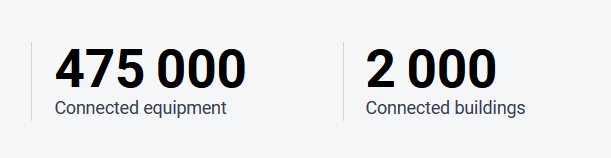

## Introduction

Kuzzle is a versatile backend platform providing essential building blocks for various applications. By offering standardized features ready for use, Kuzzle allows developers to focus on building high-value, specialized business functionalities, rather than re-creating standard features in every new application.

## Brief History

The following timeline highlights Kuzzle's development milestones:

- 2015: Kuzzle has been founded.
- 2016: Kuzzle launched as an open-source project.
- 2017 - 2018: Kuzzle expands its focus on real-time and IoT applications. Gaining traction within the industries requiring complex data management (Smart city infrastructure & Healthcare).
- 2019: The release of Kuzzle v2.
- 2020: Expansion of IoT and enterprise capabilities
- 2021: Update on SDK and client libraries for a smoother integration across multiple platforms.
- Security updates and the encouragement of community contributions.
- 2023 - Present: Expanded protocol support
- Enterprise offerings
- Ai and Machine Learning integrations.

## Main Features

Kuzzle is a powerful backend solution designed for building scalable and real-time applications. Its main features include:

- **Data storage and access:**
  Kuzzle provides real-time capabilities, allowing developers to push updates to clients instantly using WebSockets or HTTP.
  Kuzzle's Realtime Engine allows you to do Pub/Sub in dedicated communication channels called rooms.
  

- **Advanced Search:**
  It offers advanced search functionalities, including full-text search, geospatial queries, and filtering options.

- **Data Persistence:**
  Kuzzle supports data persistence, enabling applications to store and retrieve data efficiently using Elasticsearch as a NoSQL document storage.

- **User Management:**
  It includes built-in user authentication and management, supporting various authentication methods and role-based access control.

- **API Generation:**
  Kuzzle automatically generates RESTful and WebSocket APIs, simplifying the integration process for front-end applications.

- **Plugins and Extensibility:** The platform is highly extensible, allowing developers to create plugins to extend its functionality.

- **Cross-Platform:**
  Kuzzle supports various front-end frameworks, enhancing flexibility across mobile and web applications.

## Use cases

Kuzzle's diverse capabilities make it suitable for a wide range of applications, including

- **Real-Time Web and mobile applications**
   With WebSocket technology, Kuzzle enables real-time applications, such as chat apps, where messages and notifications appear instantly across devices.
- **E Commerce Platforms**:
  Kuzzle’s inventory and stock tracking capabilities make it ideal for e-commerce.
- **Geo tracking**
  Kuzzle’s real-time data capabilities are beneficial for tracking vehicles and assets.

- **All use cases**
  Kuzzle offers robust backend solutions well-suited for applications requiring real-time tracking, monitoring, and data synchronization. For a comprehensive list of use cases, visit Kuzzle use cases.[Kuzzle use cases](https://kuzzle.io/use-case/)

## High profile use cases

 **Kuzzle IoT was chosen as the data and IoT platform for the Finistère Smart Connect project to connect 270 municipalities and communities to be the first territory connected on a departmental scale.**

 Kuzzle IoT connects and supervises 270 smart territories in real time thanks to more than 475,000 sensors and equipment connected to a territorial hypervisor.

 
 
 For more information 

### References

https://blog.back4app.com/kuzzle-alternatives/
https://kuzzle.io
