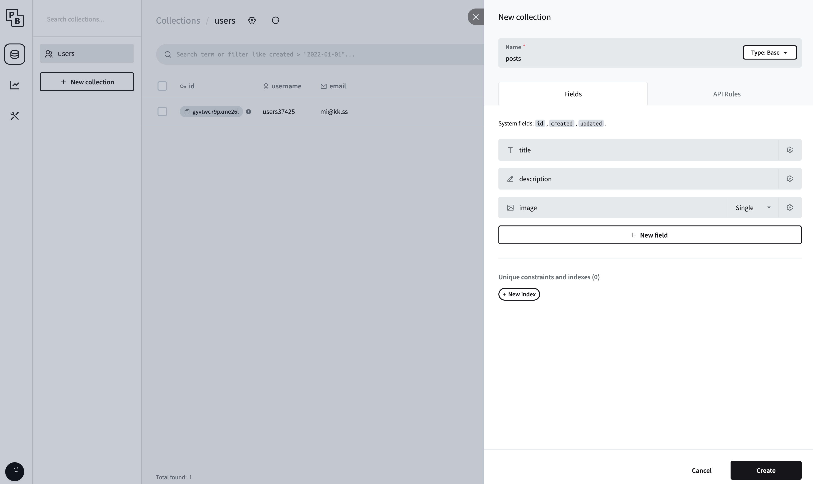
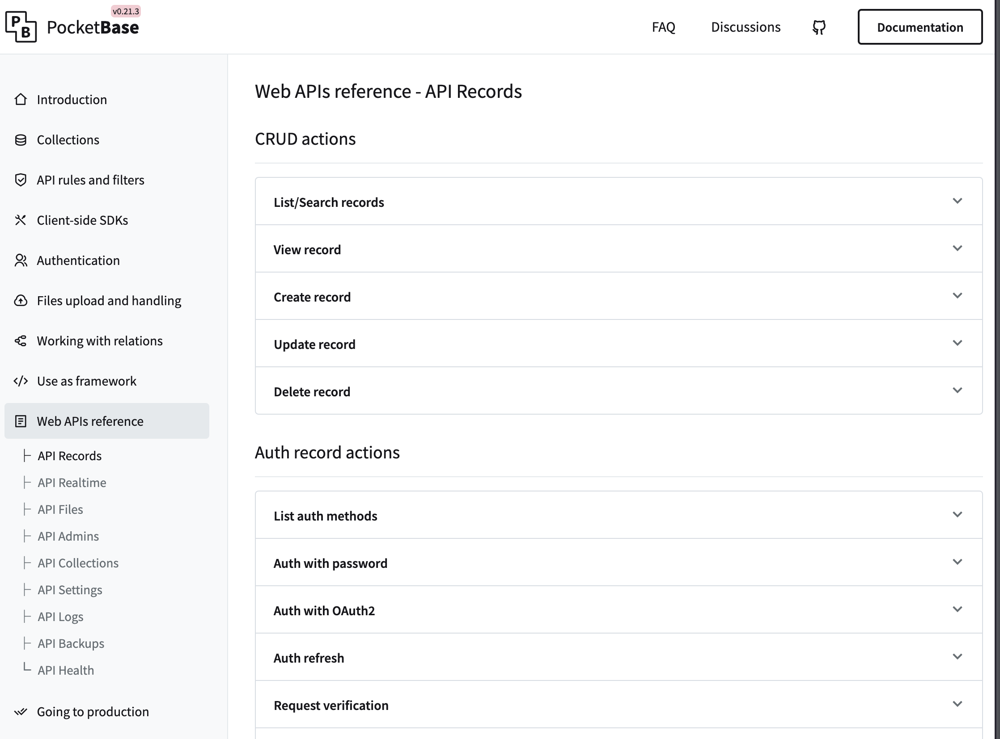

## Introduction

PocketBase is an open-source [BaaS](https://en.wikipedia.org/wiki/Backend_as_a_service) (Backend-as-a-Service) in one single file. This self-hosted platform comes with a real-time database, authentication, file storage, and a user-friendly admin dashboard. The platform is an ideal solution for startups and small to medium-sized projects due to its flexibility and ease of use.

## Brief History

Given that PocketBase is a relatively new platform, pinpointing a detailed timeline of its development can be challenging.

However, the first public release version 0.1.0, was announced on July 7, 2022. As of the latest data, there have been 122 version releases, with version 0.21.3 being released on February 11, 2024. PocketBase has reached 31.6K stars on its GitHub repository, indicating a growing interest in the platform.

## Main Features

PocketBase offers several key features as a free, open-source BaaS:

- **Single File Deployment:** It is distributed as a single executable file, simplifying both installation and deployment across different platforms. This also makes PocketBase very straightforward to integrate into a development workflow.

- **Real-time Relational Database:** The platform utilizes SQLite, supporting real-time data updates. The fact that SQLite runs in [WAL mode](https://www.sqlite.org/wal.html) (Write Ahead Logging), often allows it to outperform other relational databases in read-heavy applications.

- **Authentication:** PocketBase supports email/password authentication, along with OAuth2 integrations for major services such as Google, Facebook, GitHub, and many more. This allows developers to implement secure authentication without custom coding quickly.

- **File Storage:** Integrated file storage allows for local server storage or S3-compatible cloud storage, making it suitable for both small projects needing simple file management as well for applications requiring cloud storage.

- **Admin Dashboard:** A web-based, user-friendly admin dashboard built with [Svelte](https://svelte.dev) allows for easy backend administration.

- **Self-Hosted:** As a self-hosted solution, PocketBase allows for greater control over data privacy and security, alongside flexible hosting choices. It's possible to host on a local server or a chosen cloud provider.

- **Frontend Framework Integration:** PocketBase is a very versatile and adaptable platform. It integrates seamlessly with frontend frameworks such as React, Svelte, Vue.js, Angular, and Flutter.

## Strengths

- **Lightweight and Ease of Use:** PocketBase's lightweight nature, single-file design, simplicity and ease of use, may potentially reduce development time for smaller projects and teams without extensive prior backend experience.

- **All-in-One Package:** PocketBase provides an integrated solution, combining a database with real-time updates, authentication, and file storage. This makes it appealing for projects with straightforward backend needs.

- **Good Documentation:** Despite being relatively new on the market, PocketBase offers extensive documentation to help developers get started quickly.

- **Built with Go:** Being built with [Go](https://go.dev/) contributes to _high performance_ (beneficial for data-intensive operations), _low resource consumption_ (making PocketBase lightweight), _cross-platform support_ (Linux, macOS, Windows), and _simplicity_ (simple and maintainable code).

## Weaknesses

- **Limited Scalability:** The choice of SQLite which runs in _WAL mode_ and scales vertically may limit its suitability for larger projects that require extensive storage.

- **Community and Support:** Given that PocketBase is relatively new on the market, its community and the extent of third-party resources, tutorials, and support are likely more limited compared to more established platforms.

- **Still under Development:** PocketBase is still under active development, meaning there is no guarantee for full backward compatibility.

## Market Comparison

PocketBase is an open-source BaaS platform, such as [Appwrite](https://appwrite.io/) and [Supabase](https://supabase.com/). They are distinguished by unique core database technologies, scalability features and target audiences.

PocketBase is a lightweight solution focusing on simplicity and ease of use, making it ideal for small to medium-sized projects. In contrast, Appwrite emphasizes versatility and developer-friendliness, with extensive support for various programming languages and frameworks. Supabase targets developers in search of an open-source alternative to [Firebase](https://firebase.google.com/), providing a more advanced database and additional scalability options, making it suitable for more complex applications.

|                       |                PocketBase                |                         Appwrite                         |                         Supabase                         |
| --------------------- | :--------------------------------------: | :------------------------------------------------------: | :------------------------------------------------------: |
| **Database**          |                  SQLite                  |                       SQL / NoSQL                        |                        PostgreSQL                        |
| **Real-time updates** |         SSE (Server-Sent-Events)         |                        Websocket                         |                     Postgres Changes                     |
| **GraphQL**           |                    ❌                    |                            ✅                            |                            ✅                            |
| **Deployment**        | Easy to deploy, single binary executable |             Docker-based, more complex setup             |        Requires PostgreSQL setup, supports Docker        |
| **Pricing**           |      Open-source, self-hosted only       | Open-source, self-hosted option, cloud service available | Open-source, self-hosted option, cloud service available |
| **S3 compatible**     |                    ✅                    |                            ✅                            |                            ✅                            |
| **AdminUI**           |                    ✅                    |                            ✅                            |                            ✅                            |
| **Community**         |      Smaller and growing community       |          Larger and well-established community           |                Large and active community                |

## Getting Started with PocketBase

### Download and Install PocketBase

1. Visit the [PocketBase docs](https://pocketbase.io/docs) or the [GitHub repository](https://github.com/pocketbase/pocketbase/releases) and download the latest version for your operating system.
2. Extract the file into your desired folder.

### Run PocketBase

1. Open a CLI (Command Line Interface) and navigate to the directory where you extracted PocketBase.
2. Run the PocketBase executable:

```sh
./pocketbase serve
```

That's it! Now the PocketBase server will run with the following routes:

- URL (if pb_public directory exists, serves the static content from it html, css, images, etc.):

```sh
http://localhost:8090
```

- Admin dashboard UI:

```sh
http://localhost:8090/_/
```

- Rest API:

```sh
http://localhost:8090/api/
```

You could find all available commands and their options by running:

```sh
./pocketbase --help
```

### Create your first collection

1. Access the [Admin UI](http://127.0.0.1:8090/_/) (the first time you will be asked to create an admin account).

2. Navigate to _Collections_ and click on _New Collection_.

3. Add a name for your collection, for example, _posts_, and add the fields needed. If you are creating a collection for posts you might want to add for example _title_, _description_, _image_.
   

4. Click on _Create_.

Your collection is created, you can now _add_, _edit_ and _delete_ records within this collection.

### Integrate with your Application

1. PocketBase offers a REST API for interacting with your data. Read the [PocketBase docs](https://pocketbase.io/docs) to learn how to authenticate and perform CRUD operations from your application.

2. Use HTTP requests from your web, mobile, or desktop application to interact with the PocketBase backend. The documentation provides detailed examples and the [API Records](https://pocketbase.io/docs/api-records/).
   

## Conclusion

PocketBase, an open-source Backend-as-a-Service (BaaS) platform, is designed to cater to the needs of small to medium-sized projects, offering a fast and easy-to-set-up backend. Its use of a SQLite database, combined with self-hosting, gives an advantage for projects that do not require large-scale databases. The availability of both JavaScript and Dart SDKs makes it usable for web, mobile, and desktop applications. Additionally, PocketBase's support for both email/password authentication and OAuth2 authentication methods allows developers to quickly implement secure authentication methods.

## References

- [PocketBase - Official Site](https://pocketbase.io/)
- [PocketBase - Documentation](https://pocketbase.io/docs/)
- [PocketBase - API Records](https://pocketbase.io/docs/api-records/)
- [PocketBase - GitHub Repository](https://github.com/pocketbase/pocketbase)
- [Appwrite - Official Site](https://appwrite.io/)
- [Supabase - Official Site](https://supabase.com/)

## Additional Resources

- [What Is PocketBase and How Do You Use It?](https://www.makeuseof.com/pocketbase-what-and-how/)
- [PocketBase vs Supabase: Exploring the Ultimate Battle of Backend Solutions](https://fabled-web.ca/blog/pocketbase-vs-supabase)
- [Discover PocketBase: A Quick Introduction](https://www.toolify.ai/ai-news/discover-pocketbase-a-quick-introduction-187491)
- [PocketBase: Free Open Source Backend as a Service Platform](https://medium.com/elestio/pocketbase-free-open-source-backend-as-a-service-platform-1277b751c6b9)
- [Create a Fully Functional Backend in Seconds Using Pocketbase!](https://www.youtube.com/watch?v=Hw797S85yQE) _(video 5:21m)_
- [PocketBase... The Ultimate Side-Hustle Backend?](https://www.youtube.com/watch?v=Wqy3PBEglXQ) _(video 3:30m)_
- [PocketBase | what it is | how to run it | dashboard overview & mini project!](https://www.youtube.com/watch?v=NuLua3EXXVQ&list=PLHT1TNReACRcHR8rMnB8T0JSMIpz-Z7Mp&index=1) _(video 17:43m)_
- [Best Free Open Source Backend as a Service Solutions](https://www.youtube.com/watch?v=EgxG3XTZ5uM) _(video 8:29m)_
- [I Can't Believe This FAST Backend Is 100% FREE](https://www.youtube.com/watch?v=VJG1Sq-_a7Q) _(video 36:59m)_
