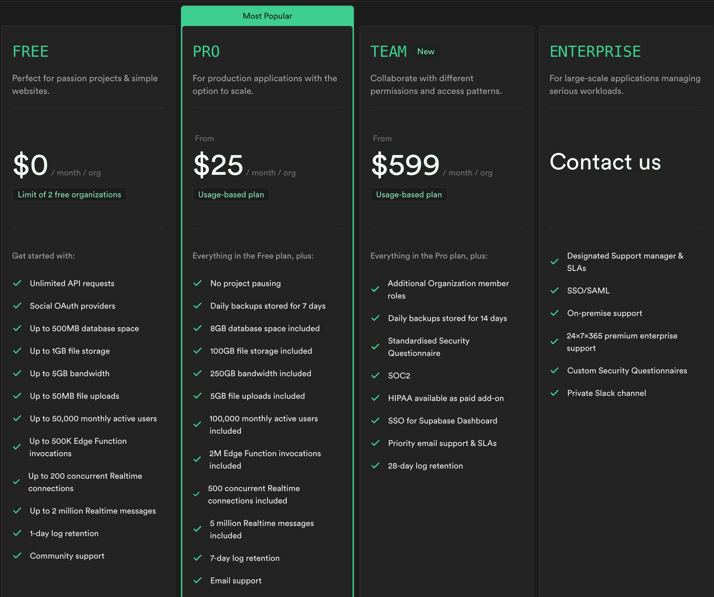

## Introduction

Supabase is an open-source BaaS (Backend as a Service) platform that was created in 2019 as an alternative to Firebase.
Supabase provides Postgres database, Authentication, instant APIs, Edge Functions, Realtime subscriptions, and Storage.

## Brief History

- 2020 January: Supabase is started by Paul Copplestone and Ant Wilson.
- 2020 April: First update incl Postgres spin up, auto-generated API, query databases from dashboard and analyze queries.
- 2020 May: New UI, auto-generated docs for APIs, table view for the database.
- 2020 June: Migration to AWS, relational database UX, JSON editor and viewer, database backups, early version of Auth.
- 2020 July: Auth, new Postgres extensions.
- 2020 August: Email templates, custom SMTP server for Auth, TypeScript support.
- 2020 December: Supabase Beta and receiving of $6M in funding.
- 2021 March: Pricing (was entirely free before), storage, CLI, UI, workflows.
- 2021 September: Supabase raised $30M Series A.
- 2022 May: Supabase raised $80M Series B.
- 2023 May: Supabase Vector and ChatGPT plugins that support Postgres and.

## Main Features

Supabase is a completely free and open-source. Supabase offers a range of features that enable developers to build modern applications efficiently. Here are some of the key features of Supabase:

| Feature                          | Description                                                                                                                                                                                                                                                                                                                                                             |
| -------------------------------- | ----------------------------------------------------------------------------------------------------------------------------------------------------------------------------------------------------------------------------------------------------------------------------------------------------------------------------------------------------------------------- |
| Hosted Postgres database         | Allows to store and manage application's data. Postgres is a powerful, reliable, and feature-rich relational database system with a proven track record in the industry. Working with the Postgres tables inside Supabase takes a minimal understanding of SQL.                                                                                                         |
| Authentication and Authorization | A robust authentication and authorization system that allows to secure the application and control user access. User registration, login and password recovery can be easily managed using Supabase's authentication APIs. Access control rules can be defined to restrict access to specific resources based on user roles and permissions                            |
| Auto-generated API's             | Supabase simplifies the process of building APIs for the application by automatically generating REST and GraphQL APIs based on the users database schema. It also enables seamless integration with front-end frameworks and libraries.                                                                                                                                |
| Realtime Subscriptions           | Supabase supports realtime subscriptions, allowing to receive instant updates whenever data in the database changes. Subscription can be done using websockets and gives opportunity to receive real-time notofications for inserts, updates, and deletes.                                                                                                              |
| Functions                        | Supabase provides support for serverless functions, allowing to write custom logic that runs on the server. This allows to create database functions that execute SQL queries or perform complex data operations. Additionally, Supabase offers edge functions, which allow to run serverless functions close to the users, reducing latency and improving performance. |
| Storage                          | Supabase includes file storage capabilities, allowing to upload, store, and manage files associated with the application. The file storage integrates with popular cloud storage providers like Amazon S3 and uses Postgres to manage permissions and access control                                                                                                    |
| AI & Vectors                     | Supabase offers an AI toolkit that allows to leverage machine learning models and embeddings in the application. Various AI-related tasks can be performed such as image recognition, natural language processing, and recommendation systems using the provided toolkit.                                                                                               |
| Dashboard                        | Supabase provides a comprehensive dashboard that gives a centralized view of the application's data, authentication settings, APIs, functions, file storage, and more. The dashboard provides a user-friendly interface for managing and monitoring the project.                                                                                                        |
| Example Feature                  | This feature does something for a specific reason.                                                                                                                                                                                                                                                                                                                      |

## Market Comparison

- Firebase and Supabase: Differ in several ways. Firebase is a NoSQL database, while Supabase is a relational database. The Firestone database, which lets to store "documents" is the core of Firebase. These are collections of key: value pairs where the value can be another sub-document. Supabase is open source. Firebase charges for reads, writes and deletes, Supabase charges based on the amount of data stored. Supabase outperforms Firebase by up to 4x on number of reads per second, and 3.1x on writes per second.
- Appwrite and Supabase: Appwrite has a focus on APIs and is well-suited for developers who want to build APIs or integrate their applications with other APIs. Supabase offers a range of APIs and integrations with other technologies, it may not have as many pre-built integrations.
- PocketBase and Supabase: Pocketbase is a single executable and can be self-hosted, very easy to set up. Since the PocketBase is self-hosted, there are no worries about vendor lock-in or issues when trying to migrate the data.

## Getting Started Supabase with React

Supabase can be integrated with popular front-end frameworks as React, Vue.js, and Angular.

1. Create a new project in the Supabase Dashboard. After your project is ready, create a table in your Supabase database using the SQL Editor or UI in the Dashboard.
2. Create a React app using a Vite template.

```bash
npm create vite@latest my-app -- --template react
```

3. Install the Supabase client library. Navitage to the React app and install **supabase-js**.

```bash
cd my-app && npm install @supabase/supabase-js
```

4. Query data from the app. In **App.jsx**, create a Supabase client using your Project URL and public API (anon) key.
5. Start the app, go to **http://localhost:5173** in a browser, and open the browser console and you should your app.

```bash
npm run dev
```

## Pricing

Supabase offers a free tier that allows developers to try out the platform and build small-scale applications at no cost. The free tier includes a generous usage limit for database storage, API requests, authentication, and file storage.
For large applications or higher usage requirements, Supabase offers paid plans with increased resource limits and additional features.



## Conclusion

Supabase is a powerful open source that offers a range of features for building modern full-stack applications. With its hosted Postgres database, authentication and authorization system, auto-generated APIs, realtime subscriptions, serverless functions, file storage, AI toolkit, and comprehensive dashboard. Supabase provides developers with a complete solution for building scalable and secure applications.

## Credits

Written by:

- Anastassia Sommer (anasommer)

## References

- [Supabase Docs](https://supabase.com/docs)
- [Introduction To Supabase](https://www.adservio.fr/post/introduction-to-supabase)
- [Learn Supabase - freecodecamp full tutorial for beginners](https://www.youtube.com/watch?v=dU7GwCOgvNY)
- [Firebase and Supabase: Key differences you need to know](https://www.red-gate.com/simple-talk/development/other-development/firebase-and-supabase-key-differences/#:~:text=Firebase%20is%20a%20NoSQL%20database,value%20documents%20may%20be%20present.)
- [Supabase vs Firebase](https://supabase.com/alternatives/supabase-vs-firebase)
- [Appwrite vs Supabase vs Firebase](https://medium.com/@tkarmakar27112000/appwrite-vs-supabase-vs-firebase-48d1dd79bdc2)
- [Why You Should Use PocketBase for Your Next Project](https://dev.to/kalashin1/why-you-should-use-pocketbase-for-your-next-project-4dda)
- [Use Supabase with React](https://supabase.com/docs/guides/getting-started/quickstarts/reactjs)
