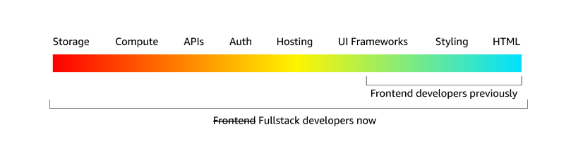
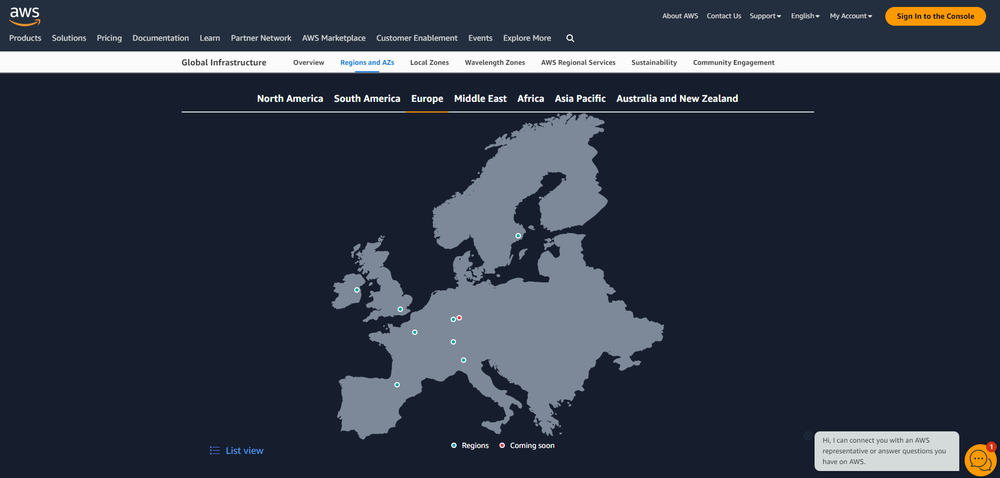

# Why did I choose to do a case study on AWS Amplify?
### Feel free to skip reading this part if only interested in the product specs

For learning purposes I wanted to take on a summer project in the summer of 2024.
Specifically by building an old school forum, because I have always loved them.
A simple, yet highly functional forum.
That potentially could be used in real life afterwards, also for business purposes.
As a newbie frontend developer without any prior backend experience, I needed to choose the right backend product to help me achieve those goals.

### And so the following concerns were considered in my pre case study research, to find a technology to further explore:

**1. Simplicity & ease of use**

Firebase seemed like the best choice in terms of simplicity and out of the box usefulness, without prior experience. AWS Amplify and Supabase also seemed user friendly based on simple configuration and use. Although Supabase uses a relational database, that would have a steeper learning curve than NoSQL-databases. And for AWS Amplify users report feature complexity and more time consuming infrastructure management over time.

**2. Feasibility**

All of the considered BaaS-es seemed to be feasible technologies for building a simple forum. The only question was my skill, learning curve, and time frame for actually using them. As well as which technology I actually wanted to invest my time in for the long term usefulness.

**3. GDPR compliance**

Firebase: A few Google searches clarified that the auth. solution of Firebase is not GDPR compliant, due to US servers for the authentication. And so that would create a lot of complexity for users based in Norway and Europe.
AppWrite: I also considered AppWrite because then I would set up my own server, located in Norway, but that would require quite a bit of manual work of learning Docker, setting up the server myself, etc. And having no prior experience with that, it seemed risky to get stuck in these backend requirements.
Supabase: GDPR compliance seemed unavailable due to being HQ-ed in Singapore.
AWS Amplify: Amplify seemed to be the best alternative here, since AWS has put in extensive work in making their solution GDPR compliant. And since AWS Amplify can be customized by using most of the AWS ecosystem, this seemed like the safest route in terms of GDPR compliance, although more complex generally.

**4. Pricing**

For pricing; AppWrite is the only free solution although I would have to pay for web hosting myself. All the other solutions have either a freemium solution, or pay as you go pricing plan. Since the prices didn't seem too overwhelming for any of the solutions from the getgo and for a relatively simple solution, I decided to pick the BaaS that seemed a better fit without weighting the pricing too much.

### Hypothesis for case study on AWS Amplify

Due to GDPR compliance and rich functionality for AWS Amplify, it seemed like the best option to use for the summer project since I'd rather invest my time and energy into something that  has long term potential.
However, feature complexity might kill my progress since I will also have a steep learning curve on the frontend for technologies like React, Vite, etc.
So I will use this case study to clarify whether my hypothesis is correct; is AWS Amplify really the best option for a newbie frontend developer, also wanting to build a viable long term solution?
Or will it put a full stop to my summer project plans if utilized, due to time constraints, steep learning curve, and potentially other challenges?

### For whom is this AWS Amplify case study intended?

This case study is intended for anyone considering whether to build their tech product with AWS Amplify.
And particularly for newbeginners in development, since this product case study was written from the perspective of someone having never used a BaaS, very limited frontend development experience, and no backend experience.
I want to emphazise that reading a case study from someone having very little prior knowledge about a product can also be an advantage, since advanced users of f.ex. BaaS solutions, will know every in and out of the products and technology in general, and so what they might take for granted and describe as simple, might actually be highly complex.
While a newbeginner will answer the so-called silly questions - that could be highly useful and valuable to someone new to the topic.

So for what it's worth; here's my case study on AWS Amplify.

# Introduction
*"We built Amplify to make it easy for frontend developers to build full-stack apps."*

[Source: Product Manager at AWS sharing purpose of Amplify](https://youtu.be/UfYWGYbmV3s?si=EFwshYVCHHFK12Uj&t=156)

AWS Amplify is a fully managed service built on top of AWS, Amazon Web Services, designed to abstract away the complexity of backend features and other AWS services with an additional layer. A user friendly interface to configure your backend and infrastructure services. So that you can focus on the frontend part of your work, while having AWS Amplify manage your backend processes etc.
It provides a wide range of services to build fullstack web and mobile apps, such as authenthication, storage, APIs, hosting, etc.
It is designed to increase speed and ease of prototyping and building for developers that want to spend less time with backend, infrastructure, configurations and various other not-directly-frontend-related necessities of a fullstack app.

# Brief history & background
AWS Amplify was launched on the 26th of November 2017 by AWS, Amazon, and has been experiencing continuous upgrades and enhancements since then.

Amazon were the pioners of the public cloud as we know it today. Based on their e-commerce business they innovated for the tech industry by creating these common hosted infrastructure services. Originally intended for internal use for Amazon, they quickly realized that this was a huge business opportunity, seeing that most other companies would benefit from the product as well.

### Milestones for Amplify's evolution
**5th of July 1994: Founding of Amazon by Jeff Bezos, the mother company behind AWS Amplify.**

Jeff Bezos wanted to take part in the internet revolution that unfolded upon the world in the 1990s, and he decided to focus on selling books online.
He chose to locate the company in the city of Seattle, in Washington, because it was located geographically close to a book distribution center, as well as in the same city as Microsoft's headquarter for great supply of technology engineering expertise.

**Year 2000: Merchant.com**

Amazon.com begins to work on merchant.com, an e-commerce platform intended for use by other large retailers. In the process, Amazon realize that they need to decouple their code better, with cleaner interfaces and access APIs. Around the same time, the company also realize the need to build infrastructure-as-a-service internally, to improve the speed of development and not have it bottlenecked by infrastructure availability. This paved the way for the eventual release of AWS.

**14th of March 2006: Launch of AWS**

Based on a culture of innovation, making bold bets, as well as a visionary founder, Amazon were able to launch AWS officially in March of 2006. This was made possible by their continued research and development of the AWS product in the early 2000s, as necessitated by their rapidly growing e-commerce business.

**March 2006 to November 2017: Evolution of AWS**

AWS was continually improved, upgraded and developed since its official release, with new services and product offerings added in the period between 2006 and 2017.

**26th of November 2017: Official release of AWS Amplify**

The continued development of AWS eventually culminating in the launch of AWS Amplify on the 26th of November 2017.

**2017-2024: Evolution of Amplify**

From November 2017 and until now AWS Amplify has been enhancing their product with continuous updates to add new and improve their existing functionality, adding functionality such as CLI, Hosting, Admin UI, etc.

**6th of May 2024: Broad launch of Amplify Gen 2**

On the 6th of May 2024, AWS officially launched "Amplify Gen 2", or "Generation 2" for broad public use. AWS has gathered feedback from their users over the years, and rethinked their end-to-end developer experience. 

# Gen 1 vs. Gen 2 Amplify
In Amplify Gen 1 you would setup your backend through the console. The main way Gen 2 distinguishes itself is by allowing developers to setup their backend and app requirements purely in Typescript, including data models, business logic, authorization rules, etc.

Effectively allowing frontend Typescript developers to become fullstack developers, covering everything from UI to databases, while using AWS Amplify, as illustrated here:

This will allow for a much more seamless developer experience, by being able to setup various functionality with just copy paste of a few lines of code or the click of a few buttons, such as:
- Setup and deploy standard React and Vite frontend project with just a few clicks
- Let AWS run your auth with less than 10 lines of code

To be honest, I wasn't aware that AWS had just launched their Gen 2 until the end of this case study, and how significant it will be, which is quite exciting, to be honest.
Going forward more and more code will be available for boilerplate configuration for Amplify, to avoid complex console operations that require a lot of trying and failing, reading documentation, etc. Instead probably a lot of copy paste recipes will be created and shared for configurating custom Amplify projects in 1-2-3.
Great!

[Release of Gen 2](https://aws.amazon.com/blogs/mobile/amplify-gen2-ga/)

# Strengths
**1. Access to most of AWS's vast ecosystem of services, while being shielded from its complexity.**

AWS can be intimidating due to the hundreds of services that are acessible through the platform, and can prevent new developers from daring to even start using AWS.
However, Amplify flips that issue on its head. Instead of starting with a problem that you want to solve, and having to figure out which AWS services to use, Amplify allows you to focus on the solution and frontend aspects of the problem. By letting Amplify activate the necessary AWS services on the backend without you having to understand exactly what's going on behind the scenes.

**2. Secure and effective infrastructure provisioning**

AWS allows for a hosted platform without having to deal with local infrastructure hosting etc. And since AWS is the most advanced cloud platform, you can do almost anything on the platform. With Amplify you can draw upon these vast resources, giving your app almost unlimited possibilities in terms of functionality, scalability, security, etc. In short; by starting out on Amplify, and your product becomes a success, you will not be hindered by infrastructure bottlenecks.

**3. Easy to get started.**

Amplify is constructed to be able to begin quickly and without advanced configuration knowledge. Without prior knowledge, you can get started in an hour by following a Youtube tutorial.

**4. Rapid prototyping, deployments, and development cycles.**

By being able to release directly to the cloud you can release your code to production in seconds, instead of days, weeks, or even months.
This allows for frontend developers to rapidly iterate on their prototype, product, concept, to test out functionality etc., as well as iterating on their final product.
This is crucial when working with end users to gather feedback and improving their user experience.

**5. GDPR compliance**

Developers building solutions for users located in the EU region - subject to the GDPR regulations - will experience challenges to remain GDPR compliant if the services they utilize are hosted outside of the EU region. This is because the GDPR regulations dictate that storage of personal data outside of the EU region is illegal for users located within the EU region.
This in turn can lead to punitive fees of up to 2-4% of the annual revenue of whichever company to break these GDPR regulations.

It is for the same reason that Firebase is not GDPR compliant, since its auth services are hosted on US servers.

Amplify however, running on AWS's vast data centre resources across the world, has servers scattered around Europe as well, allowing for GDPR compliance.

**6. Strong community support & documentation**

AWS has been around for a long time and Amazon is the largest cloud vendor, and has strong community support amongst developers over the world.

[Official GitHub repo for Amplify documentation](https://github.com/aws-amplify/docs)

# Weaknesses
**1. Potential for pricing surprizes**

Although Amplify has a reasonable pricing for simple apps and products with limited users and resource usage, you might experience surprizes in the pricing model.
The reason for this is that Amplify abstracts away the complexity of the AWS ecosystem, by drawing upon various AWS services as necessary to solve your unique problem.
In that process, you might "accidentally" end up engaging some more resource demanding service, that might give you a higher-than-expected bill.
For the same reason you might want to setup some kind of bill notification, should it exceed a certain amount, etc.

**2. Feature complexity & steep learning curve**

Together with AWS's vast platform of services naturally comes feature complexity, particularly for new developers. You might end up troubleshooting some kind of backend API or service, wondering how that particular feature works in your app, having to dive through page up and page down of documentation, trying to figure out where and what the problem is.
It is for the same reason that Firebase, being a more fully integrated all-in-one Backend-as-a-Service, often is experienced as simpler and easier to learn.
However, since Amplify is maintained by the largest cloud vendor in the world, has been around for 6+ years, and there are over 10 000 commits on the official AWS Amplify documentation GitHub repo as per the 12th of May 2024, there will most likely be plenty of people having gone through similar problems as yourself.
It should still be noted that Amplify is widely regarded to have a steeper learning curve, particularly for newbeginners, due to its feature complexity and wider range of services.

[Source](https://aaron-russell.co.uk/blog/firebase-vs-supabase-vs-aws-amplify-vs-appwrite/)

**3. Not really learning AWS**

Due to working with the AWS services through an API, CLI and user interface, developers using Amplify will not learn the full extent of how to use the AWS services on a deeper level. This is for the same reason that devs are using Amplify, to focus on the product development instead of DevOps, security, infrastructure, scalability, backend, storage, authentication, etc.
But at the same time - that's why you started using Amplify in the first place, right?

**4. Vendor lock-in and hard to go outside the box**

From other reviews I can see developers reporting that you might find some services unavailable through Amplify, and that trying to customize your app by using services outside of the Amplify service, is complicated for unexperienced developers. You'll need to learn some other technology with its own learning curve.
Using Amplify also leads to vendor lock-in since you are building on a solution that is proprietary for AWS and Amplify. That means should you encounter some road block at some point in the future that you are not comfortable solving with the AWS ecosystem, you'll likely have to rewrite a large portion of your app.

[Source](https://inhire.io/blog/aws-amplify-is-it-really-worth-using-it-as-a-production-solution/)

**5. Hard to maintain due to consistent change**

From the same source as above, it is being reported that Amplify often changes and updates. From past experience I can confirm that this is a pain while using a system.
Often it is adapting to the continuous changes of a system that require the greatest mental energy expenditure - and not learning or building the system itself.
Speaking particularly from gaming experience. Playing a game that was updated every week with hundreds of moving parts was almost impossible to learn unless you actively studied the game for several hours weekly - and not just playing it. Depending on the severity and how deep the changes are - the worst case scenario of a system update to Amplify breaking your whole app is quite intimidating, since it means you'll never be able to leave your app and do something else, but always have to maintain it or pay someone to do it.

# Market comparisons
I found a great summary of AWS Amplify as compared with Supabase, AppWrite, and Firebase. Instead of reinventing the wheel, I'll just link to it here:

[AWS Amplify vs. Firebase vs. Supabase vs. AppWrite](https://aaron-russell.co.uk/blog/firebase-vs-supabase-vs-aws-amplify-vs-appwrite/)

# Developer experience for newbies
Instead of writing a lot about this before I've actually tried to work on Amplify, I'll leave this section open until after I've tried it.

The assumption is that it will work very well for a relatively simple forum app, where the main app requirements are authentication, storage, posting, commenting, and various other forum functionality.

Although I do expect some complexity and having to wrestle with some documentation and console setup in the beginning.

# Conclusion
AWS Amplify seems like a complete product that will cater well to your needs as a BaaS, while also providing a high level of security, scalability, and various other necessary backend and infrastructure services to run a professional app these days. Some of the main strengths are rapid development and prototyping, simple setup, and GDPR compliance; while some of the weaknesses are its complexity due to rich feature functionality, steep learning curve, consistent changes, and sometimes unpredictable pricing. If you have a lot of app requirements, you might also find yourself having to build some functionality in Amplify, and some on AWS directly, that might require extra work and configuration, which could be worth looking into before you begin your project.

Also, it should not be underestimated the value of Gen 2 Amplify, being able to copy paste Typescript code to setup your entire infrastructure in AWS, instead of fumbling around with complex setups in the console. As this Gen 2 is allowed to be developed further, we might see a new surge of Amplify being adopted across the industry due to being able to control complex backend and cloud services with pure code.

As far as this case study is concerned it appears as the right path forward to use Amplify to build my web app, because I would rather accept a bit more complexity and feature functionality, while working on a platform that has long term potential, instead of starting in a dead end on a platform that is not GDPR compliant from the getgo, or an open source technology where I would have to learn relational databases etc. from scratch. I believe Amplify can provide about 99% of what a regular app would need, and it would be unrealistic to expect anything to work a 100% without any individual effort to be needed, anyway.

# References
- [AWS re:Invent 2023 - The next-generation application-building experience from AWS Amplify, presented by two of AWS' Product Managers](https://youtu.be/UfYWGYbmV3s?si=DU7mBzUvgAIG0wJ2)
- [What is AWS Amplify? Pros and cons?](https://beabetterdev.com/2021/09/22/what-is-aws-amplify/)
- [AWS on Wikipedia](https://en.wikipedia.org/wiki/Amazon_Web_Services)
- [AWS review](https://inhire.io/blog/aws-amplify-is-it-really-worth-using-it-as-a-production-solution/)
- [Launch of Gen 2 Amplify by AWS](https://aws.amazon.com/blogs/mobile/amplify-gen2-ga/)
- [AWS Amplify vs Firebase vs Supabase vs AppWrite](https://aaron-russell.co.uk/blog/firebase-vs-supabase-vs-aws-amplify-vs-appwrite/)
- [Server localizations source AWS](https://aws.amazon.com/about-aws/global-infrastructure/regions_az/)
