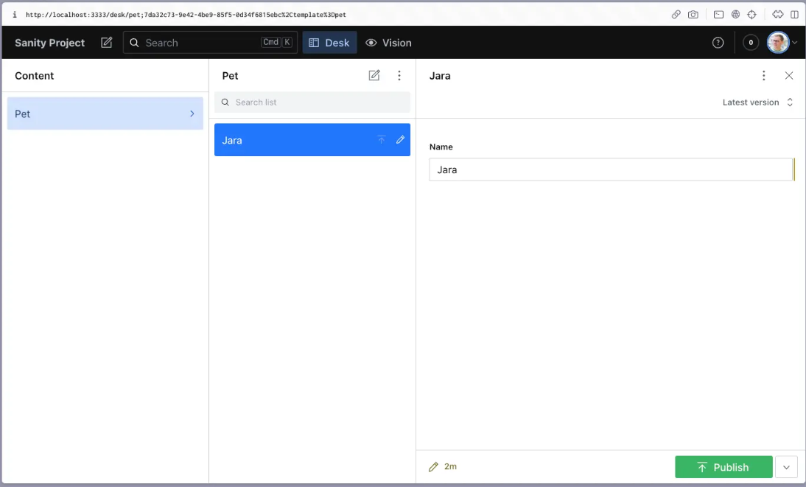

// REVIEW BRANCH FOR SANITY CMS CASE STUDY

---

Title: Sanity CMS Case Study.
Keywords: sanity, headless CMS, content management system
Tags: Sanity, development platforms, headless CMS, content management

---

## Authors

- Ana Cascante: [AnaCascante](https://github.com/AnaCascante)
- Eirik Kirkeli: [Knirkeli](https://github.com/Knirkeli)
- Pablo Garza: [Pgarza-dev](https://github.com/Pgarza-dev)

## Introduction

Sanity CMS, developed by the Norwegian company Sanity.io, is a headless, fully customizable content management system designed to provide flexibility and control over content management. The development of Sanity CMS began in 2015 by co-founders Even Westvang, Simen Svale Skogsrud, and Magnus Holm. The team developed a website for renown Architect Rem Koolhaas. The site was an algorithmic website that would link to his Instagram account giving Rem live updates on how people were using his buildings. The team aimed to build a flexible, developer-friendly content management system that could serve a wide range of content-driven projects.

Sanity.io officially launched the Sanity CMS platform in 2017, introducing it as a headless CMS solution. Since then, Sanity has gained popularity among developers and content creators for its ease of use, flexibility, and powerful features.

Over the years, the Sanity team has continued to improve and expand the platform, adding new features, integrations, and capabilities to meet the evolving needs of its users. Sanity remains a prominent player in the headless CMS market, known for its developer-friendly approach and customizable nature.

## History

- **2015**: Development of Sanity CMS begins by co-founders Even Westvang, Simen Svale Skogsrud, and Magnus Holm.
- **2017**: Official launch of Sanity CMS platform as a headless CMS solution by Sanity.io.
- **2018**: Continued refinement and expansion of Sanity CMS features to meet evolving user needs.
- **2019**: Further enhancements and improvements to Sanity CMS platform, focusing on developer-friendliness and customization.

## Sanity.io Case Study

This Case Study introduces Sanity.io as a platform that enables companies of all sizes to create remarkable digital experiences. It provides a single source of truth for content, aiding in the development of innovative digital campaigns. Sanity.io’s strengths lie in its excellent integration with popular programming languages and frameworks, providing a seamless experience for developers. Its powerful image pipeline and support for GraphQL make it a versatile tool for content management. Additionally, it boasts a large library of official and custom plugins, further enhancing its capabilities.

One of the main weaknesses is the lack of multi-language support, which is only available through plugins. This could potentially limit its usability for global teams. Additionally, with a high number of requests and responses, a paid tariff becomes necessary, which could be a barrier for smaller organizations. The time to set up a project can be slower than some of the competitors. Lastly, there’s a dependency on Sanity.io when developing data for a website, which could limit flexibility.

## Sanity API

**Sanity provides two APIs**

When accessing the Sanity CMS API, you have two options to choose from based on your specific needs.

The first option is the live, uncached API, `api.sanity.io`. This API provides the freshest data but may result in slower requests as each request needs to reach the backend. Additionally, requests made to this API are more computationally expensive on our servers.

The second option is `apicdn.sanity.io`, which is the CDN-distributed, cached API. This optional feature provides fast responses to cached requests. We recommend using this API for front-end applications that expose the API to end users. However, for static builds, it is recommended to use the live uncached API to ensure the latest version of the data.

To use the API CDN, simply replace `api.sanity.io` with `apicdn.sanity.io`. Most clients offer a seamless option to switch to the CDN.

## Increasing Free Resources in Sanity

Sanity CMS offers a growing number of resources to enhance your development experience. Currently, there are 20 frameworks supported, with React and Next.js being the most popular choices. Unlike traditional CMS platforms, Sanity does not require the use of PHP. Instead, it utilizes Groq, an open-source query language developed by Sanity. However, if you prefer GraphQL, it is also possible to integrate it with Sanity.

When it comes to managing images in your projects, Sanity provides the image-url plugin. This powerful pipeline takes care of resizing, storage, and deletion, making it easier to handle images efficiently.

Furthermore, the number of plugins and tools available in Sanity continues to grow, with 210 options currently available. Some notable "must-have" plugins recommended by Sanity include:

- Scheduled publishing: Organize and plan upcoming releases effectively.
- Media browser: Manage and organize your assets seamlessly.
- Vision (GROQ playground): Test and experiment with GROQ queries.
- Image URL: Customize and optimize images according to your needs.
- Official Sanity toolkit for Next.js: Integrate content from Sanity into your Next.js projects effortlessly.
- Content Graph View: Visualize real-time changes in your content graph.

## Key Features of Sanity CMS

The following key features of Sanity CMS contribute to its flexibility, efficiency, and developer-friendly nature, making it a powerful choice for content management and digital experiences.

### Structured Content 101

Sanity CMS allows you to break down content into small, structured pieces, making it easier for machines to understand and utilize the information in various ways.

### Real-time Updates

Collaborators can make changes to content, and these changes are instantly updated in real-time, ensuring seamless collaboration and efficient workflow.

### Presenting and Previewing Content

Sanity CMS provides the ability to preview content changes before publishing, allowing for feedback, approval, and error minimization. This feature is particularly useful in ensuring content accuracy and quality.

### Composable Content

With Sanity CMS, you can shape data from independent but interconnected documents. Draft documents can coexist with published versions, providing flexibility and control over content creation and management.

### Perspectives

Sanity CMS allows you to run queries in a "draft" mode and preview the changes before publishing. This helps to avoid conflicts and accidental publications, ensuring a smooth and error-free content publishing process.

### Drafts and Strong References

When creating or editing documents, Sanity CMS keeps changes separated from published documents until they are ready to be published. This ensures that drafts are not accidentally published and provides clarity and organization in the content management process.

### Live Editing

In certain cases where immediate publishing is desired, Sanity CMS allows for live editing by including the `liveEdit: true` option in the schema definition. This enables real-time updates to be directly reflected in the public APIs.

Example ⬇️:

```javascript
export default {
  name: "author",
  title: "Author",
  type: "document",
  liveEdit: true, // This enables live editing
};
```

## Comparison with Competitors

Sanity.io is one of a large library of CMS providers. In this case study we have chosen to look a bit closer and compare sanity with two of their more popular competitors, Strapi and Contentful.
All three platforms share a content-first approach, providing flexibility to developers by allowing them to use their preferred programming languages and frameworks. They all focus on delivering content across multiple channels.

### Differences.

Strapi: Strapi sets itself apart as an open-source platform, giving developers more control over the backend storage and admin interface. It allows for the creation of custom APIs quickly and easily, with the ability to define the structure of the data according to project requirements. Strapi also features a secure and intuitive admin panel that enables non-technical users to manage content without needing to interact with the codebase.

Sanity.io: Sanity.io differentiates itself with real-time collaboration features and a customizable editing environment. It has a powerful image pipeline that handles image metadata extraction on upload and transformations in front-end usage. Additionally, Sanity.io provides a globally distributed CDN, ensuring fast and efficient delivery of content.

Contentful: Contentful is known for its robust set of tools for enterprise-scale projects. It provides a user-friendly interface for content creators to manage content without needing technical skills. Moreover, Contentful supports multi-language content for international audiences.

In the world of CMS there is a vast amount of options. Each with unique features that set them apart. The choice between these platforms depends on the specific needs and circumstances of the project. Each platform has its own strengths and weaknesses, and potential users should consider these factors when deciding which CMS is the right fit for their needs.

## Getting Started with Sanity

[IMPORTANT: Make sure you have Node.js and npm installed on your machine.](https://nodejs.org/en/download/)

### SANITY SETUP WITH HTML & JAVASCRIPT

1. **Run in your command line**

   ```
   npm create sanity@latest -- --template clean --create-project "Sanity Project" --dataset production
   ```

   ✓ This command will create a new project with the name "Sanity Project" and a dataset called "production".

   ✓ Create an account.

   ✓ Choose the output path.

2. **Run Sanity Studio locally**

   ```bash
   cd sanity-project
   ```

   ```bash
   npm run dev
   ```

   ```
   Open locally in [http://localhost:3333](http://localhost:3333)
   ```

3. **Create Schema**

   The schemas folder is where you add your document types and define their fields.

   ```
   // Example of File layout
   ├── README.md
   ├── node_modules
   ├── package-lock.json
   ├── package.json
   ├── sanity.cli.js
   ├── sanity.config.js
   ├── schemas
   │   └── index.js
   └── static
   ```

   - Open the schema folder and create a new file `example.js`.
   - This is an example of a pet schema that you can use to create a pet document type. Add the following code to `example.js`

     ```javascript
     // example.js
     export default {
       name: "pet",
       title: "Pet",
       type: "document",
       fields: [
         {
           name: "name",
           title: "Name",
           type: "string",
         },
         {
           name: "species",
           title: "Species",
           type: "string",
         },
         {
           name: "breed",
           title: "Breed",
           type: "string",
         },
         {
           name: "age",
           title: "Age",
           type: "number",
         },
         {
           name: "owner",
           title: "Owner",
           type: "reference",
           to: [{ type: "person" }],
         },
       ],
     };
     ```

   - Import your schema in `schemas/index.js`.
   - Save and run command `npm run dev` and open in [http://localhost:3333](http://localhost:3333).

**EXAMPLE OF YOUR SANITY STUDIO LAYOUT ⬇️**



4. **View Your Content**

   - View your content by clicking on the three-dotted menu in the upper right corner of the documentation form.
   - Select inspect to open JSON inspector to view what the document data looks like.

5. **Connecting Your Content**
   - You can use HTML and JavaScript to query your Sanity project’s API and retrieve your document from the production dataset that it lives in.
   - Refer to steps in _HTML/JavaScript setup_.
   - Frameworks like Next.js, Nuxt.js, and SvelteKit can also be used.
   - Next.js setup: refer to _SANITY EXAMPLE SET UP WITH NEXT JS 14_.

## HTML & JavaScript SETUP

1. **Finding Your Project ID and Dataset Name**


- To fetch your data you will need your PROJECT ID and DATASET NAME. You can find these via [sanity.io/manage](sanity.io/manage).

2. **Connecting with HTML & JavaScript**

   - Sanity provides its own Codesandbox that will give you a boilerplate code that you can use to fetch your data using a few lines of JavaScript inside the `<script>` element.

3. **Adding your URL to the Cross-Origins Resource Sharing (CORS) Settings**


- Add the URL from Codesandbox in the preview pane i.e., `https://[RANDOMLY_GENERATED_LETTERS].csb.app/`.
- In [sanity.io/manage](https://www.sanity.io/manage) go to the API tab in project settings and then to _CORS Origins_ paste the URL from Codesandbox into the URL field, and hit save (you don’t need to “Allow credentials”).

4. **Prepare Your Query and API URL**

   - Through [sanity.io/docs](https://www.sanity.io/docs) documentation you can use a minimalist example, you’ll construct this URL using the project ID, the dataset name, a query, and Sanity’s URL endpoint for content queries.

     ```html
     // Example of HTML snippet
     <script>
       let PROJECT_ID = "YOUR_PROJECT_ID";
       let DATASET = "production";
       let QUERY = encodeURIComponent('*[_type == "pet"]');

       // Compose the URL for your project's endpoint and add the query
       let URL = `https://${PROJECT_ID}.api.sanity.io/v2021-10-21/data/query/${DATASET}?query=${QUERY}`;
     </script>
     ```

5. **Fetching Your Content**

   - Add a fetch function that takes the URL and then extracts the returned JSON out of the response and then passes it to a callback function where you can output the data to the DOM, that is, your pre tag. If something wrong happens, you’ll catch that and console.log the error.
   - Code snippet:

     ```javascript
     // fetch the content
     fetch(URL)
       .then((res) => res.json())
       .then(({ result }) => {
         // get the list element, and the first item
         let list = document.querySelector("ul");
         let firstListItem = document.querySelector("ul li");

         if (result.length > 0) {
           // remove the placeholder content
           list.removeChild(firstListItem);

           result.forEach((pet) => {
             // create a list element for each pet
             let listItem = document.createElement("li");

             // add the pet name as the text content
             listItem.textContent = pet?.name;

             // add the item to the list
             list.appendChild(listItem);
           });
           let pre = document.querySelector("pre");
           // add the raw data to the preformatted element
           pre.textContent = JSON.stringify(result, null, 2);
         }
       })
       .catch((err) => console.error(err));
     ```

### HTML & JAVASCRIPT SETUP RECAP

✓ Created a project.

✓ Set up Sanity Studio using our CLI.

✓ Created a schema using a code editor.

✓ Added some content via the Studio, that now lives in the Content Lake.

✓ Connected a front-end that fetches and displays this content.

## SANITY EXAMPLE SET UP WITH NEXT JS 14 | TYPESCRIPT | REACT | TAILWIND CSS

### IN THE TERMINAL

- `npx create-next-app@latest`
- What is your project name? _example-name_
- Would you like to use TypeScript? [Y]
- Would you like to use Eslint? [Y]
- Would you like to use Tailwind CSS? [Y]
- Would you like to use "src/" directory? [N]
- Would you like to use App Router?(recommended) [Y]

### OPEN VSCODE

- to open locally run command `npm run dev`

### SANITY SETUP

**Run in your command line**

- `npm create sanity@latest -- --template clean --create-project "Sanity Project" --dataset production`
- This command will create a new project with the name "Sanity Project" and a dataset called "production". The name of the project can be anything you want.
- Next create an account if you do not already have one.

### IN THE TERMINAL

- Would you like to add configuration files for a Sanity project in this Next.js folder? [N]
- Project output path: _path to your Next.js project_
- Would you like to use TypeScript? [Y]
- Package manager to use for installing dependencies: [NPM]

### CREATE SCHEMA

- This is an example of a pet schema that you can use to create a pet document type. Add the following code to your`example.js`:

  ```javascript
  // example.js
  export default {
    name: "pet",
    title: "Pet",
    type: "document",
    fields: [
      {
        name: "name",
        title: "Name",
        type: "string",
      },
      {
        name: "slug",
        type: "slug",
        title: "Slug",
        options: {
          // Options for adding option to generating slug from title
          source: "title",
          maxLength: 96,
        },
      },
      {
        name: "species",
        title: "Species",
        type: "string",
      },
      {
        name: "breed",
        title: "Breed",
        type: "string",
      },
      {
        name: "age",
        title: "Age",
        type: "number",
      },
      {
        name: "owner",
        title: "Owner",
        type: "reference",
        to: [{ type: "person" }],
      },
    ],
  };
  ```

### START SANITY DEV SERVER / SANITY STUDIO

In the terminal run:

- `cd sanity-project`
- `npm run dev`
- Open locally in [http://localhost:3333](http://localhost:3333)
- If not logged into sanity.io, you will be prompted to log in using the same credentials you used to create your sanity profile.

### CREATE A NEW DOCUMENT TYPE

In your Studio click on the “+” button in the left-hand sidebar to create a new document type.


Name the document type “Pet”.

- In your code editor you must import your schema in `schemas/index.js`.

```javascript
// schemas/index.js
import pet from "./pet";

export const schemaTypes = [pet];
```

## SANITY SCHEMA TEMPLATES

- Sanity offers a wide range of templates that can offer a pre-made setup for projects. For a full overview refer to [Sanity Templates](https://www.sanity.io/templates).

#### _#References:_

- _ref: 1_ [https://www.sanity.io/docs/api-cdn](https://www.sanity.io/docs/api-cdn)

- _ref: 2_ [https://www.sanity.io/exchange/frameworks](https://www.sanity.io/exchange/frameworks)

- _ref: 3_ [https://www.sanity.io/docs/groq](https://www.sanity.io/docs/groq)

- _ref: 4_ [https://www.sanity.io/docs/image-type](https://www.sanity.io/docs/image-type)

- _ref: 5_ [https://www.sanity.io/plugins](https://www.sanity.io/plugins)

- _ref: 6_ [https://www.sanity.io/docs/realtime-updates](https://www.sanity.io/docs/realtime-updates)

- _ref: 7_ [https://www.sanity.io/docs/presenting-and-previewing-content](https://www.sanity.io/docs/presenting-and-previewing-content)

- _ref: 8_ [Sanity.io](https://www.sanity.io/)

- _ref: 9_ [YouTube](https://www.youtube.com/watch?v=TRCnAcdxP0M&list=PLRzQpWc3zNPkrIwaz1qfTMx0IGSfCFPKX)

- _ref: 10_ [Strapi vs Contentful vs Sanity Comparison — Restack](https://www.restack.io/docs/strapi-knowledge-strapi-vs-contentful-vs-sanity)

- _ref: 11_ [Exploring Headless CMS: Sanity Vs Contentful Vs Strapi | Tarka Labs Blog](https://blog.tarkalabs.com/exploring-headless-cms-f94466b765a2)

- _ref: 12_ [Top 20 Questions about Sanity CMS — Represent Web Agency](https://www.represent.no/articles/frequently-asked-questions-about-sanity-cms)
