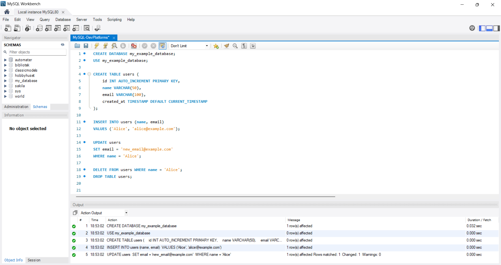

# MySQL

## Introduction

MySQL is a widely used open-source relational database management system (RDBMS) that allows users to store, manage, and retrieve data efficiently. It is based on the Structured Query Language (SQL), a standard language for interacting with databases. MySQL is known for its speed, reliability, and ease of use, making it a popular choice for web applications, data analytics, and enterprise solutions.
Initially developed by MySQL AB, it is now owned and maintained by Oracle Corporation. MySQL supports various platforms, including Windows, macOS, and Linux, and integrates seamlessly with many programming languages like PHP, Python, and Java. It powers numerous high-traffic websites and applications, such as Facebook, Twitter, and YouTube.
MySQL is available in several editions, including the community version (free and open-source) and enterprise versions with advanced features and support.

## Using MySQL

A simplified way to explain the usage of MySQL:

- Imagine you’re creating a website for a library where people can browse and borrow books. A MySQL database could store information about the  
  books and the users who borrow them. This would be useful for keeping all the data organized in one place, to quickly search for books that are available, and find out which user has borrowed a specific book.

Using MySQL involves creating and managing databases to store and retrieve structured data. You can interact with MySQL through SQL commands to perform operations like creating tables, inserting data, updating records, and running queries to extract meaningful insights. MySQL supports advanced operations like joining tables, indexing for performance, and managing relationships between data.

To use MySQL, you need a client or interface to connect to the MySQL server. Popular tools for this include MySQL Workbench, a graphical application that simplifies database design, query execution, and server management. Alternatively, you can use the MySQL command-line interface (CLI) or integrate MySQL into your applications using programming languages like PHP, Python, or Java.

MySQL Workbench is ideal for designing schemas and tables, testing SQL queries, and managing connections to the MySQL database.
Here is an example of how to use MySQL Workbench to perform some commonly used commands:

## Brief History

MySQL was created in 1995 by Michael Widenius, David Axmark, and Allan Larsson while working at MySQL AB, a Swedish company they founded. It was developed as a fast, flexible, and reliable relational database management system, using SQL as its query language. The name "MySQL" combines "SQL" with "My," the name of Widenius's daughter.

In 2008, Sun Microsystems acquired MySQL AB, further enhancing its development and global reach. A couple of years later, in 2010, Oracle Corporation acquired Sun Microsystems, and with it, MySQL. Despite concerns about its future under Oracle, MySQL has continued to grow and remains one of the most popular open-source database systems today.

Its active community and continuous development have made it a foundation for countless web applications, startups, and large-scale enterprises

## Strengths and weaknesses of MySQL

| Strengths                                 | Weaknesses                                |
| ----------------------------------------- | ----------------------------------------- |
| Fast for read-heavy operations            | Limited support for advanced SQL features |
| Easy to set up and use                    | Less flexible than PostgreSQL             |
| Large community and resources             | Not as fully ACID-compliant as PostgreSQL |
| Good support for large-scale applications | Limited support for complex data types    |

## Comparison to other products

PostgreSQL and SQLite are also relational database management systems, similar to MySQL, they serve different use cases and priorities. Like MySQL, they use the Structured Query Language (SQL) for managing and querying data, but each has its own strengths and design philosophy.
PostgreSQL is known for its advanced features, and strict adherence to standards, making it ideal for complex and high-performance applications. And SQLite is a lightweight, file-based database that is serverless and self-contained, often used in embedded systems, mobile apps, and small-scale projects.

#### MySQL VS PostgreSQL

| Category          | MySQL                                                  | PostgreSQL                                                             |
| ----------------- | ------------------------------------------------------ | ---------------------------------------------------------------------- |
| **Performance**   | Faster for simple queries and read-heavy workloads     | Better for complex queries, large datasets, and write-heavy operations |
| **Features**      | Focuses on simplicity and speed, good for web apps     | Rich feature set, including full ACID compliance and advanced indexing |
| **Extensibility** | Less extensible                                        | More extensible, allows custom functions and data types                |
| **Community**     | Strong community                                       | Known for open governance and transparency                             |
| **Use Cases**     | Ideal for content management systems (e.g., WordPress) | Better for analytics, data warehousing, and advanced data modeling     |

#### MySQL VS SQLite

| Category        | MySQL                                                                     | SQLite                                                                               |
| --------------- | ------------------------------------------------------------------------- | ------------------------------------------------------------------------------------ |
| **Performance** | Designed for multi-user environments, handles larger datasets efficiently | Lightweight, faster for small-scale, single-user applications                        |
| **Storage**     | Client-server model with persistent storage on disk                       | Serverless, file-based architecture, ideal for embedding in apps                     |
| **Concurrency** | Handles multiple connections and concurrent users well                    | Limited concurrency, writes are serialized, unsuitable for high-traffic applications |
| **Use Cases**   | Ideal for scalable web applications                                       | Suitable for mobile apps, IoT devices, and small-scale local databases               |

## Conclusion

MySQL is a widely-used relational database management system known for its speed, simplicity, and scalability, making it ideal for web applications and data-driven projects. While it excels in handling read-heavy workloads and has a robust ecosystem, it may lack some advanced features offered by alternatives like PostgreSQL. Compared to SQLite, MySQL is better suited for larger, multi-user systems. Together with tools like MySQL Workbench for database management and backend languages like PHP or Python for integration, MySQL remains a reliable choice for developers building modern applications.

## Source references

- Kristoffersen B. Databasesystemer. 5.edition. Oslo: Universitetsforlaget 2021
- Oracle. MySQL Documentation 2025. https://dev.mysql.com/doc/
- Wikipedia. MySQL 2025. https://en.wikipedia.org/wiki/MySQL
- Images used are owned by me
