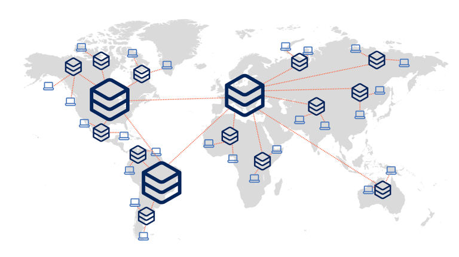

# Turso Case Study

## Introduction

Turso is a modern database as a service (DBaaS) platform designed for edge deployments. It combines the simplicity of SQLite with advanced distributed capabilities, offering low-latency data management tailored to the needs of modern applications. This case study presents its history, key features, strengths, and position in the current database landscape.

## History

Turso was developed by **ChiselStrike, Inc.**, a San Francisco-based company dedicated to tools for modern, edge-focused development. The founding team, including Otavio Salvador, Pedro Arvela, and Rodrigo Gonzalez, leveraged their expertise in software development and databases to create an innovative solution.

### Motivation

SQLite, one of the most trusted and widely used databases, is designed for single-node use, limiting its application in distributed and edge computing environments. Turso addresses these limitations with the following key enhancements:

1. **Distributed Capabilities**: Turso adds support for distributed environments, overcoming SQLite’s single-node nature.
2. **Licensing Flexibility**: libSQL provides a permissive license that fosters community-driven innovation.

## Key Features

Turso offers several innovative features, including:

- **Edge Deployment**: Optimized for edge environments, it reduces latency by bringing data closer to users.
- **Distributed Replication**: Replicates data across multiple nodes to ensure high availability and resilience.
- **SQLite Compatibility**: Leverages libSQL to retain SQLite’s simplicity and reliability.
- **Fast Setup**: Minimal configuration makes integration into modern workflows seamless.
- **Open Source**: Its open-source core encourages collaboration and rapid improvement.

### But what is the edge?

By integrating edge computing principles, Turso ensures data is available and processed as close as possible to the end user, delivering high performance and scalability. In edge computing:

- **Data is processed locally**: Reducing dependency on long-distance communication with centralized servers.
- **Applications benefit from low latency**: Ideal for real-time systems, IoT, and geographically distributed services.
- **Bandwidth is optimized**: Less data is sent over the network, saving resources and costs.

_Figure 1: Edge computing reduces response times by processing data closer to users._

## Applications

Turso excels in scenarios where distributed, low-latency databases are essential:

1. **Real-Time Applications**: Chat systems, collaborative tools, and live updates. For example, a company building a real-time collaborative document editor could use Turso to ensure instant data synchronization across global users.

2. **Geographically Distributed Systems**: Content delivery and applications with a global user base. An e-commerce platform serving users across multiple continents can leverage Turso to minimize latency and deliver localized content efficiently.

3. **IoT Deployments**: Managing data from sensors and devices in distributed networks. A smart agriculture company could use Turso to process and store data from IoT sensors deployed across large farming areas, enabling real-time analysis and decision-making.

4. **Gaming Industry**: Multiplayer online games require low-latency interactions. Turso can be used to store and synchronize game states, player data, and match results across distributed servers to ensure a smooth gaming experience.

5. **Startups and Edge-First Companies**: Several startups have begun integrating Turso into their stacks to reduce latency and increase responsiveness in real-time analytics or monitoring applications.

## Strengths and Weaknesses

### Strengths

- **Simplicity**: Built on SQLite’s straightforward approach, it is highly developer-friendly.
- **Performance**: Optimized for edge use cases, offering low-latency data access.
- **Scalability**: Distributed replication ensures availability and fault tolerance.
- **Community-Driven**: Its open-source model fosters innovation and collaboration.
- **Generous Free Tier**: Offers 500 databases for free, with easy scalability to unlimited databases. [Check the pricing here.](https://turso.tech/pricing)

### Weaknesses

- **Immaturity**: As a relatively new platform, Turso lacks the extensive adoption and ecosystem of older databases like PostgreSQL or Redis.
- **Limited Use Cases**: While powerful for edge computing, it may not yet address high-complexity relational workloads.

## Comparison with Other Databases

### Turso vs SQLite

| Feature              | Turso                          | SQLite                  |
| -------------------- | ------------------------------ | ----------------------- |
| Distribution         | Distributed across nodes       | Single-node only        |
| Latency Optimization | Designed for edge environments | Local embedded database |
| Licensing            | Open-source (libSQL)           | Original SQLite license |

### Turso vs Redis

| Feature          | Turso                | Redis                         |
| ---------------- | -------------------- | ----------------------------- |
| Primary Use Case | Edge database        | In-memory caching             |
| Persistence      | Disk-based storage   | Memory-based with persistence |
| Complexity       | SQL-based simplicity | Key-value store               |

## Conclusion

Turso combines innovative features with exceptional simplicity, positioning itself as a key tool for developers focused on modern and distributed applications. With a growing community and a focus on edge computing, Turso is transforming how we manage data in high-performance applications. We invite you to discover how it can benefit your next project.

## References and Additional Resources

- **[Turso Official Documentation](https://docs.turso.tech/introduction)**: Comprehensive guide on configuration and usage.
- **[Turso Blog](https://turso.tech/blog)**: News and articles about the platform.
- **[Turso Pricing Details](https://turso.tech/pricing)**: Information about pricing tiers.
- **[libSQL Repository](https://github.com/libsql/libsql)**: Source code for libSQL, the foundation of Turso.
- **[SQLite Official Site](https://www.sqlite.org/)**: Technical information and documentation for SQLite.
