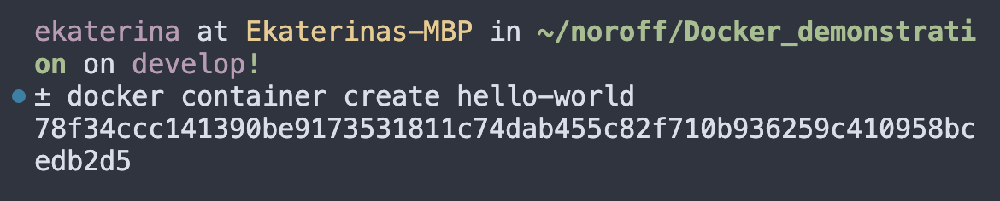
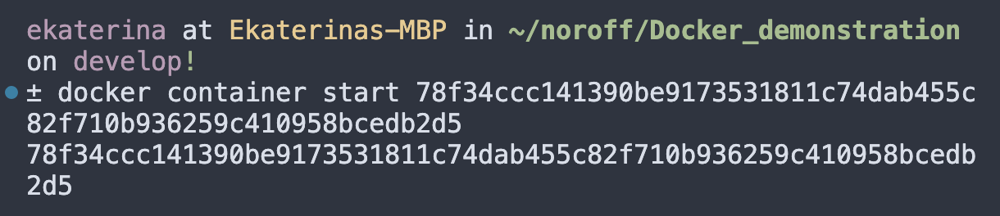
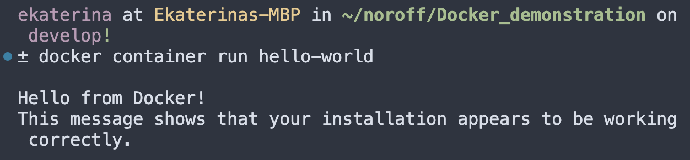
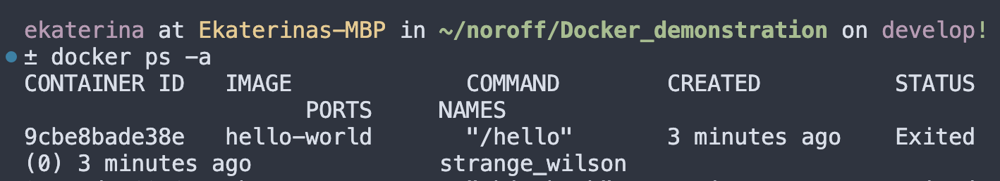
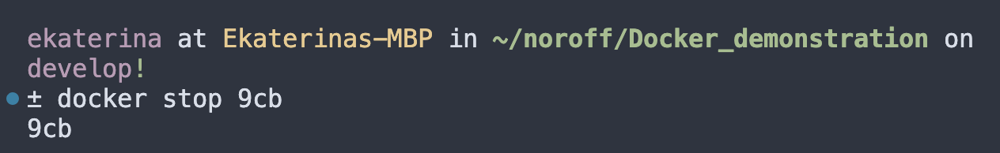
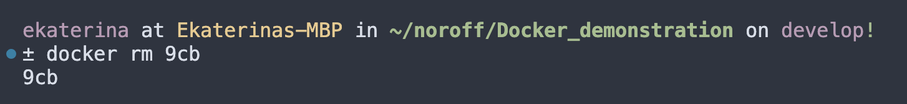
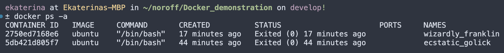

| Attribute  | Details                                                      |
|------------|--------------------------------------------------------------|
| Title      | Docker case study                                            |
| Author     | Eirik Michielsen <EM-90>                                     |
| Tags       | docker, docker image, containerize, container, deployment, development, environment |


### Introduction

This case study explores the advantages of using Docker, with a specific emphasis on Docker images and containerizations

### Brief History

-	2013: Docker is launched by Solomon Hykes during a talk at PyCon (Python developers conference). It introduces the concept of containerization to a wider audience, the focus is to simplify the development process, shipping and deployment.
-	2014: Docker 1.0 is officially released. This technology quickly gains popularity in the tech community for its efficiency and portability.
-	2015 Docker Compose is released simplifying the process of defining and running multi-container Docker applications.
-	2019: Docker sells its enterprise business to Mirantis, a cloud and open-source software company, to focus more on developer tools and its public Docker Hub.
-	2020: Despite challenges, Docker remains a key player in the container ecosystem, with significant advancements in Docker Desktop and Docker Compose for simplifying development workflows.
-	2021: Docker introduces updates to Docker Desktop, including features that enhance collaboration among developers and streamline the containerization process.
-	Today: Docker continues to innovate, focusing on simplifying the developer experience, enhancing security features, and expanding the community and ecosystem.


### Main features

**Docker Container**

Docker is designed to simplify both the development and deployment processes by leveraging the power of containers. These containers encapsulate your application, along with all necessary files, such as code, configuration files, frameworks, and dependencies, into a single, cohesive unit. This approach significantly reduces development and setup time, especially in a local environment.

To put it in perspective, consider a scenario where a team of developers is working with a variety of fifteen different dependencies and three libraries each. Traditionally, every developer would need to install all these dependencies and libraries in their local environment, a process complicated further by variations in operating systems. Docker, however, streamlines this process: every piece of the project is packaged into a container, making it easily accessible to every team member, irrespective of their OS. This means all dependencies and libraries are immediately available, right out of the "box" or, more accurately, the container.

**Docker Image**

Creating a Docker image is a fundamental step in containerizing an application, and it all begins with crafting a Dockerfile. This file contains the essential instructions for building a Docker image, serving as a blueprint for constructing a Docker container. Think of Docker images as comprehensive packages – they include the application's code, runtime, environment variables, and configuration files. By encapsulating everything the software needs to operate, Docker images provide a consistent environment for applications to run across various systems.

When an image is executed, it transforms into a Docker container. In essence, Docker images serve as the foundational elements of Docker containers, packaging applications and their environments into portable units. This portability facilitates easy sharing, distribution, and deployment of applications across diverse systems and platforms. Now, let's delve into the process of crafting a Dockerfile, the key to shaping these powerful Docker images.

How to start using docker and make an image into a container will be described and displayed with pictures in this case study

### Market comparison

Docker has been, and is still one of the most used application when it comes to the containerization for easy setup and deployment. 
This is also due to that Docker has a big open source community.

Here is some of the competitors:
- Kubernetis is one of Dockers biggest copetitors, but at the same time they are very commonly used together. You can use both seperatly.
- Podman has most simularities with Docker because they both use images and containers. Podman aso uses somthing called pods, build on kubernetis


### Getting started with Docker

The purpose of this walkthrough is to give an introduction on how to use docker, so that the user gets an understanding on how the image and containerization works.

**Step 1**

Install Docker by going to docker.com in your browser. Then pick the installation for your OS.


**Step 2**

Once installed, open a terminal or command prompt and run the following command to check that Docker is installed and running.
If Docker is installed correctly you will get Docker followed by the version number and build

```bash
docker --version
```

**Step 3**

Now create a simple node.js app. First create a directory for the project and navigate into it by writing this in the terminal:

```bash
mkdir node-app-test
cd node-app-test
```

**Step 4**

Then create a js file named server.js in the folder (directory) you just made:


This simple web server will respond "Hello world" to any request

**Step 5**

Next create a Dockerfile in the same directory as "server.js". This is where you make the commands for your Docker image.


Explanation of the commands:

- FROM is where you specify the base image, in this case a node image with the node version "node 14"
- WORKDIR decides witch app directory it will be running from
- COPY is writen two times, the first time to make sure every dependecy from your package.json is copied to the image, and the second time to copy all the local code to the image
- RUN runs the instalation of the production dependecies
- ENV HOST. ENV PORT and EXPOSE are commands that makes sure that it works on all network interfaces so that it can be mapped to the host OS
- CMD runs the web service on container startup

**Step 6**

Now that you have made a Dockerfile, you can build the Docker image by typing in this command in the terminal:

```bash
docker build -t node-app-test .
```

**Step 7**

After the image is built you can run your container by writing: 

```bash
docker run -p 3000:3000 node-app-test
```
Here is a screenshot of what your terminal will look like if you have followed all the steps


the last command is highlighted

**Step 8**

The last step is to open your browser and navigate to "http://localhost:3000". If it worked you will get a dark screen that say "Hello World"


### Conclution

In conclution, Docker's case study highlights the power of containerization in addressing real-world software development challenges. 
By containerizing applications, Docker has not only streamlined the development process but also bridged the gap between development and production environments.
The case study of creating a simple Node.js application and containerizing it with Docker illustrates the practical benefits of Docker: reduced setup time, consistency across environments, and ease of deployment. The example in this case study is to show how easy it can be to use Docker, how it takes an image and conainerize it.

### References

https://www.techtarget.com/searchitoperations/feature/The-history-of-Dockers-climb-in-the-container-management-market

https://www.docker.com/
https://www.docker.com/resources/what-container/

TeckWorld with Nana:
https://www.youtube.com/watch?v=pg19Z8LL06w&t=748s

IBM Technology: Containerization explained
https://www.youtube.com/watch?v=0qotVMX-J5s


=======
---
title: Docker Case Study
author: Ekaterina Nattrass <EkaterinaNattrass>
tags: Docker, Containerization, Deployment, Dockerfile, Container Orchestration
---

## Introduction

Imagine there's a platform that allows you to package your applications and their dependencies into small and portable containers. These containers can be easily shared and run on any machine in the world regardless of its operating system or installed software. Sounds too good to be true? Not really. Docker uses images and containers to allow applications to run anywhere consistently.

## Virtualization

Before delving into the history of containers, it's important to understand the concept of virtualization in general. According to AWS website, virtualization is 'technology that you can use to create virtual representations of servers, storage, networks, and other physical machines. Virtual software mimics the functions of physical hardware to run multiple virtual machines simultaneously on a single physical machine.' Usage of virtualization has a number of advantages:
- ***lower costs*** (reduces the amount of hardware servers, improves energy savings); 
- ***easier testing*** (testing is less complicated in a virtual environment);
- ***easier disaster recovery*** (in an emergency situation data can be migrated to a new location within minutes);
- ***improved efficiency and easier administration*** (less time is spent maintaining the servers, the time spent on the tasks is drastically decreased);
- ***easier migration to the cloud***.

## History of Containers

- **1979, the chroot**: development of the chroot(change root) command made it possible to change the root directory for a running process and its children to a new location in the filesystem; the command was added to the 7th edition of Unix in 1982;
- **2000, FreeBSD Jails**: introduction of FreeBSD jail command allowed the hosting provider to separate its services from those of its customers, isolate filesystems, users, networks etc. and to assign an IP address, configure custom software installations and make modifications to each jail;
- **2001, Linux VServer**: an early virtualization solution that transformed a single physical server into multiple isolated environments called virtual private servers (VPS);
- **2004, Solaris Containers**: Solaris Containers created full application environments through the use of Solaris Zones, which combined system resource controls and boundary separation, and also icluded new features like snapshots and cloning from ZFS;
- **2005, OpenVZ**: Linux developed a container-based virtualization solution which shared the host kernel among multiple containers;
- **2006, Process Containers**: launched by Google Process Containers were designed for isolating and limiting the resource usage of a process; they were renamed control groups(cgroups) in 2007;
- **2008, LinuX Containers(LXC)**: the project provided virtualization at the operating system level by allowing multiple isolated Linux environments to run on a shared Linux kernel;
- **2013, Let Me Contain That For You**: an open-source version of Google's container stack that allowed applications to be 'container aware' and programmed to create and manage their own sub-containers;
- **2013, Docker**: Docker was released as an open-source project which revolutionized containerization and led to increase of containers popularity; Docker provided the ability to package containers so that they could be moved from one environment to another;
- **2014, Kubernetes**: Google launched Kubernetes as an open-source container orchestration platform for automating deployment, scaling and management of containerized applications;
- **2016, Container Security**: further development of container-based applications and appearance of vulnerablities like dirty COW increased the importance of container security implementation on each step of container app development, which led to appearance of the DevSecOps principle (development, security and operations); 
- **2017, rkt**: rkt(pronounced 'rocket'), an application container engine designed for cloud-native environments, was adopted by Cloud Native Computing Foundation(CNCF);
- **2018, The Gold Standard**: containerization became the foundation for modern software infrastructure and Kubernetes was used for most container projects; development of several open-source projects (Kata containers, gVisor, Nabla and Podman) provided stronger workload isolation;

## Docker advantages

Docker solves several common problems in software development and offers unique features which makes it a valuable tool for developers:

- **Fast,consistent delivery of applications**:

Docker enables work in standardized environments using local containers which provide your application and services, they are also great for continuous integration and continuous delivery (CI/CD) workflows.

- **Responsive deployment and scaling**

Docker containers can run on physical and virtual machines, on cloud providers and in a mixture of environments.

Developers can also dynamically manage workloads scaling up and down applications based on the needs.

- **Running more workloads on the same hardware**:

Thanks to Docker software engineers can use more of server capacity, which is perfect when you don't have access to huge amount of resources.

## Docker Architecture

Docker uses a client-server architecture. **The Docker client** communicates to the **Docker daemon**(with use of a REST API, over UNIX sockets or a network interface), which in its own turn builds, runs and distributes **Docker containers**. 

-**The Docker client(docker)**

It is the primary way to interact with Docker through commands such as 
- `docker run`: used to create and start a new container based on a Docker image;
- `docker build`: used to build a Docker image from a Dockerfile;
- `docker pull`: used to pull a Docker image from a registry;
- `docker ps`: used to list running containers;
- `docker images`: used to list Docker images;
- `docker start`: used to start a stopped container;
- `docker stop`: used to stop a running container;
- `docker restart`: used to restart a running or stopped container;
- `docker rm`: used to remove one or more containers;
- `docker rmi`: used to remove one or more images;
- `docker logs`: used to display logs of a container;
- `docker exec`: used to run a command inside a running container;


-**The Docker daemon(dockerd)**

The Docker daemon listens for Docker API requests and manages Docker objects such as images, containers, networks, plugins, volumes and others. It can also communicate with other daemons.
- ***Images*** are read-only templates with instructions for creating a Docker container. They include the application code, runtime, libraries, dependencies and other files and configurations and are stored in a registry, such as Docker Hub or a private registry.
- ***Containers*** are executable instances of Docker images, which can be created, started, stopped, paused, restarted, moved or deleted with help of Docker API or CLI. Containers can communicate with each other and with external networks using Docker networking.
- ***Networks*** allow containers to communicate with each other and with external networks, include bridge networks, overlay networks, host networks and custom networks.
- ***Volumes*** provide storage for containers, allowing data to persist even after a container is stopped or deleted.
- ***Plugins*** are extensions that provide additional functionality and integrate Docker with external systems and services, and incorporate:
 - ***Network plugins*** extend Docker's networking capabilities and include, for example, [Contiv Networking](https://github.com/contiv/netplugin) ( provides infrastructure and security policies) and [Kuryr Network Plugin](https://github.com/openstack/kuryr) (implements the Docker networking remote driver API)
 - ***Volume plugins*** extend volume management capabilities, most popular among which are [Portwox Volume Plugin](https://github.com/portworx/px-dev) and [REX-Ray plugin](https://github.com/rexray/rexray)
 - ***Authorization plugins*** enable users to integrate Docker with external authentication and authorization systems and include, among others, [Casbin AuthZ Plugin](https://github.com/casbin/docker-casbin-plugin)
 - ***Logging plugins*** allow users to manage container logs, enabling easier troubleshooting, monitoring and analysis of containerized applications, for example, [Fluentd Docker logging driver](https://docs.fluentd.org/)
 - ***Runtime plugins*** extend container runtime capabilities, the most famous among these is probably [containerd](https://containerd.io/)
 - ***Service Discovery plugins*** enable containers to dynamically discover and communicate with other services and resources in the environment, for example, [Consul Docker service discovery](https://github.com/bitsofinfo/docker-discovery-registrator-consul)

## Getting Started

You can download and install Docker on multiple platforms.

- **Docker Desktop for Mac**
    1. Download the installer using the [link](https://docs.docker.com/desktop/install/mac-install/)
    2. Double-click Docker.dmg to open the installer and then drag the Docker icon to the Applications folder
    3. Double-click Docker.app in the Applications folder to start Docker

- **Docker Desktop for Windows**
    1. Download the installer using the [link](https://docs.docker.com/desktop/install/windows-install/)
    2. Double-click Docker Desktop Installer.exe to run the installer, follow the instructions to proceed with the installation process
    3. When the installations is done, select Close to complete the installation process

- **Docker Desktop on Linux**
    1. Download the correct package and install it with the corresponding package manager:
    [Install on Debian](https://docs.docker.com/desktop/install/debian/)
    [Install on Fedora](https://docs.docker.com/desktop/install/fedora/)
    [Install on Ubuntu](https://docs.docker.com/desktop/install/ubuntu/)
    [Install on Arch](https://docs.docker.com/desktop/install/archlinux/)
    2. Open the application menu in Gnome/KDE Desktop and search for Docker Desktop and select it to start Docker

## Docker Demonstration 

Now that everything is set up, let's look at how Docker works in practice. In order to create a container you need command `docker container create` and at least one argument (the image). The most popular ones in 2024 according to Google are Alpine, BusyBox and Ubuntu, but we´ll be using hello-world Docker image in this demonstration, which just contains a text file with the text "Hello, World".

- </img>

Below the command you can see the container ID, which is unique and helps a developer interact with the created container. 

It's also important to mention that the `docker container create` command creates a container, but doesn't start it. In order to start it, you need to run `docker container start` plus the ID of the container. 

- </img>

The fact that we got the container ID again means that Docker managed to start the container successfully.

There is also a shortcut command `docker container run` which combines `create` and `start` in one command. 

- </img>

If we run `docker ps -a` command which shows us all the existing containers, we will see that we have a new hello-world container with a new ID.

- </img>

In order to stop a container we need to run command `docker stop` plus the container ID (you can use the first three characters of the ID as a shortcut).

- </img>

It's important to highlight that this command only stops the container, but doesn't delete it. In order to remove a container use command `docker rm` plus the ID (or the three character shortcut).

- </img>

If we run the command `docker ps -a` again, we can make sure that there is no more container with this ID.

</img>

## Market Comparison

There are a few alternative containerization tools that can be used instead of Docker, but not all of them can be used as a full alternative, but just as an alternative to certain components of Docker, and therefore address only specific parts of Docker's functionality. The most interesting tools among them are:

- **LXC**

[LXC](https://linuxcontainers.org/) is a set of low-level container management tools that are part of a Linux  open-source project. 

Both Docker and LXC provide containerization capabilities, but Docker offers a more extensive set of tools and additional features for image management, security and deployment. LXC, on the other hand, may be preferred when low-level control over the container environment is required. Another difference is that with LXC a developer can run more than one process in a container, whereas Docker is designed to run only one process in each container.

- **Hyper-V**

[Hyper-V](https://learn.microsoft.com/en-us/virtualization/hyper-v-on-windows/about/) is a virtualization tool developed by Microsoft that allows users to create and manage virtual machines on Windows-based systems.

Among the advantages of Hyper-V one can name greater portability than traditional containers and better security as a result of increased isolation. But Hyper-V and Docker serve different virtualization needs, with Hyper-V being suitable for running isolated virtual machines with different operating systems, while Docker is designed for building and deploying cloud-native applications using containerization. 

- **Podman**

[Podman](https://podman.io/) is an open-source containerization tool that provides a daemonless and rootless alternative to Docker, allowing users to manage containers and pods without requiring a central daemon process. Its command-line interface is practically identical to Docker's (for example, `podman start`, which just like in Docker starts one or more containers), which makes it easy for Docker users to transition to Podman. 

The key difference between the two is that Podman functions without a central daemon. Instead, it uses a client-server model similar to Git, where commands interact directly with the container runtime. The rootless character of Podman provides better security and isolation. Additionally, unlike Docker, it doesn't require root privileges to manage containers. 

- **Containerd**

[Containerd](https://containerd.io/) is an open-source container runtime that provides a platform for core operations, such as image distribution, container execution, snapshot functionality and storage management through the use of simple API requests. It was buillt as part of the Docker system, but then spun off as an independent open-source project.

Containerd is designed to be modular and pluggable, can be integrated into various container orchestration platforms and container management tools. Whereas, Docker offers a more integrated approach to containerization, adding additional features and tools to Containerd to provide a complete container platform.

## Conclusion

Containerization is the future of software development. Although there are many platforms in this sphere, Docker can be easily called the most popular one, as it has a large and established community with extensive documentation, tutorials and third-party integrations. It is widely adopted in the industry and supported by major cloud providers, including AWS, Microsoft Azure and GCP. Moreover, the deployment goes quickly and smoothly, and applications built using Docker will run on any compatible operating system. Don't forget about high level of security and user-friendly interface which make Docker choice number one among developers.

## References

-[Docker Overview](https://docs.docker.com/get-started/overview/)

- [Docker Plugins](https://docs.docker.com/engine/extend/legacy_plugins/)

- [Docker Install](https://docs.docker.com/desktop/install/)

- [LinkedIn Course, Learning Docker](https://www.linkedin.com/learning/learning-docker-17236240/get-up-and-running-quick-with-docker?u=43268076)

- [History of Containers](https://www.aquasec.com/blog/a-brief-history-of-containers-from-1970s-chroot-to-docker-2016/)

- [More on History of Containers](https://www.pluralsight.com/resources/blog/cloud/history-of-container-technology)

- [Virtualization](https://aws.amazon.com/what-is/virtualization/)

- [More on Virtualization](https://www.techtarget.com/searchitoperations/definition/virtualization)

- [Other Containerization Tools](https://jfrog.com/devops-tools/article/alternatives-to-docker/)


