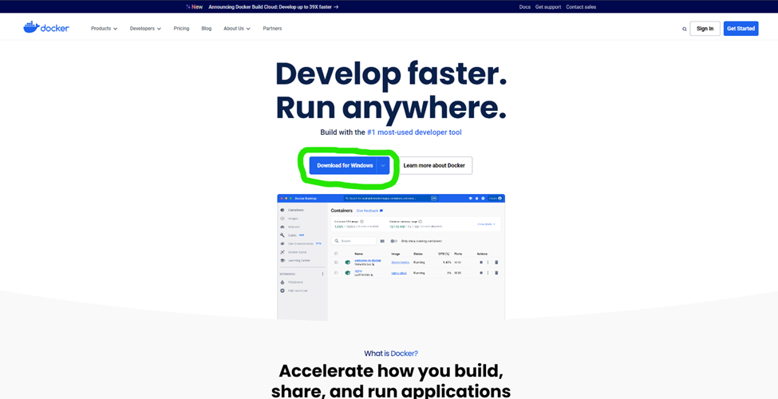
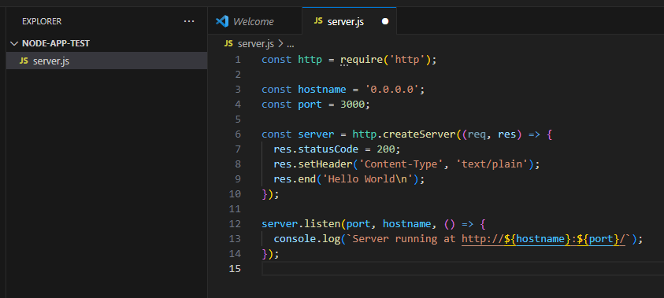
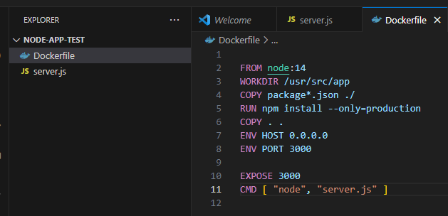
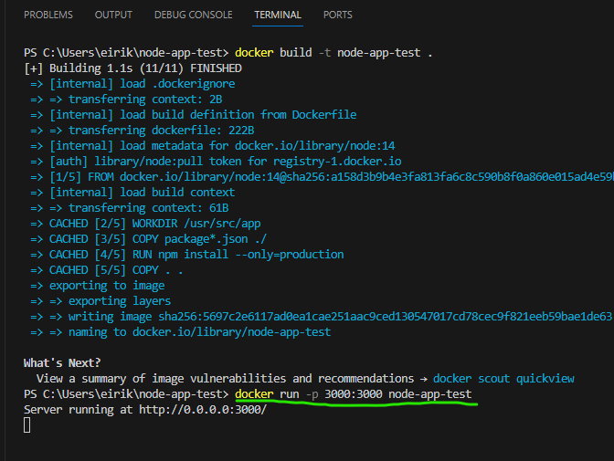
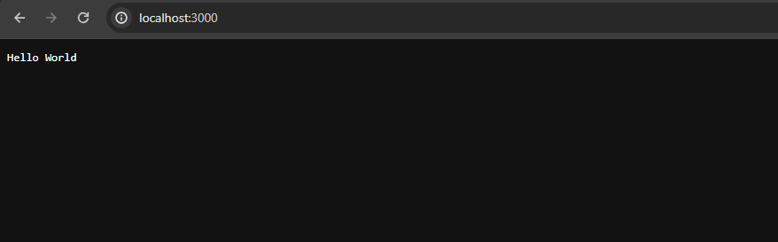

| Attribute  | Details                                                      |
|------------|--------------------------------------------------------------|
| Title      | Docker case study                                            |
| Author     | Eirik Michielsen <EM-90>                                     |
| Tags       | docker, docker image, containerize, container, deployment, development, environment |


### Introduction

In this case study I will be writing about the benefit of using Docker by focusing on Docker image and containerizing applications.

### Brief History

-	2013: Docker is launched by Solomon Hykes during a talk at PyCon (Python developers conference). It introduces the concept of containerization to a wider audience, the focus is to simplify the development process, shipping and deployment.
-	2014: Docker 1.0 is officially released. This technology quickly gains popularity in the tech community for its efficiency and portability.
-	2015 Docker Compose is released simplifying the process of defining and running multi-container Docker applications.
-	2019: Docker sells its enterprise business to Mirantis, a cloud and open-source software company, to focus more on developer tools and its public Docker Hub.
-	2020: Despite challenges, Docker remains a key player in the container ecosystem, with significant advancements in Docker Desktop and Docker Compose for simplifying development workflows.
-	2021: Docker introduces updates to Docker Desktop, including features that enhance collaboration among developers and streamline the containerization process.
-	Today: Docker continues to innovate, focusing on simplifying the developer experience, enhancing security features, and expanding the community and ecosystem.


### Main features

**Docker Container**

Docker is designed to simplify both the development and deployment processes by leveraging the power of containers. These containers encapsulate your application, along with all necessary files, such as code, configuration files, frameworks, and dependencies, into a single, cohesive unit. This approach significantly reduces development and setup time, especially in a local environment.

To put it in perspective, consider a scenario where a team of developers is working with a variety of fifteen different dependencies and three libraries each. Traditionally, every developer would need to install all these dependencies and libraries in their local environment, a process complicated further by variations in operating systems. Docker, however, streamlines this process: every piece of the project is packaged into a container, making it easily accessible to every team member, irrespective of their OS. This means all dependencies and libraries are immediately available, right out of the "box" or, more accurately, the container.

**Docker Image**

To successfully containerize an application, you need to make a Dockerfile. The Dockerfile contains all the commands for building a Docker image. Images are essentially  blueprints for creating the docker container. The Docker image has everything you need for building the application: The code, runtime, environment variables and configuration files. The images enable an application to run in a variety of environments consistently because the image encapsulates everything the software needs to operate. 
When running an image it becomes a Docker container. In summary we can say that Docker images are the building blocks of Docker containers. They package the application and its environment into a neat, portable unit, making it easy to share, distribute, and deploy applications across different systems and platforms. 

How to start using docker and make an image into a container will be described and displayed with pictures in this case study

### Market comparison

Docker has been, and is still one of the most used application when it comes to the containerization for easy setup and deployment. 
This is also due to that Docker has a big open source community.

Here is some of the competitors:
- Kubernetis is one of Dockers biggest copetitors, but at the same time it they are very commonly used together. You can use both seperatly.
- Podman has most simularities with Docker because they both use images and containers. Podman aso uses somthing called pods, build on kubernetis


### Getting started

**Step 1**

Install Docker by going to docker.com in your browser. Then pick the installation for your OS.


**Step 2**

Once installed, open a terminal or command prompt and run the following command to check that Docker is installed and running.
If Docker is installed correctly you will get Docker followed by the version number and build

```bash
docker --version
```

**Step 3**

Now we are going to create a simple node.js app. First we will create a directory for the project and navigate into it by writing this in the terminal:

```bash
mkdir node-app-test
cd node-app-test
```

**Step 4**

Then we make a js file named server.js in the folder (directory) we just made:



This simple web server will respond "Hello world" to any request

**Step 5**

Next we make our Dockerfile in the same directory as "server.js". This is where we make the commands for our Docker image.



Explanation of the commands:

- FROM is where you specify the base image, in this case a node image with the node version "node 14"
- WORKDIR decides witch app directory it will be running from
- COPY is writen two times, the first time to make sure every dependecy from your package.json is copied to the image, and the second time to copy all the local code to the image
- RUN runs the instalation of the production dependecies
- ENV HOST. ENV PORT and EXPOSE are commands that makes sure that it works on all network interfaces so that it can be mapped to the host OS
- CMD runs the web service on container startup

**Step 6**

Now that we have made a Dockerfile we can build the Docker image by typing in this command in the terminal:

```bash
docker build -t node-app-test .
```

**Step 7**

After the image is built you can run your container by writing: 

```bash
docker run -p 3000:3000 node-app-test
```
Here is a screenshot of what your terminal will look like if you have followed all the steps



the last command is highlighted

**Step 8**

The last step is to open your browser and navigate to "http://localhost:3000". If it worked you will get a dark screen that say "Hello World"




### Conclution

In conclution, Docker's case study highlights the power of containerization in addressing real-world software development challenges. 
By containerizing applications, Docker has not only streamlined the development process but also bridged the gap between development and production environments.
The case study of creating a simple Node.js application and containerizing it with Docker illustrates the practical benefits of Docker: reduced setup time, consistency across environments, and ease of deployment. The example in this case study is to show how easy it can be to use Docker, how it takes an image and conainerize it.

### References

https://www.techtarget.com/searchitoperations/feature/The-history-of-Dockers-climb-in-the-container-management-market

https://www.docker.com/
https://www.docker.com/resources/what-container/

TeckWorld with Nana:
https://www.youtube.com/watch?v=pg19Z8LL06w&t=748s

IBM Technology: Containerization explained
https://www.youtube.com/watch?v=0qotVMX-J5s


