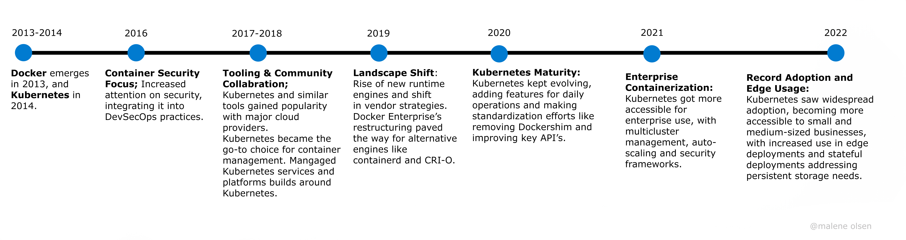
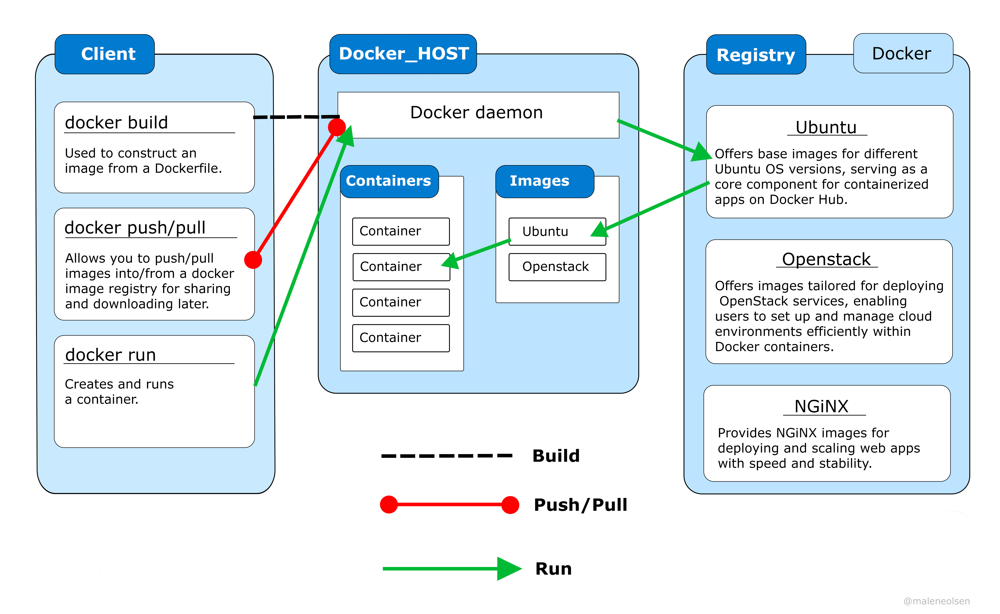
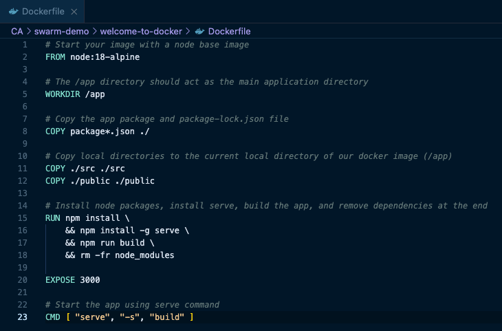
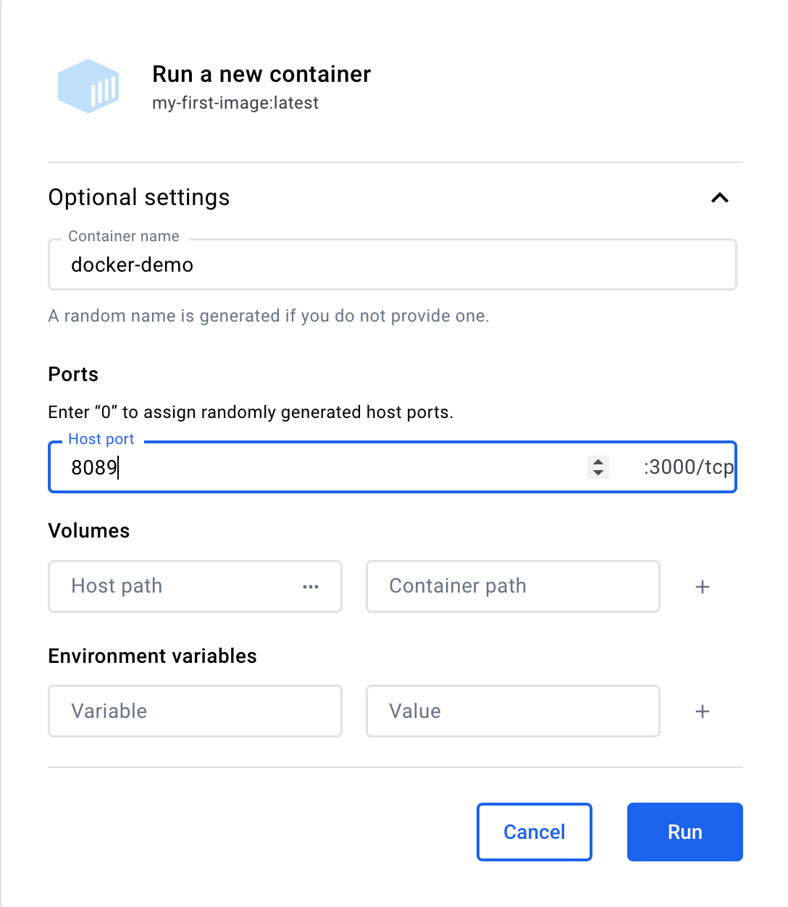
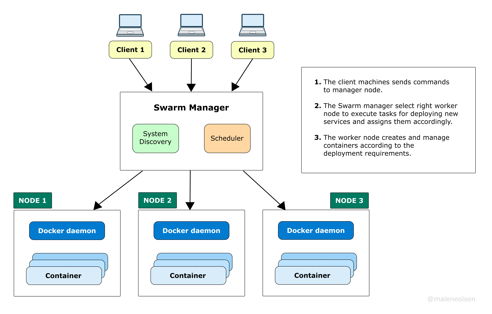

# Docker Swarm - container orchestration tool
[Acronyms used in the text](#acronyms-used)
## Introduction
This case study aims to compare Docker and Kubernetes, the two key technologies in containerization and orchestration. Wil will begin by introducing Docker, an essential tool for containerization, to set the groundwork for understanding container orchestration tools.

Then we will dive into comparison of Docker Swarm and Kubernetes to help students/beginners understand these important tools in modern software development. 

## Containerization
A container works as a self-contained environment that holds all of the necessary components for running an application. It provides an isolated environment for running applications and services.

Containerization enables teams to package applications, dependencies and configurations into container images. This simplifies the development of microservices, which are small, independent software components that focus on specific tasks within a larger application.

### Container Key Milestones

In 1979, the concept of containers first emerged. This was 34 years before Docker surfaced in 2013.

Docker revolutionized the way containers were created, deployed, and managed, making them more accessible and easier to use for developers and operators alike. Kubernetes grew in popularity after its appearance in 2014 and today, in the world of container orchestration, the two leading platforms are Docker Swarm and Kubernetes. 

## Docker Overview
**Docker** is an open platform designed for creating, deploying, and managing containers and is the standard way to build applications for millions of developers today.
To set up a Docker environment, you'll need to download the application Docker Desktop, which provides you an integrated environment for building, testing and deployment of application on your local machine. Docker Desktop includes Docker Engine, CLI, Docker Compose and other useful tools for managing Docker containers and images.

### Docker Architecture
Docker works on a client-server architecture where the Docker client communicates with the Docker daemon. 



The Docker client is a command-line interface (CLI) tool that allows users to interact with the Docker daemon.

It accepts commands from users and sends them to the Docker daemon for execution. These commands can include instructions for managing containers, images, networks, and volumes.

The Docker daemon, in turn, processes these commands, performs the necessary actions, and communicates the results back to the client. This communication between the client and daemon occurs through a REST API, which can operate over UNIX sockets for local communication or network interfaces for remote communication.

The registry serves as a centralized repository for storing Docker images, functioning much like a digital library. Think of it as a virtual catalog where users can discover and download images that suit their needs.

**Docker Hub**, for instance, is a well-known public registry where users can find a diverse array of images contributed by various communities and individuals. 

### Image and container
A container image is like a digital box that holds all the stuff your app needs to work. Inside, you'll find the code, tools, and settings required for your app to run smoothly.

When you use Docker, this box becomes magical! It can be moved and used on different computers without any hassle. This means that you don't have to worry about what installed software there is on each computer. When you open this digital box, it turns into a container, which is what actually runs your app. 

People often mix up images and containers, but they're actually two different parts of Docker. To sum it up; the image is like the package, and the container is what runs when you open the package. A single image can create multiple containers.

### Dockerfile and image layers
To build your own image, you'll need to compose a Dockerfile, creating a straightforward syntax with steps that is needed for its creation and execution. Each instruction in the Dockerfile contributes to a layer within the image. Each layer represents a set of filesystem changes, such as adding, modifying, or deleting files. Every time the Dockerfile changes, only the layers which have changes, are rebuilt. 

Some common Dockerfile instructions:
* **FROM**: Specifies the base image to use for the new image. 
* **COPY**: Copies files/directories from the host machine into the image.
* **RUN**: Executes commands within the image.
* **EXPOSE**: Container will listen on port 3000 on runtime.
* **CMD** Specifies the default command to run when a container is started from the image. 

### Demonstration: build an image and run container
Let's take a look at Dockers [welcome-to-docker](https://github.com/docker/welcome-to-docker) repo on Github. 
1. Install Docker Desktop on [Mac](https://docs.docker.com/desktop/install/mac-install/), [Windows](https://docs.docker.com/desktop/install/windows-install/) or [Linus](https://docs.docker.com/desktop/install/linux-install/). 
We will continue with the Mac installation instructions.

1. Make sure to make a folder where you can try this out. Open terminal and navigate to your folder before you clone the repo with this command: 

   ```sh
   git clone https://github.com/docker/welcome-to-docker
   ```
2. Navigate yourself to the new folder with this command: 
    ```sh
    cd welcome-to-docker
    ```
3. Open the sample application in your IDE(code editor), and look at the sample Docker file. read the comments. 

1. Build your first image. The -t flag tags your image with the name "my-first-image" and the . lets Docker know where to find the Dockerfile. 
   ```sh
   docker build -t my-first-image .
   ```
   Now you can see the image in Docker Desktop. 

Run container by pressing on the "play" button you see under Actions, and fill inn container name and the host port you want to assign it to and hit run.

You have now a running container, view it live by selecting the link below the container's name. 

### Multi-container applications
Multi-container applications are software that consist of multiple containers working together, where each container performs a specific task or function.

In a web application for instance; you might have separate containers for the web server, application and database server. These containers work together to serve web pages, process requests and store data. 

**Docker Compose** is a tool that allows developers to specify the services, networks and volumes required for their application in a single YAML file. It makes development and testing faster and simpler when managing complex applications with lots of linked containers 

### Container orchestration
Container orchestration manages the dynamic lifecycle of containers, with automating tasks such as provisioning, deployment, scaling, resource allocation, load balancing and health monitoring.  It's essential for DevOps teams to integrate containers into CI/CD workflows, because of its many benefits, such as faster delivery, lower costs and improved efficiency.

There are two types of container orchestration: self-built and managed. I have picked two of the most popular tools to compare to each other.


## Orchestration with Kubernetes or Docker Swarm
Docker Swarm is a managed container orchestration tool, while Kubernetes is self-built. Let's take a comparing look at them making it easier to decide which one suits best for what. 

### Docker Swarm
Docker Swarm allows a user to manage multiple containers deployed across multiple host machines. It allows you to create a cluster of Docker nodes and deploy services to the cluster. There are two types of swarm nodes; manager nodes manage the cluster and worker nodes run the containers.

### Docker Swarm Architecture



The swarm manager node receives commands from the clients and assigns them to the worker nodes. Inside the swarm manager node there are the two components where the Service Discovery is responsible for collecting information on the worker nodes, and the Scheduler finds suitable nodes to assign tasks to. The worker nodes executes this assigned tasks. 

To create a swarm:

*  Create the node that will become the swarm manager. (Initialize a swarm)
    ```sh
    docker swarm init
    ```

    If you want to do multi node swarm, you'll need multiple machines, either virtual or physical. 

* You can check the swarm info, to check all the info about your Docker install, all the containers, images and swarms you have installed. You can also get the id of the swarm: 
    ```sh
    docker info
    ```

## Kubernetes
Kubernetes is another popular container orchestration tool and is rich on features and very configurable. Let's take a look at the architecture, which is also more complex than Docker Swarm.

### Kubernetes Architecture


As we can see in the diagram above, the Kubernetes architecture consist of two components which are the Control Pane and the Kubernetes Node.

The Control Pane manages the cluster's operation and Kubernetes Node executes the tasks by the control pane.

## Choosing container orchestration tools
Developers should always evaluate them in context of their specific needs. In this case study I've taken to consideration these criteria


| Criteria            | Kubernetes                               | Docker Swarm                            |
|--------------------|------------------------------------------|-----------------------------------------|
| Autoscaling        | Yes                                      | No, manual scaling                      |
| CLI tool           | Needs separate tool, kubectl             | Integrated with Docker CLI              |
| Container Runtime  | Supports Containerd, CRI-O and more.     | Only Docker containers                  |
| Ecosystem          | Extensive                                | Growing                                 |
| Learning curve     | Complicated                              | Easy                                    |
| Load Balancing     | Yes                                      | Built-in automatic load balancing       |
| Security           | Supports RBAC, SSL/TLS and secret management  | Support TLS                        |
| Self-healing       | Yes                                      | Yes                                     |
| Service Discovery  | Built-in service discovery               | DNS-based service discovery             |
| Use Cases          | Large-scale deployments, microservices   | Small to medium-scale deployments       |

### Criteria explained
* **Autoscaling**: Kubernetes supports automatic scaling, adjusting container instances based on workload, while Docker Swarm lacks this feature.

* **CLI**: There is no need to install an additional command line tool with Docker Swarm, unlike Kubernetes, which requires kubectl command line tool to work with the cluster.

* **Container Runtime**: A container runtime is a program that runs and manages containers, ensuring they have what they need to run smoothly on a system.
  
  Kubernetes is more flexible and supports any container runtime that implements its Container Runtime Interface, while Docker Swarm only supports Docker containers. Kubernetes did support Docker as a container runtime earlier, but removed this support in the late 2021. 

* **Ecosystem**: Ecosystem is a wide range of additional tools, plugins, community input and integrations that improves and expand the core platform. This includes third-party applications, development frameworks, monitoring solutions, networking plugins, storage drivers, security tools and more.
  
  Kubernetes offers a large ecosystem with many plugins and tools, while Docker Swarm is more limited, but growing. 
  
* **Load Balancing**: Docker Swarm offers an automatic load balancing mechanism, ensuring seamless communication and interaction between containers within the Docker Swarm cluster. The load balancing functionality is built-in, requiring minimal configuration.
  
  In contrast, Kubernetes provides a more customizable approach to load balancing. It allows you to define and configure load balancers based on your specific requirements. While this requires some manual setup, it grants you greater control over the load balancing configuration within the Kubernetes cluster.

* **Learning Curve**: Kubernetes has more features and has therefore a more complex learning curve than Docker Swarm, which is designed to be lightweight.

* **Security**: Both Kubernetes and Docker Swarm deploys applications safely, but Kubernetes supports more authentication and authorization mechanism like Role-Based Access Control (RBAC), secure access layers (SSL) and secret management. Docker Swarm supports Transport Layer Security (TLS). 

* **Self-healing**: Both are self-healing, meaning they have the ability to detect and automatically recover from failures within the system, such as restarting containers that have failed. 

* **Service Discovery**: This means when the parts of the system finds and connects services automatically, so that containers can communicate with each other without human need to step in. Kubernetes has this built-in, while Docker Swarm relies on DNS(Domain Name Service) for connection. Unlike Kubernetes, Docker Swarm uses DNS-based service discovery.

### Use Cases
Docker Swarm is good for small to medium deployments, while Kubernetes is suitable for larger deployments. Some other points that are useful when you consider those two are: 

| Kubernetes                               | Docker Swarm                            |
|------------------------------------------|-----------------------------------------|
| Those who have deeper understanding of using containerization techniques. | Beginners, who wants to learn application deployment using containerization techniques. |-
| Should know Kubernetes components | Should be familiar with Docker, but luckily it's easier to learn and use. |
| Complex application which demands extensive customization during deployment. | Applications with consistent user traffic or stable usage patterns are well-suited.  |
| Auto-scaling, this is necessary for complex applications with growing user base.  |                      |
| When detailed control and extensive customization options are essential for your deployment. |                  |

## Resources
* [Docker Docs](https://docs.docker.com/)
* [28 Docker facts you should know](https://blog.hildenco.com/2020/09/docker-28-facts-you-should-know.html)
* [Docker Architecture](https://www.scaler.com/topics/docker/docker-architecture/)
* [Container History](https://www.aquasec.com/blog/a-brief-history-of-containers-from-1970s-chroot-to-docker-2016/)
* [Stack Overflow Survey](https://survey.stackoverflow.co/2023/#technology-admired-and-desired)
* [Kubernetes Docs](https://kubernetes.io/docs/home/)
* [Kubernetes vs. Docker Swarm](https://betterstack.com/community/guides/scaling-docker/docker-swarm-kubernetes/)
* [Kubernetes deprecates Docker](https://www.pluralsight.com/resources/blog/cloud/kubernetes-is-deprecating-docker-what-you-need-to-know)

### Images
Diagrams/images used in this case study are made by me, but inspired by the resources I've been through.
* [Container History Timeline](https://www.aquasec.com/blog/a-brief-history-of-containers-from-1970s-chroot-to-docker-2016/)
* [Docker Architecture](https://betterstack.com/community/guides/scaling-docker/docker-swarm-kubernetes/#what-is-kubernetes)
* [Docker Swarm & Kubernetes Architecture](https://betterstack.com/community/guides/scaling-docker/docker-swarm-kubernetes/#what-is-kubernetes)

### Acronyms used

| Acronym | Explanation |
|-|-|
| CLI | Command Line Interface |
| UNIX | UNIX-like operating system - communications between processes on the same host |
| YAML | YAML Ain't Markup Language - Human readable data serialization language |
| DevOps | development teams (Dev) and operations teams (Ops)|
| CI/CD workflows |Continuous Integration/Continuous Deployment workflows |
| CRI-O | Container Runtime Interface - OCI (Open Container Initiative) |
| RBAC | Role based access control |
| SSL | Secure Sockets Layer |
| TSL | Transport Layer Security |
| SSL | Secure Sockets Layer |
| DNS | Domain Name System |

[Go to the top](#docker-swarm---container-orchestration-tool)
