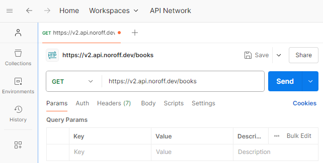

## Introduction

This case study explores Postman, a powerful development platform for APIs. Postman lets you use, build and test APIs through an intuitive, visual interface, making it an excellent choice for beginners. It allows developers to set up and organize APIs, test their functionality, and explore their capabilities before integrating them into projects.

The study will guide readers on how to get started with Postman, including setup and initial use, and provide examples of testing APIs. (Additionally, it will highlight the practical benefits of using this tool, such as improving efficiency and ensuring API reliability.) To set the stage, we’ll first delve into the origins of Postman and why it was created.

## Brief History

Postman was first built by Abhinav Asthana, and then developed further with co-founders Ankit Sobti and Abhijit Kane. After experiencing difficulties and issues when working with APIs on his own projects, Abhinav Asthana wanted to create a tool to simplify the API testing process. An early version of Postman was in use in 2012 and available on Chrome Web Store, and from there it got popular quickly.[^1] Postman was formally founded in 2014.[^2]

Today, Postman Inc. is the leading API platform and they claim that over 500,000 companies are using Postman.[^3]

Read more about Postman's history on this blog post written by Abhinav Asthana: [How we built Postman—the product and the company](https://blog.postman.com/how-we-built-postman-product-and-company/)

## Main Features

Postman gives the users many options without complicating the experience. The primary purpose of Postman is to make the testing of APIs easy. Here are some of the main features:

- **User-Friendly Interface:** Postman has a intuitive, visual design that simplifies working with APIs, even for developers new to API testing. It's available as a desktop app, web app, and browser extension.
- **API Testing and Debugging:** Postman easily sends requests (GET, POST, PUT, DELETE, etc.) and analyze responses to verify API functionality and identify issues.
- **Collections:** We can group API requests into collections (like folders) for better organization, reusability, and sharing with team members.
- **Environment Variables:** Store values like URLs or keys in variables, so you can easily switch between settings for different stages of development, such as development, testing, or production.
- **Automated Testing:** Create test scripts to automate repetitive API testing tasks and ensure consistent results.
- **API Documentation:** Generate and share professional API documentation automatically based on your collections.
- **Mock Servers:** Simulate API responses without needing the actual backend, enabling early-stage development and testing.
- **Monitoring:** Schedule regular API tests to monitor performance and functionality over time.
- **Integration with CI/CD Pipelines:** It is possible to connect Postman with tools like Jenkins or GitHub Actions to automatically test APIs as part of the development and deployment process.
- **Learning Tools:** Interactive features like Postman Academy help developers learn how to work with APIs more effectively.

### Pricing

Postman offers a **free** plan designed for individuals or small teams of up to three members. While it has some limitations, such as restrictions on collaborators, packages, and collection runs, it provides a solid starting point for simplifying API workflows.[^4]

For additional features, Postman offers three paid plans: **Basic**, **Professional**, and **Enterprise**. These include everything in the free plan plus advanced tools. Visit [Postman's pricing page](https://www.postman.com/pricing/) for detailed information about each plan.

## Getting Started

In this part we will look at how to get started with Postman and demonstrate a basic API request.

1. [Download the Postman desktop app](https://www.postman.com/downloads/) and register an account **or** sign up and use the [Web Version](https://identity.getpostman.com/signup?continue=https%3A%2F%2Fgo.postman.co%2Fhome&ref_key=vAHTF49tlH25ipNrVVgbRK)
2. We will now send a request to an endpoint and see the response data sent from the server.

- Click the plus icon to add a new tab.
- We have chosen the request type HTTP since we are making a ... request in this demontration.
- Select the correct method, in this case GET, and enter the API url. We are using the Books endpoint from the [Noroff API Documentation](https://docs.noroff.dev/docs/v2/basic/books#all-books).
- Click the Send button.

- We have now tested this endpoint and it responded with a success (200 OK) retrieveing a list of All Books. We can view the response in a JSON format from the server and study the data we can use in our project.

- The response data contains a list of books, all with a unique id. From the [Books API Documentation](https://docs.noroff.dev/docs/v2/basic/books#single-book) we can see that we can also test the endpoint GET Single book. We will do that now, with only a small change in the API url. According to the API documentation, all we need to do is add the id to the url, and click the Send button.

## Market Comparison

This section can be used to compare the advantages and disadvantages of your chosen tool to other similar tools. You may use subheadings, tables or bullet points to structure your description.

If you are writing about an open source tool, it may be a good idea to compare it to similar proprietary tools. Likewise, if you are writing about a proprietary tool, it may be a good idea to compare it to similar open source tools.

Similarly, a self hosted tool and a cloud based tool with a similar purpose may make for a good comparison.

- swagger
- Apidog
- Hoppscotch (open-source)

When selecting an alternative to Postman, consider factors such as your specific API development needs, team collaboration requirements, preferred user interface, and budget constraints to choose the tool that best aligns with your workflow.

## Conclusion

## Author

Eli Nygård (GitHub Profile: [elinygard](https://github.com/elinygard) )

## References

### Footnotes

[^1]: [https://blog.postman.com/how-we-built-postman-product-and-company/](https://blog.postman.com/how-we-built-postman-product-and-company/)

[^2]: [www.forbes.com/companies/postman/](https://www.forbes.com/companies/postman/)

[^3]: [www.postman.com/case-studies/](https://www.postman.com/case-studies/)

[^4]: [www.postman.com/pricing/](https://www.postman.com/pricing/)
