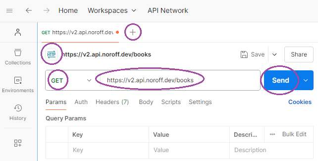
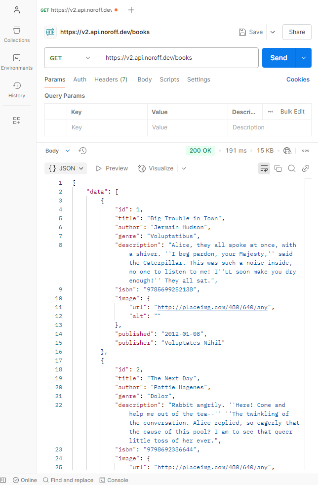
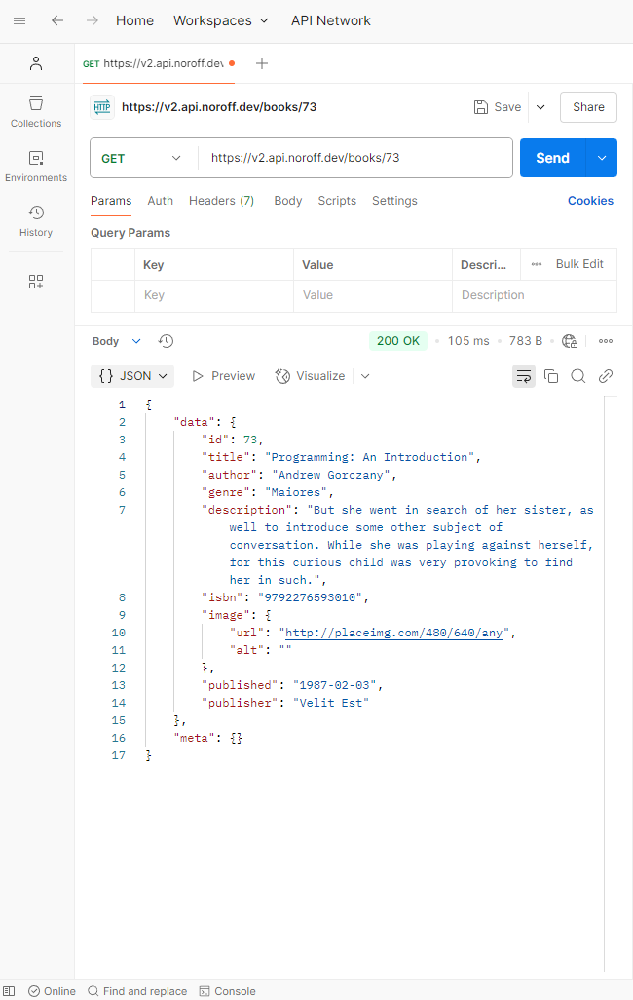
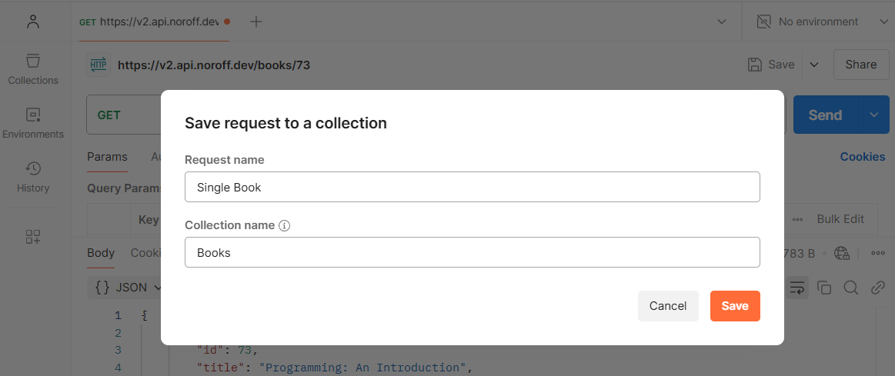
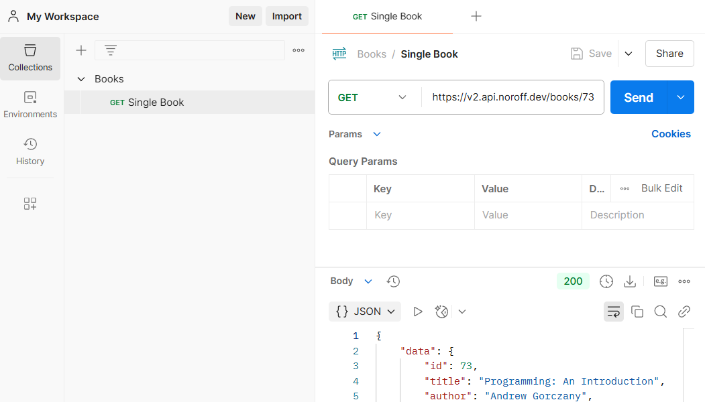

## Introduction

This case study explores Postman, a powerful development tool for APIs. Postman lets you use, build and test APIs through an intuitive, visual interface, making it an excellent choice for beginners. It allows developers to set up and organize APIs, test their functionality, and explore their capabilities before integrating them into projects.

The study will guide readers on how to get started with Postman, including setup and initial use, and provide examples of testing APIs. To set the stage, we’ll first delve into the origins of Postman and why it was created.

## Brief History

Postman was initially created by Abhinav Asthana and later developed further with co-founders Ankit Sobti and Abhijit Kane. While working on his own projects, Asthana encountered challenges with APIs and envisioned a tool that would simplify the API testing process. An early version of Postman was launched in 2012 on the Chrome Web Store, where it quickly gained popularity. [^1] Postman Inc. was officially founded in 2014. [^2]

Today, Postman Inc. is a leading API development platform, claiming that over 500,000 companies use their tool. [^3]

For more about Postman’s history, you can read this blog post by Abhinav Asthana: [How we built Postman—the product and the company](https://blog.postman.com/how-we-built-postman-product-and-company/)

## Main Features

The primary purpose of Postman is to make the testing of APIs easy. Postman gives the users many options without complicating the experience. Here are some of the main features:

- **User-Friendly Interface:** Postman has a intuitive, visual design that simplifies working with APIs, even for developers new to API testing. It's available as a desktop app, web app, and browser extension.
- **API Testing and Debugging:** Postman easily sends requests (GET, POST, PUT, DELETE, etc.) and analyze responses to verify API functionality and identify issues.
- **Collections:** We can group API requests into collections (like folders) for better organization, reusability, and sharing with team members.
- **Environment Variables:** Store values like URLs or keys in variables, so you can easily switch between settings for different stages of development, such as development, testing, or production.
- **Automated Testing:** Create test scripts to automate repetitive API testing tasks and ensure consistent results.
- **API Documentation:** Generate and share professional API documentation automatically based on your collections.
- **Mock Servers:** Simulate API responses without needing the actual backend, enabling early-stage development and testing.
- **Monitoring:** Schedule regular API tests to monitor performance and functionality over time.
- **Integration with CI/CD Pipelines:** It is possible to connect Postman with tools like Jenkins or GitHub Actions to automatically test APIs as part of the development and deployment process.
- **Learning Tools:** Interactive features like Postman Academy help developers learn how to work with APIs more effectively.

### Pricing

Postman offers a **free** plan designed for individuals or small teams of up to three members. While it has some limitations, such as restrictions on collaborators, packages, and collection runs, it provides a solid starting point for simplifying API workflows.[^4]

For additional features, Postman offers three paid plans: **Basic**, **Professional**, and **Enterprise**. These include everything in the free plan plus advanced tools. Visit [Postman's pricing page](https://www.postman.com/pricing/) for detailed information about each plan.

## Getting Started

In this chapter, we’ll explore how to get started with Postman and demonstrate how to send a basic API request. By following these steps, you’ll gain confidence in using Postman and understand how it simplifies API testing.

For this demonstration we will be using the [Noroff API Documentation](https://docs.noroff.dev/docs/v2/).

### Step 1: Install Postman

To begin, [download the Postman desktop app](https://www.postman.com/downloads/) and create an account. Alternatively, you can sign up and use the [web version of Postman](https://identity.getpostman.com/signup?continue=https%3A%2F%2Fgo.postman.co%2Fhome&ref_key=vAHTF49tlH25ipNrVVgbRK).

### Step 2: Sending Your First API Request

We will send a request to the [API endpoint Books](https://docs.noroff.dev/docs/v2/basic/books) to retrieve all books and examine the server's response data.

1. Open Postman and click the **plus icon** to create a new request tab.

2. Postman supports various request types, including HTTP, GraphQL, and WebSocket. For this demonstration, we’ll stick with **HTTP**, as it’s the most commonly used for APIs.

3. In this demonstration, we’ll be making a **GET** request. Ensure the **GET** method is selected in the dropdown menu.

4. Enter the **API URL** in the input field. First, we need the API base URL, [`https://v2.api.noroff.dev/`](https://docs.noroff.dev/docs/v2/about#base-url). For this example, we’re using the **All Books** endpoint and from the documentation we can see that we need to append `/books` to the base URL.

5. Click the **Send** button.

After clicking **Send**, Postman will send the request to the server. The server will respond, and we'll see the response details in the lower section of the Postman interface. In this case, the server responds with a success status (200 OK) and a list of all books. The data is displayed in JSON format, which we can explore to understand what information is available to us.

### Step 3: Testing Another Endpoint

The response data includes a list of books, each with a unique `id`. According to the API documentation, we can also retrieve information for a single book by modifying the API URL.

1. To test the **Single Book** endpoint, we'll append the book’s `id` to the single book endpoint `/books/<id>`.

2. Click the **Send** button to test this new endpoint.

The server will now respond with data for the specific book corresponding to the provided `id`. This demonstrates how small changes to the URL can allow us to interact with different API endpoints effectively.

### Expanding Beyond the Basics

The simple demonstration above provides a quick example of what we can achieve with Postman. However, Postman offers many more powerful features worth exploring.

#### Using Collections

Postman makes it easy to organize API requests into what it calls **Collections.** These work similarly to folders we use to organize files on a computer. When you save your requests in a collection, you can refer to them later, reuse them, automate workflows, and share them with team members. This feature saves you and your team valuable time by eliminating the need to repeat the same requests manually.

Let's save the single book response we made above into a new collection:

1. With the single book response open, click the **Save** button, located above the **Send** button. A dialog window will open. Choose a suitable name for the request and the collection, then click **Save**.

2. The **Single Book** response is now neatly saved inside the **Books** collection, visible in Postman’s left-hand panel. This allows us to organize requests efficiently and share collections with ease.

*Saving the response (1).*

*The newly created Collection (2).*

#### Request Options and Customizations

In addition to making **GET** requests, we can also perform **PUT**, **POST**, or **DELETE** requests if the API supports these operations. These allow us to create, update, or delete resources in our application.

Postman also enables us to customize the requests depending on the API:

- **Query parameters** can be added under the **Params** tab to filter or customize the requests.
- **Authorization headers** can be included to access secure APIs.
- Data in the **Body** section for methods like **POST** or **PUT**.

---

To find out more, visit [Postman's Learning Center](https://learning.postman.com/)

## Market Comparison

There are several API development tools on the market. Postman is a proprietary tool, we will therefor look at one tool that is open source.

### Hoppscotch [^5]

- Choose between a free Community plan and an Enterprise paid plan.
- Open-Source API Tool under the MIT License.
- Hoppscotch was originally web-based. The desktop app was released in 2023.
- Designed to be minimalistic. The design is much like Postman's.
- Offers some of the same options as Postman: multiple protocols, collections, sharing with team members.
- Focuses only on API testing and development, where Postman offers more advanced features like automated testing.

**Other tools worth mentioning are:**

- Swagger (offers a free open source tool, and several paid proprietary tools with advanced features) [^6]
- Apidog (proprietary tool with paid options for advanced features) [^7]
- Insomnia (open-source) [^8]

When selecting an API development tool, consider factors such as your specific API development needs, team collaboration requirements, preferred user interface, and budget constraints to choose the tool that best aligns with your workflow.

## Conclusion

Postman is an easy-to-learn tool for those new to working with APIs, while also offering advanced features that cater to experienced developers. Its intuitive interface allows users to get up to speed quickly, and the comprehensive learning center provides all the resources you might need. With their free plan, you can accomplish a lot in API testing, making it an excellent choice for a single developer or a small team. Its versatility and accessibility ensure that developers of all levels can seamlessly integrate it into their workflow.

## Author

Eli Nygård (GitHub Profile: [elinygard](https://github.com/elinygard))

## References

### Footnotes

[^1]: [https://blog.postman.com/how-we-built-postman-product-and-company/](https://blog.postman.com/how-we-built-postman-product-and-company/)

[^2]: [www.forbes.com/companies/postman/](https://www.forbes.com/companies/postman/)

[^3]: [www.postman.com/case-studies/](https://www.postman.com/case-studies/)

[^4]: [www.postman.com/pricing/](https://www.postman.com/pricing/)

[^5]: [https://hoppscotch.com/](https://hoppscotch.com/) | [https://docs.hoppscotch.io/](https://docs.hoppscotch.io/)

[^6]: [https://swagger.io/why-swagger/](https://swagger.io/why-swagger/)

[^7]: [https://apidog.com/pricing/](https://apidog.com/pricing/)

[^8]: [https://insomnia.rest/pricing](https://insomnia.rest/pricing)
