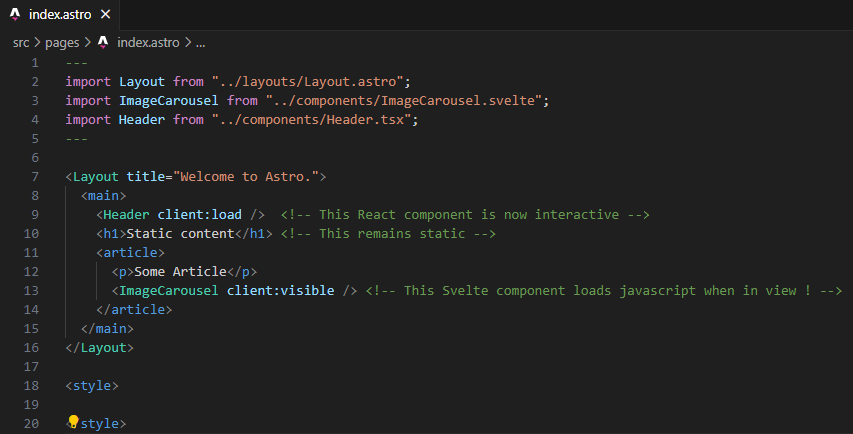

## Introduction

Many modern websites are complicated and slow due to too much JavaScript and complicated tools. Astro is the new kid on the block, designed with performance in mind. By loading pages on the server first and introducing Astro Islands, it not only increases performance but also search engine ranking (SEO).

## Brief history

Astro was created by Fred Schott and Nate Moore back in 2021, and version 1 was released in 2022. The project has been growing ever since.

## Main Feutures

### Server side rendering

Astro's big feature is that it builds web pages using only HTML and CSS, without JavaScript. Components that need interactivity are instead hydrated on the client after the page is delivered to the user. This greatly increases performance and overall user experience. In short, the page is first loaded using only HTML and CSS. If a component on the page needs JavaScript, Astro then only adds JavaScript to that part of the page, instead of the whole page.

### Astro islands

Astro Islands is a concept where components that need to be interactivity are split into their own "island". Each island can work independently. For example, if you want an image carousel and a header on the same page without impacting each other's performance, you need to tell Astro how the JavaScript should be loaded. You can instruct Astro to load the JavaScript for the carousel until it's in view, While the header can have its Javascript loaded after the rest of the page is loaded. This keeps your page light and fast while improving both UX and SEO.

### Framework components

Astro lets you mix your favorite tools like React, Svelte, Vue, and many more on the same page! For example, if you prefer to make headers in React and carousels in Svelte, Astro has no issues loading both on the same page. This is possible because each component is independent.

## Strengths

- Fast Performance: By focusing on server-side rendering (SSR), Astro makes the page load quickly, which also improves user experience and SEO.

- Flexible: Use your favorite UI frameworks and design tools, letting you pick the right tool for each problem.

- Partial hydration: Astro takes the components you create and turns them into regular HTML before your website is presented to the user. This means that when a user visits your site, they don't have to wait for complex calculations or JavaScript to run before they can start browsing. Instead, they get a fast, ready-to-use page right away. Then, Astro adds interactivity to only those parts of the page that need it, by downloading the necessary JavaScript and setting up things like click events or other types of interactivity. This method is known as "hydration" and it makes your site load quickly while still allowing all the dynamic features you've built into your components.

## Weaknesses

- Smaller Community: This will, of course, change in the future, but currently, being new means fewer resources and a smaller community compared to older frameworks.

- Learning Curve: New ideas like partial hydration and "Islands" might take some time to fully understand and get used to.

## Summary

Astro is a fresh new addition to web development, focusing on speed, flexibility, and better user experience. While it is relatively new, it will be exciting to see how it evolves in the future. As the community grows, I anticipate it will become an even stronger tool. Astro presents an intriguing option for developers. However, it raises the question: do we really need another framework in web development, or do the constant additions of new frameworks highlight underlying problems with JavaScript and today's web development practices? Something to think about!

### References

https://blog.logrocket.com/astro-adoption-guide/
https://docs.astro.build/en/getting-started/
https://medium.com/@Adele_michael/advantages-of-using-astro-framework-980f30e50b81
https://solutionshub.epam.com/blog/post/what-is-server-side-rendering
https://7.dev/how-astro-compares-to-next-js-for-react-apps/
https://en.wikipedia.org/wiki/Hydration_(web_development)
