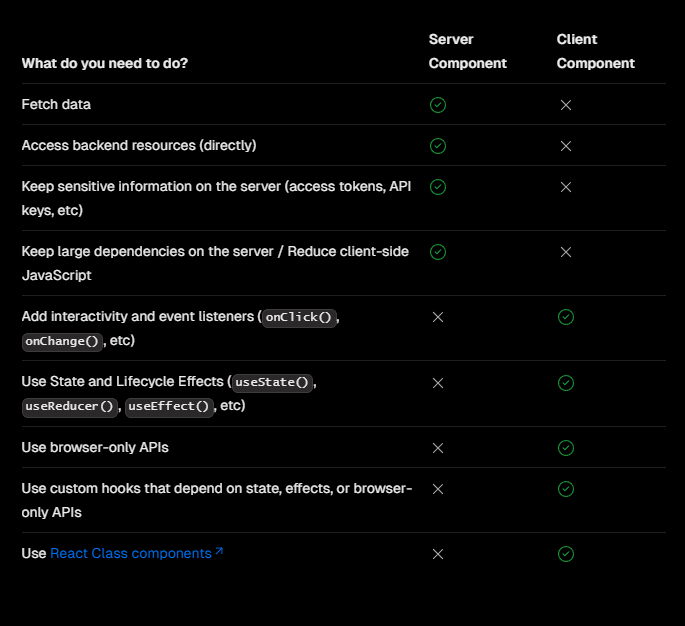
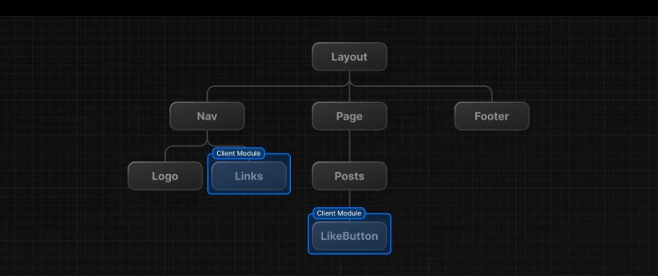

## Introduction

One of the core decisions web developers must make is where to implement logic and rendering in their application. This can be difficult because there are so many ways to build a website.
Rendering converts the code you write into user interfaces. React and Next.js allow you to create hybrid web applications where parts of your code can be rendered on the server or the client. In Next.js, you can choose where you want your components to be rendered: on the server side or on the client side. This study will help you understand the differences between these rendering environments, strategies, and runtimes.

### What are these?

Simply put, both are React components, but the difference lies in where
they are rendered.

**The client** refers to the browser on a user’s device that sends a request to a server for your application code. It then turns the response it receives from the server into an interface the user can interact with.
**The server** refers to the computer in a data center that stores your application code, receives requests from a client, does some computation, and sends back an appropriate response.

## Client-side rendering (or browser rendering)

Traditionally, when building a React single page application (SPA), all of the components are client components.

Client-side rendering happens when a user requests a webpage. The server sends the pre-rendered HTML document and JavaScript code, that enchances the page with interactive features. The browser then downloads and executes the JavaScript code, which leads to the rendering of components and, finally, the display of the webpage. When the application is first loaded, the user may notice a slight delay before they can see the full page, this is because the page isn't fully rendered until all the JavaScript is downloaded, parsed, and executed. After the page has been loaded for the first time, navigating to other pages on the same website is typically faster, as only necessary data needs to be fetched, and JavaScript can re-render parts of the page without requiring a full page refresh.

### Advantages and disadvantages of using client-side components

**Pros:**

**Interactivity:** Client Components can use state, effects, and event listeners, meaning they can provide immediate feedback to the user and update the UI.
**Browser APIs:** Client Components have access to browser APIs, like geolocation or localStorage.

**Cons:**

The primary downside to client-side rendering is that the amount of JavaScript required tends to grow as an application grows, which can impact a page's INP ('Interaction to Next Paint'). This becomes especially difficult with the addition of new JavaScript libraries, polyfills, and third-party code, which compete for processing power and must often be processed before a page's content can render. Another disadvantage are poor Search Engine Optimization (SEO) , as crawlers have hard time crawling client rendered content.

_How to use client-side components in Next.js_

Making a component render on the client side is as simple as adding the following line **to the top of the file** that you want to make client component.

```jsx
'use client'
```

## Server-side rendering

Server-side rendering generates the full HTML for a page on the server in response to navigation. This avoids additional round trips for data fetching and templating on the client, because the renderer handles them before the browser gets a response. When a user requests a page, the Next.js server can either generate the HTML dynamically (for SSR) or serve pre-built static HTML (for SSG). This process ensures that the user gets a fast and efficient initial load. When it comes to data-fetching from a server component, you can reduce the code and complexity of your application. You have direct access to ORMs and databases, and you can use server-side rendering (SSR) to improve SEO.

In previous versions of Next.js, specifically versions before 13, we faced a
limitation where server-side rendering was restricted to individual
pages. This meant that only the route pages like "/", "/about", "/projects",
and so on could be rendered on the server side. This limitation led to challenges such as prop drilling and duplication of
API calls when passing data to lower-level components.

### Advantages and disadvantages of using server-side components

**Pros:**

**Efficient utilisation of server resources:** Fetch data and access all backend resources while rendering in server with less latency, and can be directly displayed to client reducing loading time.
**SEO Friendliness:** Search engines favor pages with well-structured HTML content. Since SSR provides pre-rendered HTML, it enhances the SEO of Next.js applications, making them more discoverable by search engines.
**Maintainability and Consistency:** With SSR, you can centralize data fetching and processing logic on the server, promoting a cleaner and more maintainable codebase. This approach ensures consistency between server-rendered content and client-rendered content.
**Security:** Safe to use API key within server components.

**Cons**

When it comes to interactivity, server components can be slower and less interactive than client components. You also can only use React hooks from a client component.

_How to use server-side components in Next.js_

By default, Next.js uses Server Components. This allows you to automatically implement server rendering with no additional configuration, and you can opt into using Client Components when needed.

## When To Use Which

It can be confusing on when to use which, so there is a chart from official Next.js docs:



If you are just fetching some data or need access to backend resources directly, you can usually keep it as a server component. Obviously if you have sensitive data like api keys, you should keep it as a server component, otherwise you risk exposing your keys to the client.

However if you want to add events and hooks and make the component interactive, you should use a client component.

## Network Boundary

In Next.js, there is a network boundary between server and client components. You can choose where this boundary is in your component tree. For example, you can fetch data and render a user's posts on the server (using Server Components), but then render the LikeButton for each post on the client (using Client Components). The reason for this is because the like button is interactive and will use events and maybe some hooks and needs to be rendered on the client.

Similarly, you can create a Nav component that's rendered on the server and shared across pages, but if you want to show an active state for links, you can render the list of Links on the client.



Behind the scenes, the components are divided into two groups: server components and client components. After the server components are rendered, the server sends a special data package called the `React Server Component Payload` (RSC) to the client. This package includes:

- The output of the server-rendered components.
- Placeholders indicating where the client components should go, along with references to their JavaScript files.

React then uses this data to combine the server and client components and update the webpage in the browser.

One misconception is that 'use client' is Client Side only. That's not really the case. 'use client' is a hint to the the bundler, that the module has to be part of the JavaScript that is sent to the client. Server Components, never share their JavaScript with the client.

## Conclusion

use-client and use-server aren't just directives; they are powerful tools for Next.js developers. By understanding their individual strengths and using them strategically, you can create applications that excel in performance, SEO, and user experience. Remember, the key lies in finding the right balance and tapping into the full range of rendering possibilities that Next.js 14 offers.

From use-client & use-server in next Js 14 to mastering the rendering game with Next.js 14, What’s New, What’s the Difference, and Why Does It Matter? is an exciting journey, full of twists and turns that unlock incredible possibilities.

_Resource links:_

- https://dev.to/oktadev/nextjs-in-a-nutshell-5dj1
- https://web.dev/articles/rendering-on-the-web
- https://nextjs.org/docs/app/building-your-application/rendering
- https://medium.com/@markminj/understanding-ssr-in-next-js-and-its-benefits-e54ffed48294#:~:text=Server%2DSide%20Rendering%20in%20Next,deliver%20a%20superior%20user%20experience.
- https://www.linearloop.io/blog/nextjs-use-client-vs-use-Server
- https://www.traversymedia.com/nextjs-from-scratch
