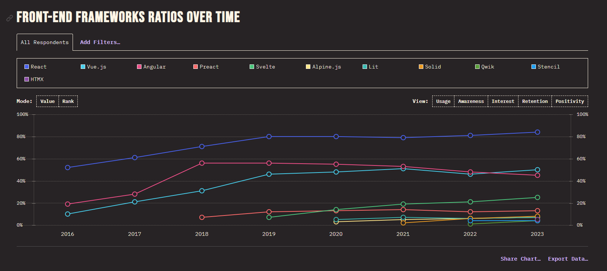

## Introduction


> Vue (pronounced /vjuː/, like view) is a JavaScript framework for building user interfaces.
> It builds on top of standard HTML, CSS, and JavaScript and provides a declarative, component-based programming model that helps you efficiently develop user interfaces of any complexity.

Given that you have experience with the previously mentioned frontend languages, it is fairly easy for beginners to learn Vue.
Vue is a "progressive" framework, it means it could be progressively learnt and adopted:

> Vue is a framework and ecosystem that covers most of the common features needed in frontend development.
> But the web is extremely diverse - the things we build on the web may vary drastically in form and scale.
> With that in mind, Vue is designed to be flexible and incrementally adoptable.

`(#1)` Vue is one of the most used framework based on the "State of Javascript 2023 survey" and his usage is growing.

[Reference](https://share.stateofjs.com/share/prerendered?localeId=en-US&surveyId=state_of_js&editionId=js2023&blockId=front_end_frameworks_ratios&params=&sectionId=libraries&subSectionId=front_end_frameworks)

## Brief History

Vue was created by Evan You, a Google software engineer, in 2013 and had its official release in 2014.
The name derives from the French word vue, meaning view.
He had previously worked on several large-scale projects using other popular frameworks, but found that they often came with a steep learning curve and a lot of overhead that was not necessary for smaller projects.

Evan wanted to create a framework that was easy to understand and use, yet still powerful enough to handle complex applications.
He was inspired by the simplicity and elegance of React's component-based architecture and Angular's two-way data binding, and set out to create a framework that combined the best of both worlds.

### Major event timeline

- **2013:** Version 0.6 In December Evan You created the first version of Vue.
- **2014:** Version 0.8 First public release.
- **2015:** Version 1.0 was released, which featured a virtual DOM and improved performance. Starting to gain popularity. Chinese tech giants Alibaba and Xiamoi are now using Vue.
- **2016:** Version 2.0 was released, which introduced significant performance improvements, better TypeScript support, and a new syntax for components.
- **2020:** Version 3.0 was released `(#2)`, which introduced several new features and performance improvements over the previous version. Vue 2 remains the default version. Estimated over 6 million weekly downloads from npm.
- **2021:** Version 3.2 was released, which introduced many significant new features and performance improvements.
- **2022:** Vue 3 is now the new default version.
- **2023.05:** Version 3.3 was released and it is focused on developer experience improvements - in particular, Single File Component (SFC) `<script setup>` usage with TypeScript.
- **2023.12:** Version 3.4 was released, which introduced some substantial internal improvements.
- **2023.12** Vue 2 reach End of Life (EOL) on December 31st, 2023.

`(#2)` Vue 3 has been rewritten in Typescript and includes many changes and improvements. The most important are:

- New Composition Api
- Teleport
- Allows multiple root elements
- Filters are removed
- Lazy loading with Suspense
- State-driven CSS variables
- Single file component (SFC) `<style scoped>`

## Main Features

| Feature              | Description                                                                                                                                                                |
| :------------------- | :------------------------------------------------------------------------------------------------------------------------------------------------------------------------- |
| Virtual DOM          | Virtual representation of the DOM tree, a copy of the real DOM, that is compared whenever a change is made and updates the UI accordingly, resulting in better performance |
| Data Binding         | Manipulates/assign values to HTML attributes, change style or assign classes etc.                                                                                          |
| Components           | Create custom reusable HTML elements                                                                                                                                       |
| Event Handling       | Event listeners                                                                                                                                                            |
| Animation/Transition | Built-in wrappers and/or third party libraries for transition effects                                                                                                      |
| Computed Properties  | Listens to changes made to UI elements and performs necessary calculations without additional coding                                                                       |
| Templates            | Compiles templates into virtual DOM render functions                                                                                                                       |
| Directives           | Built-in directives such as: `v-if`, `v-else`, `v-show`, `v-on`, `v-bind`, and `v-model`                                                                                   |
| JSX/TSX              | Built-in support for `JSX`, developer can choose between `TSX` and `HTML templates`.                                                                                       |
| Watchers             | Applied to changing data such as form inputs. Data handling is taken care of by a watcher                                                                                  |
| Routing              | `Vue-router` helps with navigation between pages                                                                                                                           |
| State management     | Built-in state management `Pinia`, developed by the Vue team. NB. `Vuex` as been abandoned.                                                                                |
| Web components       | Built-in support to create web-components and hence design systems                                                                                                         |
| Lightweight          | Light and fast performing                                                                                                                                                  |

## Market Comparison

### Vue vs React

We compare Vue to React, the most used framework to highlight why Vue is a good choice to build modern applications.

|                               |                                                         Vue                                                         |                                                               React                                                               | Notes |
| :---------------------------- | :-----------------------------------------------------------------------------------------------------------------: | :-------------------------------------------------------------------------------------------------------------------------------: | ----: |
| Type                          |                                                      Framework                                                      |                                                              Library                                                              |       |
| Learning curve                |                                                Easy, and Progressive                                                |                                           Medium steep, many 3rd party packages to know                                           |       |
| Router                        |                                   Yes<br/>[Reference](https://router.vuejs.org/)                                    |                                               No<br/>A 3rd party package is needed                                                |       |
| State manager                 |                  Yes, `Pinia`<br/>[Reference](https://vuejs.org/guide/scaling-up/state-management)                  |                                               No<br/>A 3rd party package is needed                                                |       |
| Typescript support            |                                        Yes<br/>Vue is built with Typescript                                         |                   Partial<br/>React is built with Javascript,<br/>and requires extra care for typescript types.                   |       |
| Signals support               | Yes<br/>Via shallow <br/>[Reference](https://vuejs.org/guide/extras/reactivity-in-depth.html#connection-to-signals) |                      No<br/>[Reference](https://blog.axlight.com/posts/why-you-dont-need-signals-in-react/)                       |       |
| HTML-based template syntax    |                    Yes<br/>[Reference](https://vuejs.org/guide/essentials/template-syntax.html)                     |                                                                No                                                                 |       |
| JSX/TSX                       |                                                         Yes                                                         |                                                                Yes                                                                |       |
| Web components                |                     Yes. From 3.2 (2021)<br/>[Reference](https://blog.vuejs.org/posts/vue-3-2)                      | Not yet<br/>From React 19 (still in Beta)<br/>[Reference](https://react.dev/blog/2024/04/25/react-19#support-for-custom-elements) |       |
| Two-ways binding              |                                                         Yes                                                         |                                                                No                                                                 |       |
| Multiple component parameters |                                           Yes<br/>Via multiple “v-model”                                            |                                                       Yes<br/>Via “params”                                                        |       |
| Unit testing                  |                                                     Vitest/Jest                                                     |                                                               Jest                                                                |       |

### Html template vs JSX

Vue 3 allows the developer to choose between `JSX` and `HTML Templates`.
Html templates allow to separate HTML, js and CSS, which makes it easier for beginners to learn Vue.
This resembles a vanilla based approach to making UI.
React - on the other hand - allows the developer only to use JSX, which means that HTML and CSS are used in the same file.

### Installation Tools

React uses `create-react-app` and Vue uses `create-vue`.
Both can be used via CDN.
The Vue creator has also started the `Vite` project.
Vite is a "Next Generation Frontend Tooling" that can replace Webpack, Rollup and Parcel, being faster.

### Popularity

React is more popular than Vue.
The job opportunity with React is more than Vue.
There is a big name behind React i.e. Facebook which makes it more popular.
However - as shown by `(#1)` - we notice an increment over time of Vue and related job market.

### Pros

- **Usage:** Vue is one of the most used and loved frameworks available.
- **Small in size:** The framework is only 18kb and is fast to install.
- **Typescript:** The framework is written in Typescript and then the support comes out of the box.
- **Performance:** Using a virtual DOM, page rendering is pretty quick and thus improves the application's overall performance.
- **Data-binding:** Two-way databinding allows for a component class to share data between itself and its template.
- **JSX support:** Supporting JSX allows React developers to reuse their knowledge, simplifying the migration to Vue.
- **Vue is a Framework:** Being a Framework it means it includes all the tools/packages a modern SPA requires nowadays. No external dependency - and relate maintenance hell.
- **Light learning curve:** All you need to know is basic HTML, CSS and Javascript.
- **Community support:** Vue has a pretty active community on Discord chat and forum.
- **Documentation:** Vue has a pretty good documentation.

### Cons

- **Lack of real example in documentation:** The documentation doesn't show working code examples, but it's only focused ont he explanations.
- **Vue 2/Vue 3 confusion:** As Vue supports two different ways to write components, the online examples could be confusing.
- **Too much flexibility:** Flexibility is nice, but in big projects can drive to confusion. Over-flexibility can over-complicate a project and lead to more errors and lack of shared patterns within the code.
- **Lack of 3rd party libraries:** Vue lacks the support and popularity of other major frameworks, like React and Angular.

## Code comparison

### Vue

```typescript
<script lang="ts">
import { defineComponent } from 'vue'

type ToDoItem = {
  userId: number
  id: number
  title: string
  completed: boolean
}

export default defineComponent({
  data() {
    return {
      todos: [] as ToDoItem[]
    }
  },
  methods: {
    async fetchData() {
      const response = await fetch('https://jsonplaceholder.typicode.com/todos')
      const data: ToDoItem[] = await response.json()
      this.todos = data
    }
  },
  mounted() {
    this.fetchData()
  }
})
</script>
```

### React

```typescript
import { useState, useEffect } from "react";

type ToDoItem = {
  userId: number;
  id: number;
  title: string;
  completed: boolean;
};

const CallApi = () => {
  const [todos, setTodos] = useState<ToDoItem[]>([]);

  const fetchData = async () => {
    const response = await fetch("https://jsonplaceholder.typicode.com/todos");
    const data: ToDoItem[] = await response.json();
    setTodos(data);
  };

  useEffect(() => {
    fetchData();
  }, []);

  return (
    <>
      <h1>Call API</h1>
      <button onClick={fetchData}>Call</button>

      {todos.map((todo) => {
        return <p key={todo.id}>{todo.title}</p>;
      })}
    </>
  );
};

export default CallApi;
```

## Getting Started

```shell
npm init vue@latest
```

### Vue from CDN

```html
<script src="https://unpkg.com/vue@3/dist/vue.global.js"></script>
```

## Conclusion

Vue is a lightweight framework that is easier for beginners to master.
It has some powerful features such as the virtual DOM, data-binding etc.
Vue has taken the good parts from Angular and React and has built a powerful library, and it has reached Angular and React levels of popularity.
Vue is a developing framework and thus still a work in progress, introducing many new functionalities over time.
Within Vue 3 and its developed ecosystem, there is no doubt it can be a good candidate to build complex projects.

## References

- [Wikipedia](https://en.wikipedia.org/wiki/Vue.js)
- [Vue Documentary](https://www.youtube.com/watch?v=OrxmtDw4pVI)
- [Tutorialspoint](https://www.tutorialspoint.com/vuejs/vuejs_overview.htm)
- [Altexsoft](https://www.altexsoft.com/blog/engineering/pros-and-cons-of-vue-js/)
- [Monterail](https://www.monterail.com/blog/vue-vs-react)
- [Naturaily](https://naturaily.com/blog/pros-cons-vue-js)

## Additional Resources

- [Official Website](https://vuejs.org/)
- [Vue 3 Migration Guide](https://v3-migration.vuejs.org/)
- [The Official Vue blog](https://blog.vuejs.org/)
