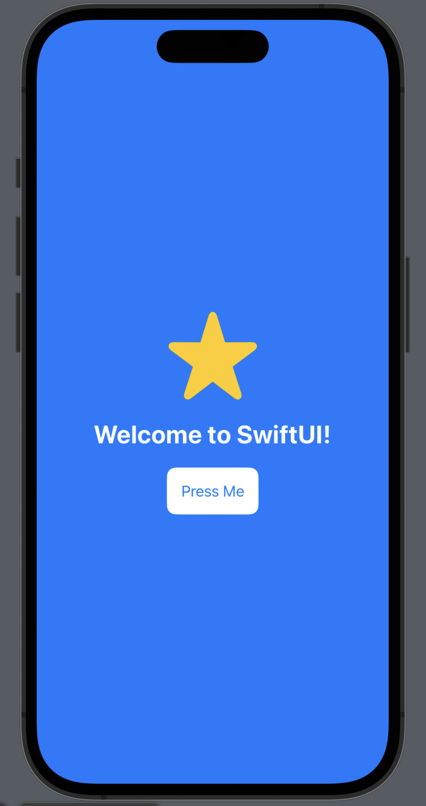

## Introduction


SwiftUI is a modern user interface framework introduced by Apple for building applications across the Apple ecosystem—iOS, macOS, watchOS, and tvOS. It adopts a declarative approach - similar to frameworks like React, allowing developers to describe the UI and let the framework handle the transitions. SwiftUI makes it easier to create consistent, beautiful user experiences with minimal code, thanks to its tight integration with Xcode and Swift.

The approach of SwiftUI allow developers to build complex UI using simple syntax. In Xcode there is a live preview that developers easy can iterate quickly, making it a powerful framework building small and large-scale applications for Apple devices.

## Brief History

- 2014: Swift programming language is publicly announced at WWDC.

- 2019: Introduction of SwiftUI as a declarative UI tool.

- 2020: SwiftUI 2.0 was released. Expanding to include additional modifierts, new layout and widgets. Also Apple added support for maps with the Map view. MapKitt allows for map annotation and atellite imagery (announced at WWDC (Worldwide Developers Confrence)).

- 2021: SwiftUI 3.0 was released. Better integrations for macOS and watchOS alon with support for asynchrous programming via Swifts´s concurrency model (async/await). Also Apple added Canvas element, adding support for immediat mode drawing and performant 2D drawing (WWDC).

- 2022: Apple relesed Swift Charts, a framework for making customizable and accessible charts (like navigation views) (WWDC).

- 2023: Apple announced the Apple Vision Pro, and support for devices ´was added to SwiftUI. New views for AR such as RealityView and ImmersiveSpace was also announced (WWDC).

- 2024: Apple continuous in updating their SwiftUI framework. MeshGradient, zoom transition, custom container views and framework foundations is some of the features (WWDC).

## Main Features

SwiftUI has several features that make it a compelling framework for building applications within the Apple ecosystem. Some of them are:

**Declarative Syntax:**
The SwiftUI is similar to React or Svelte (components). Developers uses a declareative syntax meaning you could just state what your user interface should do. In a way you could describe how the UI should looke like in a particular state. For an example look at this code cnippet:

```swift
import SwiftUI

struct ContentView: View {
    var body: some View {
        ZStack {
            // Background color for the ZStack
            Color.blue
                .ignoresSafeArea()

            VStack(spacing: 20) {
                // Image within the VStack
                Image(systemName: "star.fill")
                    .resizable()
                    .frame(width: 100, height: 100)
                    .foregroundColor(.yellow)

                // Text within the VStack
                Text("Welcome to SwiftUI!")
                    .font(.title)
                    .fontWeight(.bold)
                    .foregroundColor(.white)

                HStack(spacing: 10) {
                    // Button within the HStack
                    Button(action: {
                        print("Button Pressed")
                    }) {
                        Text("Press Me")
                            .padding()
                            .background(Color.white)
                            .foregroundColor(.blue)
                            .cornerRadius(10)
                    }
                }
            }
        }
    }
}
```

```swift
#Preview {
        ContentView()
}
```

The outcome would look like this in "live preview" inside Xcode:


In this code we got a ContentView. This is a way SwiftUI make it´s magic. You simply just write what you want to be on the screen. In my example I got an Zstack, that is layer stack, and I tell that to have a background color of blue. inside the ZStack there is a VStack. That is a Vertical Stack, meaning it is a container for vertical content. Inside the CStack there is an image ans a text (vertically alligned) and after those there are HStack (Horizontally Stack). The HStack includes a button with text and styling.

**Cross-Platform Support:**
A developer could just write once, and then it works on iOS, macOS, watchOS, tvOS. It is a big plus for Apple´s ecosystem. However SwiftUI only works on Apple devices. There are some online editors out there, but to get the full potential of SwiftUI, Apple is the way to go.

**Live Preview:**
In Xcode, the live preview feature allows developers to instantly see the effects of their code changes in real time without having to build and run the entire application. This feature is part of SwiftUI and makes use of Xcode Previews to visually update the interface alongside your code editor. You can make changes to the UI, add new views, or adjust layout properties, and see how these modifications look immediately. This capability helps developers rapidly iterate on their designs and catch UI bugs early, providing a more efficient and interactive development experience.

**State Management:**
In SwiftUI, state management is essential for handling and maintaining the current state of user interfaces in an efficient and declarative manner. Using property wrappers like @State, @Binding, and @ObservedObject, developers can create, share, and respond to changes in UI state seamlessly. @State is used for managing local state within a view, while @Binding allows for sharing state between parent and child views. For more complex cases, @ObservedObject and @EnvironmentObject are used for handling data that needs to be shared more broadly. This approach keeps the UI synchronized with data changes, resulting in a dynamic, reactive application. You can read more about managing state in SwiftUI

**Native Performance:**

_AppKit_

    AppKit is the framework used for building macOS applications. It’s a collection of tools and components that help developers create the user interface for desktop applications—things like buttons, menus, and windows. SwiftUI can integrate with AppKit by using NSViewRepresentable and NSViewControllerRepresentable to include AppKit components inside a SwiftUI layout. This means that if there’s something specific that SwiftUI can't do on its own, you can still use AppKit features to complete your app (AppKit Integration).

_UIKit_

    UIKit is the framework used for building apps for iOS and iPadOS. It provides all the basic building blocks for creating apps on iPhones and iPads, like buttons, labels, lists, and more. SwiftUI can use UIViewRepresentable and UIViewControllerRepresentable to bring UIKit views and controllers into a SwiftUI app. This is really useful if you have older UIKit code or if there are certain features that SwiftUI doesn’t have yet but UIKit does (UIKit Integration).

_WatchKit_

WatchKit is the framework used to create apps for the Apple Watch. It helps developers build the small, glanceable interfaces that work best on the watch screen. SwiftUI can work alongside WatchKit by including WatchKit components into SwiftUI apps through the WKInterfaceObjectRepresentable protocol. This means that even when building apps for Apple Watch, you can combine both SwiftUI and WatchKit to make sure all the special features and capabilities are covered (WatchKit Integration).

_Technology-Specific Views_

    Technology-specific views are parts of SwiftUI that are designed specifically for certain Apple platforms. These views are tailored to make the most of what each device can do. For example, macOS might have features like NSView, while watchOS might use WKInterfaceObject. This helps developers create platform-appropriate experiences and ensures that their apps look and work well on every Apple device, even if the capabilities of each device are a bit different (Technology-Specific Views).

So to get the max out of SwiftUI, a developer can use:

- AppKit to add traditional macOS components.
- UIKit to include iOS and iPadOS components.
- WatchKit for Apple Watch interfaces.
- Technology-specific views to make the most out of device-specific features.

This allows SwiftUI to interact smoothly with other parts of Apple's ecosystem, giving developers the ability to leverage the best features from older, established frameworks while building their user interfaces in a modern, consistent way.

## How it works

SwiftUI works by combining view modifiers and state management to create dynamic user interfaces efficiently.

**View Modifiers**

In SwiftUI, view modifiers are a crutial part of how you customize the appearance and behavior of views. A view modifier is essentially a function that returns a modified version of the original view, allowing developers to chain multiple modifications in a clean and readable way. For example, if you want to add padding, change the background color, or round the corners of a view, you can do all of that using view modifiers. Here’s a simple example:

```swift
Text("Hello, SwiftUI!")
    .padding()
    .background(Color.blue)
    .cornerRadius(10)
```

In this snippet, the view modifiers .padding(), .background(Color.blue), and .cornerRadius(10) are applied to a Text view to adjust its style. The use of these modifiers allows developers to layer changes to a view without creating deeply nested code, resulting in a more readable and maintainable structure. Modifiers help make SwiftUI incredibly expressive, which is key in maintaining declarative UI principles.

**State Management**

State management in SwiftUI allows developers to control the flow of data and how the UI responds when this data changes. It is implemented using property wrappers that ensure the interface remains synchronized with the underlying data:

    @State: This is used for local, mutable state within a view. When the value of a @State property changes, the UI automatically updates to reflect the change. It's great for managing small state changes, like button taps or toggling switches.

```swift
    @State private var isOn: Bool = false

    var body: some View {
        Toggle("Switch", isOn: $isOn)
    }
```

    @Binding: Used for passing data between parent and child views. With @Binding, you can share the same state between multiple views, ensuring they stay in sync. If the value changes in one view, all views reflecting that state update automatically.

    @ObservedObject and @EnvironmentObject: These wrappers are used for more complex or shared data models. @ObservedObject is used for managing objects that can be shared across multiple views, while @EnvironmentObject is particularly useful for global app state that many views need to access.

In combination, view modifiers and state management make SwiftUI a powerful tool for building responsive user interfaces with less boilerplate code. The declarative syntax means that rather than explicitly instructing how to update the UI, you simply describe what the UI should look like in each state, and SwiftUI takes care of updating the view whenever the data changes.

Together, these components allow SwiftUI to offer a streamlined and intuitive approach to building user interfaces, making it possible to focus on the declarative flow of data rather than the intricacies of UI state handling. This results in apps that are responsive, easy to maintain, and have a consistent user experience.

## Getting Started

Here are the main steps to start a SwiftUI projects

Before you begin, make sure you have Xcode installed on your mac os system.

**Step 1: Create a new Xcode project**
To create a new project, open your Xcode program and "create new project"

**Step 2: Navigate to the project directory**
Choose for witch platform you want to build. IOS, WatchOS, App Playground etc.

**Step 3: Start coding**
Start coding and you can always see your changes in the "simulator".

## Conclusion

## References

- [Apple Developer Site](https://developer.apple.com/swift/)
- [Apple Developer Documentation](https://developer.apple.com/documentation/swift)
- [Swift GitHub](https://github.com/swiftlang/swift)
- [SwiftUI vs React Native](https://blog.devteam.space/swiftui-vs-react-native/)
- [SwiftUI vs Angular Comparison](https://www.cuelogic.com/blog/angular-vs-swiftui)
- [History of SwiftUI](<https://en.wikipedia.org/wiki/Swift_(programming_language)>)
- [Next.js and SvelteKit Comparisons](https://blog.logrocket.com/next-js-vs-sveltekit/)

## Additional Resources

- [Chat GPT](https://chat.openai.com/)
- [Interview with Chris Lattner](https://www.youtube.com/watch?v=ovYbgbrQ-v8)
