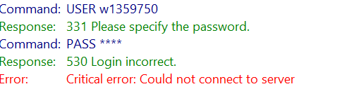
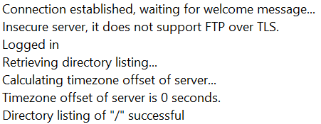

## Introduction

FTP, or "File Transfer Protocol" is in short a way to move files from one server over to another. FTP is one of the oldest protocols in internet history and have largely been replaced by newer technologies (SFTP, FTPS). None the less it has been a vital part of internett history, and it is the technology i have used to migrate my latest project, wich i will delve deeper in to. The FTP i have the most experience with is FileZilla, so that is the one i will use as an example for the most part.

## Brief History

- FTP was first introduced in 1971 by Abhay Bhushan. The initial focus was to transfer files between ARPANET nodes, (ARPANET was a precursor to the internet), and sharing files and information between mainframe computers and research stations.

- In 1985 FTP was defined into it's longest lasting form. Several features were introduced, and among them were:

1. Separate control and data channels for communication.
2. An active and passive mode for file transfer.
3. support for more types of files and format.

- During the 80's and 90's, FTP were the main and most used method of file transfer on the internet. FTP also evolved to be more user-friendly, meaning it took less technical skill to make use of.

- From the 2000's and onwards the use of FTP started to decline. the main reason was a lack of encryption, making the method vulnerable to security leaks.

- Https Became the new standard, and in the later years cloud storage like Google Drive, Dropbox and OneDrive became more common.

- By 2010 many of the big browsers (Chrome and Firefox Among others) started phasing out it's support for FTP.

## Main Features

As explain above, the reason and function of an FTP is to move files from one server to another. I have stated that i will focus on FileZilla, a program that supports FTP and SFTP.

To get the gist of FileZilla, it's an open-source initiative called The FileZilla Project. It was firstreleased in 2001, and it's an easy to use, drag and drop FTP client. The best part from my experience with FileZilla was the way it could easely handle big file transfers, (Up to 4GB). There is nothing worse than spending an hour transferring files and you get an error with 10 files left. This never happened while using FileZilla, and i downloaded and uploaded a LOT of files during my project.

FileZilla supports both FTP and SFTP:

- **FTP:** It's simple and fast, in open and secure networks. Altough it transfers data and credentials in plaintext, making it unsafe on untrusted networks.
  It has also lost support on the big browsers.
- **SFTP:** Secure File Transfer Protocol. It provides encryption, ensuring the safety of your files. It is more common than FTP today, because of it's safety features. The only downside to SFTP is that because of the encryption, file transfers may take a while longer. I have not personally tested the difference between an encrypted transfer and a non encrypted one.

## Market Comparison

To start with my inexperienced opinion, I prefer having my files, docs and folders saved locally, and then to manually move them where i need them to be. Being a windows user i have only bad experiences with using the cloud (Looking at you OneDrive). That might just be becuase microsoft for some reason has set onedrive to be default download directory. But i find it unreliable and tedious. It also propmts you endlessly to buy more cloud storage.

This makes FileZilla great in my opinion. It leaves you and your files alone until you open it, connect to a server and click transfer.

You have of course other similar programs to FileZilla. Some of them are:

- **WinSCP** It's also free, but windows only. I tried this one out, but to me it offered no more than FileZilla, while FileZilla also were more intuitive.
- **Cyberduck** Commonly used for Mac, But also supports windows. Another free alternative that supports cloud integration.
- **Transit** A paid alternative. This one i have never tried (because it's paid), but it looks to be more advanced and for the experienced users. It supports SFTP/FTPS and cloud integration. Transit is only supported on MacOS.

To conclude, I started off with FileZilla and stayed with FileZilla. It's not a fantastic super-program that fixes all your problems, but it's beginner-friendly, handles bigger transfers, supports cross-platform and most importantly it's free. There is a paid version where you get cloud support and such, but i never had the need for my work.

It has also been critizized by some for how the installer bundles optional adware, but honestly which open-sorce installer dosen't. Just uncheck the box?

## Getting Started

Starting FileZilla is as easy as it can be. Just:

- Head to their website [FileZilla](https://filezilla-project.org/download.php?type=client)
- Download the client
- Follow the steps in the installer. (Remember to uncheck every additional download)
- Run FileZilla
- Enter Host name, Username and password. You can manually type wich port to use, but FTP defaults to 21 and SFTP to 22.
- Click connect and if the fields above are correct you will get a prompt saying "Connection to server established", and you will in a side-panel see all the available files on the server.

A thing i appreciate with FileZilla is the console since it displays what the client is doing at all times. This makes it easy to see if something has gone wrong, and it is usually good at telling you exactly what has gone wrong.

In the image above i typed the wrong Password. In the next the password is correct.

I also got a warning because i'm using FTP connection, which is as stated not secure.

## Conclusion

FTP is easy but not secure. It is being faced out by the large browsers and is mostly replaced by SFTP. For the user the difference is not that great. In fileZilla you just choose if you want to use a FTP connection or an SFTP. The host must of course support the method you are choosing to link the servers.

For my use it has proved an excellent tool, making transfers, backups and edits really simple.

## References

- [SNL](https://snl.no/FTP)
- [wp-beginner](https://www.wpbeginner.com/showcase/6-best-ftp-clients-for-wordpress-users/)
- [BizBot](https://bizbot.com/blog/10-best-ftp-clients-2024-secure-file-transfer/)
- [RFC](https://www.rfc-editor.org/rfc/rfc114.html)
