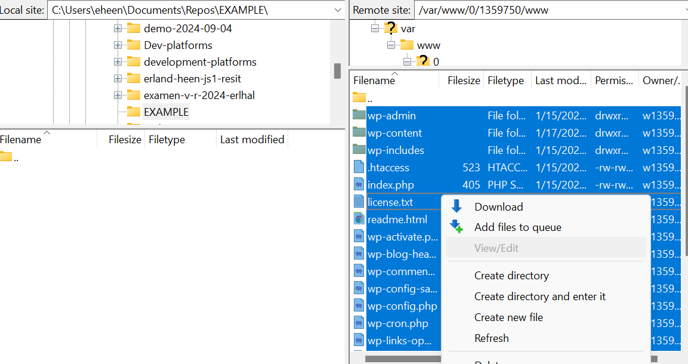

# In this example

I will explain how i used FileZilla ti migrate my WordPress site from one server to another.

## To start

Make Sure you have FileZilla installed and updated. Make your way to where your files are located. In my case i had my files stored with SYSE. I also had them locally of course which you always should have just in case, but for the sake of the process..
Log in to your hosting provider and make your way to the section where your webhost is. In my case it looked like this:


Here you should get all the information you nedd to connect FileZilla to the host.
You should be provided with a Host-name and a username. The password is something you create easely and can update at the control-panel or Cpanel or whatever the provider use. In my case it looked like this:


In the image above you can see that SYSE supports both FTP and SFTP.

In FileZilla, Open the site manager.


Fill in the information provided by your host:


And press Connect.

If connection is Succsessfull you will be met with a side-panel containing all available files from the Webhost. (Note, you will get a warning while using FTP, telling you that your files will be displayed in plain text. You can ignore it, or connect again using SFTP)

After a succsessfull connection FileZilla should look like this:


You can change the display, but for me (Default) i have my local files to my left, connected server to the right and console on the top. You also have to sections on either side. One for navigation (the top one), and one for file/folder management.

Now exactly where your website files belong can vary a bit, but to my knowledge the most common directories are WWW or public_html. With SYSE the correct directory was WWW. Locate the folder and open it. It should then look like this:


Note how i have two www folders. Make your way to the one under your username.

On the left side, make sure you are standing in the directory you want your files to end up. This is where the files will be transfered to. Whan that is done, mark all the files you want to download, right-click and press download. Like this:



This process may take some time. With my connectioen it toke about one and a half hours, but it depends on number of files transferred and your internet connection.

## Next steps, Backup

When all files have been downloaded it is always a good idea to make a copy of the folder containing the files. This is what we call a backup, and will most likely prove extreamly usefull shoul something go wrong. (I have never experienced a computer project that worked on the first try, so make a backup...)
You should also make a backup of your database, but since wordpress uses PHP, you dont need FileZilla for this. Just download the database directly from your providers phpmyadmin page (if supported).

Now that you have your files secured, you can navigate to the new providers controlpanel. In my case my customer were using Go Large Hosting (which was terrible and ancient, altough the costumer support were quick and polite). A problem i faced here was that Go Large used Cpanel, and i was struggeling to find the correct connection credentials. But when in doubt it's always an option to contact costumer service, and in this case they proved quite useful. I can not show pictures from Cpanel, since i would be displaying information belonging to my costumer.

When connected to the new host, make sure to do a backup of theire old files as well. In my opinion it's always good practise to be as cautious as possible when dealing with other peoples property. (i made three backups out of anxiety).

Now as stated before, the most common roots for a web-page were www and public_html. For me it was www, but with go large they had a public_html directory. It looked like this:


## Uploading files

So after you have found the correct directory and done all necessary backups, it's time to upload the new files to the target directory. Before you do this (and assuming you have taken backups) you must remove the old files from the directory. as before, mark all files you want to remove, right click and press delete.


Now head to the left panel and locate the directory containing the new files. When found make sure your target directory is the correct one and empty, mark your new local files, right-click and press upload. It should look like this:


Now, in the example above the server directory was not empty because it is my actual costumer's files. Also, you can uploud one and one file should you wish to make smaller changes.

Let's say i wanted to update my wp-config.php file (which is something you have to do when migrating a wordpress site). It needs to be updated because this is the file that links your database to your site. The process would go something like this:

- Locate the oridginal wp-config.php you have locally and make a backup.
- Enter the file using the preferred text editor (VScode for example).
- The section you are looking for is this:

```php
// ** Database settings - You can get this info from your web host ** //
/** The name of the database for WordPress */
define( 'DB_NAME', 'EXAMPLE' );

/** Database username */
define( 'DB_USER', 'EXAMPLE' );

/** Database password */
define( 'DB_PASSWORD', 'EXAMPLE' );

/** Database hostname */
define( 'DB_HOST', 'EXAMPLE' );
```

Here you will have to put in the correct credentials. If your website and database is hosted on the same server you can usually put 'localhost' into DB_HOST.

- When the right credentials are filled in you can save the document and close it.
- Go back to FileZilla and locate where your new wp-config file is, highlight it, and press upload. **(!Always make sure you are uploading to the correct directory!)**


- You may get a prompt asking if you wish to owerwrite. In this case you should only have one wp-config, (and you should have a backup), so it's fine to owerwrite.

To make sure the process have been done correctly, simply type in the domain in your browser. It should take you to your wordpress site. If something went wrong with your wp-config wordpress will tell you. Then you will get a notification saying there was an issue connecting to your database.
If you get a critical error, some of your files may have been corrupted during download or transfer.
For me it has worked to delete the files from the server and uploading them again, but make sure you are uploading all the necassary files.

## Conclusion

The process is fairly simple, but as with all things it can prove challanging the first time you do it. Also it depends on what hosting-service you use. When i tested this method i migrated from PRO ISP to SYSE, which is very similar in practice. This was easy, because all the information you needed was displayed in the same way.
When i moved to my costumers domain however, it was more of a challange.

Go Large Hosting were using Cpanel, and i needed spent more time finding the correct credentials to connect FileZilla to the server, and the information i needed to connect the database to the domain. I ended up contacting support, and made them fing the correct credentials for me.

In the end, as soon as you can connect FileZilla to the server it is simple to navigate, upload and download files. Most modern hosting-services support SFTP aswell, which makes the transfer safer, altough somewhat slower. I will probably continue to use FileZilla for this type of work.
