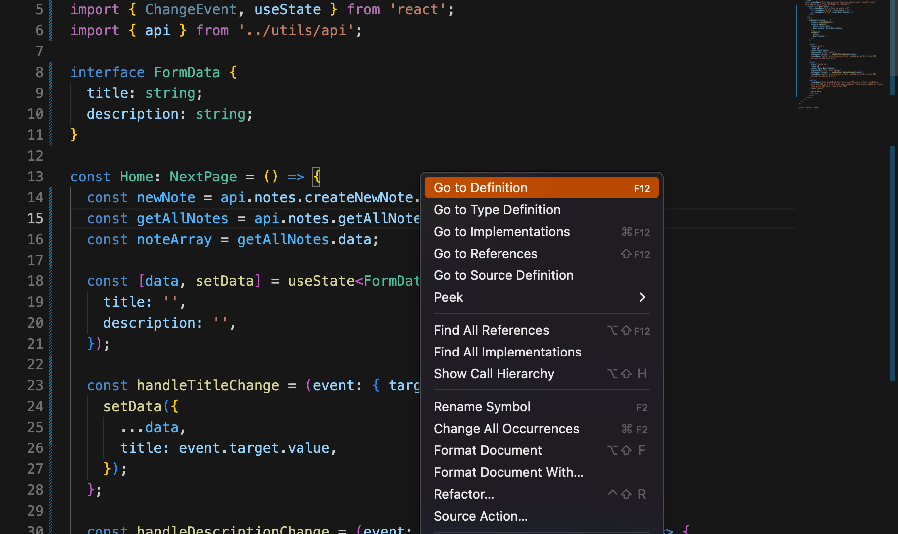

## Introduction

tRPC stands for TypeScript Remote Procedure Call. It's a simple and lightweight library for creating API's using a singular programming language [TypeScript](https://www.typescriptlang.org/), with the option to use a singular respoitory to host both the client and server infrastructure. It operates as a protocol to call your backend functions directly from the frontend, unlike other popular options such as ``GraphQL``.

## Brief History

tRPC was created by [Alex / KATT](https://twitter.com/alexdotjs) and was first released in 2020, with [tRPC/client](https://www.npmjs.com/package/@trpc/client?activeTab=versions) and [tRPC/server](https://www.npmjs.com/package/@trpc/server?activeTab=versions).

Since then there's been many iterations and versions of the product, with its latest version ``10.9.0`` being released 11th of Jan 2022.

Currently its latest versions is seeing around 40k weekly downloads and the repository has a respectable 20k stars on github. The interest in the product have increased recently in social media, and been praised by several prominent ``full-stack`` developers for it's features on how it bridges the gap between front- and backend, seamless workflow and overall ease-of-use in a completely typesafe eco-system.

[Chris Bautista short overview here](https://www.youtube.com/watch?v=2LYM8gf184U&t=665s)

According to the product creator himself, version 9.x should really be viewed as version 1.x, where as the newly released 10.x should be considered version 2.x.

v 10.x brings in performance improvements as well as quality of life enhancements. Some of the changes includes:

- Simplified backend writing of routers and procedures.
- Made client calls to backend procedures more easily defined.
- Allows to seamlessly navigate between client/server code with a single mouse click.
- Simplified the operation of creating complex inference helpers.
- Middlewares are now reusable and chain. 


## Features

One of the most unique features with tRPC is how it brings typesafety between server and client code, and how well its handled. Instead of getting uncaught type-errors on runtime, Typescript will detect type related issues between server and client before the file is even saved. In addition to this, tRPC allows you to quickly update endpoint names in one place and update all associated client/server files at the same time, and navigate between script files by simply ``CMD+click`` or ``right-click+use-definition``. Everything about tRPC is about a tiny footprint, great DX and simplicity of use.

Since tRPC does not rely on schemas or code generation, and rather is a protocol for accessing backend functions to the frontend, it allows a more seamless workflow for the developer, and lightweight well performing application with a tiny footprint for the end user. 

#### Automatic typesafety
While this is a Typescript feature, and not isolated to tRPC it allows for an eco-system where the client will notify you of errors even before you save the files.

#### Great DX
tRPC has no build or compile steps, no code generation, runetime bloat or build step.

#### Framework agnostic
tRPC works will all JavaScript frameworks and runetimes. It's easy to add to already existing projects. 

#### Autocompletion
tRPC is intelligent in the sense that it tries to auto-complete your queries for you based on your entry input.

### Example of use

In the example we're using a T3 app, configured with tRPC, Prisma, MongoDB, Next.js and Typescript. 

      - MongoDB is our database.
      - tRPC is will be used to create our endpoint.
      - Prisma to handle data to our database.

In our front-end, client folder we have defined an endpoint the following way. We're going to take a closer look at how tRPC can be used to tie everything together from backend functions, frontend rendering and an updated database with a new entry, while highlighting some of tRPC's excellent workflow and QoL features.

```tsx 
      import { api } from '../utils.api'; 

      const newNote = api.notes.createNewNote.useMutation();
```

 - ``api`` is the client-side entry point in this use case. Containing our Next.js App-wrapper as well as typesafe react-query hooks.

- ``notes`` is the name given to our ``notesRouter`` in our `` appRouter``.

- Where as, ``createNewNote`` defines the endpoint for handling our ``CREATE`` operations with the procedures we've created on the backend. 



We can easily navigate to it by right-clicking -> ``go to definition`` and it will take us straight to our router function where our procedures are being defined. 


A single router typically contain several procedures. In the case of our ``noteRouter``, it would make sense to have procedures, or endpoints that handles all of your ``CRUD`` operations: 

Read all notes, read a single note defined by ID, create a new note, update note and delete an existing note. In this example, we're specifically going to take a closer look at a ``CREATE`` operation endpoint using tRPC's library. 

- ``createTRPCRouter`` is the function we wrap all of our procedures in in by calling publicProcedure, after our name definition. 

- ``publicProcedure`` can be viewed as the equivalent of a REST-endpoint. 
- Defining a ``publicProcedure`` is the same no matter the operation. i.e queries or mutations. 

 Calling the procedure builder ``input``, which is where we define the content of our endpoint. In this case we're using ``Zod`` for some basic validation and creating a ``title`` and ``description`` keys with the type of string.
 
```ts
      export const noteRouter = createTRPCRouter({
  // Create new note
  createNewNote: publicProcedure
    .input(
      z.object({
        title: z
          .string()
          .min(5, { message: 'Must be 5 characters or longer' })
          .max(20, { message: 'Maximum 20 characters' })
          .trim(),
        description: z
          .string()
          .max(280, { message: 'Maxiumum 280 characters' }),
      })
    )
```

Now that we've defined our ``input`` we can use the procedure builder ``.mutation`` to either alter or create a new instance with those definitions. 

```prisma
model Notes {
  id          String   @id @default(auto()) @map("_id") @db.ObjectId
  title       String
  description String
  createdAt   DateTime @default(now())
  updatedAt   DateTime @updatedAt
}
```

In this use case we're using prisma to easily read or write data to our database, above is the model for our ``Notes``.

```ts
    .mutation(async ({ ctx, input }) => {
      try {
        return await ctx.prisma.notes.create({
          data: {
            title: input.title,
            description: input.description,
          },
        });
      } catch (err) {
        console.log(err);
      }
    }),
```

 In our asyncronous function we call ``context`` and our previously defined ``input`` and call ``ctx.prisma.notes.create`` to a create a new instance on our database where title is that of input.title, and description is that of input.description.

Using the same method as before, we can right click on ``createNewNote`` to take us back to our front-end/client code. 

```tsx
     const newNote = api.notes.createNewNote.useMutation();
```

Where we've called our backend function and stored it in a variable ``newNote``. Within the render code, we've created a simple form, with text input for title and description, and added the following script to run on submit:

```tsx
      <form
          className="ml-5 rounded bg-white p-5"
          onSubmit={(event) => {
            event.preventDefault();
            newNote.mutate({
              title: data.title,
              description: data.description,
            });
            setData({
              title: '',
              description: '',
            });
          }}
        >
```

The repository is configured with a public MongoDB cluster with our prisma model. On submit, the form should now add a new entry to the database with the content of ``title.value`` and ``description.value``. 

[!alt-image](tRPC-media/form-example.png)

A very basic layout render of the form as well as alsready existing notes in the database on the right hand side. Submitting the form should now update the database with a new entry:

[!alt-image](tRPC-media/database-result.png)

## Strengths

#### tRPC is lightweight
Since tRPC is a protocol or method for exposing backend functionality it allows for better performing applications without any code generation or runtime bloat.

Since tRPC uses Typescript, which is a statically typed language, type definitions are checked during compiling rather than runtime, increasing speed of application.

#### tRPC uses Typescript
This can be viewed as both a strenght and a weakness. On one hand, it allows for a uniform coding language and infrastructure between backend and frontend, improving worklflow and communcation between the team. 

While on the other hand, if Typescript is not the preferred programming language, or if team structure is heavily silo'd between front- and backend tRPC might not be the best option.

#### tRPC works great in a monorepo
- Easy to nagivate between code
- better workflow and easier to maintain structure
- Encouraged to do so.

#### Quick development
- Fastest and easiest way to develop an API. 
- Uses type inferference, which means the type of data is automatically detected, which particularly boosts development in the early stages.
- Integrate with IDE's.

## Weaknesses

#### tRPC uses Typescript
- slow compile time
- Only works if the entire development team is comfortable working with Typescript.
- Can be annoying to use in smaller projects

#### Works best in a monorepo
- Not the best solution if your team is silo'd and seperate repo for the API is preferred.

#### Scalability
- In larger scale projects, in a larger team, its often beneficial to come up with a clear set of rules and a schema that everyone can work from. tRPC does not offer this.
- If your app is getting increasingly more complex and require more nuanced requirements, tRPC might not be the best option.


#### 

## Comparison

[Web Dev Simplified](https://www.youtube.com/watch?v=lxnPMB0Jc7E) asks recently in a video if tRPC spells the end to ``REST/graphQL``. While

## Summary

Summarise the content and highlight the relevance of the product to a web developer.

### Credits

- Truls Haakenstad Haugen || [@Menubrea](https://github.com/Menubrea)

#### References

- https://www.npmjs.com/package/@trpc/server?activeTab=versions
- https://www.npmjs.com/package/@trpc/server?activeTab=versions
- https://github.com/trpc
- https://trpc.io/
- https://create.t3.gg/en/usage/trpc
- https://www.youtube.com/watch?v=2LYM8gf184U&t=1s
- https://cleancommit.io/blog/trpc-vs-graphql-how-to-choose-the-best-option-for-your-next-project/
- https://www.youtube.com/watch?v=lxnPMB0Jc7E
https://trpc.io/docs/migrate-from-v9-to-v10#summary-of-changes
