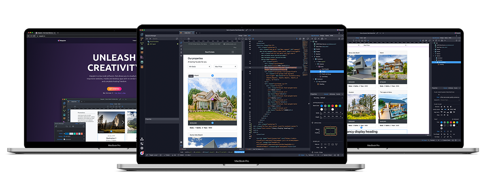

| **Table of contents**                   |
| --------------------------------------- |
| [Introduction](#introduction)           |
| [History](#history)                     |
| [Features](#features)                   |
| [Market comparison](#market-comparison) |
| [Getting started](#getting-started)     |
| [Conclusion](#conclusion)               |
| [References](#references)               |

## Introduction

Wappler is a leading producer og low code, visual productivity tools for creating rich data driven, highly interactive web sites and mobile apps. Wappler is a result of 20 year of development work in the shadows of Adobe, extending their products with great components and plugins.

Wapplers history of innovation started with the launch of a successful international user group. The goal of this community was to share knowledge about Adobe Dreamweaver, that long-known website editor. Because of the enthusiasm of the users this group blossomed and became a network with more than 600,000 users.

It offers great visual design and integration og standard frameworks allowing for full freedom and rich productivity. Wappler supports many frameworks for front-end andd back-end solutions as well as visual design tools and workflow editors.

## History

Oct 2017: Wappler closed beta was released.
Nov 2017: Wappler joined the 2017 Web Summit and was announced for the first time in public.
Jan 2018: One of the first media articles about Wappler is published in the INN'twente Magazine.
Feb 2018: Wappler closed it's crowdfunding campaign reaching 197% of it's initial goal.  
May 2018: Wappler 1.0 is released after months of development at the TNW Conference in Amsterdam.
May 2019: Wappler 2.0 is released with many improvements and new features.
Jan 2020: Wappler was selected among the Top 25 game-changing innovators of the Blue Tulip awards.
Jun 2020: Wappler 3.0 is released loaded with new exciting features like full NodeJS integration, a Visual Database Manager and Bootstrap 4 Theme Manaager.
Jul 2021: Wappler 4.0 is released great features such as a New Modern UI, Stripe Integration, Bootstrap 5 integration, Realtime Data with Websockets and Apple Silicon M1 Native Support.
Jul 2022: Wappler 5.0 released with a newly designed logo and brand identity.

## Features

| Feature                                  | Description                                                                                                                                                                                                                                                                                           |
| ---------------------------------------- | ----------------------------------------------------------------------------------------------------------------------------------------------------------------------------------------------------------------------------------------------------------------------------------------------------- |
| HIGH PERFORMANCE FRONT-END FRAMEWORK     | App Connect is a high performance front-end framework powerful just as React, Angular and VueJS but much easier to use thanks to its custom component structure and visual integration. so no coding is required!                                                                                     |
| EXTENSIVE DATA BINDING DONE VISUALLY     | Add any data directly in your content, populate mighty fast repeat regions, dynamic CSS styling, generate content or toggle areas fully dynamic and data dependent.                                                                                                                                   |
| RICH SET OF COMPONENTS                   | App Connect includes a huge library of component and services available to power every aspect of your dynamic web site or responsive web application. Data Formatting, Session and Cookie Management, Form Validation, Repeat Regions are just a few of the available options.                        |
| SEO FRIENDLY URLS                        | Thanks to Wappler's routing component you can improve the usability and SEO of your site with cleaner, easier to remember and SEO friendly URLs.                                                                                                                                                      |
| Service Discovery and DNS                | To make it easier for services to discover and communicate with each other, regardless of their location within the cluster, K8s gives a unique IP address and DNS name to each service.                                                                                                              |
| POWERFUL BACK-END FRAMEWORK INCLUDED     | Server Connect offers full visual programming without any coding. It includes many server-side workflow components. Connect to your databases, create advanced database queries, send emails, manage files and folders, process images or create login systems fully visual!                          |
| SUPPORT FOR ANY HOSTING AND SERVER MODEL | Server Connect components support PHP, ASP.NET and Classic ASP so you just connect your hosting and you are ready to work.                                                                                                                                                                            |
|                                          |
| SUPPORT FOR ALL MAJOR DATABASES          | Connect to any major database like Microsoft SQL Server, MySQL, PostgreSQL with just a couple of clicks.                                                                                                                                                                                              |
| VISUAL DATABASE QUERY DESIGNER           | The included visual query designer allows you to design your queries and generate SQL queries fully visual. Just select the table, add columns, adjust filtering and sorting options and you are done!                                                                                                |
| API CONNECTIVITY                         | Connect securely to any API Data Source, define API schema visually and use it on your pages. Also you can connect to any OAuth2 compatible service. OAuth2 Connector is available in Server Connect and it includes 18 predefined services.                                                          |
| FULL VERSION CONTROL WITH GIT            | Get in the world of Version Control with the native Git integration in Wappler. With the support of branches and remote repositories, you can easily keep track of different versions of your website or app and publish it to remote sites like GitHub, GitLab, BitBucket or Microsoft Azure DevOps. |
| BUILD MOBILE APPS                        | Cordova Builder allows you to define, generate and build mobile applications. With this awesome tool it's possible to deploy your app build in regular HTML5 and CSS as a mobile app to all of the major mobile platforms.                                                                            |

## Market Comparison

Wappler is one of the leading producers worldwide og low code and visual productivity tools. But there are many others to be considered.

## Getting started

Wappler is a standalone desktop app for Windows, Mac OS and Linux.

### How to get Wappler

After you made your purchase, you can download Wappler from your account page .

Navigate to the Download section on the left and download the version suitable for your OS (Windows, Mac or Linux).

Your download will start automatically.

After your download and instal is finished, a login dialog appear. Click the Login with browser button to continue.

There are two options you can use to log in - using an email address or using community account;

If you select to log in using your email , then a login code will be sent to your email so that you can log in. Here you need to use the same email you used for activating your license/free trial.

If you select to log in using your community account , you need to make sure that you connected it to your purchase.

After logging in to Wappler, you can now use Wappler to start building and creating!

## Conclusion

When choosing a visual low-code building tool, Wappler is a great tool that helps you create responsive websites and mobile apps. It gives you alot of control over the source code and you can use any hosting provider of your choice.

## References

- [Wappler.io](https://wappler.io/)
- [Documentation](https://docs.wappler.io/)
